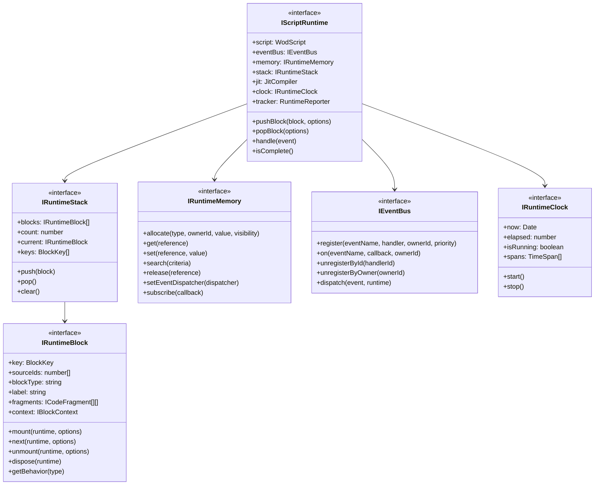
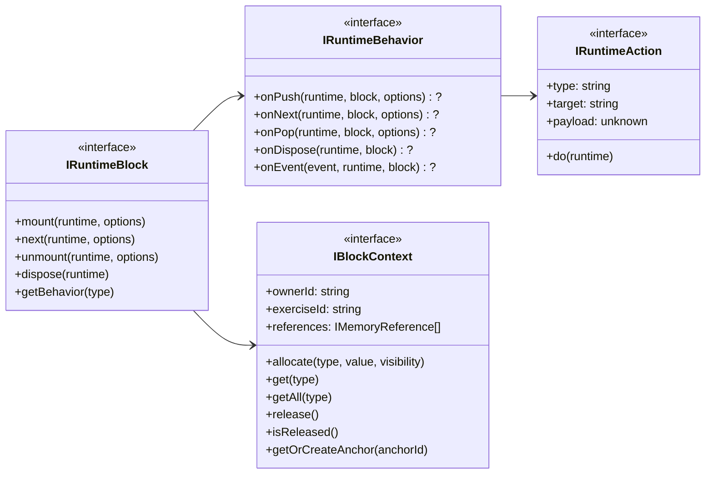
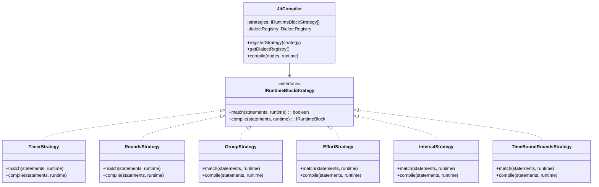
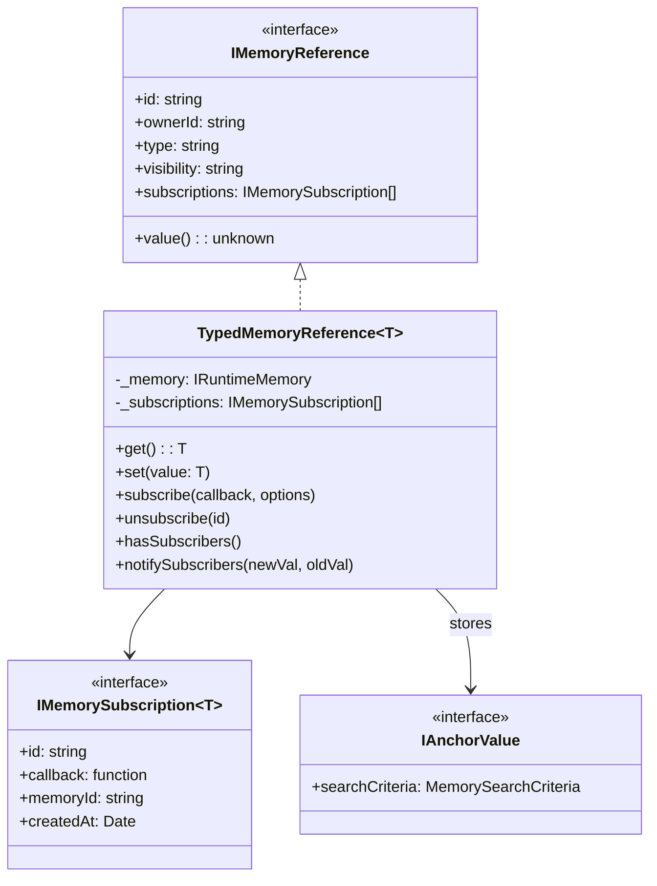
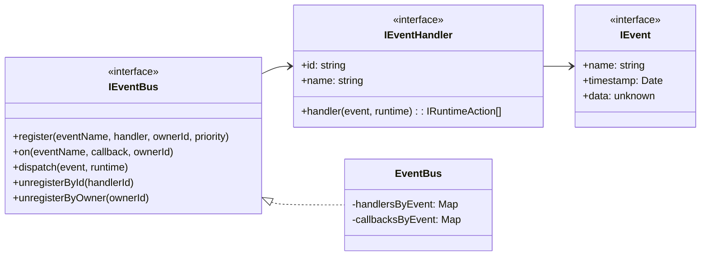
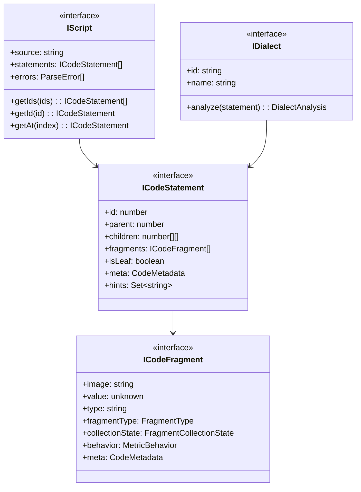

# WOD Wiki - Architectural Overview

> **Generated**: 2025-12-28  
> **Source Analysis**: TypeScript interfaces and implementation classes only  
> **Excludes**: Markdown documentation comments

## Table of Contents

1. [Interface Interaction Map](#interface-interaction-map)
2. [Mermaid.js Class Diagrams](#mermaidjs-class-diagrams)
3. [Redundancy & Hygiene Report](#redundancy--hygiene-report)
4. [Architectural Goal Summary](#architectural-goal-summary)

---

## Interface Interaction Map

### Primary Interfaces

The WOD Wiki codebase is organized around a **stack-based runtime execution engine** for workout scripts. The primary interfaces are:

| Interface | Location | Purpose |
|-----------|----------|---------|
| `IScriptRuntime` | `src/runtime/IScriptRuntime.ts` | Central runtime context orchestrating execution |
| `IRuntimeBlock` | `src/runtime/IRuntimeBlock.ts` | Executable workout block with lifecycle hooks |
| `IRuntimeStack` | `src/runtime/IRuntimeStack.ts` | Stack-based execution management |
| `IRuntimeMemory` | `src/runtime/IRuntimeMemory.ts` | Separate memory management for debugging |
| `IEventBus` | `src/runtime/IEventBus.ts` | Event dispatch and handler registration |
| `IRuntimeBehavior` | `src/runtime/IRuntimeBehavior.ts` | Composable behavior pattern for blocks |
| `IRuntimeBlockStrategy` | `src/runtime/IRuntimeBlockStrategy.ts` | Strategy pattern for JIT compilation |
| `IBlockContext` | `src/runtime/IBlockContext.ts` | Memory allocation context per block |
| `IRuntimeClock` | `src/runtime/IRuntimeClock.ts` | Time tracking for runtime |
| `IRuntimeAction` | `src/runtime/IRuntimeAction.ts` | Command pattern for runtime mutations |
| `IEvent` | `src/runtime/IEvent.ts` | Base event contract |
| `IEventHandler` | `src/runtime/IEventHandler.ts` | Event handling with action production |
| `IMemoryReference` | `src/runtime/IMemoryReference.ts` | Reference handle for memory locations |

### Secondary Interfaces

| Interface | Location | Purpose |
|-----------|----------|---------|
| `IScript` | `src/parser/WodScript.ts` | Parsed workout script representation |
| `ICodeStatement` | `src/core/models/CodeStatement.ts` | Single parsed statement node |
| `ICodeFragment` | `src/core/models/CodeFragment.ts` | Fragment within a statement |
| `IDialect` | `src/core/models/Dialect.ts` | Semantic hint generation |
| `IValidationRule` | `src/parser/IValidationRule.ts` | Parse-time validation |
| `ITrackerCommand` | `src/tracker/ITrackerCommand.ts` | Command pattern for execution tracking |
| `IMetricCollector` | `src/runtime/MetricCollector.ts` | **(Deprecated)** Metric collection |
| `IFragmentMetricCollector` | `src/runtime/FragmentMetricCollector.ts` | Fragment-based metric collection |
| `IProjectionEngine` | `src/timeline/analytics/analytics/IProjectionEngine.ts` | Analytics projection engine |
| `ICardParserStrategy` | `src/editor/parsers/ICardParserStrategy.ts` | Editor card parsing strategy |
| `IDistributedFragments` | `src/runtime/IDistributedFragments.ts` | Fragment distribution for iterations |
| `IFragmentCompiler` | `src/runtime/FragmentCompilationManager.ts` | Fragment-to-metric compilation |
| `IRuntimeFactory` | `src/runtime/RuntimeFactory.ts` | Factory for runtime instances |
| `IAnchorValue` | `src/runtime/IAnchorValue.ts` | Anchor memory reference value |

### Behavior Sub-Interfaces

| Interface | Location | Purpose |
|-----------|----------|---------|
| `IBehavior` | `src/runtime/behaviors/IBehavior.ts` | High-level behavior with `do()` entry point |
| `IBehaviorContext` | `src/runtime/behaviors/IBehavior.ts` | Context passed to behavior methods |
| `IPushBehavior` | `src/runtime/behaviors/IBehavior.ts` | Optional push lifecycle hook |
| `INextBehavior` | `src/runtime/behaviors/IBehavior.ts` | Optional next/tick lifecycle hook |
| `IPopBehavior` | `src/runtime/behaviors/IBehavior.ts` | Optional pop lifecycle hook |

### Testing Interfaces

| Interface | Location | Purpose |
|-----------|----------|---------|
| `ITestSetupAction` | `src/runtime/testing/actions/ITestSetupAction.ts` | Test scenario setup actions |

### Display/UI Interfaces

| Interface | Location | Purpose |
|-----------|----------|---------|
| `IDisplayItem` | `src/core/models/DisplayItem.ts` | Unified display model for UI |
| `ITimerDisplayEntry` | `src/clock/types/DisplayTypes.ts` | Timer display data |
| `IDisplayButton` | `src/clock/types/DisplayTypes.ts` | Control button display data |
| `IDisplayCardEntry` | `src/clock/types/DisplayTypes.ts` | Card display data |
| `IDisplayMetric` | `src/clock/types/DisplayTypes.ts` | Metric display data |
| `IDisplayStackState` | `src/clock/types/DisplayTypes.ts` | Full display stack state |

---

## Dependency Chains

### Core Runtime Dependencies

```
IScriptRuntime
├── IRuntimeStack (contains IRuntimeBlock[])
├── IRuntimeMemory (contains IMemoryReference[])
├── IEventBus (manages IEventHandler[])
├── IRuntimeClock
├── JitCompiler (uses IRuntimeBlockStrategy[])
└── RuntimeReporter (uses ITrackerCommand[])

IRuntimeBlock
├── IBlockContext (memory allocation)
├── IRuntimeBehavior[] (composable behaviors)
└── ICodeFragment[][] (execution data)

IRuntimeBlockStrategy
├── ICodeStatement[] (input)
├── IScriptRuntime (context)
└── IRuntimeBlock (output)
```

### Memory System Dependencies

```
IRuntimeMemory
├── TypedMemoryReference<T> (implements IMemoryReference)
│   └── IMemorySubscription<T>[]
└── MemoryEventDispatcher → IEventBus

IBlockContext
├── IRuntimeMemory (allocation target)
├── IMemoryReference[] (tracked references)
└── IAnchorValue (anchor memory)
```

### Event System Dependencies

```
IEventBus
├── IEventHandler[] (registered handlers)
│   └── IEvent → IRuntimeAction[]
└── EventCallback[] (simple listeners)

IEventHandler
├── IEvent (input)
├── IScriptRuntime (context)
└── IRuntimeAction[] (output)
```

---

## Mermaid.js Class Diagrams

### Core Runtime Architecture



### Block Lifecycle & Behavior Pattern



### JIT Compilation Strategy Pattern



### Memory Reference System



### Event System



### Parser & Script Model



---

## Redundancy & Hygiene Report

### 1. Dead Code: Interfaces Defined but Never Implemented

| Interface          | Location                                     | Status                          | Recommendation                                   |
| ------------------ | -------------------------------------------- | ------------------------------- | ------------------------------------------------ |
| `IValidationRule`  | `src/parser/IValidationRule.ts`              | **No implementations found**    | Remove or implement validation rules             |
| `IMetricCollector` | `src/runtime/MetricCollector.ts`             | **Deprecated** - being replaced | Complete migration to `IFragmentMetricCollector` |
| `IRuntimeAdapter`  | `src/runtime-test-bench/types/interfaces.ts` | Test-bench only interface       | Consider removing if unused                      |

### 2. Redundant/Overlapping Interfaces

| Issue                                            | Interfaces                                                                                                        | Analysis                                                                                                                         |
| ------------------------------------------------ | ----------------------------------------------------------------------------------------------------------------- | -------------------------------------------------------------------------------------------------------------------------------- |
| **Duplicate ICodeStatement**                     | `src/core/models/CodeStatement.ts` <br> `src/core/types/core.ts`                                                  | Same interface defined in two locations. The `core/types/core.ts` version imports from models. **Consolidate to single source.** |
| **Duplicate IScript**                            | `src/parser/WodScript.ts` <br> `src/core/types/core.ts`                                                           | Re-exported from parser. **Keep single definition.**                                                                             |
| **Duplicate IScriptRuntime**                     | `src/runtime/IScriptRuntime.ts` <br> `src/core/types/runtime.ts`                                                  | The `core/types/runtime.ts` version is a simplified re-export. **Consider removing duplicate.**                                  |
| **Duplicate IRuntimeBlock**                      | `src/runtime/IRuntimeBlock.ts` <br> `src/core/types/runtime.ts` <br> `src/runtime-test-bench/types/interfaces.ts` | Three definitions with varying completeness. **Consolidate to canonical source.**                                                |
| **Duplicate IRuntimeAction**                     | `src/runtime/IRuntimeAction.ts` <br> `src/core/types/runtime.ts`                                                  | Re-exported. **Keep single definition.**                                                                                         |
| **Duplicate IMemoryReference**                   | `src/runtime/IMemoryReference.ts` <br> `src/core/types/runtime.ts`                                                | Partial re-export with different signature. **Align signatures.**                                                                |
| **IBehavior vs IRuntimeBehavior**                | `src/runtime/behaviors/IBehavior.ts` <br> `src/runtime/IRuntimeBehavior.ts`                                       | `IBehavior` has unified `do()` method; `IRuntimeBehavior` has individual hooks. **Both actively used - document pattern.**       |
| **IMetricCollector vs IFragmentMetricCollector** | `src/runtime/MetricCollector.ts` <br> `src/runtime/FragmentMetricCollector.ts`                                    | Deprecated vs new pattern. **Complete deprecation migration.**                                                                   |

### 3. Circular Dependencies

| Cycle | Components | Risk Level | Mitigation |
|-------|------------|------------|------------|
| **IScriptRuntime ↔ IRuntimeBlock** | `IScriptRuntime` references `IRuntimeBlock`; `IRuntimeBlock.mount/next/unmount` require `IScriptRuntime` | **Low** | Acceptable design - bidirectional communication pattern |
| **IRuntimeMemory ↔ TypedMemoryReference** | `TypedMemoryReference` holds `_memory: IRuntimeMemory`; `IRuntimeMemory.allocate` returns `TypedMemoryReference` | **Low** | Intentional - memory references need parent for get/set |
| **IEventBus ↔ IScriptRuntime** | `IEventBus.dispatch` requires `IScriptRuntime`; `IScriptRuntime.eventBus` is `IEventBus` | **Low** | Acceptable - runtime context needed for handlers |

### 4. Interface Hygiene Issues

| Issue                                 | Location                                | Severity | Recommendation                                   |
| ------------------------------------- | --------------------------------------- | -------- | ------------------------------------------------ |
| **Deprecated interface still in use** | `IMetricCollector`                      | Medium   | Complete migration to `IFragmentMetricCollector` |
| **Large interface**                   | `IBlockContext` (8 methods)             | Low      | Consider splitting read vs write operations      |
| **Optional members in interface**     | `IRuntimeBehavior` (all hooks optional) | Low      | Acceptable - partial implementation pattern      |
| **Type duplication in core/types**    | Multiple runtime type re-exports        | Medium   | Centralize to avoid drift                        |

### 5. Recommended Cleanups

1. **Consolidate Type Definitions**: Move all interface definitions to `src/runtime/` and export from `src/core/types/` as single source of truth
2. **Complete Deprecation**: Finish `IMetricCollector` → `IFragmentMetricCollector` migration
3. **Implement or Remove IValidationRule**: No implementations found - either add validation rules or remove interface
4. **Document IBehavior vs IRuntimeBehavior**: Both patterns are valid - document when to use each

---

## Architectural Goal Summary

### High-Level Architecture

The WOD Wiki codebase implements a **JIT-compiled stack-based runtime** for executing workout scripts. The architecture follows several key patterns:

#### 1. **Stack-Based Execution Model**

`IScriptRuntime` acts as the **central orchestrator** that coordinates:
- `IRuntimeStack`: Manages a LIFO stack of `IRuntimeBlock` instances representing nested workout constructs
- `IRuntimeMemory`: Provides separate memory storage for state management and debugging
- `IEventBus`: Enables loose coupling between runtime components through event-driven communication

**Business Goal**: Enable hierarchical workout structures (rounds containing exercises, intervals with sub-routines) with clean lifecycle management.

#### 2. **Strategy Pattern for JIT Compilation**

`JitCompiler` uses `IRuntimeBlockStrategy` implementations to compile parsed statements into executable blocks:
- **Precedence-based matching**: Strategies are tried in order (TimeBoundRounds → Interval → Timer → Rounds → Group → Effort)
- **Dialect integration**: `IDialect` implementations provide semantic hints for strategy matching

**Business Goal**: Support multiple workout formats (AMRAP, EMOM, For Time, Tabata) through pluggable compilation strategies.

#### 3. **Composable Behavior Pattern**

`IRuntimeBlock` delegates lifecycle logic to `IRuntimeBehavior` instances:
- Behaviors handle specific concerns: timing (`TimerBehavior`), sound cues (`SoundBehavior`), loop coordination (`LoopCoordinatorBehavior`)
- Behaviors are injected during block construction by strategies

**Business Goal**: Enable reusable, testable behavior components that can be composed to create complex workout logic.

#### 4. **Command Pattern for State Mutations**

`IRuntimeAction` provides a consistent interface for runtime mutations:
- Actions are produced by event handlers and behaviors
- All mutations flow through `action.do(runtime)`

**Business Goal**: Centralized mutation handling for debugging, logging, and undo/redo capabilities.

#### 5. **Memory Separation for Debugging**

`IRuntimeMemory` and `IBlockContext` provide:
- Type-safe memory allocation via `TypedMemoryReference<T>`
- Ownership tracking via `ownerId` for automatic cleanup
- Subscription system for reactive UI updates

**Business Goal**: Enable debugging and state inspection independently of program execution flow.

### Interface Interaction Summary

```
Parser ──[IScript]──► JitCompiler ──[IRuntimeBlock]──► RuntimeStack
                           │                               │
                     [IDialect]                     [IRuntimeBehavior]
                           │                               │
                    [ICodeStatement]               [IRuntimeAction]
                           │                               │
                    [ICodeFragment]                  [IEventBus]
                                                          │
                                                    [IEventHandler]
```

### Key Design Decisions

1. **Constructor-Based Initialization**: Blocks initialize during construction, not when pushed to stack
2. **Consumer-Managed Disposal**: Consumers must call `dispose()` on popped blocks
3. **Event-Driven Communication**: Loose coupling via `IEventBus` rather than direct references
4. **Strategy + Behavior Composition**: Separation of compilation (strategy) from execution (behavior)
5. **Typed Memory References**: Generic `TypedMemoryReference<T>` for type-safe memory access

### Future Considerations

- Complete deprecation of `IMetricCollector` in favor of `IFragmentMetricCollector`
- Implement or remove unused `IValidationRule` interface
- Consider consolidating duplicate interface definitions in `core/types`
- Document `IBehavior` vs `IRuntimeBehavior` pattern decision
