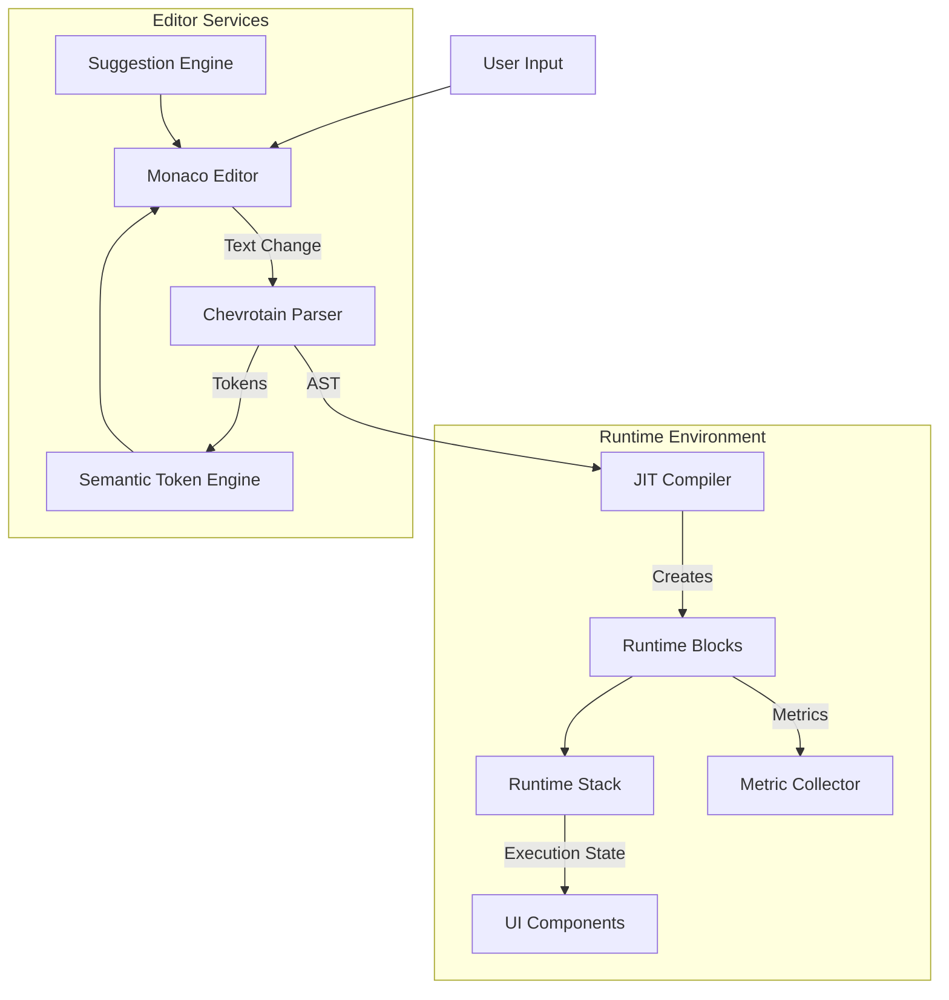

# Architecture

This document describes the high-level architecture of the WOD Wiki system.

## Overview

WOD Wiki is designed to parse, compile, and execute workout definitions written in a specialized Markdown-like syntax. The system is built on a few key pillars:

1.  **Parser**: Converts raw text into a structured Abstract Syntax Tree (AST).
2.  **JIT Compiler**: Transforms the AST into executable runtime blocks.
3.  **Runtime Engine**: Manages the execution state, stack, and timing.
4.  **Editor Integration**: Provides a rich editing experience with syntax highlighting and suggestions.
5.  **UI Components**: React components for visualizing the workout and its status.

## System Architecture Diagram

## Core Components

### 1. Parser (`src/parser/`)
The parser uses [Chevrotain](https://chevrotain.io/) to tokenize and parse the input text. It defines a grammar for the WOD syntax, including:
- **Tokens**: `timer.tokens.ts` defines lexer tokens like `Timer`, `Reps`, `Weight`, etc.
- **Parser**: `timer.parser.ts` defines the grammar rules.
- **Output**: Produces `CodeStatement` nodes that represent the structure of the workout.

### 2. JIT Compiler (`src/runtime/JitCompiler.ts`)
The Just-In-Time (JIT) compiler is responsible for converting parsed nodes into executable `IRuntimeBlock` instances.
- It uses a strategy pattern (`IRuntimeBlockStrategy`) to determine how to compile different types of nodes.
- Compilation happens on-demand or ahead of execution, preparing the runtime stack.

### 3. Runtime Stack (`src/runtime/RuntimeStack.ts`)
The execution model is stack-based.
- **Blocks**: Executable units (e.g., a round, an interval, a rest period).
- **Stack**: Maintains the current hierarchy of active blocks.
- **Lifecycle**: Blocks are pushed onto the stack when they start and popped when they complete.

### 4. Editor Integration (`src/editor/`)
The project integrates [Monaco Editor](https://microsoft.github.io/monaco-editor/) for a robust coding experience.
- **Semantic Tokens**: `SemantcTokenEngine.tsx` provides syntax highlighting based on the parser's output.
- **Suggestions**: `SuggestionEngine.tsx` offers auto-completion for exercises and keywords.
- **Exercise Index**: `ExerciseIndexManager.ts` manages a searchable index of exercises for the suggestion engine.

### 5. Metric Collection (`src/runtime/MetricCollector.ts`)
As the workout executes, metrics (reps, time, weight, etc.) are collected.
- **RuntimeMetric**: Represents a data point.
- **MetricCollector**: Aggregates metrics for analysis and reporting.
