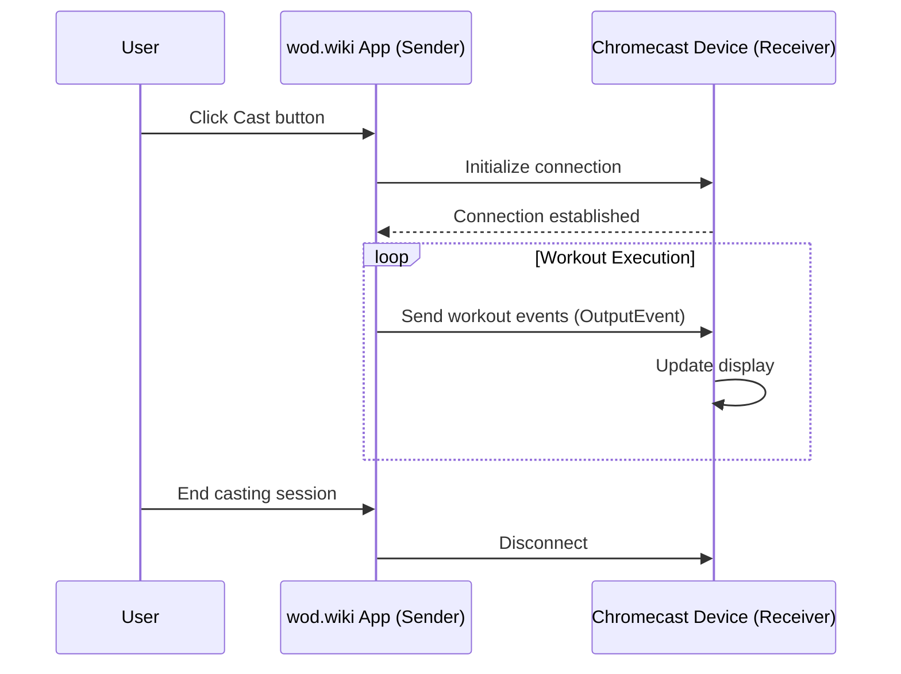

# Chromecast Architecture

## Overview

The Chromecast integration in wod.wiki allows users to cast workout information and events to Chromecast-enabled devices. This enables a "coach view" experience where workout timers, instructions, and events can be displayed on a larger screen like a TV.

The architecture follows Google's recommended patterns for Chromecast applications, with a sender application (the main wod.wiki app) and a receiver application (displayed on the Chromecast device).

## Core Components

### 1. Sender Components

The sender components run in the main wod.wiki application and enable casting to Chromecast devices:

- **ChromecastButton**: UI component that initiates casting sessions
- **useCastSender**: React hook that manages the sender connection and messaging

### 2. Receiver Components

The receiver components run on the Chromecast device:

- **CastReceiver**: Main React component for the receiver application
- **useCastReceiver**: React hook that manages receiving and processing messages

### 3. Shared Types and Utilities

- **chromecast-events.ts**: Defines the message types and format for communication
- **CAST_NAMESPACE**: Common namespace for all Chromecast communications

## Communication Flow



## Implementation Details

### Sender Implementation

The sender uses the `useCastSender` hook to manage connections and send messages:

```typescript
// Example usage in a component
const { state$, connect, disconnect, sendMessage } = useCastSender();

// Connect to available Chromecast device
await connect();

// Send workout events
runtime.output$.subscribe(event => {
  sendMessage(event);
});
```

Key features:
- Manages connection state using a `BehaviorSubject`
- Provides methods for connection management
- Handles errors and reconnection attempts
- Transmits workout events to the receiver

### Receiver Implementation

The receiver is a standalone React application that:

1. Initializes the Cast SDK
2. Listens for messages from sender applications
3. Processes incoming events
4. Updates the display based on received events

It displays:
- Current timer information
- Active exercise description
- Workout metrics and progress

### Integration with wod.wiki Runtime

The Chromecast integration leverages the existing event system:

1. The runtime emits `OutputEvent` objects through its `output$` observable
2. The sender application captures these events and sends them to the receiver
3. The receiver processes these events and updates its UI accordingly

This reuses the same event types and action handlers that drive the main application UI.

## Development and Testing

For local development and testing, there are three approaches:

1. **Chrome Debug Receiver**: Use the `chrome://cast/receiver/` page for debugging
2. **Local Development**: Use the `useLocalCast` hook which simulates casting for development
3. **Storybook**: The `/cast` path in Storybook provides a sandbox for testing the receiver

## Future Enhancements

Planned improvements to the Chromecast functionality:

- Unified namespace across all files
- Separation of sender, receiver, and local dev/test hooks
- Standalone receiver app compliant with Cast SDK best practices
- Comprehensive error and debug handling
- Bidirectional communication to allow remote control from the receiver

## Troubleshooting

Common issues and their solutions:

1. **Connection Failed**: Verify devices are on the same network
2. **Casting Not Available**: Make sure Chrome browser supports casting
3. **Events Not Appearing**: Check that the correct namespace is being used
4. **Broken Display**: Ensure the receiver can handle all event types

See [Chromecast Custom Troubleshooting](../Notes/Chromecast%20Custom%20Troubleshooting.md) for more details.