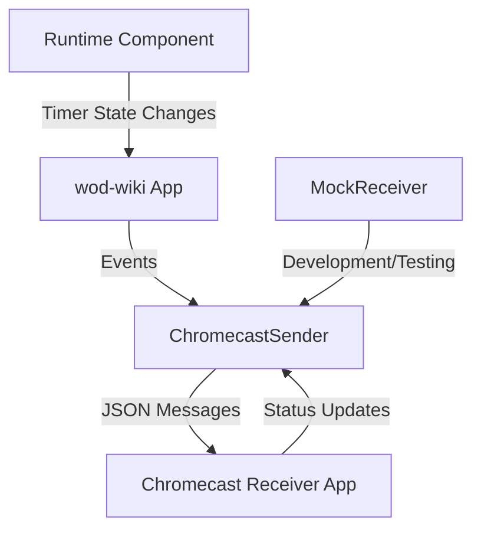

# Chromecast Integration

The Chromecast integration allows wod-wiki to display workout timers and information on external screens via Google Chromecast. This document defines the event system architecture and requirements for the feature.

## Architecture Overview

The Chromecast integration follows a sender-receiver architecture with a well-defined event protocol:



### Key Components

1. **ChromecastSender**: Core service that handles communication with Chromecast devices
2. **Event Protocol**: Type definitions for all messages between sender and receiver
3. **MockReceiver**: Local implementation for testing without actual Chromecast hardware
4. **Runtime Integration**: Extensions to the existing Timer Runtime to emit Chromecast events
5. **UI Controls**: Components for connecting to Chromecast and displaying status

## Clock States

The Chromecast integration must handle three primary clock states:

1. **Running**: Active workout timer with associated metadata
2. **Paused**: Timer temporarily stopped but maintaining current state
3. **Idle**: No active workout (may display current time or welcome screen)

### Running State Requirements

- Display a prominent running clock (mm:ss or hh:mm:ss format)
- Show current exercise information:
  - Effort name (e.g., "Pullups")
  - Repetition count (e.g., "21 reps")
  - Current round indicator (e.g., "Round 2/5")
- Support for resistance and distance metrics when applicable
- Visual indication of progress (percentage complete if known)

### Paused State Requirements

- Clear visual indication that timer is paused
- Maintain display of current workout information
- Optional: Display duration of pause

### Idle State Requirements

- Display current time (hh:mm format)
- Show wod-wiki branding
- Optional: Display connection status or instructions

## Event Payload Structure

Each state requires specific data to be transmitted between the sender and receiver:

### Common Fields (All Events)

- `eventType`: String identifier of the event type (e.g., "CLOCK_RUNNING", "CLOCK_PAUSED", "CLOCK_IDLE")
- `timestamp`: ISO timestamp when the event was generated
- `version`: Protocol version for backward compatibility

### Running Clock Payload

```typescript
{
  eventType: "CLOCK_RUNNING",
  timestamp: string,
  version: string,
  data: {
    timerValue: number, // seconds
    timerDisplay: string, // formatted time string
    effort: string, // current exercise
    repetitions?: number, // current rep count
    resistance?: {
      value: number,
      unit: string, // "kg", "lb", etc.
    },
    distance?: {
      value: number,
      unit: string, // "m", "km", etc.
    },
    roundCurrent: number,
    roundTotal?: number, // may be undefined for AMRAP
    isAMRAP: boolean,
    estimatedCompletionPercentage?: number
  }
}
```

### Paused Clock Payload

```typescript
{
  eventType: "CLOCK_PAUSED",
  timestamp: string,
  version: string,
  data: {
    timerValue: number, // seconds
    timerDisplay: string, // formatted time string
    pauseDuration?: number, // seconds paused
    // Same workout fields as CLOCK_RUNNING
    effort: string,
    repetitions?: number,
    resistance?: { value: number, unit: string },
    distance?: { value: number, unit: string },
    roundCurrent: number,
    roundTotal?: number,
    isAMRAP: boolean
  }
}
```

### Idle Clock Payload

```typescript
{
  eventType: "CLOCK_IDLE",
  timestamp: string,
  version: string,
  data: {
    currentTime: string, // formatted current time
    message?: string // optional status or welcome message
  }
}
```

## Runtime Component Integration

The Chromecast event system will integrate with the existing Runtime component by:

1. Extending the current action/event system to emit Chromecast-specific events
2. Adding a new ChromecastEventEmitter that subscribes to relevant Runtime events:
   - DisplayUpdateAction → CLOCK_RUNNING/PAUSED events
   - SetButtonAction → Connection to clock state
   - SetResultAction → Workout completion events

The integration will use the existing event-driven architecture without modifying core Runtime behavior, ensuring backward compatibility.

## Mock Receiver for Development

The mock receiver will:

1. Provide a visual representation of how content would appear on a Chromecast
2. Implement the same event protocol as the actual receiver
3. Include tooling to inspect and debug events
4. Support simulating connection issues and edge cases

## Implementation Considerations

- All events must be serializable to JSON for transmission
- Events should be compact to minimize latency
- The protocol should be versioned to allow for future extensions
- Error handling should be robust with reconnection logic
- The system should degrade gracefully when Chromecast is unavailable
