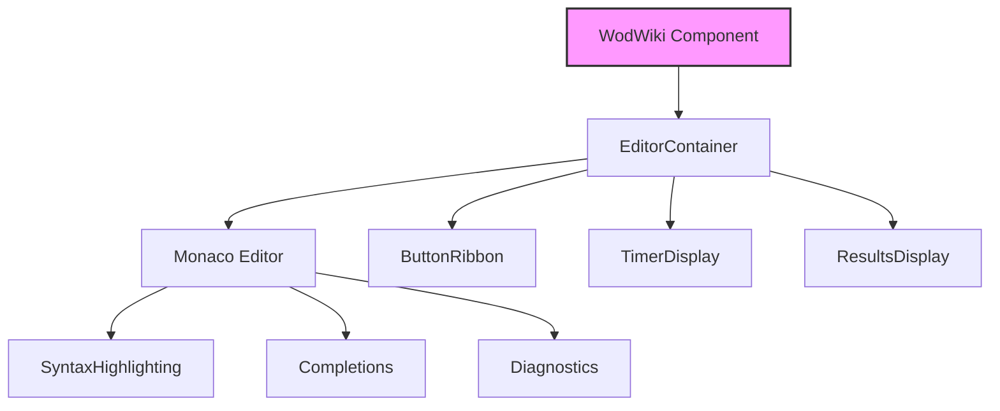

# Editor Components

The editor is a core part of the wod.wiki application, providing a rich environment for authoring workout scripts with syntax highlighting, auto-completion, and other features.

## Component Architecture



## Main Components

### WodWiki

The root component that encapsulates the entire editor experience:

```typescript
export interface WodWikiProps {
  id: string;
  code?: string;
  syntax?: string;
  onScriptCompiled?: (script: RuntimeScript) => void;
}

export function WodWiki(props: WodWikiProps) {
  // Implementation of the main editor component
}
```

**Responsibilities**:
- Initialize the editor with workspace settings
- Set up syntax highlighting for wod.wiki language
- Handle script compilation and validation
- Manage the editor lifecycle

### EditorContainer

Wraps the Monaco editor and provides additional UI components:

```typescript
export interface EditorContainerProps {
  id: string;
  initializer: WodWikiInitializer;
  onScriptCompiled?: (script: RuntimeScript) => void;
}

export function EditorContainer(props: EditorContainerProps) {
  // Implementation of the container component
}
```

**Responsibilities**:
- Initialize and configure Monaco editor
- Set up event listeners for editor changes
- Manage compilation of edited content
- Handle layout and sizing

## Editor Features

### Syntax Highlighting

wod.wiki uses custom syntax highlighting rules to visually differentiate different parts of the workout syntax:

- Durations (e.g., `:30`, `2:00`) are highlighted distinctly
- Exercise names have their own styling
- Weights and distances have special formatting
- Rounds and grouping symbols are visually emphasized

### Auto-completion

The editor provides context-aware suggestions as users type:

- Common exercise names
- Time formats
- Weight and distance units
- Grouping symbols

### Validation

Real-time validation helps users identify issues in their workout scripts:

- Syntax errors are highlighted with squiggly underlines
- A diagnostics panel shows error details
- Quick-fix suggestions are provided where possible

## Initialization Process

The editor initialization follows these steps:

1. Create Monaco editor instance
2. Register wod.wiki language definition
3. Set up theme and syntax highlighting rules
4. Configure auto-completion provider
5. Register validation provider
6. Set up change listeners
7. Initialize with provided code (if any)

## Monaco Configuration

The Monaco editor is configured with these settings:

```typescript
const options: editor.IStandaloneEditorConstructionOptions = {
  value: initialCode,
  language: 'wodwiki',
  theme: 'vs-dark',
  minimap: { enabled: false },
  lineNumbers: 'on',
  folding: true,
  wordWrap: 'on',
  fontSize: 16,
  renderLineHighlight: 'all',
  // Other settings...
};
```

## Custom Language Registration

The wod.wiki language is registered with Monaco:

```typescript
monaco.languages.register({ id: 'wodwiki' });

monaco.languages.setMonarchTokensProvider('wodwiki', {
  tokenizer: {
    root: [
      // Token rules for the wodwiki language
      [/[:]\d+/, 'timer'],
      [/\d+[:]\d+/, 'timer'],
      [/\d+/, 'repetition'],
      [/\d+[a-z]+/, 'measurement'],
      // More rules...
    ]
  }
});
```

## Integration with Runtime

The editor integrates with the runtime system through the `onScriptCompiled` callback:

1. Editor content is parsed into a syntax tree
2. The syntax tree is compiled into a `RuntimeScript`
3. The script is passed to the runtime via the callback
4. The runtime executes the script and manages the workout

This separation of concerns allows the editor to focus on providing a great authoring experience while the runtime handles execution.