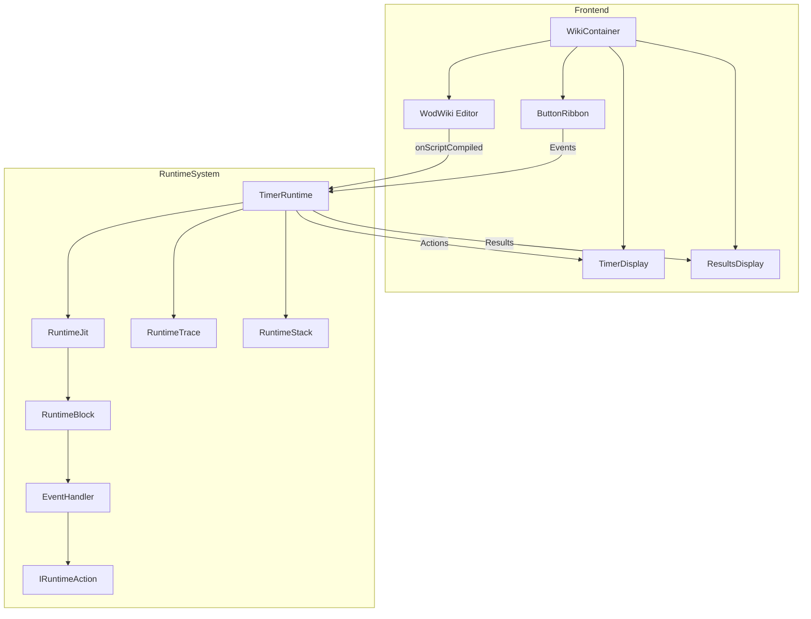

# Components

This section documents the key components of the wod.wiki application and the relationships between them.

## Core Components Overview

wod.wiki is built around several key component groups:

1. **Editor Components** - Provide the user interface for creating and editing workout scripts
2. **Runtime Components** - Execute the workout scripts and manage timing and state
3. **UI Components** - Display workout information and provide user controls
4. **Result Components** - Track and display workout metrics and results

## Component Relationships



## Documents in this Section

- [Editor.md](./Editor.md) - The Monaco-based editor and related components
- [Runtime.md](./Runtime.md) - Runtime components that execute workout scripts
- [ResultSpan.md](./ResultSpan.md) - Components for tracking and displaying workout results
- [RuntimeHandlers.md](./RuntimeHandlers.md) - Event handling components

## Key Component Interfaces

The wod.wiki system defines several key interfaces that components implement:

### ITimerRuntime

The central runtime interface that manages workout execution:

```typescript
interface ITimerRuntime {
  trace: RuntimeTrace;
  input$: Subject<IRuntimeEvent>;
  output$: Subject<OutputEvent>;
  tick$: Observable<TickEvent>;
  
  // Navigation methods
  push(block: IRuntimeBlock): void;
  pop(): void;
  
  // Execution control
  start(): void;
  stop(): void;
  reset(): void;
}
```

### IRuntimeBlock

The interface for executable blocks within the runtime:

```typescript
interface IRuntimeBlock {
  blockId: string;
  blockKey: string;
  
  // Lifecycle methods
  enter(runtime: ITimerRuntime): IRuntimeAction[];
  next(runtime: ITimerRuntime): IRuntimeAction[];
  leave(runtime: ITimerRuntime): IRuntimeAction[];
  
  // Event handling
  handle(runtime: ITimerRuntime, event: IRuntimeEvent): IRuntimeAction[];
}
```

### IRuntimeAction

Actions produced by blocks to affect the runtime:

```typescript
interface IRuntimeAction {
  apply(
    runtime: ITimerRuntime, 
    input$: Subject<IRuntimeEvent>,
    output$: Subject<OutputEvent>
  ): void;
}
```

## Creating New Components

When creating new components, follow these guidelines:

1. Separate concerns: UI, state management, and business logic
2. Use RxJS for event-based communication
3. Follow the existing patterns (strategies, handlers, actions)
4. Create appropriate interfaces for abstraction
5. Include unit tests for component behavior