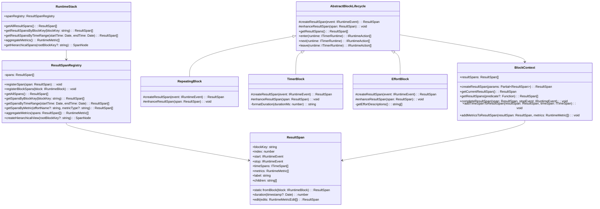
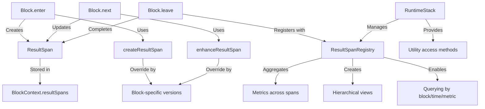

# ResultSpan System

## Overview

The ResultSpan system is a comprehensive solution for tracking and analyzing workout execution data in wod.wiki. It provides a structured way for runtime blocks to maintain their own records of events and metrics throughout their lifecycle.

## Architecture

The ResultSpan system consists of several key components:

1. **ResultSpan Class** - A data structure that represents a span of execution for a specific block, containing:
   - Start/stop events
   - Associated time spans
   - Metrics (effort, repetitions, resistance, distance)
   - Hierarchical relationships with other spans

2. **BlockContext with ResultSpans Collection** - Each block's context now manages a collection of ResultSpans instead of a single span, allowing for:
   - Multiple spans per block
   - Specialized span creation based on block type
   - Advanced querying and filtering

3. **AbstractBlockLifecycle Template Methods** - Enhanced to automatically:
   - Create spans during block entry
   - Update spans during block execution
   - Complete spans during block exit
   - Track metrics consistently across all block types

4. **ResultSpanRegistry** - Centralized management of all spans in the system:
   - Registration of spans from all blocks
   - Querying spans by block, time range, or metrics
   - Aggregation of metrics across spans
   - Hierarchical views of span data

5. **Specialized Block Implementations** - Custom ResultSpan behaviors:
   - **RepeatingBlock**: Tracks round counts and completion
   - **TimerBlock**: Records planned vs. actual durations
   - **EffortBlock**: Associates effort metrics with spans

## Class Diagram



## Data Flow



## Usage Examples

### Getting spans for a block

```typescript
// Access spans directly from a block
const blockSpans = block.getResultSpans();

// Or access through the runtime stack
const blockKey = 'some-block-key';
const spans = runtime.trace.getResultSpansByBlockKey(blockKey);
```

### Querying spans by time range

```typescript
const startTime = new Date('2025-05-16T15:00:00');
const endTime = new Date('2025-05-16T16:00:00');
const spansDuringTimeframe = runtime.trace.getResultSpansByTimeRange(startTime, endTime);
```

### Aggregating metrics across spans

```typescript
// Get all metrics aggregated across all blocks
const allMetrics = runtime.trace.aggregateMetrics();

// Or aggregate metrics from specific spans
const specificMetrics = runtime.trace.spanRegistry.aggregateMetrics(someSpans);
```

### Viewing hierarchical span data

```typescript
// Get a hierarchical view of all spans
const spanTree = runtime.trace.getHierarchicalSpans();

// Or start from a specific root block
const rootBlockKey = 'root-block-key';
const partialTree = runtime.trace.getHierarchicalSpans(rootBlockKey);
```

## Benefits

1. **Improved Accuracy**: Each block type can record data in the most appropriate format for its specific behavior.

2. **Enhanced Analysis**: The registry provides powerful querying and aggregation capabilities for workout data.

3. **Hierarchical Insights**: Easily view relationships between parent and child blocks to understand workout structure.

4. **Consistency**: Standardized lifecycle methods ensure all blocks handle events and metrics in a consistent way.

5. **Extensibility**: The template method pattern makes it easy to add new block types with specialized ResultSpan handling.

## Future Enhancements

1. **Real-time visualizations** of active spans during workout execution.

2. **Serialization support** for storing and retrieving span history.

3. **Enhanced UI components** to display hierarchical span data with filtering options.

4. **Statistical analysis** of spans to provide insights into workout performance over time.
