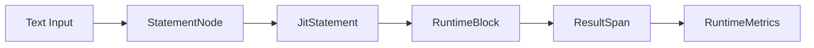

# Statement to Block to ResultSpan Lifecycle

This document details the complete lifecycle of workout elements, from text input to execution blocks to result tracking.

## Overview

In wod.wiki, workout elements follow a transformation process:



## 1. Text to StatementNode

### Input Text Example

```
(3)
  20 Push-ups
  :30 Rest
```

### Parsing Process

1. **Lexical Analysis**: The text is tokenized according to the grammar rules
2. **Syntax Tree**: Tokens are organized into a concrete syntax tree
3. **AST Creation**: The visitor pattern transforms the CST into an abstract syntax tree of StatementNodes

### StatementNode Structure

```typescript
interface StatementNode {
  id: string;              // Unique identifier
  fragments: Fragment[];   // Array of typed fragments
  meta: SourceCodeMetadata; // Source location information
  children: string[];      // IDs of child statements
  parent?: string;         // ID of parent statement, if any
  next?: string;           // ID of next statement at same level
  isLeaf: boolean;         // Whether this is a leaf node
  rounds: number;          // Number of rounds
}
```

The fragments array contains specialized fragment objects:
- TimerFragment: For durations (e.g., ":30")
- RepFragment: For repetition counts (e.g., "20")
- EffortFragment: For exercise descriptions (e.g., "Push-ups")
- RoundsFragment: For round specifications (e.g., "(3)")

## 2. StatementNode to JitStatement

### Compilation Process

1. The parser output (an array of StatementNodes) is processed into a RuntimeScript
2. The RuntimeJit compiles StatementNodes into JitStatements on demand
3. JitStatements represent an intermediate form with additional metadata for execution

### JitStatement Structure

```typescript
interface JitStatement {
  id: string;              // Unique identifier from StatementNode
  fragments: Fragment[];   // Same fragments as StatementNode
  children: JitStatement[]; // Child statements (now as references)
  parent?: JitStatement;   // Parent statement (now as reference)
  next?: JitStatement;     // Next statement (now as reference)
  isLeaf: boolean;         // Whether this is a leaf node
  rounds: number;          // Number of rounds
}
```

The key difference is that references are now direct object references, not string IDs.

## 3. JitStatement to RuntimeBlock

### Block Creation

1. RuntimeJit uses strategies to create appropriate block types for each JitStatement
2. Strategies are selected based on the statement content and structure
3. BlockContext objects are created to manage state for each block

### Block Hierarchy

Each statement gets transformed into a specific block type:

- Root level statements → RootBlock
- Timer statements → TimedBlock
- Effort statements → EffortBlock
- Repeating groups → RepeatingBlock
- Timed groups → TimedGroupBlock

### Block Lifecycle Methods

Each block implements these key lifecycle methods:

```typescript
interface IRuntimeBlock {
  // Called when the block becomes active
  enter(runtime: ITimerRuntime): IRuntimeAction[];
  
  // Called to advance the block state
  next(runtime: ITimerRuntime): IRuntimeAction[];
  
  // Called when the block is being removed
  leave(runtime: ITimerRuntime): IRuntimeAction[];
}
```

## 4. RuntimeBlock to ResultSpan

### ResultSpan Creation

1. When a block starts execution, it creates a new ResultSpan
2. As the block executes, it adds timespan entries to the ResultSpan
3. Metrics are collected during execution and added to the ResultSpan

### ResultSpan Structure

```typescript
interface ResultSpan {
  blockKey: string;        // Identifies the associated block
  timeSpans: TimeSpan[];   // Start/stop time pairs
  metrics: RuntimeMetric[]; // Metrics collected during execution
  
  // Calculate duration between start and stop
  duration(timestamp?: Date): number;
}

interface TimeSpan {
  start: {
    name: string;         // Event name
    timestamp: Date;      // When it started
    blockKey: string;     // Associated block
  };
  stop?: {
    name: string;         // Event name
    timestamp: Date;      // When it stopped
    blockKey: string;     // Associated block
  };
}
```

### ResultSpanBuilder

The ResultSpanBuilder simplifies creation of ResultSpan objects:

```typescript
const span = ResultBuilder
  .forBlock(block)
  .withMetrics(block.sources[0].metrics())
  .build();
```

## 5. ResultSpan to Metrics

### Metric Calculation

1. ResultSpan objects collect raw data during execution
2. MetricCalculator processes these spans to derive summary metrics
3. Metrics are aggregated across multiple spans for total workout statistics

### RuntimeMetric Structure

```typescript
type RuntimeMetric = {
  effort: string;          // Exercise name
  repetitions?: MetricValue; // Reps, if applicable
  resistance?: MetricValue;  // Weight/resistance, if applicable
  distance?: MetricValue;    // Distance, if applicable
};

type MetricValue = {
  value: number;           // Numeric value
  unit: string;            // Unit (e.g., "kg", "m")
};
```

### Metric Composition

Blocks can specify metric composition strategies to control how metrics are combined:

```typescript
interface IMetricCompositionStrategy {
  compose(metrics: RuntimeMetric[]): RuntimeMetric[];
}
```

Common strategies include:
- Sum (add all values)
- Max (take the highest value)
- Last (take the most recent value)
- Custom (domain-specific calculations)

## Complete Lifecycle Example

```
# Input text
3 rounds:
  10 Push-ups
  :30 Rest

# Parsed into StatementNodes
{
  id: "1",
  fragments: [RoundsFragment{count: 3}],
  children: ["2", "3"],
  isLeaf: false,
  rounds: 3
},
{
  id: "2",
  fragments: [RepFragment{reps: 10}, EffortFragment{effort: "Push-ups"}],
  parent: "1",
  next: "3",
  isLeaf: true,
  rounds: 1
},
{
  id: "3",
  fragments: [TimerFragment{duration: ":30"}, EffortFragment{effort: "Rest"}],
  parent: "1",
  isLeaf: true,
  rounds: 1
}

# Compiled into RuntimeBlocks
RepeatingBlock {
  blockKey: "1",
  rounds: 3,
  children: [EffortBlock, TimedBlock]
}

# Execution produces ResultSpans
ResultSpan {
  blockKey: "1",
  timeSpans: [
    {start: {timestamp: "2025-05-22T12:00:00"}, stop: {timestamp: "2025-05-22T12:05:00"}}
  ],
  metrics: [
    {effort: "Push-ups", repetitions: {value: 30, unit: "reps"}},
    {effort: "Rest", repetitions: {value: 3, unit: "reps"}}
  ]
}

# Derived Metrics
Total workout time: 5 minutes
Total push-ups: 30 reps
Total rest periods: 3
```

This complete lifecycle demonstrates how wod.wiki transforms simple text into a rich, executable workout with comprehensive metrics tracking.