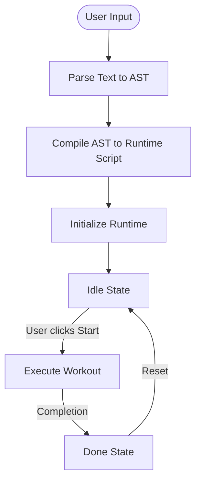

# Core Documentation

This section details the core runtime components, workflow, and implementation of the wod.wiki system.

## Overview

The wod.wiki core consists of several interconnected systems:

1. **Parser/Compiler Pipeline** - Translates text into executable structures
2. **Runtime Engine** - Executes workout scripts and manages state
3. **Metrics System** - Tracks and reports workout performance
4. **Event System** - Manages communication between components

## Key Files in this Section

- [Runtime.md](./Runtime.md) - Runtime component architecture
- [Compile.md](./Compile.md) - Parser and compiler pipeline
- [Workflow.md](./Workflow.md) - Runtime workflow and execution flow
- [Lifecycle.md](./Lifecycle.md) - Lifecycle of statements to blocks to results

## Runtime Workflow

The basic execution flow of a workout in wod.wiki follows these steps:

### 1. Parse Text to AST

The text editor content is parsed into an Abstract Syntax Tree (AST) using a custom parser:

- Tokenization of the text into recognizable elements (timers, reps, exercises)
- Construction of a tree structure representing the workout
- Validation of syntax and structure

### 2. Compile AST to Runtime Script

The AST is compiled into a RuntimeScript:

- StatementNodes are extracted from the AST
- Parent-child relationships are established
- Fragment types are identified and processed

### 3. Initialize Runtime

The runtime is initialized with the compiled script:

- TimerRuntime is created with the script
- Event streams are established
- Initial blocks (RootBlock, IdleBlock) are pushed onto the stack

### 4. Execute Workout

When the user starts the workout:

- Event flow begins
- Blocks are processed in sequence
- Timer events are generated
- Results are collected

### 5. Complete Workout

Upon completion:

- Final metrics are calculated
- Results are displayed
- DoneBlock is pushed onto the stack

## Key Runtime Components

### TimerRuntime

The central coordinator of the runtime system:

- Manages event streams
- Processes user interactions
- Coordinates block execution
- Tracks execution state

### RuntimeBlock

The base class for all executable blocks:

- Manages lifecycle (enter, next, leave)
- Processes events
- Generates actions
- Collects metrics

### RuntimeJit

The Just-In-Time compiler for runtime blocks:

- Creates specialized blocks for different statement types
- Applies strategies based on statement content
- Manages parent-child relationships

### RuntimeTrace

Tracks the execution stack and history:

- Maintains the active block stack
- Records event history
- Provides debugging information

## Runtime Extensions

The core can be extended in various ways:

1. **Block Strategies** - New IRuntimeBlockStrategy implementations
2. **Event Handlers** - Custom EventHandler implementations
3. **Actions** - New IRuntimeAction implementations
4. **Metrics** - Custom metrics collection and reporting