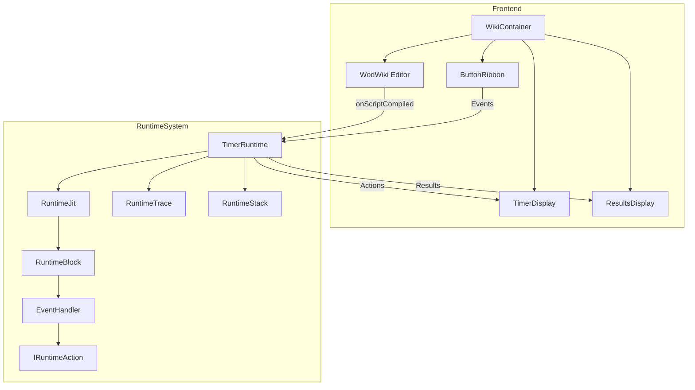

# Runtime Component Architecture

This document provides comprehensive details about the runtime component architecture in wod.wiki, focusing on the block-based execution model, event handling system, and reactive data flow.

## 1. Architecture Overview

The wod.wiki runtime is built upon a few key architectural patterns:

- **Block-based Component Model**: Workout execution is divided into blocks, each responsible for a specific execution context
- **Reactive Event Processing**: Events flow through a reactive pipeline using RxJS Observables
- **Stack-based Execution Trace**: Maintains parent-child relationships between blocks in an execution stack
- **Just-In-Time Compilation**: Creates specialized blocks for different execution contexts as needed

### Core Component Relationships



## 2. Block-Based Execution Model

### RuntimeBlock

`RuntimeBlock` is the abstract base class for all execution blocks. It defines the common interface and behavior for handling events and generating actions.

```typescript
export abstract class RuntimeBlock implements IRuntimeBlock {
  constructor(
    public blockId: number,
    public blockKey: string,
    public source?: StatementNode | undefined
  ) {}
  
  // Parent-child relationship
  public parent?: IRuntimeBlock | undefined;
  
  // Results tracking
  public laps: ResultSpan[] = []; 
  public metrics: RuntimeMetric[] = [];
  public buttons: IActionButton[] = [];

  // Event handling
  protected handlers: EventHandler[] = [];
  protected system: EventHandler[] = [];
  
  // Abstracts that specialized blocks must implement
  abstract next(runtime: ITimerRuntime): StatementNode | undefined;
  abstract load(runtime: ITimerRuntime): IRuntimeEvent[];

  // Standard event handling pipeline
  public handle(runtime: ITimerRuntime, event: IRuntimeEvent): IRuntimeAction[] {
    const result: IRuntimeAction[] = [];
    for (const handler of [...this.system, ...this.handlers]) {
      const actions = handler.apply(event, runtime);
      for (const action of actions) {
        result.push(action);
      }
    }
    return result;
  }  
}
```

### Specialized Block Types

The system includes several specialized block types:

1. **RootBlock**: Contains all top-level statements in the workout script
2. **SingleBlock**: Handles execution of a single statement
3. **IdleRuntimeBlock**: Represents the idle state of the runtime
4. **DoneRuntimeBlock**: Represents the completed state of the runtime

Each specialized block type implements the abstract methods from `RuntimeBlock`:
- `next()`: Determines the next statement to execute
- `load()`: Initializes the block and generates any events needed at startup

## 3. Reactive Event Flow

### TimerRuntime

The `TimerRuntime` orchestrates the event flow using RxJS Observables:

```typescript
export class TimerRuntime implements ITimerRuntimeIo { 
  // Observable streams
  public tick$: Observable<IRuntimeEvent>; 
  public input$: Subject<IRuntimeEvent>;
  public output$: Subject<OutputEvent>;
  
  // State management
  public trace: RuntimeTrace;
  
  constructor(
    public code: string,
    public script: RuntimeStack,     
    public jit: RuntimeJit,
    input$: Subject<IRuntimeEvent>,
    output$: Subject<OutputEvent>,    
  ) {            
    // Initialize the runtime
    this.input$ = input$;
    this.output$ = output$;
    this.trace = new RuntimeTrace();
    
    // Set up the initial blocks
    this.next(this.jit.root(this));
    this.next(this.jit.idle(this));

    // Create tick stream for time-based events
    this.tick$ = interval(100).pipe(map(() => new TickEvent()));
    
    // Set up event processing pipeline
    this.dispose = merge(this.input$.pipe(tap(logEvent)), this.tick$)
      .subscribe(event => {         
        // Log the event to the trace
        this.trace.log(event);

        // Get the current active block
        const block = this.trace.current();
        
        // Handle the event and collect actions
        const actions = block?.handle(this, event)
            .filter(actions => actions !== undefined)
            .flat() ?? [];
        
        // Apply each action
        for (const action of actions) {          
          action.apply(this, this.input$, this.output$);
        }            
      });    
  }
  
  // ... methods for block navigation and state management ...
}
```

### Event and Action Types

Events flow through the system in this pattern:
1. External events enter through `input$` (e.g., start, stop, lap)
2. Time-based events enter through `tick$` (generated every 100ms)
3. Blocks handle events and generate actions
4. Actions apply changes to the runtime state
5. Output events are published through `output$`

## 4. Execution Tracing

### RuntimeTrace

`RuntimeTrace` manages the execution stack and event history:

```typescript
export class RuntimeTrace {  
  // Execution history
  public history: Array<IRuntimeLog> = [];
  
  // Block execution stack
  public stack: Array<IRuntimeBlock> = [];
  
  // Get the currently active block
  current(): IRuntimeBlock | undefined {
    return this.stack.length == 0 ? undefined : this.stack[this.stack.length - 1];
  }

  // Record an event in the history
  log(event: IRuntimeEvent) { /* ... */ }

  // Add a block to the execution stack
  push(block: IRuntimeBlock): IRuntimeBlock { /* ... */ }

  // Remove the top block from the execution stack
  pop(): IRuntimeBlock | undefined { /* ... */ }
}
```

The trace provides a complete picture of:
- The current execution context (active block)
- Parent-child relationships between blocks
- Event history for debugging and analytics

## 5. ResultSpan and Metrics

### ResultSpan

`ResultSpan` captures execution results for a block:

```typescript
export class ResultSpan {
  blockKey?: string;
  index?: number;
  stack?: number[];
  start?: IRuntimeEvent;
  stop?: IRuntimeEvent;
  metrics: RuntimeMetric[] = [];
  label?: string;
  
  // Calculate duration between start and stop
  duration(timestamp?: Date): number { /* ... */ }
  
  // Apply metric edits
  edit(edits: RuntimeMetricEdit[]): ResultSpan { /* ... */ }
}
```

### RuntimeMetric

`RuntimeMetric` captures specific measurements within a workout:

```typescript
export type RuntimeMetric = {
  effort: string;           // The exercise name
  repetitions?: MetricValue; // Count of repetitions
  resistance?: MetricValue;  // Weight/resistance used
  distance?: MetricValue;    // Distance covered
};

export type MetricValue = {
  value: number;
  unit: string;
};
```

These metrics are used throughout the application for results display, analytics, and performance tracking.

## 6. Integration with UI Components

The runtime system integrates with the UI through:

1. **Input Events**: Button clicks, editor commands, and other user interactions
2. **Output Actions**: Display updates, timer changes, result updates

### Key UI Integration Points

- **ButtonRibbon**: Sends control events (start, stop, lap) to the runtime
- **TimerDisplay**: Receives display updates from the runtime
- **ResultsDisplay**: Receives result metrics from the runtime
- **WodWiki Editor**: Provides the workout script to the runtime

By maintaining this separation of concerns, the runtime can focus on workout execution while the UI handles presentation.

---

This architectural approach provides a modular, testable, and extensible foundation for the wod.wiki runtime system, enabling complex workout script execution with real-time feedback and metrics tracking.
