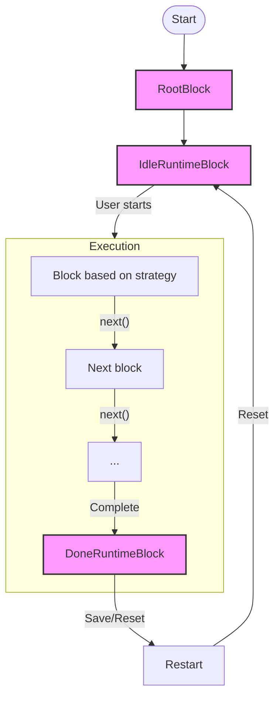
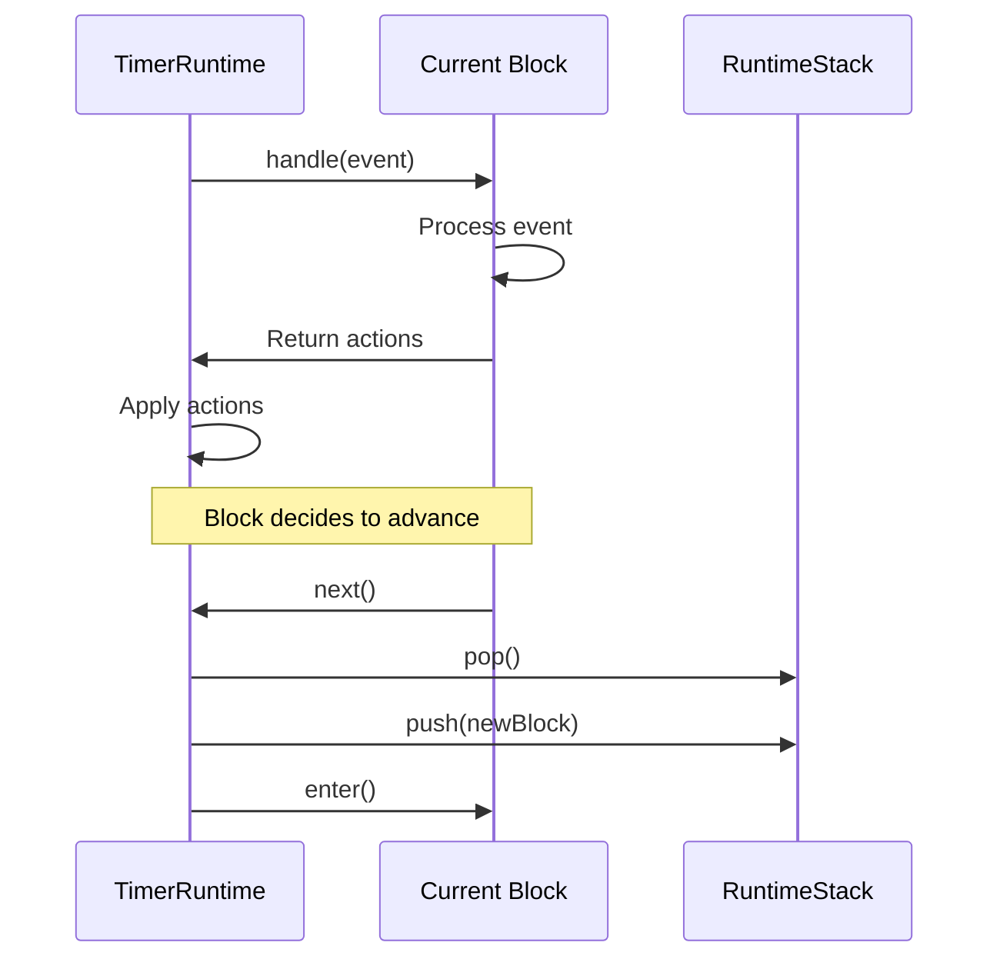
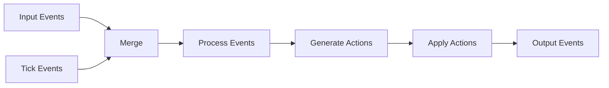

# Runtime Workflow

This document details the workflow of the wod.wiki runtime, focusing on the execution flow and state transitions.

## Execution Flow

The runtime follows a stack-based execution model, processing blocks in sequence and responding to events.



## State Transitions

The runtime moves through these primary states:

1. **Initialization**: Setting up the runtime with compiled script
2. **Idle**: Waiting for user to start the workout
3. **Executing**: Processing blocks according to the workout script
4. **Done**: Workout completed, displaying results
5. **Reset**: Returning to Idle state for potential restart

## Detailed Workflow Steps

### 1. Initialization

```typescript
// Create a new runtime with the compiled script
const runtime = new TimerRuntime(
  code,                   // Original source code
  new RuntimeStack(),     // Empty execution stack
  new RuntimeJit(script), // JIT compiler with the script
  new Subject<IRuntimeEvent>(), // Input event stream
  new Subject<OutputEvent>()    // Output event stream
);
```

During initialization:
- The RuntimeJit is configured with the script
- Event streams are established
- RootBlock containing all statements is pushed onto the stack
- IdleRuntimeBlock is pushed on top of the RootBlock

### 2. Idle State

The IdleRuntimeBlock:
- Displays the workout overview
- Sets up the "Start" button
- Waits for the start event

```typescript
// Inside IdleRuntimeBlock.onNext
if (event instanceof StartEvent) {
  return [new PopBlockAction()]; // Remove idle block, exposing root
}
```

### 3. Execution Start

When the user clicks Start:
- The IdleBlock is popped from the stack
- The RootBlock becomes active
- The RootBlock's `enter()` method is called
- The RootBlock processes its first child statement

```typescript
// Inside RootBlock.onEnter
protected onEnter(runtime: ITimerRuntime): IRuntimeAction[] {
  const actions: IRuntimeAction[] = [];
  
  // Start tracking results for this block
  this.onStart(runtime);
  
  // If we have statements, push the first one
  if (this.children.length > 0) {
    actions.push(new PushStatementAction(this.children[0]));
  }
  
  return actions;
}
```

### 4. Block Processing

As the workout progresses, each block:
1. Processes events via `handle()`
2. Updates its state
3. Generates actions via `next()`
4. Eventually completes and calls `leave()`



#### Common Block Pattern

Most blocks follow this general pattern:

```typescript
// Example pattern for a timed block
class TimedBlock extends RuntimeBlock {
  protected onEnter(runtime: ITimerRuntime): IRuntimeAction[] {
    // Start timer
    return [new StartTimerAction(this.duration)];
  }
  
  protected onNext(runtime: ITimerRuntime): IRuntimeAction[] {
    if (event instanceof CompleteEvent) {
      // User clicked "complete"
      return [new PopBlockAction()];
    }
    
    if (event instanceof TimerCompleteEvent) {
      // Timer finished
      return [new PopBlockAction()];
    }
    
    return [];
  }
  
  protected onLeave(runtime: ITimerRuntime): IRuntimeAction[] {
    // Stop timer if still running
    return [new StopTimerAction()];
  }
}
```

### 5. Block Navigation

The runtime uses a stack to navigate between blocks:

- **Push**: Adding a new block on top of the stack, making it active
- **Pop**: Removing the top block, returning to the previous block
- **Replace**: Popping the current block and pushing a new one

```typescript
// Example of block navigation
runtime.push(new EffortBlock(statement));  // Push a new block
runtime.pop();                            // Return to previous block
```

### 6. Completion

When all blocks are processed:

```typescript
// Inside RootBlock when all children are complete
return [new PushEndBlockAction()];  // Push the Done block
```

The DoneRuntimeBlock:
- Displays final workout results
- Provides options to save or reset
- Handles the end of the workout flow

### 7. Reset

When the user resets the workout:

```typescript
// Reset handler
if (event instanceof ResetEvent) {
  return [
    new PopBlockAction(),         // Remove DoneBlock
    new PushIdleBlockAction()     // Return to idle state
  ];
}
```

## Event Processing Pipeline

Events flow through a reactive pipeline:



### Implementation

```typescript
// Event processing pipeline in TimerRuntime
this.dispose = merge(this.input$.pipe(tap(logEvent)), this.tick$)
  .subscribe(event => {         
    // Log the event to the trace
    this.trace.log(event);

    // Get the current active block
    const block = this.trace.current();
    
    // Handle the event and collect actions
    const actions = block?.handle(this, event)
        .filter(actions => actions !== undefined)
        .flat() ?? [];
    
    // Apply each action
    for (const action of actions) {          
      action.apply(this, this.input$, this.output$);
    }            
  });
```

## Common Runtime Scenarios

### Scenario 1: Simple Timer

For a simple `:30` timer:

1. User clicks Start
2. IdleBlock pops
3. RootBlock gets `:30` statement
4. TimedBlock for `:30` is pushed
5. Timer starts counting down
6. When timer completes or user clicks Complete
7. TimedBlock pops
8. DoneBlock is pushed

### Scenario 2: Multiple Rounds

For `(3) 10 Push-ups`:

1. RepeatingBlock for 3 rounds is pushed
2. EffortBlock for 10 Push-ups is pushed
3. User completes the exercise
4. EffortBlock pops
5. RepeatingBlock checks round count (1 of 3)
6. EffortBlock is pushed again for round 2
7. Process repeats until all 3 rounds complete
8. RepeatingBlock pops
9. DoneBlock is pushed

## Debugging the Runtime

The RuntimeTrace maintains a complete history of events and block transitions, which can be used for debugging:

```typescript
// Accessing event history
const history = runtime.trace.history;

// Viewing the current block stack
const stack = runtime.trace.stack;

// Finding the active block
const current = runtime.trace.current();
```

This workflow provides a comprehensive view of how the wod.wiki runtime executes workout scripts, from initialization through completion.