# Event Propagation and Cyclical Dependency Analysis

> **Generated**: 2025-12-29  
> **Purpose**: Document runtime event propagation, identify cyclical dependencies, and propose architectural simplifications  
> **Status**: Analysis Complete

## Table of Contents

1. [Executive Summary](#executive-summary)
2. [Event Catalog](#event-catalog)
3. [Event Propagation Flows](#event-propagation-flows)
4. [Behavior Composition by Strategy](#behavior-composition-by-strategy)
5. [Cyclical Dependency Analysis](#cyclical-dependency-analysis)
6. [Current Architecture Issues](#current-architecture-issues)
7. [Proposed Solution: Phase-Separated Execution](#proposed-solution-phase-separated-execution)

---

## Executive Summary

The WOD Wiki runtime engine uses an event-driven architecture where:
- **Events** trigger **handlers** which produce **actions**
- **Actions** modify runtime state (push/pop blocks, emit more events)
- **Behaviors** respond to lifecycle hooks (`onPush`, `onNext`, `onPop`) and events (`onEvent`)

The current implementation has potential for cyclical issues where:
1. A `PopBlockAction` triggers `parent.next()` which may produce more actions
2. Events emitted by behaviors can trigger handlers that emit more events
3. Multiple behaviors listening to the same event can produce conflicting actions

---

## Event Catalog

### Core Events

| Event Name | Source | Purpose | Subscribers |
|------------|--------|---------|-------------|
| `next` | User action, timer completion | Request advancement to next block | `NextEventHandler` → `NextAction` |
| `timer:tick` | Clock interval | Periodic time update | `CompletionBehavior`, `SoundBehavior` |
| `timer:started` | `TimerBehavior.onPush()` | Timer has started | Display components |
| `timer:complete` | `TimerBehavior.onPop()`, `CompletionBehavior` | Timer finished | `LoopCoordinatorBehavior`, `CompletionBehavior` |
| `timer:start` | User button click | User requested timer start | `RootLifecycleBehavior` |
| `timer:pause` | User button click | User requested pause | `RootLifecycleBehavior` |
| `timer:resume` | User button click | User requested resume | `RootLifecycleBehavior` |
| `timer:next` | User button click | Skip current segment | `RootLifecycleBehavior` |
| `workout:complete` | User button click | Force-complete workout | `RootLifecycleBehavior` |
| `block:complete` | `CompletionBehavior` | Block has completed | Parent blocks |

### Stack Events

| Event Name | Source | Purpose | Subscribers |
|------------|--------|---------|-------------|
| `stack:push` | `ScriptRuntime.pushBlock()` | Block pushed onto stack | `SpanTrackingHandler`, display |
| `stack:pop` | `ScriptRuntime.popBlock()` | Block popped from stack | `SpanTrackingHandler`, display |
| `stack:clear` | `RuntimeStack.clear()` | Stack cleared | Cleanup handlers |

### Memory Events

| Event Name | Source | Purpose | Subscribers |
|------------|--------|---------|-------------|
| `memory:set` | `BlockContext.set()` | Memory value changed | Reactive UI components |
| `memory:allocate` | `BlockContext.allocate()` | New memory allocated | Debug/tracking |
| `memory:release` | `BlockContext.release()` | Memory released | Cleanup handlers |

### Metric Events

| Event Name | Source | Purpose | Subscribers |
|------------|--------|---------|-------------|
| `metric:collect` | `IdleBehavior.onPop()` | Metric ready for collection | Analytics system |
| `rounds:changed` | `LoopCoordinatorBehavior` | Round counter updated | Display, analytics |

---

## Event Propagation Flows

### Flow 1: User Clicks "Next" Button

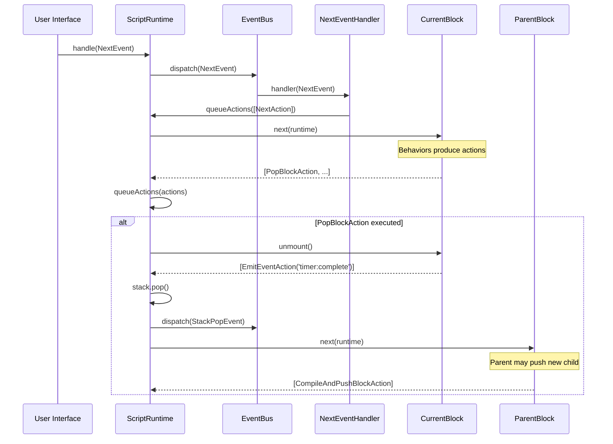

### Flow 2: Timer Completion

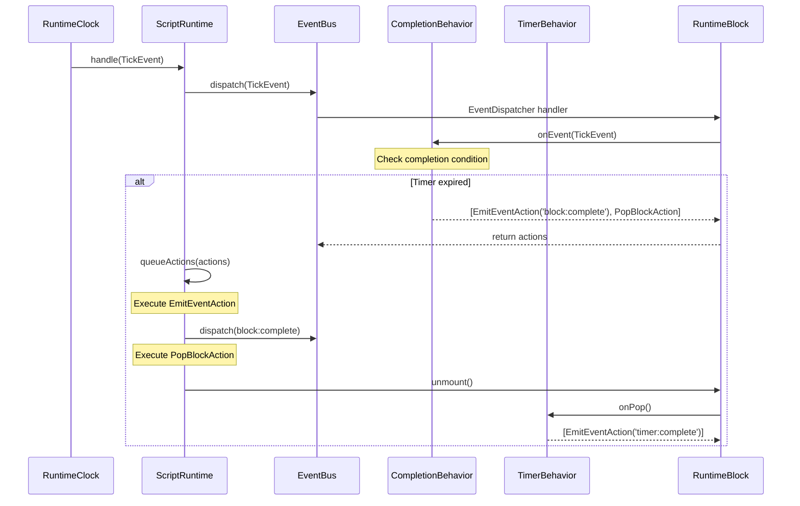

### Flow 3: Push Block → Mount → Event Cascade

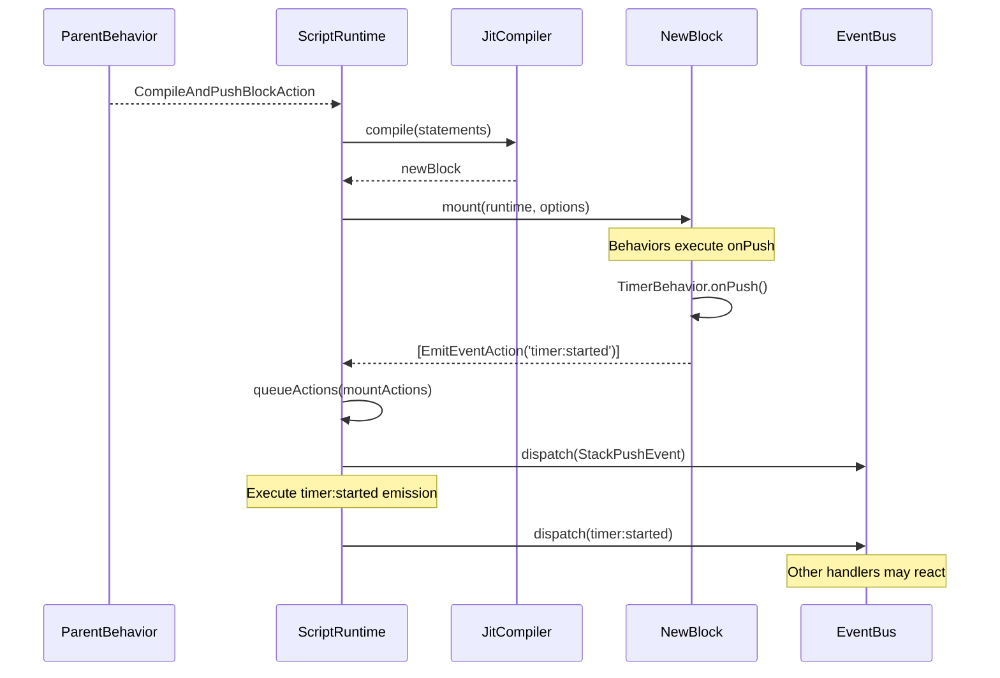

### Flow 4: Pop Block → Parent Next → Potential Loop

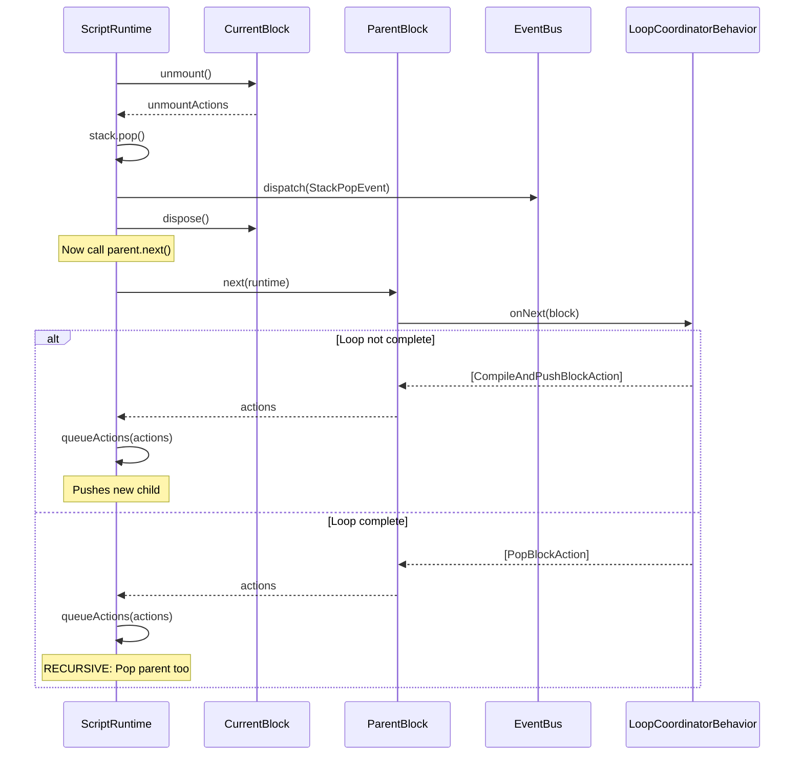

---

## Behavior Composition by Strategy

### RoundsStrategy Behaviors

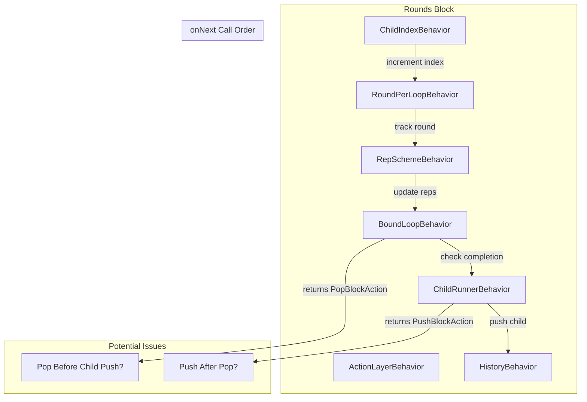

### TimerStrategy Behaviors

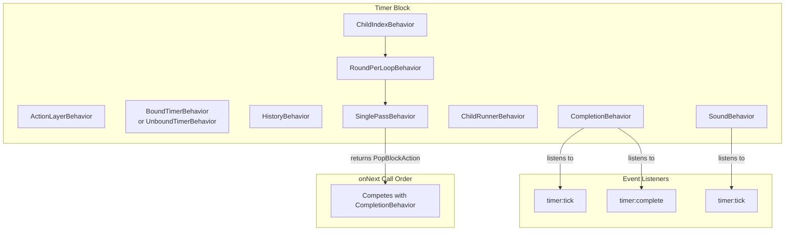

### EffortStrategy Behaviors

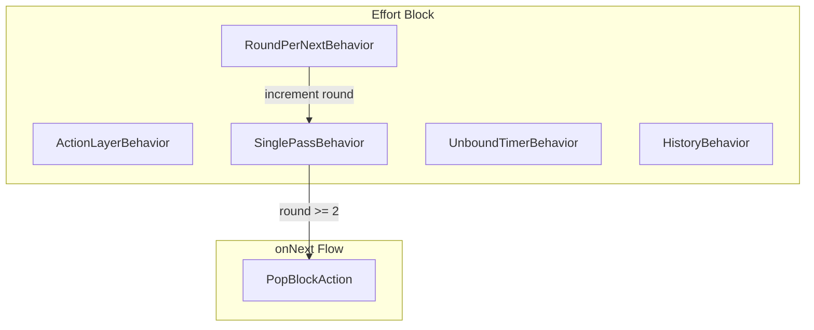

### RootLifecycleBehavior State Machine

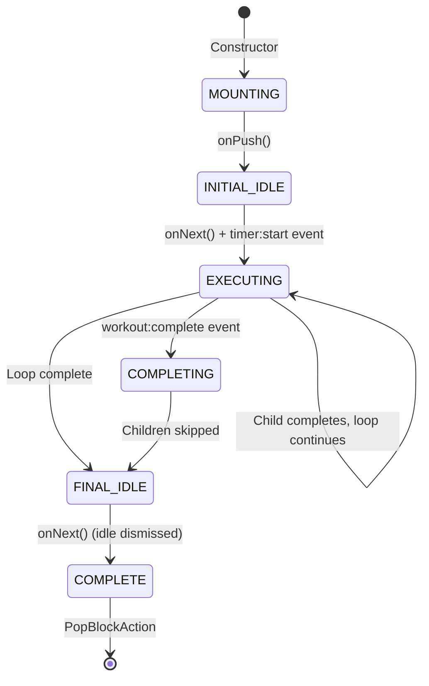

---

## Cyclical Dependency Analysis

### Cycle 1: PopBlock → ParentNext → PushChild → PopChild → ParentNext

```mermaid
graph LR
    A[Child completes] --> B[PopBlockAction]
    B --> C[parent.next()]
    C --> D[LoopCoordinator.onNext]
    D --> E{Loop complete?}
    E --> |No| F[CompileAndPushBlockAction]
    F --> G[New child mounted]
    G --> H[Child runs]
    H --> A
    E --> |Yes| I[PopBlockAction]
    I --> J[Grandparent.next()]
    J --> K{...continues up stack}
```

**Risk**: The pop-next chain can cascade up the entire stack in a single action processing cycle.

### Cycle 2: Event → Handler → Action → Event

```mermaid
graph TD
    A[timer:tick] --> B[CompletionBehavior.onEvent]
    B --> C{Condition met?}
    C --> |Yes| D[EmitEventAction<br>block:complete]
    D --> E[EventBus.dispatch]
    E --> F[Other handlers]
    F --> |May emit| G[More events]
    G --> |Processed in| H[Same action queue]
    
    C --> |Yes| I[PopBlockAction]
    I --> J[TimerBehavior.onPop]
    J --> K[EmitEventAction<br>timer:complete]
    K --> L[EventBus.dispatch]
    L --> M[LoopCoordinator.onEvent]
    M --> |May trigger| N[advance()]
```

**Risk**: A single `timer:tick` can trigger a cascade of events, all processed in the same action queue cycle.

### Cycle 3: NextEventHandler → NextAction → block.next() → PopBlockAction → parent.next()

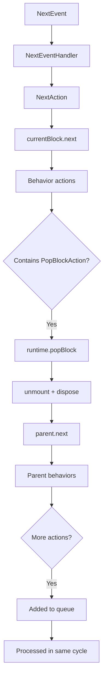

**Risk**: A single `NextEvent` can complete multiple blocks if each parent's `next()` returns a `PopBlockAction`.

### Cycle 4: Competing Completion Behaviors

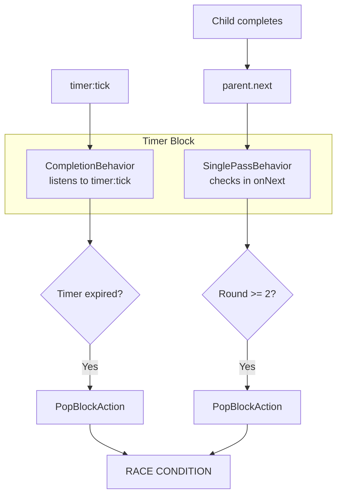

**Risk**: Both `CompletionBehavior` and `SinglePassBehavior` may try to pop the same block.

---

## Current Architecture Issues

### Issue 1: Interleaved Push/Pop with Event Emission

The current flow in `ScriptRuntime.popBlock()`:

```typescript
// Current flow (problematic)
1. block.unmount()           // May emit events
2. stack.pop()
3. dispatch(StackPopEvent)   // More events
4. tracker.endSpan()
5. Execute unmount actions   // May include EmitEventAction
6. block.dispose()
7. cleanup handlers
8. parent.next()             // May return PushBlockAction
9. queueActions(nextActions) // Processed immediately
```

**Problem**: Events are emitted mid-lifecycle, and `parent.next()` is called before the pop is "conceptually complete."

### Issue 2: Action Queue Processes During Lifecycle

```typescript
// In popBlock()
this.executeActionsImmediately(unmountActions);
// ...later
const nextActions = parent.next(this, lifecycleOptions);
this.queueActions(nextActions);
```

**Problem**: `executeActionsImmediately` bypasses the queue, while `queueActions` adds to queue. This creates inconsistent ordering.

### Issue 3: EmitEventAction Recursive Dispatch

```typescript
// EmitEventAction.do()
runtime.handle(event);  // Calls eventBus.dispatch() synchronously
```

**Problem**: Event emission during action processing can trigger new actions, which are added to the queue while processing is active.

### Issue 4: Multiple Behaviors Returning Pop

Several behaviors can independently return `PopBlockAction`:
- `CompletionBehavior.onNext()` / `onEvent()`
- `SinglePassBehavior.onNext()`
- `BoundLoopBehavior.onNext()`
- `BoundTimerBehavior.onNext()` (via timer completion)

**Problem**: If multiple behaviors return `PopBlockAction` in the same `next()` call, duplicate pops may be attempted.

---

## Proposed Solution: Phase-Separated Execution

### Core Concept: Onion Layer Model

Separate the runtime execution into distinct phases, where each phase completes entirely before the next begins. This prevents event emission from triggering push/pop operations mid-lifecycle.

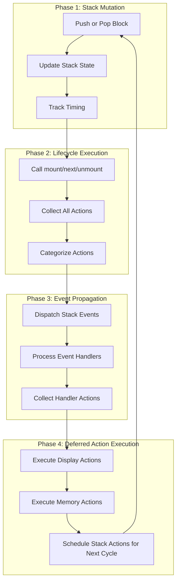

### Proposed Architecture Changes

#### 1. Action Categories

```typescript
enum ActionPhase {
  /** Stack mutations - push/pop blocks */
  STACK = 'stack',
  /** Event emissions - dispatch to handlers */
  EVENT = 'event',
  /** Display updates - UI state changes */
  DISPLAY = 'display',
  /** Memory mutations - allocate/set values */
  MEMORY = 'memory',
  /** Side effects - sounds, logging */
  SIDE_EFFECT = 'side_effect'
}

interface IPhasedAction extends IRuntimeAction {
  phase: ActionPhase;
}
```

#### 2. Phased Action Processor

```typescript
class PhasedActionProcessor {
  private pendingByPhase: Map<ActionPhase, IRuntimeAction[]> = new Map();
  private currentPhase: ActionPhase | null = null;
  
  queue(action: IPhasedAction): void {
    const list = this.pendingByPhase.get(action.phase) ?? [];
    list.push(action);
    this.pendingByPhase.set(action.phase, list);
  }
  
  processAllPhases(): void {
    // Execute phases in strict order
    const phaseOrder = [
      ActionPhase.DISPLAY,      // Update UI first
      ActionPhase.MEMORY,       // Update state
      ActionPhase.SIDE_EFFECT,  // Sounds, logging
      ActionPhase.EVENT,        // Emit events (may queue more actions)
      ActionPhase.STACK         // Stack mutations (deferred to next cycle)
    ];
    
    for (const phase of phaseOrder) {
      this.executePhase(phase);
    }
  }
  
  private executePhase(phase: ActionPhase): void {
    this.currentPhase = phase;
    const actions = this.pendingByPhase.get(phase) ?? [];
    this.pendingByPhase.delete(phase);
    
    for (const action of actions) {
      action.do(this.runtime);
    }
    this.currentPhase = null;
  }
}
```

#### 3. Deferred Stack Operations

Stack mutations should be collected and executed atomically at the end of a cycle:

```typescript
class DeferredPopBlockAction implements IPhasedAction {
  readonly phase = ActionPhase.STACK;
  readonly type = 'deferred-pop-block';
  
  do(runtime: IScriptRuntime): void {
    // Pop is queued, will execute after all other phases
    runtime.scheduleStackMutation(() => {
      runtime.popBlock();
    });
  }
}
```

#### 4. Event Emission Without Immediate Processing

```typescript
class DeferredEmitEventAction implements IPhasedAction {
  readonly phase = ActionPhase.EVENT;
  readonly type = 'deferred-emit-event';
  
  constructor(
    public readonly eventName: string,
    public readonly data?: unknown
  ) {}
  
  do(runtime: IScriptRuntime): void {
    // Collect handler actions, don't process immediately
    const event = { name: this.eventName, timestamp: new Date(), data: this.data };
    const actions = runtime.eventBus.dispatch(event, runtime);
    
    // Queue actions for next phase, not immediate execution
    for (const action of actions) {
      runtime.queueAction(action);
    }
  }
}
```

#### 5. Revised Pop Flow

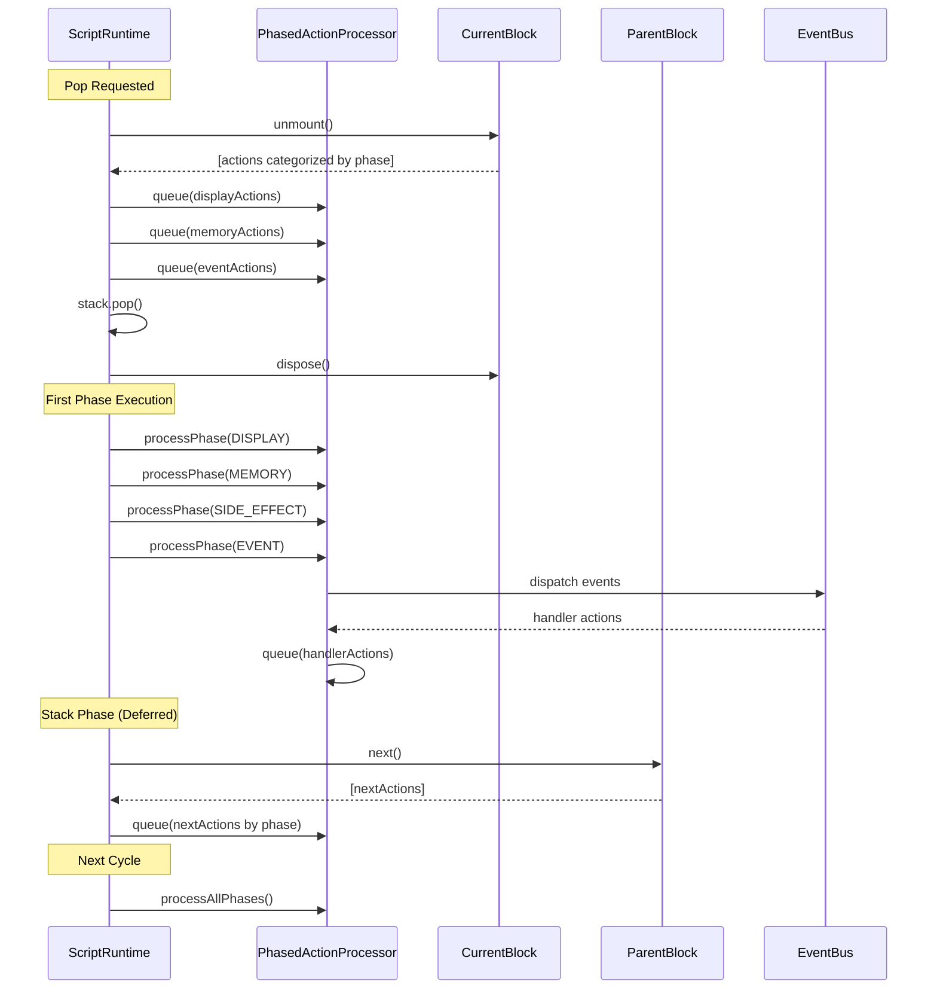

### Benefits of Phase-Separated Execution

1. **Predictable Ordering**: Display updates always happen before stack mutations
2. **No Event Cascades**: Events are collected and processed in batches
3. **Debuggable State**: At each phase boundary, state is consistent
4. **Prevents Double-Pop**: Stack operations are deduplicated per cycle
5. **Clean Lifecycle**: `unmount()` completes before any new blocks are pushed

### Implementation Roadmap

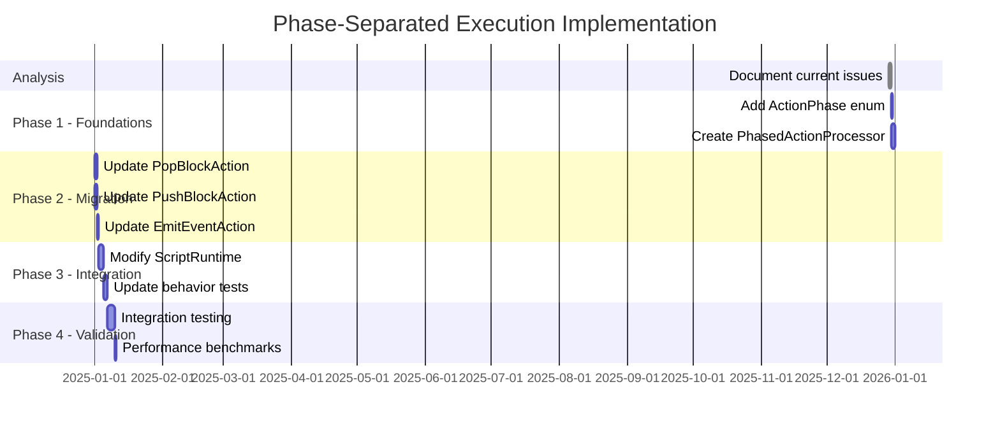

---

## Appendix: All Behaviors and Their Event/Action Interactions

### Behavior Interaction Matrix

| Behavior | onPush Actions | onNext Actions | onPop Actions | onEvent Actions |
|----------|---------------|----------------|---------------|-----------------|
| `ActionLayerBehavior` | Display setup | - | - | - |
| `TimerBehavior` | EmitEvent(timer:started) | - | EmitEvent(timer:complete) | - |
| `BoundTimerBehavior` | Timer init | - | Timer cleanup | timer:tick → display |
| `UnboundTimerBehavior` | Timer init | - | Timer cleanup | - |
| `CompletionBehavior` | - | PopBlockAction (if condition) | - | timer:tick, timer:complete → PopBlockAction |
| `LoopCoordinatorBehavior` | CompileAndPush | CompileAndPush or [] | - | timer:complete → advance() |
| `ChildRunnerBehavior` | Calls onNext | CompileAndPush | - | - |
| `ChildIndexBehavior` | Reset index | Increment index | - | - |
| `BoundLoopBehavior` | - | PopBlockAction (if round > total) | - | - |
| `SinglePassBehavior` | - | PopBlockAction (if round >= 2) | - | - |
| `RoundPerNextBehavior` | - | Increment round | - | - |
| `RoundPerLoopBehavior` | - | Increment round on wrap | - | - |
| `HistoryBehavior` | Span start | - | Span end | - |
| `SoundBehavior` | - | - | - | timer:tick → PlaySound |
| `IdleBehavior` | Memory allocation | PopBlockAction (if popOnNext) | EmitEvent(metric:collect) | event → PopBlockAction (if popOnEvents) |
| `RootLifecycleBehavior` | Subscribe, PushIdleBlock | State machine transitions | Unsubscribe | timer:start/pause/resume/next, workout:complete |
| `RuntimeControlsBehavior` | Register controls | - | - | - |
| `RepSchemeBehavior` | - | Update memory | - | - |
| `IntervalWaitingBehavior` | - | Wait state | - | timer:complete → unwait |

### Event to Handler Mapping

| Event | Handler/Behavior | Actions Produced |
|-------|-----------------|------------------|
| `next` | NextEventHandler | NextAction |
| `timer:tick` | CompletionBehavior | PopBlockAction, EmitEventAction |
| `timer:tick` | SoundBehavior | PlaySoundAction |
| `timer:complete` | CompletionBehavior | PopBlockAction, EmitEventAction |
| `timer:complete` | LoopCoordinatorBehavior | advance() → CompileAndPush |
| `timer:start` | RootLifecycleBehavior | PopBlockAction (dismiss idle) |
| `timer:pause` | RootLifecycleBehavior | Display updates |
| `timer:resume` | RootLifecycleBehavior | Display updates |
| `timer:next` | RootLifecycleBehavior | SkipCurrentBlockAction |
| `workout:complete` | RootLifecycleBehavior | PopToBlockAction, PushIdleBlockAction |
| `stack:push` | SpanTrackingHandler | Span tracking |
| `stack:pop` | SpanTrackingHandler | Span tracking |

---

## Conclusion

The current event-driven architecture creates complex interdependencies between behaviors, events, and actions. The proposed phase-separated execution model addresses these issues by:

1. **Separating concerns**: Stack mutations, events, and display updates execute in distinct phases
2. **Preventing cascades**: Actions queued during event processing execute in the next phase
3. **Ensuring consistency**: Each phase completes atomically before the next begins
4. **Simplifying debugging**: State is predictable at phase boundaries

This refactoring would require significant changes to the action system and runtime, but would result in a more maintainable and predictable execution model.
