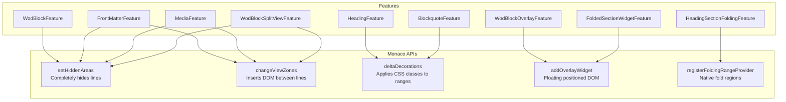

# Monaco Editor Inline Widget System - Deep Dive Analysis

This document provides a comprehensive analysis of the current Monaco Editor customization system in WOD Wiki, with the goal of understanding and simplifying the inline widget architecture.

## Executive Summary

The current implementation has **11 feature files** using **3 different Monaco APIs** (`setHiddenAreas`, `changeViewZones`, `deltaDecorations`) with overlapping responsibilities. This creates complexity that makes it difficult to achieve the desired "inline preview with edit-on-focus" experience consistently.

**Proposed Solution**: Unify all features under a single **Inline Widget Card** abstraction that supports:
- Full-width preview mode (cursor outside)
- Half-width side-by-side mode (cursor inside for WOD/frontmatter)
- Edit-only mode (cursor inside for headings/media)

---

## Current Architecture

### Feature Files Inventory

| File | Purpose | Monaco APIs Used | Widget Type |
|------|---------|------------------|-------------|
| `RichMarkdownManager.ts` | Orchestrator | None (delegates) | N/A |
| `FeatureRegistry.ts` | Coordinates all features | `setHiddenAreas`, `changeViewZones`, `deltaDecorations` | ViewZones |
| `RichFeature.ts` | Interface definition | N/A | N/A |
| `HeadingFeature.ts` | Hide `#` markers | `deltaDecorations` | Inline CSS |
| `BlockquoteFeature.ts` | Hide `>` markers | `deltaDecorations` | Inline CSS |
| `WodBlockFeature.ts` | Hide fence lines | `setHiddenAreas` | None |
| `FrontMatterFeature.ts` | Show property table | `setHiddenAreas`, `changeViewZones` | React ViewZone |
| `MediaFeature.ts` | Show image/YouTube | `setHiddenAreas`, `changeViewZones` | React ViewZone |
| `WodBlockOverlayFeature.tsx` | Right-side overlay | `addOverlayWidget` | Overlay Widget |
| `WodBlockSplitViewFeature.tsx` | Split code/preview | `setHiddenAreas`, `changeViewZones` | ViewZone |
| `HeadingSectionFoldingFeature.ts` | Native folding | `registerFoldingRangeProvider` | Folding |
| `FoldedSectionWidgetFeature.tsx` | Folded section summary | `addOverlayWidget` | Overlay Widget |

### Monaco APIs Used



---

## Current Behavior Analysis

### 1. Heading Feature (`HeadingFeature.ts`)

**Input**: `# Heading Text`, `## Heading Text`, `### Heading Text`

**Current Behavior**:
- When cursor is **outside** the line:
  - Hides `# ` prefix using CSS (`rich-md-hidden` class)
  - Applies heading styles (`rich-md-heading-1/2/3`)
- When cursor is **on** the line:
  - Shows raw text `# Heading Text`
  - No styling applied

**Implementation**:
```typescript
// HeadingFeature.ts
getDecorations(range, context) {
    if (currentLine === line) return []; // Cursor on line - show raw
    return [
        { range: prefixRange, options: { inlineClassName: 'rich-md-hidden' } },
        { range: textRange, options: { inlineClassName: `rich-md-heading-${level}` } }
    ];
}
```

**CSS** (`index.css`):
```css
.rich-md-hidden {
  color: transparent !important;
  font-size: 0px !important;
  letter-spacing: -100px;
  width: 0; height: 0;
}

.rich-md-heading-1 {
  font-size: 1.5em !important;
  font-weight: bold !important;
}
```

**Problems**:
- Line height doesn't adjust when style changes (heading is taller but line stays same height)
- No actual "preview widget" - just styled text
- Can't show a different UI representation (e.g., rendered markdown heading block)

---

### 2. Media Feature (`MediaFeature.ts` + `MediaWidget.tsx`)

**Input**: `` or YouTube URL on standalone line

**Current Behavior**:
- When cursor is **outside** the line:
  - Line is completely hidden via `setHiddenAreas`
  - React `MediaWidget` rendered in ViewZone
  - Shows actual image or YouTube iframe
- When cursor is **on** the line:
  - Hidden areas cleared
  - Raw markdown visible for editing

**Implementation**:
```typescript
// MediaFeature.ts
shouldHide(range, context) {
    if (context.isReadOnly) return true;
    return currentLine !== line; // Hide when cursor not on this line
}

renderWidget(range, onEdit) {
    return <MediaWidget type={block.type} url={block.url} />;
}
```

**Problems**:
- ViewZone height is fixed (`heightInLines: 10 or 15`)
- No smooth transition between edit/preview modes
- Entire line disappears - jarring UX

---

### 3. Front Matter Feature (`FrontMatterFeature.ts` + `FrontMatterTable.tsx`)

**Input**: YAML block at start of file
```yaml
---
title: My Workout
difficulty: hard
---
```

**Current Behavior**:
- When cursor is **outside** the block:
  - Block hidden via `setHiddenAreas`
  - `FrontMatterTable` component shows properties in table format
- When cursor is **inside** the block:
  - Block visible for editing
  - Table widget removed

**Problems**:
- Same issues as Media: fixed height, jarring transitions
- No side-by-side edit mode option

---

### 4. WOD Block Feature (Multiple Files!)

**Input**:
```wod
5 rounds
10 Push ups
15 Squats
```

**Current Behavior** - THREE DIFFERENT IMPLEMENTATIONS:

#### 4a. `WodBlockFeature.ts` (Simple)
- Just hides the fence lines (`\`\`\`wod` and `\`\`\``)
- Content inside remains visible

#### 4b. `WodBlockOverlayFeature.tsx` (Overlay)
- Creates floating overlay widget on right side of editor
- Shows parsed statements preview
- Positioned manually based on scroll position
- Overlay floats over content

#### 4c. `WodBlockSplitViewFeature.tsx` (Split View)
- Hides entire WOD block
- Creates ViewZone with split layout:
  - Left: Code (static or embedded Monaco editor when editing)
  - Right: Parsed preview with "Run Workout" button
- Most complex implementation (597 lines!)

**Problems**:
- Three separate implementations for same content type!
- Split view creates nested Monaco editor (performance concern)
- Complex state management between outer/inner editors
- Hard to maintain consistency

---

### 5. Folding Features (`HeadingSectionFoldingFeature.ts` + `FoldedSectionWidgetFeature.tsx`)

**Current Behavior**:
- Registers native Monaco folding provider for headings
- When user clicks fold gutter:
  - Monaco collapses region natively
  - `FoldedSectionWidgetFeature` tries to render summary widget
  - Widget positioned via overlay (unreliable positioning)

**Problems**:
- Widget positioning doesn't work reliably with Monaco's fold UI
- Polling for fold state (no direct event from Monaco)
- Complex interaction between native folding and custom widgets

---

## Desired Behavior

### Unified Inline Widget Card Model

Every "rich" element should behave as an **Inline Widget Card** with three display modes:

```
┌──────────────────────────────────────────────────────┐
│ FULL-WIDTH PREVIEW (cursor outside)                  │
│ ┌────────────────────────────────────────────────┐   │
│ │ Preview Widget (rendered heading/image/etc)    │   │
│ └────────────────────────────────────────────────┘   │
└──────────────────────────────────────────────────────┘

┌──────────────────────────────────────────────────────┐
│ HALF-WIDTH SIDE-BY-SIDE (cursor inside, complex)     │
│ ┌──────────────────┐ ┌──────────────────────────┐   │
│ │ Monaco Editor    │ │ Live Preview             │   │
│ │ (raw text edit)  │ │ (parsed result)          │   │
│ └──────────────────┘ └──────────────────────────┘   │
└──────────────────────────────────────────────────────┘

┌──────────────────────────────────────────────────────┐
│ EDIT-ONLY (cursor inside, simple elements)           │
│ # Heading Text                                       │
│ (raw monaco line, no widget)                         │
└──────────────────────────────────────────────────────┘
```

### Content Type → Display Mode Mapping

| Content Type | Cursor Outside | Cursor Inside |
|--------------|----------------|---------------|
| **Heading** | Full-width styled preview | Edit-only (raw `# text`) |
| **Image** | Full-width image preview | Edit-only (raw ``) |
| **YouTube** | Full-width video embed | Edit-only (raw URL) |
| **Front Matter** | Full-width property table | Side-by-side (edit + table) |
| **WOD Block** | Full-width parsed preview | Side-by-side (edit + preview) |

### Height Handling

**Critical requirement**: The taller of (preview widget, underlying text) determines the card height.

```
Case 1: Preview taller than source
┌──────────────────────────────────────┐
│ ┌──────────────────────────────────┐ │
│ │                                  │ │ ← Preview widget (tall)
│ │          Image Preview           │ │
│ │                                  │ │
│ └──────────────────────────────────┘ │
│      └──  ──┘             │ ← Source text (centered)
└──────────────────────────────────────┘

Case 2: Source taller than preview  
┌──────────────────────────────────────┐
│           ┌──────────┐               │
│           │ Property │               │ ← Preview (centered)
│           │ Table    │               │
│           └──────────┘               │
│ ---                                  │
│ title: Long Title Here               │
│ desc: Multi-line description         │ ← Source YAML (tall)
│ author: Person                       │
│ ---                                  │
└──────────────────────────────────────┘
```

---

## Proposed Simplified Architecture

### Single Abstraction: `InlineWidgetCard`

```typescript
interface InlineWidgetCard {
  /** Unique identifier */
  id: string;
  
  /** Content type determines display behavior */
  type: 'heading' | 'image' | 'youtube' | 'frontmatter' | 'wod-block';
  
  /** Source text range in editor */
  sourceRange: Range;
  
  /** Parsed content/metadata */
  content: HeadingContent | MediaContent | FrontMatterContent | WodContent;
  
  /** Display mode based on cursor position */
  displayMode: 'full-preview' | 'side-by-side' | 'edit-only';
  
  /** Which mode to use when cursor is inside */
  editMode: 'side-by-side' | 'edit-only';
}

interface CardRenderer {
  /** Render the preview widget */
  renderPreview(card: InlineWidgetCard): React.ReactNode;
  
  /** Calculate preview height in pixels */
  getPreviewHeight(card: InlineWidgetCard): number;
  
  /** Calculate source text height in lines */
  getSourceHeight(card: InlineWidgetCard): number;
}
```

### Unified Card Manager

```typescript
class InlineWidgetCardManager {
  private cards: Map<string, InlineWidgetCard> = new Map();
  private viewZones: Map<string, ViewZoneInfo> = new Map();
  
  constructor(private editor: editor.IStandaloneCodeEditor) {
    // Listen to cursor changes
    editor.onDidChangeCursorPosition(() => this.updateDisplayModes());
    
    // Listen to content changes
    editor.onDidChangeModelContent(() => this.parseContent());
  }
  
  private parseContent() {
    const model = this.editor.getModel();
    if (!model) return;
    
    const cards = this.detectAllCards(model);
    this.cards = new Map(cards.map(c => [c.id, c]));
    this.updateDisplayModes();
  }
  
  private updateDisplayModes() {
    const cursorLine = this.editor.getPosition()?.lineNumber;
    
    for (const card of this.cards.values()) {
      const cursorInside = this.isCursorInRange(cursorLine, card.sourceRange);
      
      if (cursorInside) {
        card.displayMode = card.editMode; // 'side-by-side' or 'edit-only'
      } else {
        card.displayMode = 'full-preview';
      }
    }
    
    this.renderAllCards();
  }
  
  private renderAllCards() {
    // 1. Calculate which lines to hide
    // 2. Create/update ViewZones with appropriate heights
    // 3. Apply decorations for inline styling
  }
}
```

### CSS Layout for Cards

```css
.inline-widget-card {
  display: flex;
  align-items: center; /* Vertical centering */
  width: 100%;
  border: 1px solid var(--border);
  border-radius: 6px;
  background: var(--card);
  overflow: hidden;
}

/* Full-width preview mode */
.inline-widget-card[data-mode="full-preview"] {
  justify-content: center;
}

.inline-widget-card[data-mode="full-preview"] .card-preview {
  width: 100%;
}

.inline-widget-card[data-mode="full-preview"] .card-source {
  display: none;
}

/* Side-by-side mode */
.inline-widget-card[data-mode="side-by-side"] {
  display: grid;
  grid-template-columns: 1fr 1fr;
  gap: 8px;
}

.inline-widget-card[data-mode="side-by-side"] .card-source,
.inline-widget-card[data-mode="side-by-side"] .card-preview {
  display: flex;
  align-items: center;
  justify-content: center;
  min-height: 100%;
}

/* Edit-only mode - no card, just show Monaco line */
.inline-widget-card[data-mode="edit-only"] {
  display: none; /* Remove card, show underlying Monaco text */
}
```

---

## Implementation Roadmap

### Phase 1: Core Card Infrastructure
1. Define `InlineWidgetCard` interface
2. Implement `InlineWidgetCardManager` class
3. Implement height calculation (max of preview vs source)
4. Implement cursor proximity detection

### Phase 2: Migrate Simple Features
1. Migrate `HeadingFeature` → `HeadingCardRenderer`
2. Migrate `MediaFeature` → `MediaCardRenderer`
3. Migrate `BlockquoteFeature` → `BlockquoteCardRenderer`

### Phase 3: Migrate Complex Features
1. Migrate `FrontMatterFeature` → `FrontMatterCardRenderer` (with side-by-side)
2. Consolidate WOD features → `WodBlockCardRenderer` (with side-by-side)
3. Remove redundant overlay/split view files

### Phase 4: Polish
1. Smooth transitions between modes (CSS animations)
2. Keyboard navigation between cards
3. Focus management when entering/exiting cards

---

## Files to Deprecate

After migration, these files can be removed:

- ❌ `WodBlockOverlayFeature.tsx` (322 lines)
- ❌ `WodBlockSplitViewFeature.tsx` (597 lines)  
- ❌ `FoldedSectionWidgetFeature.tsx` (355 lines)
- ❌ `HeadingSectionFoldingFeature.ts` (283 lines)

**Total: ~1,557 lines of code removed**

These files will be consolidated:

- `HeadingFeature.ts` → Simplified (keep decoration logic)
- `BlockquoteFeature.ts` → Simplified (keep decoration logic)
- `MediaFeature.ts` → Simplified + new card wrapper
- `FrontMatterFeature.ts` → Simplified + new card wrapper
- `WodBlockFeature.ts` → Enhanced with card wrapper

---

## Key Technical Decisions

### 1. ViewZones vs Overlay Widgets

**Recommendation: Use ViewZones exclusively**

ViewZones push editor content down, creating actual space for widgets. Overlay widgets float and require manual positioning.

```typescript
// ViewZone approach (recommended)
editor.changeViewZones(accessor => {
  accessor.addZone({
    afterLineNumber: card.sourceRange.startLineNumber - 1,
    heightInPx: Math.max(previewHeight, sourceHeight),
    domNode: cardElement
  });
});
```

### 2. Hidden Areas vs Folding

**Recommendation: Use `setHiddenAreas` for card content**

Hidden areas allow precise control. Monaco's native folding has UI that conflicts with custom widgets.

### 3. Nested Monaco Editors

**Recommendation: Avoid nested Monaco editors**

The current split view creates a nested Monaco editor for inline editing. This is complex and has performance implications.

**Alternative**: When in side-by-side mode, keep using the main Monaco editor but:
- Visually style the card to appear split
- Use decorations to highlight the "source" portion
- Preview updates as user types

---

## Appendix: Current File Sizes

| File | Lines |
|------|-------|
| `FeatureRegistry.ts` | 212 |
| `RichFeature.ts` | 51 |
| `HeadingFeature.ts` | 60 |
| `BlockquoteFeature.ts` | 60 |
| `WodBlockFeature.ts` | 38 |
| `FrontMatterFeature.ts` | 41 |
| `MediaFeature.ts` | 39 |
| `WodBlockOverlayFeature.tsx` | 322 |
| `WodBlockSplitViewFeature.tsx` | 597 |
| `HeadingSectionFoldingFeature.ts` | 283 |
| `FoldedSectionWidgetFeature.tsx` | 355 |
| **Total** | **~2,058 lines** |

Target after refactor: **~800-1000 lines** (50% reduction)
