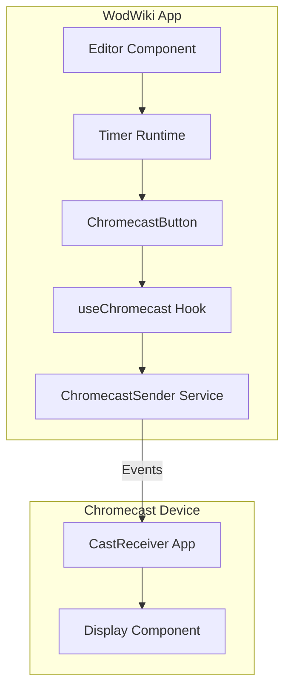
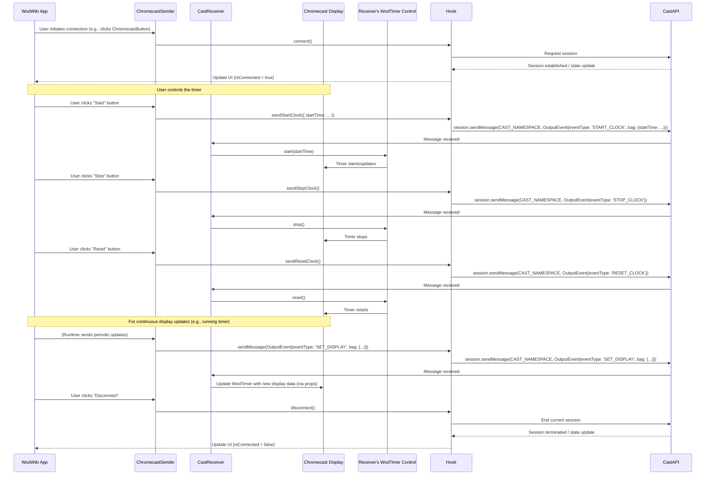

# Chromecast Integration

This document provides a comprehensive overview of the Chromecast functionality implemented in the wod-wiki platform, enabling users to cast workout timers to Chromecast-enabled displays.

## Architecture Overview

The Chromecast integration follows a sender-receiver architecture pattern:



## Core Components

The primary components involved in the sender-side logic have been refactored into React hooks for better composability and state management within UI components.

### 1. `useCastSender` Hook (`src/cast/hooks/useCastSender.ts`)

This hook is responsible for all sender-side Chromecast interactions. It provides:
- Chromecast availability and connection state (`isAvailable`, `isConnected`, `isConnecting`, `deviceName`, `error`).
- `connect()`: Initiates a Chromecast session request.
- `disconnect()`: Ends the current Chromecast session.
- `sendMessage(event: OutputEvent)`: A generic method to send an `OutputEvent` to the receiver.
- `sendStartClock(payload?: StartClockPayload)`: Sends a `START_CLOCK` event to the receiver.
- `sendStopClock()`: Sends a `STOP_CLOCK` event.
- `sendResetClock()`: Sends a `RESET_CLOCK` event.

This hook encapsulates the logic for interacting with the Cast SDK and managing session state.

### 2. `useCastReceiver` Hook (`src/cast/hooks/useCastReceiver.ts`)

*(Note: While this document primarily focuses on the sender and general flow, this hook is crucial on the receiver side.)*
This hook would be used within the Chromecast receiver application. It:
- Initializes the `CastReceiverContext`.
- Listens for incoming messages on the custom namespace (`CAST_NAMESPACE`).
- Exposes an observable stream of received `OutputEvent`s that the `CastReceiver` component subscribes to.

### 3. `ChromecastButton` Component (`src/cast/components/ChromecastButton.tsx`)

A UI component that utilizes the `useCastSender` hook. It:
- Displays the Chromecast icon, changing its appearance based on connection state (available, connecting, connected).
- Handles connection (`connect()`) and disconnection (`disconnect()`) when clicked.
- Provides visual feedback about the connection status and connected device name.
- **Timer Controls**: When connected, this component also displays "Start", "Stop", and "Reset" buttons. Clicking these buttons invokes the corresponding `sendStartClock()`, `sendStopClock()`, and `sendResetClock()` methods from the `useCastSender` hook, allowing direct control over the timer on the Chromecast receiver.

### 4. `CastReceiver` Component (`src/cast/CastReceiver.tsx`)

The main React component for the receiver application that runs on the Chromecast device. It:
- Initializes the Chromecast receiver runtime
- Listens for messages from sender applications
- Updates the timer display based on received events
- Provides visual feedback through the WodTimer component

## Event System (`types/chromecast-events.ts`)

The communication between sender and receiver is based on a well-defined event system:

### Protocol

- Namespace: `urn:x-cast:com.google.cast.wod-wiki`
- Protocol Version: `1.0.0`

### Event Types and Structure

The primary event structure used for communication is `OutputEvent` (defined in `src/core/OutputEvent.ts`). This event wrapper contains the specific `eventType` (from `OutputEventType` in `src/core/OutputEventType.ts`) and a `bag` object for the payload.

Key `OutputEventType` values relevant to Chromecast clock control include:
- `SET_DISPLAY`: Sent by the sender to update the timer's display on the receiver (e.g., with current time, lap info). This is used for continuous updates.
- `START_CLOCK`: Sent by the sender to command the receiver's timer to start. May include an optional `startTime` in its payload.
- `STOP_CLOCK`: Sent by the sender to command the receiver's timer to stop.
- `RESET_CLOCK`: Sent by the sender to command the receiver's timer to reset.
- `HANDSHAKE_ESTABLISHED`, `HANDSHAKE_TERMINATED`: Used for managing the connection lifecycle (part of `ChromecastEventType` which unions `OutputEventType`).

Other `OutputEventType` values like `WRITE_LOG`, `HEARTBEAT`, etc., are also used.

```mermaid
classDiagram
    OutputEvent {
        +eventType: OutputEventType
        +timestamp: Date
        +bag: Object (payload)
    }
    OutputEventType {
        <<enumeration>>
        SET_DISPLAY
        START_CLOCK
        STOP_CLOCK
        RESET_CLOCK
        WRITE_LOG
        HEARTBEAT
        SET_IDLE
        ...
    }
    StartClockPayload {
        +startTime?: number
    }
    OutputEvent "1" -- "1" OutputEventType : has a
    OutputEvent "1" -- "0..1" StartClockPayload : bag can be (for START_CLOCK)
    note for OutputEvent "The 'bag' object's structure depends on the eventType."
```

### Payloads

- **For `START_CLOCK`**: Uses `StartClockPayload` (defined in `src/cast/types/chromecast-events.ts`) which can optionally include `startTime` (in seconds).
  ```typescript
  // Example StartClockPayload
  {
    startTime: 300 // Optional: start clock at 5 minutes
  }
  ```
- **For `SET_DISPLAY`**: The `bag` contains information like `spans` (for time segments) and `totalTime` to be rendered by the `WodTimer` on the receiver.
- **For `STOP_CLOCK`, `RESET_CLOCK`**: Typically, the `bag` is empty as these commands are parameterless for the receiver.

The specific structure of the `bag` for `SET_DISPLAY` and other general purpose events (like `WRITE_LOG`) is defined by their respective handlers and senders.
The `useCastSender` hook provides methods like `sendStartClock(payload?)`, `sendStopClock()`, and `sendResetClock()` which construct the appropriate `OutputEvent` and send it.

## Communication Flow



## Integration with Runtime

The Chromecast functionality integrates with the wod-wiki runtime system. While the runtime can send `SET_DISPLAY` events for continuous updates, the new clock control events (`START_CLOCK`, `STOP_CLOCK`, `RESET_CLOCK`) allow direct user interaction via the `ChromecastButton` component to manage the timer on the receiver.

The `CastReceiver` component listens for these events and calls the appropriate methods (`start`, `stop`, `reset`) on its internal `WodTimer` component instance.

## Browser Compatibility

The Chromecast functionality requires:
- Chrome browser or a compatible browser with the Cast extension
- Access to the Cast API (requires HTTPS in production)

## Development and Testing

For development and testing purposes:
- The `MockChromecastReceiver` component in the stories directory provides a simulated receiver
- The receiver application can be tested in the Chrome browser directly
- The sender application includes debug logging to troubleshoot connection issues
