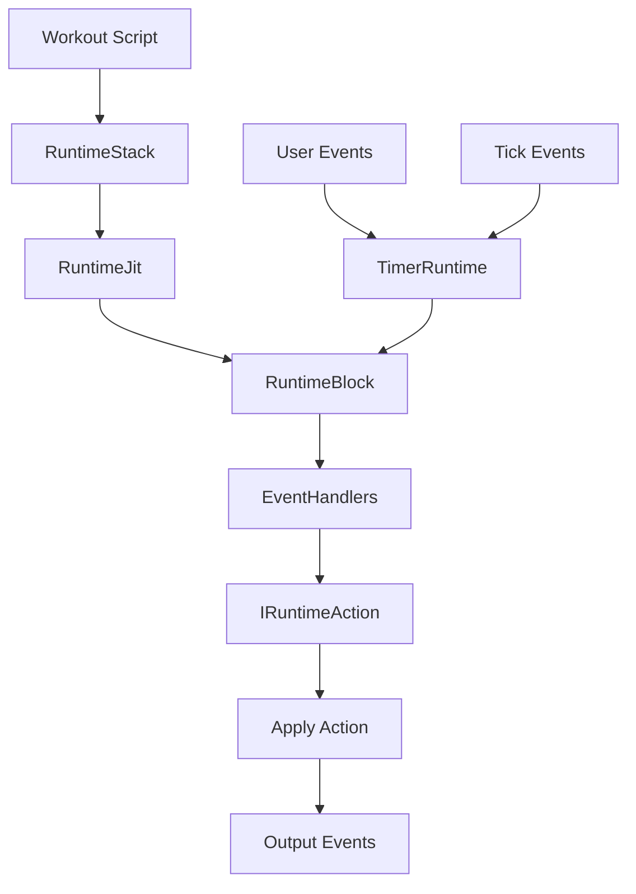
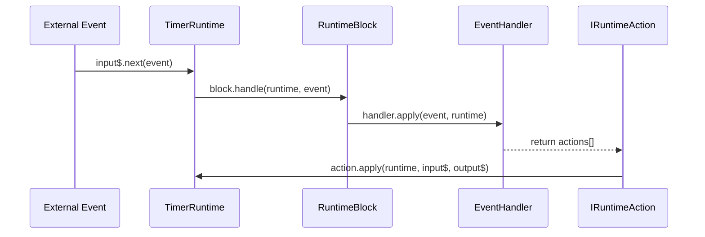

---
aliases:
  - "Runtime Flow"
  - "Runtime Execution Flow"
---

# Runtime Execution Flow

This document describes how workout scripts are processed at runtime in **wod.wiki**, covering the **Block-based Execution Model**, **Runtime Trace**, **JIT Compiler**, and the core **Event/Action** system.

## Overview

1. **RuntimeStack**: Provides efficient lookup of StatementNode objects by ID.
2. **RuntimeTrace**: Manages the active block stack and execution history.
3. **RuntimeJit**: Compiles statement nodes into specialized RuntimeBlock instances.
4. **RuntimeBlock**: Base class for all execution blocks with standardized event handling.
5. **TimerRuntime**: Orchestrates event flow through reactive streams (RxJS).

### Block Hierarchy

```mermaid
classdiagram
  class RuntimeBlock {
    +blockId: number
    +blockKey: string
    +source?: StatementNode
    +parent?: IRuntimeBlock
    +laps: ResultSpan[]
    +metrics: RuntimeMetric[]
    +duration(): IDuration
    +handle(runtime, event): IRuntimeAction[]
    +next(runtime): StatementNode
    +load(runtime): IRuntimeEvent[]
  }
  
  class RootBlock
  class SingleBlock
  class IdleRuntimeBlock
  class DoneRuntimeBlock
  
  RuntimeBlock <|-- RootBlock
  RuntimeBlock <|-- SingleBlock
  RuntimeBlock <|-- IdleRuntimeBlock
  RuntimeBlock <|-- DoneRuntimeBlock
```

### Execution Flow



### Sequence Diagram



---

## RuntimeStack

Manages efficient lookups for StatementNode objects by ID:

```ts
export class RuntimeStack {
  private lookupIndex: { [key: number]: number; } = {};
  
  constructor(public nodes: StatementNode[]) {
    // Initialize lookup index for O(1) access by ID
    for (let i = 0; i < nodes.length; i++) {
      this.lookupIndex[nodes[i].id] = i;
    }
  }

  public getId(id: number): StatementNode[] {
    const stack: StatementNode[] = [];
    let index = this.lookupIndex[id];
    
    while (index !== undefined) {
      const node = this.nodes[index];
      stack.push(node);
      index = node.parent ? this.lookupIndex[node.parent] : undefined;
    }

    return stack;
  }
}
```

## RuntimeTrace

Manages the execution stack of RuntimeBlocks and tracks event history:

```ts
export class RuntimeTrace {  
  public history: Array<IRuntimeLog> = [];
  public stack: Array<IRuntimeBlock> = [];
  
  current(): IRuntimeBlock | undefined {
    return this.stack.length == 0
      ? undefined
      : this.stack[this.stack.length - 1];
  }

  log(event: IRuntimeEvent) {
    if (event.name == "tick") return;
    const block = this.current();
    if (block) {
      this.history.push({
        blockId: block.blockId,
        blockKey: block.blockKey,
        ...event
      });
    }
  }

  push(block: IRuntimeBlock): IRuntimeBlock {
    this.stack.push(block);
    return block;
  }

  pop(): IRuntimeBlock | undefined {
    if (this.stack.length == 0) return undefined;
    return this.stack.pop();
  }
}
```

## RuntimeJit

Just-In-Time compiler: creates specialized RuntimeBlock instances for execution:

```ts
export class RuntimeJit {
  idle(_runtime: ITimerRuntime): IRuntimeBlock {
    return new IdleRuntimeBlock();
  }
  
  end(_runtime: ITimerRuntime): IRuntimeBlock {
    return new DoneRuntimeBlock();
  }

  root(runtime: ITimerRuntime): IRuntimeBlock {
    return new RootBlock(runtime.script.nodes);
  }

  handlers: EventHandler[] = [
    new TickHandler(),
    new StartHandler(),
    new StopHandler(),
    new CompleteHandler(),
    new ResetHandler(),
    new EndHandler(),
  ];

  compile(runtime: ITimerRuntime, node: StatementNode): IRuntimeBlock {
    const block = new SingleBlock(node.id, "", node, this.handlers);
    return block;
  }
}
```

## RuntimeBlock

Base class for all execution blocks with standard event handling:

```ts
export abstract class RuntimeBlock implements IRuntimeBlock {
  constructor(
    public blockId: number,
    public blockKey: string,
    public source?: StatementNode | undefined
  ) {}
  
  public parent?: IRuntimeBlock | undefined;
  public laps: ResultSpan[] = []; 
  public metrics: RuntimeMetric[] = [];
  public buttons: IActionButton[] = [];

  protected handlers: EventHandler[] = [];
  protected system: EventHandler[] = [];

  abstract next(runtime: ITimerRuntime): StatementNode | undefined;
  abstract load(runtime: ITimerRuntime): IRuntimeEvent[];

  public handle(runtime: ITimerRuntime, event: IRuntimeEvent): IRuntimeAction[] {
    const result: IRuntimeAction[] = [];
    for (const handler of [...this.system, ...this.handlers]) {
      const actions = handler.apply(event, runtime);
      for (const action of actions) {
        result.push(action);
      }
    }
    return result;
  }  
}
```

## TimerRuntime

Orchestrates the event flow and manages the execution state:

```ts
export class TimerRuntime implements ITimerRuntimeIo { 
  public dispose: Subscription | undefined;
  public tick$: Observable<IRuntimeEvent>; 
  public trace: RuntimeTrace;
   
  constructor(
    public code: string,
    public script: RuntimeStack,     
    public jit: RuntimeJit,
    public input$: Subject<IRuntimeEvent>,
    public output$: Subject<OutputEvent>,    
  ) {            
    this.trace = new RuntimeTrace();
    this.next(this.jit.root(this));
    this.next(this.jit.idle(this));

    this.tick$ = interval(100).pipe(
      map(() => new TickEvent()));
    
    const loggedInput = this.input$.pipe(
      tap((event) => {
        console.debug(
          ` ----- ::handle:: [${event.name}]`,
          this.trace.current()
        );
      }));

    this.dispose = merge(loggedInput, this.tick$)
      .subscribe(event => {         
        this.trace.log(event);

        const block = this.trace.current();        
        const actions = block?.handle(this, event)            
            .filter(actions => actions !== undefined)
            .flat() ?? [];
        
        for (const action of actions) {          
          action.apply(this, this.input$, this.output$);
        }            
      });    
  }

  next(block?: IRuntimeBlock | undefined): IRuntimeBlock | undefined {
    if (block) {
      block.parent = this.trace.current();
      return this.trace.push(block);
    }
    
    let currentBlock = this.trace.pop();
    let statement: StatementNode | undefined = undefined;
    while (currentBlock && !statement) {
      statement = currentBlock.next(this);
      currentBlock = currentBlock.parent;
    }

    if (!statement) return undefined;

    const nextBlock = this.jit.compile(this, statement);
    this.trace.push(nextBlock);
    return nextBlock;
  }
}
```

## Core Interfaces

```ts
export interface ITimerRuntime {
  code: string;
  jit: RuntimeJit;
  trace: RuntimeTrace;
  script: RuntimeStack;
  next(block?: IRuntimeBlock | undefined): IRuntimeBlock | undefined;
  reset(): void;
}

export interface ITimerRuntimeIo extends ITimerRuntime {
  input$: Subject<IRuntimeEvent>;
  tick$: Observable<IRuntimeEvent>;
  output$: Observable<OutputEvent>;  
}

export interface IRuntimeBlock {
  blockId: number;
  blockKey: string;
  source?: StatementNode | undefined;
  parent?: IRuntimeBlock | undefined;
  laps: ResultSpan[];
  metrics: RuntimeMetric[];
  duration(): IDuration | undefined;
  load(runtime: ITimerRuntime): IRuntimeEvent[];
  handle(runtime: ITimerRuntime, event: IRuntimeEvent): IRuntimeAction[];
  next(runtime: ITimerRuntime): StatementNode | undefined;
}
```

---

By adopting this block-based, reactive execution model, **wod.wiki** provides a more modular, testable, and extensible runtime system for workout script execution.
