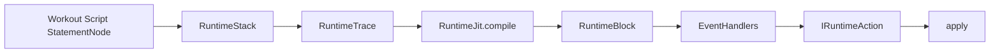
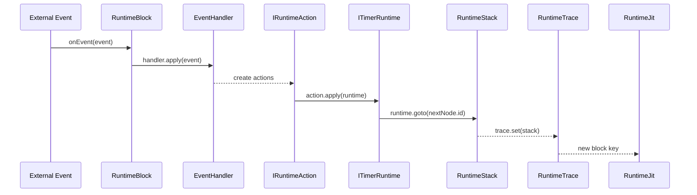

---
aliases:
  - "Runtime Flow"
  - "Runtime Execution Flow"
---

# Runtime Execution Flow

This document describes how workout scripts are processed at runtime in **wod.wiki**, covering the **Script Stack**, **Runtime Trace**, **JIT Compiler**, and the core **Event/Action** system.

## Overview

1. **RuntimeStack**: Navigates the script tree (StatementNode[]).
2. **RuntimeTrace**: Tracks execution history, round counts.
3. **RuntimeJit**: Compiles execution blocks just-in-time.
4. **RuntimeBlock**: Applies handlers to events and generates actions.

### Flowchart



### Sequence Diagram



---

## RuntimeStack

Navigates to a block by its `blockId`, building a call-stack of `StatementNode`s:

```ts
export class RuntimeStack {
  constructor(public nodes: StatementNode[]) { /* build lookup */ }

  public goto(blockId: number): StatementNode[] {
    const stack: StatementNode[] = [];
    let node = this.getId(blockId);
    while (node) {
      stack.push(node);
      node = node.parent != null ? this.getId(node.parent) : undefined;
    }
    return stack;
  }
}
```

## RuntimeTrace

Tracks per-node execution counts and history keys:

```ts
export class RuntimeTrace {
  private trace = new Map<number, [number, number]>();
  public history: StatementKey[] = [];

  nextRound(id: number): number {
    return (this.trace.get(id)?.[0] ?? 0) + 1;
  }

  set(stack: StatementNode[]): StatementKey { /* update counts & history */ }

  getTotal(id: number): number { /* returns total executions */ }
}
```

## RuntimeJit

Just-In-Time compiler: creates `RuntimeBlock` for a stack, injects metrics and handlers:

```ts
export class RuntimeJit {
  compile(
    runtime: ITimerRuntime,
    nodes: StatementNode[],
    trace?: RuntimeTrace
  ): IRuntimeBlock {
    if (!trace || nodes.length === 0) {
      return new IdleRuntimeBlock(runtime.script.nodes[0].id);
    }
    const key = trace.set(nodes);
    const block = new RuntimeBlock(
      key.toString(), nodes,
      /* logger */,
      /* handlers */
    );
    block.metrics = this.createBlockMetrics(...);
    return block;
  }
}
```

## Core Interfaces

```ts
export interface ITimerRuntime {
  code: string;
  events: IRuntimeLog[];
  jit: RuntimeJit;
  trace?: RuntimeTrace;
  script: RuntimeStack;
  current?: IRuntimeBlock;
  goto(node?: StatementNode): IRuntimeBlock | undefined;
}

export interface IRuntimeBlock {
  type: string;
  blockKey: string;
  stack?: StatementNode[];
  metrics: RuntimeMetric[];
  onEvent(
    event: IRuntimeEvent,
    runtime: ITimerRuntime
  ): IRuntimeAction[];
}
```

---

By following this execution flow, **wod.wiki** ensures a consistent, traceable runtime with real-time event handling and metric collection.
