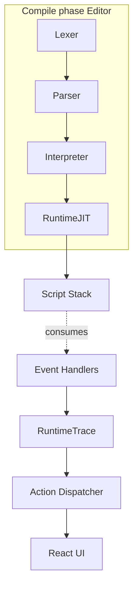
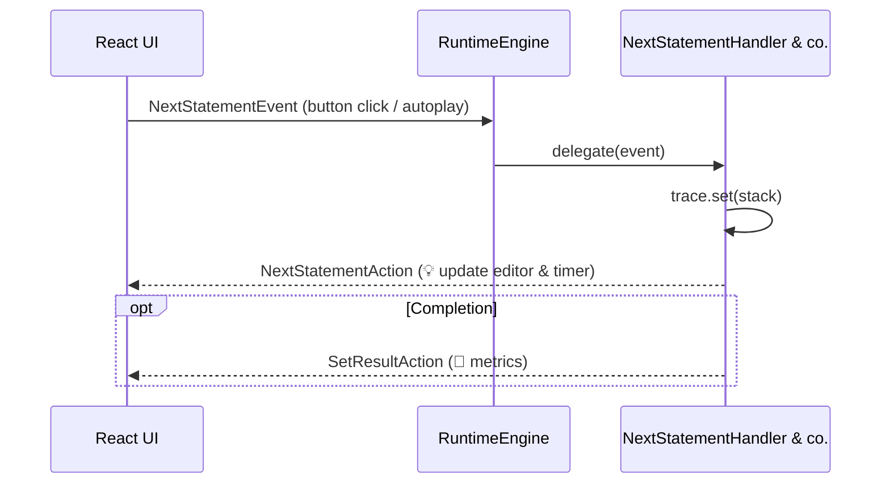
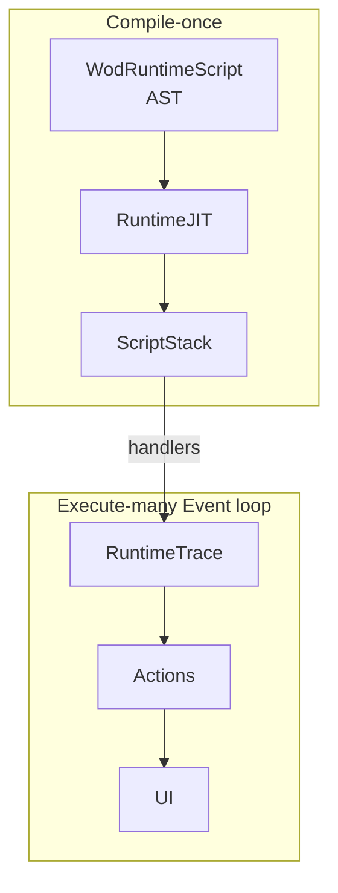

# Runtime Execution Flow

> This document outlines the current (2025-04-26) behaviour of the **wod.wiki** runtime layer—including the **script stack**, **JIT compilation**, **runtime trace**, and how **events** flowing in from the UI are converted into **actions** that mutate application state.  Code snippets are TypeScript extracts taken directly from the source-tree so that the interfaces referenced here stay in sync with the implementation.

---

## 1. High-level Architecture



* **RuntimeJIT** converts a parsed `WodRuntimeScript` (AST) into an **executable stack of `StatementNode`s**.
* The stack is stored in `RuntimeState.pointer` and walked by *event-driven* handler classes (e.g. `NextStatementHandler`).
* Each handler records execution progress in **`RuntimeTrace`** and publishes one or more **`RuntimeAction`s** that the UI consumes via React context providers.

---

## 2. Script Stack (`StatementNode[]`)

The JIT produces a linearised list of nodes that represent the workout in execution order.

```ts
// timer.types.ts
export interface StatementNode {
  id: number;           // Globally unique, used by RuntimeTrace
  kind: StatementKind;  // Round, Exercise, Timer, …
  rounds?: number;      // Optional repetition meta
  // …additional compiler-time metadata
}

// runtime internal
export type ScriptStack = StatementNode[];
```

During execution the **top of the stack** represents the *current* instruction.  Handlers may push or pop nodes (e.g., when entering / leaving repeating groups).

---

## 3. Runtime Trace

`RuntimeTrace` keeps a **per-node execution ledger**—counting how many *rounds* (iterations) a node has completed in total and in the current invocation chain.

```ts
export class RuntimeTrace {
  private trace: Map<number, [number, number]> = new Map();
  public  history: StatementKey[] = [];

  get(id: number): number         { /* current round */ }
  getTotal(id: number): number    { /* lifetime rounds */ }
  nextRound(id: number): number   { /* convenience accessor */ }
  set(stack: StatementNode[]): StatementKey { /* snapshot */ }
}
```

* **`trace`** → maps `StatementNode.id` → `[currentRound, totalRounds]`.
* **`history`** → ordered list of `StatementKey`s; each key represents the full path through nested statements that led to an executed leaf.
* **`set`** is invoked by every *handler* just before emitting a `DisplayUpdateAction`.  This ensures UI counters (⏱️, 🔁, 💪) always reflect the exact runtime state the user sees.

---

## 4. Event → Handler → Action Pipeline



### 4.1 Events

```ts
export enum EventType {
  NextStatement   = "next",   // advance pointer
  TogglePause     = "pause",  // play/pause timer
  Reset           = "reset",  // restart workout
  // …
}

export interface RuntimeEvent {
  type: EventType;
  payload?: unknown;
}
```

Events originate from **user interaction** (`ButtonRibbon`) or **timer hooks** (auto-advance when clock hits 0).

### 4.2 Actions

```ts
export enum ActionType {
  DisplayUpdate = "display_update",
  SetButton     = "set_button_state",
  NextStatement = "next_statement",
  SetResult     = "set_result",
}

export interface RuntimeAction {
  type: ActionType;
  payload?: unknown;
}
```

* The **Action Dispatcher** inside the runtime publishes actions via `EventEmitter`, which the UI subscribes to.
* *Idempotence*: Each action fully describes the resulting UI state—ensuring React components can re-render predictably from any subscription point.

---

## 5. JIT vs. Trace—Why Both?



1. **JIT** resolves *static* structure—round counts, repeat groups, AMRAP blocks—so the runtime need only perform constant-time pointer arithmetic during execution.
2. **Trace** records *dynamic* data—how many rounds have *actually* been performed, including user-initiated resets, pauses, or skips.

---

## 6. Putting It All Together

When a user starts a workout:

1. `MonacoEditor` emits `onScriptCompiled` with a fresh `WodRuntimeScript`.
2. `RuntimeJIT` linearises the AST into a `ScriptStack` and initialises `RuntimeTrace`.
3. UI dispatches the first `NextStatementEvent` (either automatically or via *start* button).
4. `NextStatementHandler` pops the next node, updates `RuntimeTrace`, and returns a `NextStatementAction` & `DisplayUpdateAction`.
5. The UI updates timer digits, round counters, and inlay hints **in a single React render**.
6. Steps 3–5 repeat until the stack is empty, at which point a `SetResultAction` finalises metrics and presents them in `ResultsDisplay`.

---

## 7. Open Extension Points

* **Group Operator Strategies** (Round-Robin/Compose/Repeat) plug into the JIT via `*CompilerStrategy` classes.
* **Custom Metrics** (e.g., heartrate) can be added by extending `RuntimeMetric` and teaching `WodResults` to render new icon columns.
* **New Events** should be handled by deriving from `RuntimeEventHandler` and registered in `RuntimeEngine`.

---

_Last updated: 2025-04-26_
