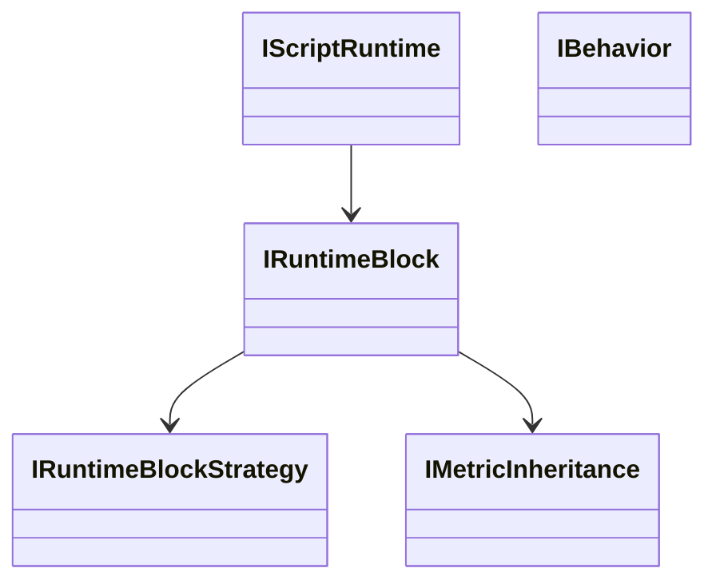

# WOD Wiki System Overview

A newcomer-friendly map of how the system works today, with links to deeper docs and runnable examples.

## Table of Contents
- Parsing
- Runtime & Debugging
- Display / UI
- Metrics Collection
- Interfaces (reference)
- Specification Discovery
- Version & Changes

```mermaid
graph TD
  A[WodScript (.ww)] --> B(Parser: Chevrotain tokens/grammar)
  B --> C[Fragments/AST]
  C --> D[JIT Compiler]
  D --> E[Runtime Blocks]
  E --> F[Results & Metrics]
  E --> G[Clock/Timer + Events]
  A -. author/edit .-> H[Editor (Monaco)]
  H -->|Storybook| I[UI Components]
```

## Parsing
Concepts: tokens, grammar, visitor, fragments → internal representation.
- Guide: [docs/language/Guide.md](./language/Guide.md)
- Source: [src/parser/timer.tokens.ts](../src/parser/timer.tokens.ts), [src/parser/timer.parser.ts](../src/parser/timer.parser.ts), [src/parser/timer.visitor.ts](../src/parser/timer.visitor.ts), [src/parser/md-timer.ts](../src/parser/md-timer.ts)
- Examples: [src/WodScript.test.ts](../src/WodScript.test.ts)

Try it
- Open stories/parsing in Storybook (if present), or run unit tests to see parsing expectations.

## Runtime & Debugging
Deterministic execution with injected time and explicit event ordering.
- Guide: [docs/runtime/Runtime.md](./runtime/Runtime.md)
- Source: [src/runtime/JitCompiler.ts](../src/runtime/JitCompiler.ts), [src/runtime/FragmentCompilationManager.ts](../src/runtime/FragmentCompilationManager.ts), [src/runtime/RuntimeBlock.ts](../src/runtime/RuntimeBlock.ts), [src/runtime/MetricComposer.ts](../src/runtime/MetricComposer.ts), [src/runtime/ResultSpanBuilder.ts](../src/runtime/ResultSpanBuilder.ts), [src/runtime/runBehaviorHooks.ts](../src/runtime/runBehaviorHooks.ts)
- Stories: [stories/runtime/Runtime.stories.tsx](../stories/runtime/Runtime.stories.tsx)

Try it
- In Storybook, open runtime examples and observe deterministic outcomes.

## Display / UI
Authoring and visualizing programs and results.
- Guide: [docs/ui/Display.md](./ui/Display.md)
- Source: [src/editor/WodWiki.tsx](../src/editor/WodWiki.tsx), [src/editor/WodWikiSyntaxInitializer.tsx](../src/editor/WodWikiSyntaxInitializer.tsx), [src/editor/SuggestionEngine.tsx](../src/editor/SuggestionEngine.tsx), [src/editor/SemantcTokenEngine.tsx](../src/editor/SemantcTokenEngine.tsx), [src/clock/components/](../src/clock/components/)
- Stories: [stories/](../stories/)

Try it
- Run Storybook and navigate editor and clock components.

## Metrics Collection
Metric types, composition, inheritance, and result spans.
- Guide: [docs/metrics/Metrics.md](./metrics/Metrics.md)
- Source: [src/runtime/MetricComposer.ts](../src/runtime/MetricComposer.ts), [src/runtime/MetricInheritance.ts](../src/runtime/MetricInheritance.ts), [src/runtime/ResultSpanBuilder.ts](../src/runtime/ResultSpanBuilder.ts)
- Tests: [src/runtime/MetricComposer.test.ts](../src/runtime/MetricComposer.test.ts), [src/runtime/MetricInheritance.test.ts](../src/runtime/MetricInheritance.test.ts)

Try it
- Run unit tests for MetricComposer/Inheritance to see expected behaviors.

## Interfaces (reference)
Key contracts and their relationships. See docs/interfaces/README.md



## Specification Discovery
Where the “specs” live today:
- README overview: [README.md](../README.md)
- Parser and visitor: [src/parser/](../src/parser/)
- Runtime core and tests: [src/runtime/](../src/runtime/)
- Stories (interaction specs): [stories/](../stories/)
- Language examples/tests: [src/WodScript.test.ts](../src/WodScript.test.ts)

## Version & Changes
- Constitution: [.specify/memory/constitution.md](../.specify/memory/constitution.md) (v1.0.0)
- When language or runtime behavior changes, update the relevant Guide and link to tests/stories that demonstrate the change.
