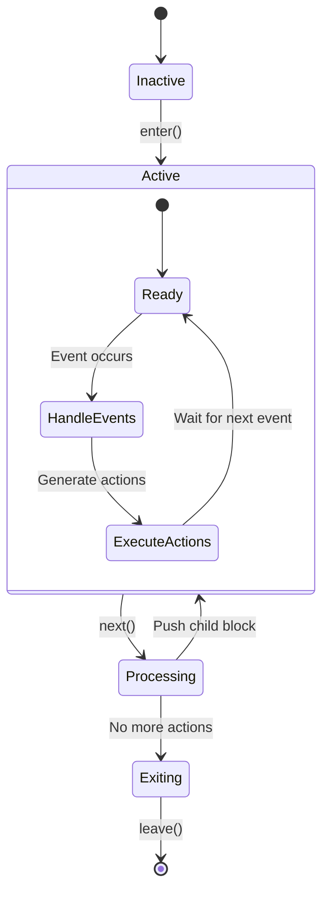
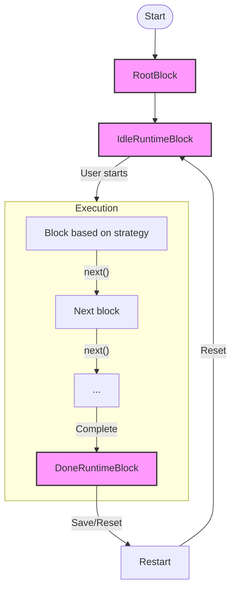
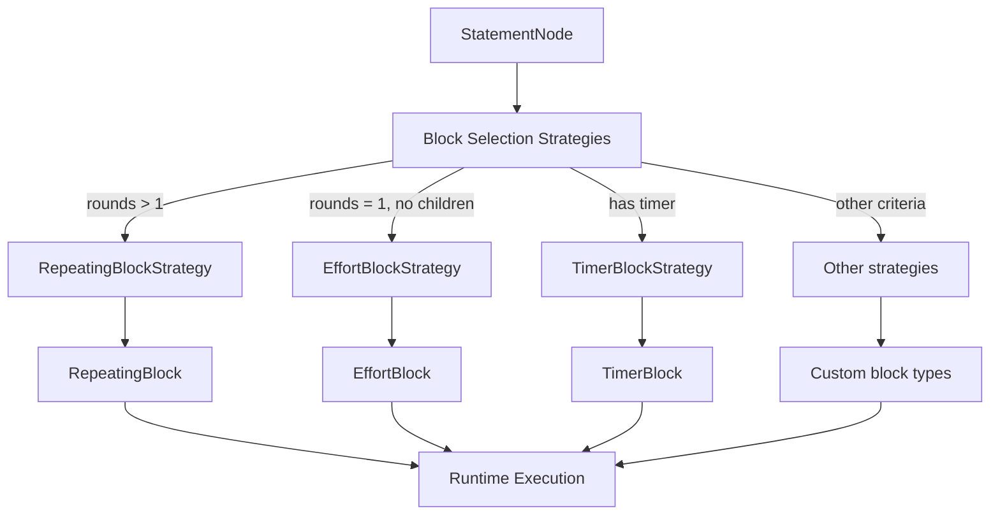

# Runtime Blocks Lifecycle Documentation

This document provides a detailed overview of the runtime blocks in the wod.wiki workout execution engine, including their lifecycle methods, selection strategies, and key responsibilities.

## Table of Contents

1. [Base RuntimeBlock Structure](#base-runtimeblock-structure)
2. [Block Lifecycle Methods](#block-lifecycle-methods)
3. [System RuntimeBlock Types](#system-runtimeblock-types)
   - [`RootBlock`](#rootblock)
   - [`IdleRuntimeBlock`](#idleruntimeblock)
   - [`DoneRuntimeBlock`](#doneruntimeblock)
4. [Repeating RuntimeBlock Types](#repeating-runtimeblock-types)
   - [Group Operation Types](#group-operation-types)
   - [`RepeatingBlock`](#repeatingblock)
   - [`RoundRobinBlock`](#roundrobinblock-conceptual-implementation)
   - [`ComposeBlock`](#composeblock-conceptual-implementation)
   - [`TimedGroupBlock`](#timedgroupblock)
5. [Execution RuntimeBlock Types](#execution-runtimeblock-types)
   - [`EffortBlock`](#effortblock)
   - [`TimerBlock`](#timerblock)
6. [Block Selection Strategies](#block-selection-strategies)
7. [Block Execution Flow](#block-execution-flow)
8. [Lifecycle Diagrams](#lifecycle-diagrams)

## Base RuntimeBlock Structure

All runtime blocks inherit from the abstract `RuntimeBlock` class which provides core functionality for the execution engine:

```typescript
abstract class RuntimeBlock implements IRuntimeBlock {
  constructor(public source: StatementNodeDetail) {
    this.blockId = source.id;
  }
  
  public blockKey?: string | undefined;
  public parent?: IRuntimeBlock | undefined;    
  public blockId: number;
  public index: number = 0;
  public spans: ITimeSpan[] = [];
  protected handlers: EventHandler[] = [];
  
  abstract enter(runtime: ITimerRuntime): IRuntimeAction[];
  abstract next(runtime: ITimerRuntime): IRuntimeAction[];    
  abstract leave(runtime: ITimerRuntime): IRuntimeAction[] ;  
  
  public handle(
    runtime: ITimerRuntime,
    event: IRuntimeEvent,
    system: EventHandler[]
  ): IRuntimeAction[] {
    const result: IRuntimeAction[] = [];
    for (const handler of [...system, ...this.handlers]) {
      const actions = handler.apply(event, runtime);
      for (const action of actions) {
        result.push(action);
      }
    }
    return result;
  }
}
```

## Block Lifecycle Methods

Each runtime block implements three critical lifecycle methods:

1. **`enter(runtime: ITimerRuntime)`**: Called when the runtime first enters this block. Initializes the block state and returns initial actions to execute.

2. **`next(runtime: ITimerRuntime)`**: Called when the runtime needs to determine what to do next within this block. May push new blocks or advance internal state.

3. **`leave(runtime: ITimerRuntime)`**: Called when execution is about to leave this block. Performs cleanup and returns final actions.

All blocks log their enter and leave operations with the format: `+=== {method} : {blockKey}`

### Event Handlers

Each block type can have specialized `EventHandler` instances that process runtime events and generate appropriate actions. The base `RuntimeBlock.handle()` method combines system-level handlers with block-specific handlers to process events.

## System `RuntimeBlock` Types

### `RootBlock`

**Purpose**: Represents the root of the execution tree and often wraps a single main block.

**Lifecycle**:

- **`enter`**: Initializes the root block and pushes an `IdleBlock` to begin execution
- **`next`**: Pushes the next statement from the statements list, increments index
- **`leave`**: Pushes an `EndBlock` to finalize execution

**Handlers**: The `RootBlock` doesn't have any specialized handlers.

**Actions**:

- `PushIdleBlockAction`
- `PushStatementAction`
- `PopBlockAction`
- `PushEndBlockAction`

**Selection Strategy**: The `RootBlockStrategy` selects the `RootBlock` as the starting point of execution. It doesn't have specific selection criteria as it's always the top-level container.

### `IdleRuntimeBlock`

**Purpose**: Represents the idle state of the workout engine (when not actively running).

**Lifecycle**:

- **`enter`**: Sets up the system with start buttons and initializes the clock display
- **`next`**: Pops itself from the block stack to allow execution to continue
- **`leave`**: No specific actions

**Handlers**: The `IdleRuntimeBlock` doesn't initialize with any specialized handlers.

**Actions**:

- `SetButtonsAction` (configures start button)
- `SetClockAction` (initializes primary clock)
- `SetTimeSpanAction` (initializes total time)
- `PopBlockAction` (removes itself from stack when transitioning)

**Selection Strategy**: The `IdleBlockStrategy` doesn't require specific conditions - it's explicitly pushed as the initial state by the `RootBlock`.

### `DoneRuntimeBlock`

**Purpose**: Represents the completed state after a workout has finished.

**Lifecycle**:

- **`enter`**: Records timing spans, sets up reset/save buttons, updates the timer display
- **`next`**: No actions (terminal state)
- **`leave`**: No specific actions

**Handlers**:

- `SaveHandler` (processes save events to persist workout results)

**Actions**:

- `SetButtonsAction` (configures reset/save buttons)
- `SetTimeSpanAction` (displays total workout time)
- `SetClockAction` (updates primary clock display)

**Selection Strategy**: Directly pushed by the runtime when workout completion is detected, not selected via a strategy.

## Repeating `RuntimeBlock` Types

The wod.wiki platform implements three distinct group operation types for handling repeating workout elements, each with specific execution patterns. These patterns are implemented through specialized runtime blocks with unique traversal logic.

### Group Operation Types

1. **Round-Robin Operator** (`-`): Each iteration of the parent round moves to the next item in the child list.

   ```markdown
   (3)
     - 10 Pullups
     - 20 Pushups
     - 30 Squats
   ```

   **Execution**: Round 1: Pullups, Round 2: Pushups, Round 3: Squats

2. **Compose Operator** (`+`): All children are executed as a single unit per round.

   ```markdown
   (3)
     + 10 Pullups
     + 20 Pushups
     + 30 Squats
   ```

   **Execution**: Round 1-3: Pullups, then Pushups, then Squats (all three exercises in each round)

3. **Repeat** (no operator): Each child individually goes through all parent rounds.

   ```markdown
   (3)
     10 Pullups
     20 Pushups
   ```

   **Execution**: 3 rounds of Pullups, then 3 rounds of Pushups

### `RepeatingBlock`

**Purpose**: Implements the **Repeat** pattern, where each child individually cycles through all parent rounds before moving to the next child.

**Implementation Details**:

- Maintains a `childIndex` to track the current child being processed
- For each child, completes all specified rounds before advancing to the next child
- When a child completes all rounds, resets the round counter and moves to the next child

**Lifecycle**:

- **`enter`**: Begins execution by calling `next()` to start the first child's execution
- **`next`**:
  - Advances the round counter when starting a new child
  - Checks if all rounds for the current child are complete
  - Pushes current child statement into the execution stack
  - Advances to the next child when all rounds are complete
- **`leave`**: Performs cleanup when all children and rounds are complete

**Actions**:

- `PushStatementAction` (pushes child statements onto the stack)
- `PopBlockAction` (removes itself when all children and rounds are completed)

**Selection Strategy**: The `RepeatingBlockStrategy` selects this block when:

- The statement has a rounds property > 1 (`node?.rounds != null && node.rounds > 1`)
- No specific operator is specified

### `RoundRobinBlock` (Conceptual Implementation)

**Purpose**: Implements the **Round-Robin** pattern where each round moves to the next child.

**Implementation Details**:

- Uses the round counter to determine which child to execute
- Maps the current round index to the appropriate child using modulo arithmetic
- Ensures each round executes a different child in sequence

**Lifecycle**:

- **`enter`**: Initializes execution and prepares to traverse children in round-robin fashion
- **`next`**:
  - Calculates which child to execute based on the current round (e.g., `childIndex = (roundIndex - 1) % children.length`)
  - Pushes the selected child onto the execution stack
  - Advances the round counter for the next iteration
- **`leave`**: Performs cleanup when all rounds are complete

**Actions**:

- `PushStatementAction` (pushes the appropriate child statement for the current round)
- `PopBlockAction` (removes itself when all rounds are completed)

**Selection Strategy**: Will be selected when:

- The statement has a rounds property > 1
- The `-` operator is specified for the group

### `ComposeBlock` (Conceptual Implementation)

**Purpose**: Implements the **Compose** pattern where all children are executed as a single unit per round.

**Implementation Details**:

- Maintains both round and child indices
- Executes all children for each round before advancing to the next round
- Ensures all children are processed as a complete unit

**Lifecycle**:

- **`enter`**: Begins execution of the first child in the first round
- **`next`**:
  - Cycles through all children for the current round
  - When all children in a round are complete, advances to the next round
  - Resets the child index at the start of each new round
  - Pushes the current child onto the execution stack
- **`leave`**: Performs cleanup when all rounds are complete

**Actions**:

- `PushStatementAction` (pushes child statements onto the stack)
- `PopBlockAction` (removes itself when all rounds are completed)

**Selection Strategy**: Will be selected when:

- The statement has a rounds property > 1
- The `+` operator is specified for the group

### `TimedGroupBlock`

**Purpose**: Specialized block for timed group-based workout elements.

**Implementation Details**: Will extend the group operation types to support timed execution patterns.

**Lifecycle**:

- **`enter`**: Sets up timed execution for a group of exercises
- **`next`**: Applies the appropriate group operation pattern (Round-Robin, Compose, or Repeat) within a timed context
- **`leave`**: Performs cleanup when timed group is complete

**Actions**: Combines timing-related actions with group execution patterns.

**Selection Strategy**: Will be selected based on timed group criteria combined with appropriate group operator.

## Execution `RuntimeBlock` Types

### `EffortBlock`

**Purpose**: Handles effort-based workout elements that require user completion.

**Lifecycle**:

- **`enter`**: Starts the timer and displays the complete button
- **`next`**: Pops itself from the block stack when completed
- **`leave`**: Stops the timer and removes runtime buttons

**Handlers**:

- `CompleteHandler` (processes user completion signals)
- Plus any additional handlers passed in construction

**Actions**:

- `StartTimerAction` (begins effort timing)
- `SetButtonsAction` (configures complete button)
- `PopBlockAction` (removes itself when completed)
- `StopTimerAction` (stops timing when leaving)

**Selection Strategy**: The `EffortBlockStrategy` selects this block when:

- The statement has exactly 1 round (`node.rounds === 1`)
- The statement has no children (`node.children?.length === 0`)

### `TimerBlock`

**Purpose**: Handles timer-based workout elements with specific durations.

**Lifecycle**:

- **`enter`**: Sets up the primary clock and displays the complete button
- **`next`**: Pops itself from the block stack when completed
- **`leave`**: Resets the clock display and removes runtime buttons

**Handlers**:

- `CompleteHandler` (processes user completion signals)
- Plus any additional handlers passed in construction

**Actions**:

- `SetClockAction` (configures primary clock display)
- `SetButtonsAction` (configures complete button)
- `PopBlockAction` (removes itself when completed)

**Selection Strategy**: This block appears to be selected for timer-based operations, likely when a statement includes duration information.


## Block Selection Strategies

Runtime blocks are selected through strategy pattern implementations that examine the properties of a `StatementNodeDetail`:

```typescript
interface IRuntimeBlockStrategy {
  canHandle(node: StatementNodeDetail): boolean;
  compile(node: StatementNodeDetail, runtime: ITimerRuntime): IRuntimeBlock | undefined;
}
```

Key strategies include:

1. **`RootBlockStrategy`**: Always handles the root statements collection

2. **`EffortBlockStrategy`**: Handles statements with:
   - `rounds === 1`
   - `children.length === 0`

3. **`RepeatingBlockStrategy`**: Handles statements with:
   - `rounds > 1`

4. **`SingleBlockStrategy`**: Handles simple atomic exercises

5. **`TimedRepeaterBlockStrategy`**: Handles timed repetition patterns

6. **`IdleBlockStrategy`**: Handles the specific idle state case

## Block Execution Flow

1. Runtime begins with a **`RootBlock`** containing all statements
2. Initial state is an **`IdleRuntimeBlock`**
3. When started, execution flows through blocks based on:
   - Statement structure (`children`, `rounds`)
   - User interactions (complete button, timer completion)
   - Block-specific logic
4. Blocks emit actions that drive UI updates and state changes
5. When completed, execution ends with a **`DoneRuntimeBlock`**

The runtime uses a stack-based execution model where blocks can push other blocks onto the stack and pop themselves off when complete.

## Lifecycle Diagrams

### General Block Lifecycle



### Runtime Execution Flow



### Block Selection Process


