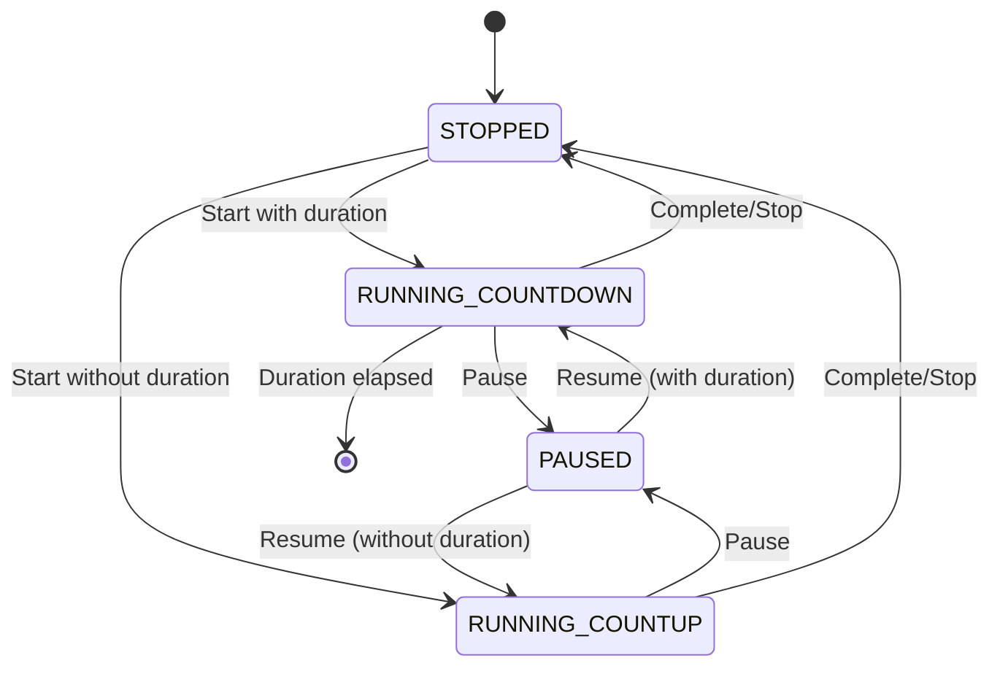
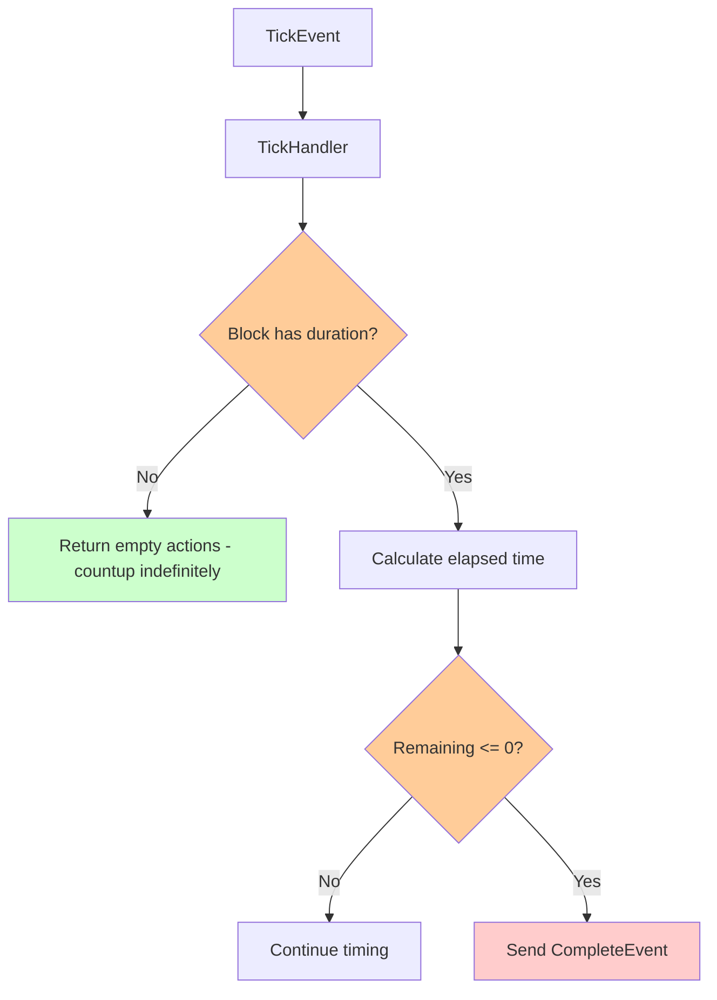

# RuntimeBlocks Analysis Report - June 2025

## Executive Summary

This report analyzes the current state of RuntimeBlock strategies in wod.wiki and identifies gaps for supporting specific workout scenarios. The analysis reveals that while the foundation is solid, several key strategies and block types are missing, creating limitations in timer handling and workout execution patterns.

## Current Implementation Status

### Existing Block Types

The current system implements the following RuntimeBlock types:

1. **System Blocks**
   - `IdleRuntimeBlock` - Initial idle state
   - `DoneRuntimeBlock` - Completion state  
   - `RootBlock` - Top-level container

2. **Execution Blocks**
   - `EffortBlock` - Single statement execution (metrics with/without timer)
   - `RepeatingBlock` - Group with rounds handling
   - `TimedGroupBlock` - Timed group execution (countdown scenarios)

### Existing Strategies

Currently registered in `RuntimeJitStrategies`:

```typescript
constructor() {
  this.addStrategy(new BlockRootStrategy());    
  this.addStrategy(new GroupRepeatingStrategy());
  // Missing: this.addStrategy(new GroupCountdownStrategy());  
  this.addStrategy(new BlockEffortStrategy());    
  // Missing: this.addStrategy(new BlockTimerStrategy());
}
```

**Implemented Strategies:**
- `BlockRootStrategy` - Handles root-level compilation
- `GroupRepeatingStrategy` - Groups with rounds (no time limit)
- `BlockEffortStrategy` - Single statements with effort/reps/duration
- `BlockCompoundStrategy` - Simple statements without specific fragments

**Missing Strategies (documented but not implemented):**
- `BlockTimerStrategy` - Standalone timer blocks
- `GroupCountdownStrategy` - Timed groups with countdown

## Scenario Analysis

### Required Scenarios vs Current Support

| Scenario | Current Block Type | Strategy | Timer State | Status |
|----------|-------------------|----------|-------------|---------|
| Single Statement + metrics, no timer | `EffortBlock` | `BlockEffortStrategy` | `RUNNING_COUNTUP` | ✅ **Supported** |
| Single Statement + metrics/duration | `EffortBlock` | `BlockEffortStrategy` | `RUNNING_COUNTDOWN` | ✅ **Supported** |
| Single Statement + duration only | **Missing** | **Missing `BlockTimerStrategy`** | `RUNNING_COUNTDOWN` | ❌ **Missing** |
| Group + rounds | `RepeatingBlock` | `GroupRepeatingStrategy` | N/A | ✅ **Supported** |
| Group + rounds + time | **Partial** | **Missing `GroupCountdownStrategy`** | `RUNNING_COUNTDOWN` | ⚠️ **Incomplete** |
| Group + time, no rounds | `TimedGroupBlock` | **Missing `GroupCountdownStrategy`** | `RUNNING_COUNTDOWN` | ⚠️ **Incomplete** |
| Group + no rounds, no time | `RepeatingBlock` | `GroupRepeatingStrategy` | N/A | ✅ **Supported** |

## Current Timer State Management

### TimerState Enum
```typescript
export enum TimerState {
  STOPPED = 'STOPPED',
  RUNNING_COUNTDOWN = 'RUNNING_COUNTDOWN', 
  RUNNING_COUNTUP = 'RUNNING_COUNTUP',
  PAUSED = 'PAUSED'
}
```

### Timer State Flow


### Current Tick Handling

The `TickHandler` processes timer events:

```typescript
protected handleEvent(_event: IRuntimeEvent, runtime: ITimerRuntime): IRuntimeAction[] {   
  const block = runtime.trace.current();          
  const duration = block?.duration;
  
  if (duration == undefined) {
    return []; // Count up indefinitely
  }

  const spans = block?.getSpanBuilder().Spans();
  const elapsed = new SpanDuration(spans ?? []);
  const remaining = new Duration(duration - (elapsed?.original ?? 0));
  
  if (remaining?.original !== undefined && remaining.original <= 0) {
    return [new NotifyRuntimeAction(new CompleteEvent(_event.timestamp))];
  }
  return [];
}
```

**Limitations:**
- Single tick handler for all timer types
- No differentiation between primary and secondary timers
- Complex logic embedded in one handler
- No specific countdown/countup behavior variants

## Critical Gaps Analysis

### 1. Missing Block Types

#### TimerBlock (Pure Timer)
**Purpose:** Handle standalone timer statements (duration only, no metrics)
**Example Syntax:** `30s`, `1m30s`

```typescript
// Missing implementation
export class TimerBlock extends RuntimeBlock {
  protected onEnter(runtime: ITimerRuntime): IRuntimeAction[] {
    return [
      new StartTimerAction(new StartEvent()),      
      new SetButtonAction("system", [endButton, pauseButton]),
      new SetButtonAction("runtime", [completeButton])
    ];
  }
  
  protected onNext(runtime: ITimerRuntime): IRuntimeAction[] {
    return [new PopBlockAction()];
  }
  
  // ... other lifecycle methods
}
```

### 2. Missing Strategies

#### BlockTimerStrategy
**Criteria:** Node with duration fragment only (no effort, reps, children, rounds)

```typescript
// Missing implementation
export class BlockTimerStrategy implements IRuntimeBlockStrategy {
  canHandle(nodes: JitStatement[]): boolean {
    return nodes.every(node => {
      const hasDuration = node.durations().length > 0;
      const hasEffort = node.efforts().length > 0;
      const hasReps = node.repetitions().length > 0;
      const hasChildren = node.children.length > 0;
      const hasRounds = node.rounds().length > 0;
      
      return hasDuration && !hasEffort && !hasReps && !hasChildren && !hasRounds;
    });
  }
  
  compile(nodes: JitStatement[], _runtime: ITimerRuntime): IRuntimeBlock | undefined {
    return new TimerBlock(nodes);
  }
}
```

#### GroupCountdownStrategy  
**Criteria:** Node with children and countdown timer

```typescript
// Missing implementation  
export class GroupCountdownStrategy implements IRuntimeBlockStrategy {
  canHandle(nodes: JitStatement[]): boolean {
    return nodes.every(node => {
      const hasDuration = node.durations().length > 0;
      const hasChildren = node.children.length > 0;
      return hasDuration && hasChildren;
    });
  }
  
  compile(nodes: JitStatement[], _runtime: ITimerRuntime): IRuntimeBlock | undefined {
    return new TimedGroupBlock(nodes[0]); // Current implementation exists
  }
}
```

### 3. Tick Handler Complexity Issues

The current `TickHandler` has several problems:

#### Multiple Timer Management
- **Primary Timer:** Main workout timer (countdown/countup)
- **Secondary Timer:** Round/interval timers within groups
- **No Clear Separation:** Both handled by same tick logic

#### Timer State Conflicts
- Groups with internal rounds need different tick handling
- Countdown vs countup logic mixed in single handler
- No priority system for competing timers



### 4. UI Communication Gaps

#### Timer State Reporting
Current blocks report timer state via `SetTimerStateAction`, but:
- No standardized reporting pattern across block types
- Missing duration reporting for UI progress bars
- No clear primary vs secondary timer designation

#### Missing Actions
- `SetDurationAction` - Report total duration to UI
- `SetProgressAction` - Report completion percentage
- `SetLapAction` - Report current lap/round information

## Recommended Solutions

### 1. Implement Missing Block Types

#### TimerBlock Implementation
Create `src/core/runtime/blocks/TimerBlock.ts`:

```typescript
export class TimerBlock extends RuntimeBlock {
  constructor(sources: JitStatement[]) {
    super(sources);
    this.leaf = true; // Mark as leaf-level block
    this.handlers.push(new CompleteHandler());
  }
  
  protected onEnter(runtime: ITimerRuntime): IRuntimeAction[] {
    const duration = this.duration;
    const timerState = duration ? TimerState.RUNNING_COUNTDOWN : TimerState.RUNNING_COUNTUP;
    
    return [
      new StartTimerAction(new StartEvent()),      
      new SetDurationAction(duration || 0, "primary"),
      new SetButtonAction("system", [endButton, pauseButton]),
      new SetButtonAction("runtime", [completeButton])
    ];
  }
  
  protected onLeave(runtime: ITimerRuntime): IRuntimeAction[] {
    return [
      new StopTimerAction(new StopEvent()),      
    ];
  }
  
  protected onNext(runtime: ITimerRuntime): IRuntimeAction[] {
    return [new PopBlockAction()];
  }
  
  protected onBlockStart(runtime: ITimerRuntime): IRuntimeAction[] {
    return [];
  }
  
  protected onBlockStop(runtime: ITimerRuntime): IRuntimeAction[] {
    return [];
  }
}
```

### 2. Implement Missing Strategies

Both `BlockTimerStrategy` and `GroupCountdownStrategy` need implementation and registration in `RuntimeJitStrategies`.

### 3. Refactor Tick Handling

#### Specialized Tick Handlers
Create specific handlers for different timer types:

```typescript
// CountdownTickHandler - for timed blocks
// CountupTickHandler - for untimed blocks  
// GroupTickHandler - for group timers
// IntervalTickHandler - for EMOM/Tabata patterns
```

#### Timer Priority System
Implement a timer management system that handles multiple concurrent timers:

```typescript
interface TimerContext {
  primary: TimerState;
  secondary?: TimerState;
  priority: 'primary' | 'secondary';
}
```

### 4. Enhanced UI Communication

#### Standardized Reporting Pattern
Each block type should follow a consistent pattern for UI updates:

```typescript
// On enter: Report timer state and duration
// On tick: Report progress updates  
// On leave: Report final state
```

## Implementation Priority

### Phase 1: Critical Missing Blocks
1. Implement `TimerBlock` 
2. Implement `BlockTimerStrategy`
3. Register strategy in `RuntimeJitStrategies`

### Phase 2: Group Timer Support  
1. Implement `GroupCountdownStrategy`
2. Enhance `TimedGroupBlock` for countdown scenarios
3. Test group + rounds + time combinations

### Phase 3: Tick Handler Refactoring
1. Extract specialized tick handlers
2. Implement timer priority system
3. Add comprehensive timer state management

### Phase 4: UI Enhancement
1. Add missing action types for better UI communication
2. Standardize reporting patterns across all block types
3. Implement progress reporting system

## Conclusion

The RuntimeBlock system has a solid foundation but requires several missing components to fully support all intended workout scenarios. The most critical gaps are the missing `TimerBlock` and `BlockTimerStrategy` for standalone timer statements, and the incomplete implementation of group countdown scenarios.

The current tick handling system is overly simplistic and needs refactoring to properly handle multiple concurrent timers and different timer behaviors. Implementing these changes will provide complete coverage for all specified workout scenarios while maintaining the existing architectural patterns.
