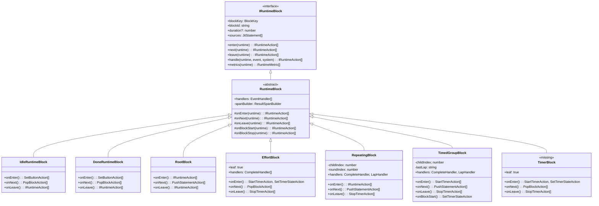
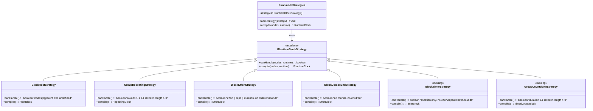
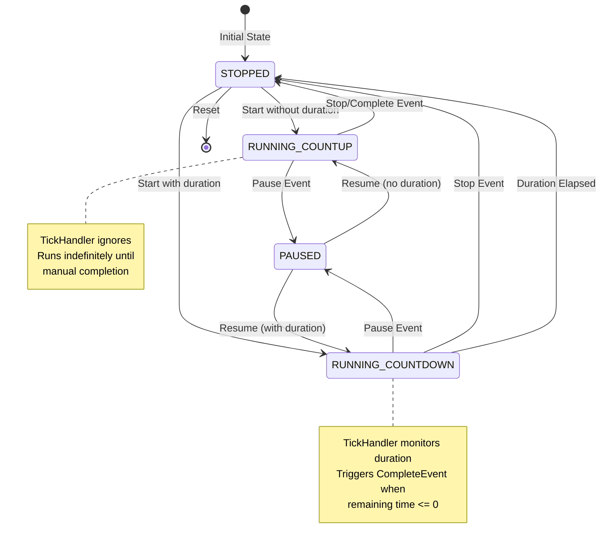
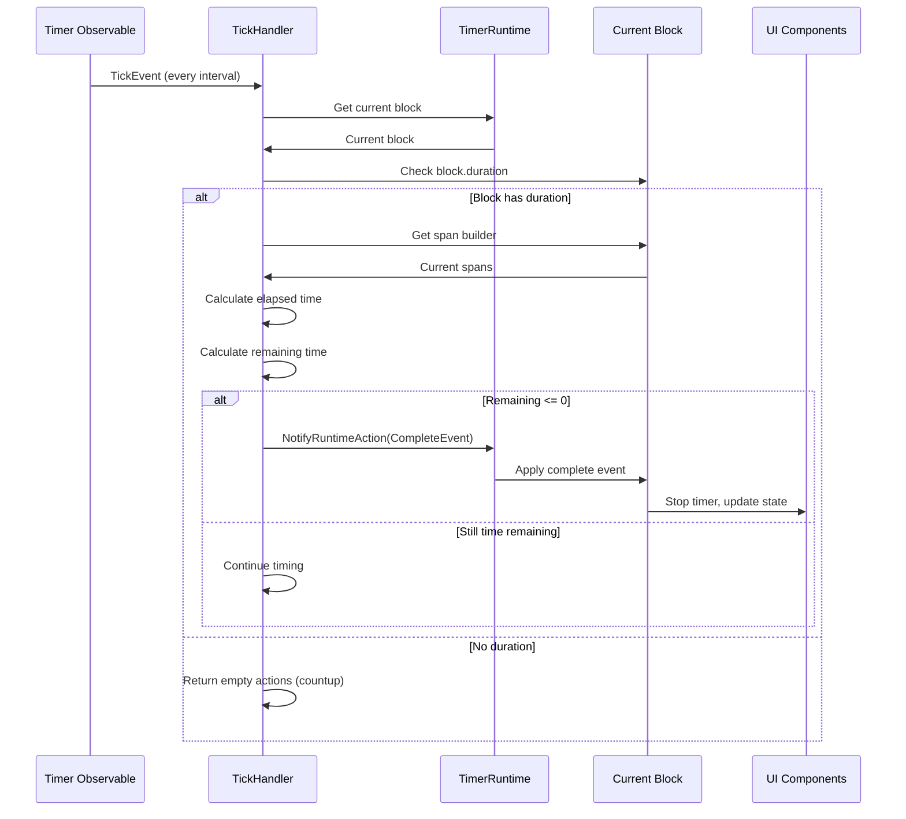
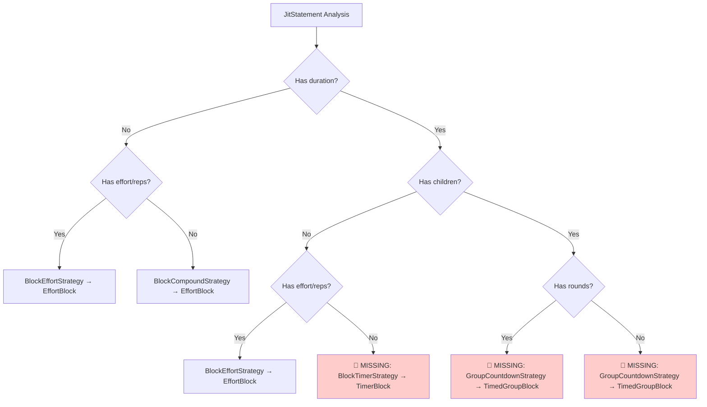
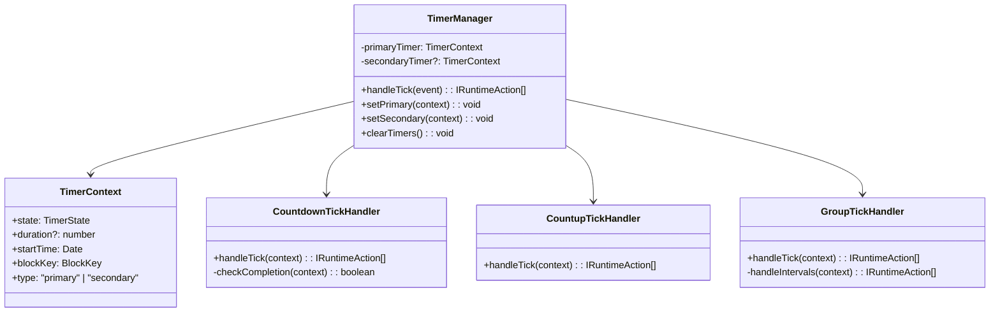

# RuntimeBlock Architecture Diagrams

## Current Block Type Hierarchy

## Strategy Pattern Implementation

## Timer State Management Flow

## Current Tick Handling Architecture

## Missing Strategy Decision Tree

## Proposed Timer Handler Refactoring

