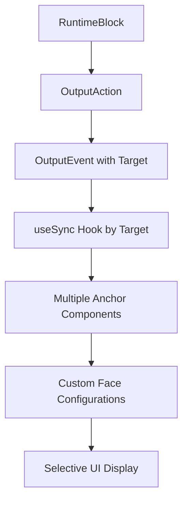

# Runtime Spans UI Output Events

## Executive Summary

This document outlines the implementation of three output events for runtime-to-UI communication in the wod.wiki system. These events integrate with a multi-target anchor system to provide real-time feedback during workout execution. The approach updates the existing runtime system to use a new process that supports multiple anchors for clocks, efforts, and buttons, allowing custom faces to be configured to display all or selected anchors.

## Current Architecture Analysis

### Existing Components

The wod.wiki runtime system already contains the foundational components needed:

1. **Output Action System**: Base `OutputAction` class with existing implementations
2. **Anchor System**: `ClockAnchor` and `EffortAnchor` components for named display targets
3. **Registry Pattern**: `useClockRegistry` hook managing states by name
4. **Button System**: `IActionButton` interface with `ButtonRibbon` for control updates
5. **ResultSpan System**: `ResultSpan`, `RuntimeSpan`, and `ResultSpanBuilder` for capturing execution metrics
6. **Event Synchronization**: `EventSyncResult` pattern for UI state synchronization

### Data Flow Patterns

The system follows these established patterns with multi-target support:



### Multi-Target Anchor System

The key architectural principle is that any number of anchors can be configured for each type:

- **Clock Anchors**: Multiple named clock displays (e.g., "primary", "secondary", "lap", "total")
- **Effort Anchors**: Multiple effort displays (e.g., "current", "average", "target") 
- **Button Anchors**: Multiple button groups (e.g., "main-controls", "advanced", "shortcuts")

Custom faces can be configured to display all anchors or filter to specific ones based on the workout context and UI design needs.

## Three Output Events

## Three Output Events

### Event 1: SET_SPAN

**Purpose**: Update or clear a single result span for a named anchor. Supports multiple clock and effort anchors.

```typescript
// Output Event Structure
{
  eventType: 'SET_SPAN',
  bag: {
    target: string,           // anchor name (e.g., "primary-clock", "secondary-clock", "current-effort", "target-effort")
    span: ResultSpan | undefined  // span data or undefined to clear
  },
  timestamp: Date
}
```

**Multi-Target Examples**:
- Clock targets: `"primary"`, `"secondary"`, `"lap"`, `"total"`, `"countdown"`
- Effort targets: `"current"`, `"average"`, `"target"`, `"max"`, `"zone"`

**Implementation**:
```typescript
export class SetSpanAction extends OutputAction {
  constructor(private target: string, private span?: ResultSpan) {
    super('SET_SPAN');
  }

  write(_runtime: ITimerRuntime, _input: Subject<IRuntimeEvent>): OutputEvent[] {
    return [{
      eventType: this.eventType,
      bag: { 
        target: this.target,
        span: this.span
      },
      timestamp: new Date()
    }];
  }
}
```

**Target-Specific Sync Hook**:
```typescript
export function useSpanSync(target: string): EventSyncResult<ResultSpan | null> {
  const [span, setSpan] = useState<ResultSpan | null>(null);
  
  const sync = (event: OutputEvent) => {
    if (event.eventType !== "SET_SPAN" || event.bag?.target !== target) {
      return;
    }
    setSpan(event.bag?.span ?? null);
  };

  return [span, sync];
}
```

### Event 2: SET_BUTTON

**Purpose**: Update button array for a named anchor. Supports multiple button groups for different contexts.

```typescript
// Output Event Structure
{
  eventType: 'SET_BUTTON',
  bag: {
    target: string,              // anchor name (e.g., "main-controls", "advanced-controls", "shortcuts")
    buttons: IActionButton[]     // button array (empty array clears)
  },
  timestamp: Date
}
```

**Multi-Target Examples**:
- Button targets: `"main-controls"`, `"advanced-controls"`, `"shortcuts"`, `"lap-controls"`, `"effort-controls"`

**Implementation**:
```typescript
export class SetButtonAction extends OutputAction {
  constructor(private target: string, private buttons: IActionButton[]) {
    super('SET_BUTTON');
  }

  write(_runtime: ITimerRuntime, _input: Subject<IRuntimeEvent>): OutputEvent[] {
    return [{
      eventType: this.eventType,
      bag: { 
        target: this.target,
        buttons: this.buttons
      },
      timestamp: new Date()
    }];
  }
}
```

**Target-Specific Sync Hook**:
```typescript
export function useButtonSync(target: string): EventSyncResult<IActionButton[]> {
  const [buttons, setButtons] = useState<IActionButton[]>([]);
  
  const sync = (event: OutputEvent) => {
    if (event.eventType !== "SET_BUTTON" || event.bag?.target !== target) {
      return;
    }
    setButtons(event.bag?.buttons ?? []);
  };

  return [buttons, sync];
}
```

### Event 3: PUSH_RESULTS

**Purpose**: Add new results to the results array. This is a global event that doesn't use targets since results are typically displayed in a unified results panel.

```typescript
// Output Event Structure
{
  eventType: 'PUSH_RESULTS',
  bag: {
    results: ResultSpan[]        // array of result spans to add
  },
  timestamp: Date
}
```

**Implementation**:
```typescript
export class PushResultsAction extends OutputAction {
  constructor(private results: ResultSpan[]) {
    super('PUSH_RESULTS');
  }

  write(_runtime: ITimerRuntime, _input: Subject<IRuntimeEvent>): OutputEvent[] {
    return [{
      eventType: this.eventType,
      bag: { 
        results: this.results
      },
      timestamp: new Date()
    }];
  }
}
```

**Global Sync Hook**:
```typescript
export function useResultsSync(): EventSyncResult<ResultSpan[]> {
  const [results, setResults] = useState<ResultSpan[]>([]);
  
  const sync = (event: OutputEvent) => {
    if (event.eventType === "PUSH_RESULTS" && event.bag?.results) {
      setResults(prev => [...prev, ...event.bag.results]);
    } else if (event.eventType === "CLEAR_RESULTS") {
      setResults([]);
    }
  };

  return [results, sync];
}
```
      setResults(prev => [...prev, ...event.bag.results]);
    } else if (event.eventType === "CLEAR_RESULTS") {
      setResults([]);
    }
  };

  return [results, sync];
}

## Implementation Plan

### Phase 1: Output Actions and Multi-Target System (1-2 weeks)

**Tasks:**
1. Create the three output action classes (`SetSpanAction`, `SetButtonAction`, `PushResultsAction`)
2. Implement target-specific sync hooks (`useSpanSync`, `useButtonSync`, `useResultsSync`)
3. Build multi-target registry system to replace existing single-target approach
4. Create face configuration system for selective target display

**Deliverables:**
- Core action classes with target support
- Multi-target registry implementation
- Target-specific sync hooks
- Face configuration framework
- Unit tests for multi-target functionality

**Effort Estimate:** 60-80 hours

### Phase 2: Runtime System Update (1-1.5 weeks)

**Tasks:**
1. Update all runtime blocks to emit new output events instead of legacy actions
2. Replace existing `SetClockAction`, `SetEffortAction`, `SetButtonsAction` with target-based equivalents
3. Update block lifecycle methods to use target-specific emissions
4. Implement automatic target assignment for different block types

**Deliverables:**
- Updated runtime blocks with new event emission
- Removal of legacy output actions
- Target assignment logic for different contexts
- Integration tests with updated runtime
- Performance validation for multi-target updates

**Effort Estimate:** 50-70 hours

### Phase 3: UI Component Migration (1 week)

**Tasks:**
1. Update all anchor components to use target-specific sync hooks
2. Implement face-based filtering in UI components
3. Create target management utilities for component configuration
4. Build examples of different face configurations

**Deliverables:**
- Migrated anchor components using new sync hooks
- Face configuration integration
- Target management utilities
- Multiple face configuration examples
- Visual design updates for multi-target support

**Effort Estimate:** 40-50 hours

### Phase 4: Integration and Testing (1 week)

**Tasks:**
1. Integrate all three output events with existing runtime system
2. Create comprehensive integration tests
3. Performance testing and optimization
4. Documentation and examples

**Deliverables:**
- Fully integrated output event system
- Performance benchmarks
- Developer documentation
- Usage examples and demos

**Effort Estimate:** 30-40 hours

## Technical Considerations

### Performance Optimizations

1. **Selective Updates**: Registry system tracks dirty state to minimize update cycles
2. **Memory Management**: Automatic cleanup of completed block data
3. **Batching**: Multiple events can be batched for efficiency

### Error Handling

1. **Graceful Degradation**: UI remains functional if event data is unavailable
2. **Fallback Values**: Default states for missing or invalid data
3. **Error Boundaries**: React error boundaries prevent event failures from crashing UI
4. **Logging**: Comprehensive logging for debugging event issues

### Testing Strategy

1. **Unit Tests**: Individual action classes and sync hooks
2. **Integration Tests**: Full event data flow
3. **Performance Tests**: High-frequency update scenarios
4. **E2E Tests**: Complete user workflow validation

## Migration Strategy

### Complete System Update

Since the product is not yet released, this implementation involves a complete migration to the new multi-target output event system:

**Legacy System Removal:**
- Remove existing `SetClockAction`, `SetEffortAction`, and `SetButtonsAction`
- Replace single-target sync hooks with multi-target equivalents
- Update all runtime blocks to use new event emission patterns
- Migrate existing anchor components to target-based approach

### Migration Path

1. **Complete Replacement**: All legacy output actions will be replaced with the new target-based system
2. **Runtime Block Updates**: Every runtime block will be updated to emit the new events with appropriate targets
3. **Component Migration**: All UI components will be migrated to use the new sync hooks and target system
4. **Configuration-Driven Display**: Face configurations will determine which targets are displayed

### Target Assignment Strategy

**Automatic Target Assignment:**
- Timer blocks: `"primary"` for main display, `"secondary"` for additional timers
- Effort blocks: `"current"` for real-time effort, `"target"` for goal values
- Lap blocks: `"lap"` for current lap, `"total"` for cumulative time
- Button contexts: `"main-controls"` for primary actions, `"advanced-controls"` for additional features 

## Success Metrics

### Developer Experience Metrics

- Clear, intuitive target-based API design
- Comprehensive documentation and examples
- Flexible face configuration system
- Minimal setup required for new target types

## Future Enhancements

### Potential Extensions

1. **Event Analytics**: Metrics collection on event performance
2. **Custom Event Types**: Framework for adding domain-specific events
3. **Cross-Component Communication**: Inter-anchor data sharing capabilities
4. **Persistence Layer**: Optional state persistence across sessions

## Conclusion

This three-event architecture provides a comprehensive, efficient, and extensible solution for runtime-to-UI communication in the wod.wiki system. By building upon existing patterns and components, the implementation minimizes risk while delivering powerful new capabilities for real-time user feedback and improved workout experience.

The phased implementation approach allows for systematic migration from the legacy system to the new multi-target architecture. The total estimated effort of 180-250 hours (4.5-6 weeks for a single developer) provides a realistic timeline for complete system migration while maintaining high code quality and comprehensive testing.
