# Test Coverage Map

This document illustrates the relationship between the testing directories and the application source code regions.

## Coverage Graph

```mermaid
graph TD
    %% Application Regions
    subgraph ParserRegion ["Parser & Compilers"]
        direction TB
        SrcParser["src/parser"]
        SrcDialects["src/dialects"]
    end

    subgraph RuntimeRegion [Runtime Engine]
        direction TB
        SrcRuntime["src/runtime Core"]
        SrcStrategies["src/runtime/strategies"]
        SrcBehaviors["src/runtime/behaviors"]
        SrcStack["src/runtime/stack"]
        SrcMemory["src/runtime/memory"]
    end

    subgraph EditorRegion [Editor Core]
        direction TB
        SrcEditor["src/editor"]
        SrcMdEditor["src/markdown-editor"]
        SrcMonaco["src/monaco"]
    end

    subgraph ServiceRegion [Services & Analytics]
        direction TB
        SrcServices[src/services]
        SrcTimeline[src/timeline]
    end

    %% Test Suites
    subgraph TestSuites ["Test Suites (tests/ directory)"]
        direction TB
        TestLang[tests/language-compilation]
        TestJit[tests/jit-compilation]
        TestRuntime[tests/runtime-execution]
        TestMetrics[tests/metrics-recording]
        TestIntegration[tests/integration]
        TestPerf[tests/performance]
        TestE2E[tests/e2e]
    end

    %% Unit Tests
    subgraph UnitTests [Co-located Unit Tests]
        UnitParser[src/parser/**/*.test.ts]
        UnitRuntime[src/runtime/**/*.test.ts]
        UnitEditor[src/editor/**/*.test.ts]
        UnitServices[src/services/**/*.test.ts]
    end

    %% Mappings
    TestLang -->|Validates Syntax| SrcParser
    TestJit -->|Validates Compilation| SrcStrategies
    TestRuntime -->|Validates Execution| SrcRuntime
    TestRuntime -->|Validates| SrcBehaviors
    TestMetrics -->|Validates| SrcServices
    TestIntegration -->|Validates| SrcRuntime
    TestPerf -->|Benchmarks| SrcStack
    
    UnitParser -.->|Unit Test| SrcParser
    UnitRuntime -.->|Unit Test| SrcRuntime
    UnitEditor -.->|Unit Test| SrcEditor
    UnitServices -.->|Unit Test| SrcServices

    TestE2E ==>|Integration Test| ParserRegion
    TestE2E ==>|Integration Test| RuntimeRegion
    TestE2E ==>|Integration Test| EditorRegion

    %% specific file links derived from analysis
    TestJit -.->|Imports| SrcParser
```

## Directory Reference

### 1. Language Compilation (`tests/language-compilation`)
Tests the `Parser` region. Verifies that raw text is correctly parsed into `WodScript` statements (`ICodeStatement`).
- **Target:** `src/parser`, `src/dialects`
- **Focus:** Syntax validation, error recovery, parser performance.

### 2. JIT Compilation (`tests/jit-compilation`)
Tests the `Runtime Strategies` region. Verifies that parsed statements are correctly compiled into executable `Blocks` and `Behaviors`.
- **Target:** `src/runtime/strategies`, `src/runtime/JitCompiler.ts`
- **Focus:** Strategy selection, block property mapping, compilation logic.

### 3. Runtime Execution (`tests/runtime-execution`)
Tests the `Runtime Core` region. Verifies the orchestration of the execution engine, including stack management, memory, and event loops.
- **Target:** `src/runtime/ScriptRuntime.ts`, `src/runtime/stack`, `src/runtime/memory`, `src/runtime/behaviors`
- **Focus:** State transitions, lifecycle events, memory correctness.

### 4. Metrics Recording (`tests/metrics-recording`)
Tests the `Services` region related to data collection.
- **Target:** `src/services` (Analytics, Metrics)
- **Focus:** Data accuracy, inheritance of metrics through the stack.

### 5. Performance (`tests/performance`)
Benchmarks critical paths.
- **Target:** `src/runtime/stack` (High frequency operations)
- **Focus:** Stack push/pop latency, memory allocation speed.

### 6. End-to-End (`tests/e2e`)
Full stack validation using Playwright.
- **Target:** Entire Application (Frontend + Runtime + Editor)
- **Focus:** User flows, visual regression, integration.
