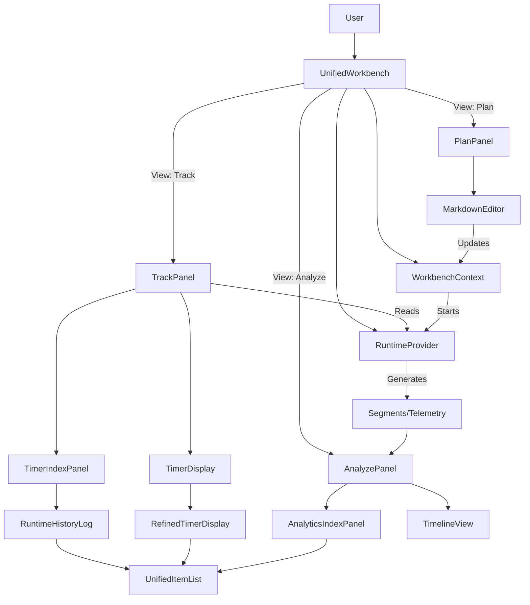

# UI Component Deep Dive Audit

## 1. Executive Summary

The WOD Wiki frontend is structured as a **Single Page Application (SPA)** functioning within a **Component Library** architecture. The core experience centers around a **Unified Workbench** that orchestrates three distinct operational modes (Screens): **Plan**, **Track**, and **Analyze**.

The UI architecture relies heavily on a "Sliding Viewport" metaphor, where users navigate horizontally between these modes. Data flows from the **Editor** (Plan) to the **Runtime** (Track) and finally to **Analytics** (Analyze), with specialized components dedicated to each stage of this lifecycle.

## 2. Architecture Overview

### 2.1 Top-Level Layout
The entry point for the application UI is the **Workbench**.
- **User Interface**: `src/components/layout/UnifiedWorkbench.tsx` (or `WodWorkbench.tsx` for simpler use cases).
- **Layout Strategy**: Implements a responsive "Sliding Viewport" that manages the visibility of three main panels based on the current `viewMode` (`plan` | `track` | `analyze`).
- **State Management**:
    - **`WorkbenchContext`**: Manages global document state (markdown content), parsed blocks, and active view mode.
    - **`RuntimeProvider`**: Manages the lifecycle of the `IScriptRuntime`, acting as the bridge between static WOD definitions and dynamic execution.

### 2.2 Data Flow Logic
1.  **Authoring**: User edits Markdown in **Plan Mode**.
    *   *Input*: Raw Text.
    *   *Output*: `WodBlock[]` (Parsed AST) + `DocumentItem[]` (Structure).
2.  **Execution**: User starts a workout in **Track Mode**.
    *   *Input*: `WodBlock` (Selected block).
    *   *Process*: `RuntimeFactory` creates an `IScriptRuntime`.
    *   *Output*: Real-time `Stack` events, memory updates, and formatted `TimeSpan` data.
3.  **Review**: User reviews performance in **Analyze Mode**.
    *   *Input*: Runtime History & Telemetry.
    *   *Process*: `AnalyticsTransformer` converts runtime events into `Segment[]` and `AnalyticsDataPoint[]`.
    *   *Output*: Visual Timelines and Metric Graphs.

---

## 3. Component Deep Dive by Screen

### 3.1 Plan Screen (The Editor)
**Goal**: Authoring of WODs using a domain-specific language within Markdown.

| Component              | File Path                                    | Role & Responsibility                                                                                           |
| :--------------------- | :------------------------------------------- | :-------------------------------------------------------------------------------------------------------------- |
| **PlanPanel**          | `components/workbench/PlanPanel.tsx`         | Thin container wrapper for the editor.                                                                          |
| **MarkdownEditor**     | `markdown-editor/MarkdownEditor.tsx`         | High-level controller for the Monaco Editor instance. Manages theme sync, toolbar, and commands.                |
| **MarkdownEditorBase** | `markdown-editor/MarkdownEditor.tsx`         | Core logic. Uses hooks like `useWodBlocks` to parse text in real-time and specific hooks for decoration.        |
| **WodBlockManager**    | `markdown-editor/components/WodBlockManager` | **Critical**: Injects custom React overlays (decorators) into the Monaco canvas to visualize WOD blocks inline. |

**Key Data Models**:
- **Consumes**: `initialContent` (string).
- **Produces**: `onContentChange` (string), `onBlocksChange` (`WodBlock[]`).

### 3.2 Track Screen (The Runtime)
**Goal**: Real-time execution and visualization of the active workout.

| Component               | File Path                                    | Role & Responsibility                                                                                          |
| :---------------------- | :------------------------------------------- | :------------------------------------------------------------------------------------------------------------- |
| **TrackPanel**          | `components/workbench/TrackPanel.tsx`        | Split-pane coordinator. Manages the "Index" (history/list) and "Primary" (timer) views.                        |
| **TimerDisplay**        | `components/workout/TimerDisplay.tsx`        | **Core Runtime UI**. Subscribes to the runtime stack. Decides which timer is "pinned" (primary) vs. secondary. |
| **RefinedTimerDisplay** | `components/workout/RefinedTimerDisplay.tsx` | **Pure UI**. Renders the visual gauge (ring), digital clock, and control buttons based on props.               |
| **TimerIndexPanel**     | `components/layout/TimerIndexPanel.tsx`      | Wrapper for the live execution log.                                                                            |
| **RuntimeHistoryLog**   | `components/history/RuntimeHistoryLog.tsx`   | Subscribes to runtime output events. Transforms `OutputStatement` into `IDisplayItem`.                         |

**Key Data Models**:
- **Consumes**: `IScriptRuntime` (Active Engine).
- **Produces**: User Intent Events (`onStart`, `onPause`, `onNext`, `onStop`).

### 3.3 Analyze Screen (The Review)
**Goal**: Post-workout deep dive and metric analysis.

| Component | File Path | Role & Responsibility |
| :--- | :--- | :--- |
| **AnalyzePanel** | `components/workbench/AnalyzePanel.tsx` | Coordinator for the analysis view. |
| **AnalyticsIndexPanel** | `components/layout/AnalyticsIndexPanel.tsx` | Displays a list of completed segments (workout parts). Allows selection for detailed charting. |
| **TimelineView** | `timeline/TimelineView.tsx` | **Data Visualization**. Renders charts (LineChart) using Recharts. Supports 'Timeline' (linear) and 'Overlay' (comparison) modes. |

**Key Data Models**:
- **Consumes**: `Segment[]` (Hierarchical workout parts), `AnalyticsDataPoint[]` (Time-series telemetry), `AnalyticsGroup[]` (Metric configs).
- **Produces**: Selection Events (`onSelectSegment`).

---

## 4. Shared UI Infrastructure (The Glue)

To maintain consistency across screens, the system uses a set of "Unified" components.

### 4.1 Unified Lists
- **Files**: `components/unified/UnifiedItemList.tsx`, `UnifiedItemRow.tsx`
- **Usage**: Used in **Track Mode** (Live Log) and **Analyze Mode** (History Index).
- **Role**: Provides a standardized way to render list items with:
    - Consistency in spacing and typography.
    - Support for hierarchical grouping (parent/child relationships).
    - Status indicators (Active vs. Completed).
    - Integrated "Visualizer" support (rendering fragments like reps, weight, etc.).

### 4.2 Fragment Visualization
- **Files**: `components/fragments/FragmentVisualizer.tsx` (Inferred)
- **Role**: Renders the specific atomic units of a workout (e.g., `10 reps` badge, `135 lbs` pill, `Timer` readout).
- **Usage**: Embedded inside `UnifiedItemRow` and potentially the Editor decorations.

---

## 5. Relationships & Dependencies

## 6. Recommendations

1.  **Splitting `TimerDisplay`**: The `TimerDisplay` component currently handles both "Stack Subscription" logic and "Presentation" logic (via `RefinedTimerDisplay`). It might be beneficial to strictly separate the Data Provider (Hook-based wrapper) from the Visual Layout to make testing the UI easier without a full runtime mock.
2.  **Unified Item List Reuse**: The usage of `UnifiedItemList` in both Track and Analyze is excellent. Ensure that `FragmentVisualizer` remains stateless so it can be used identically in both contexts.
3.  **Editor Decoupling**: `MarkdownEditor` is heavily integrated with WOD-specific parsing hooks. If the library intends to support generic markdown in the future, these hooks should be strictly optional or abstracted into a "LanguageFeatureProvider" pattern.
