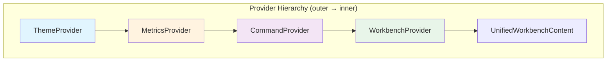
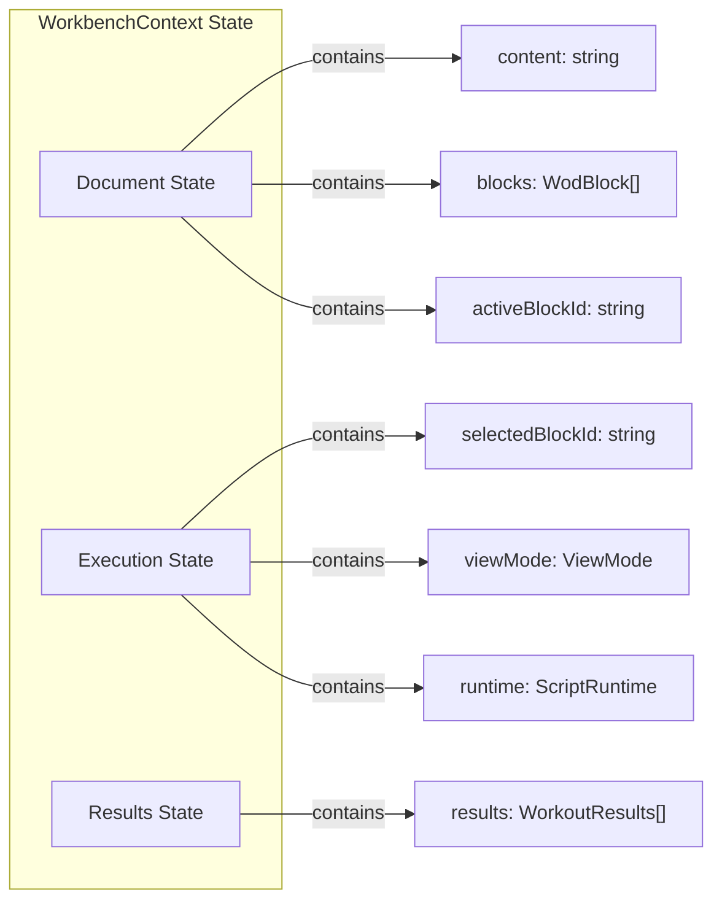
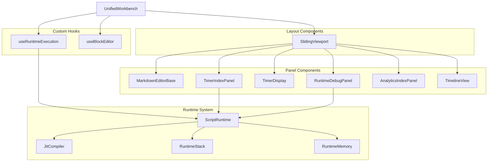
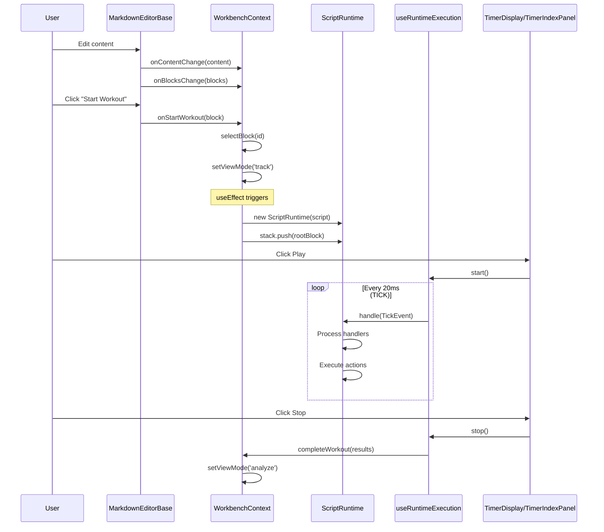
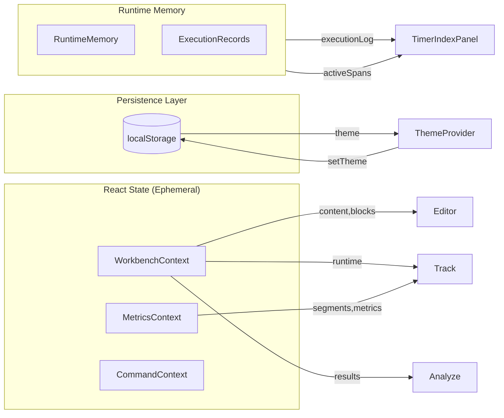
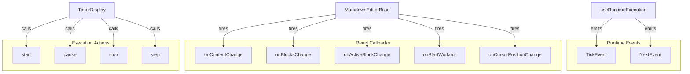
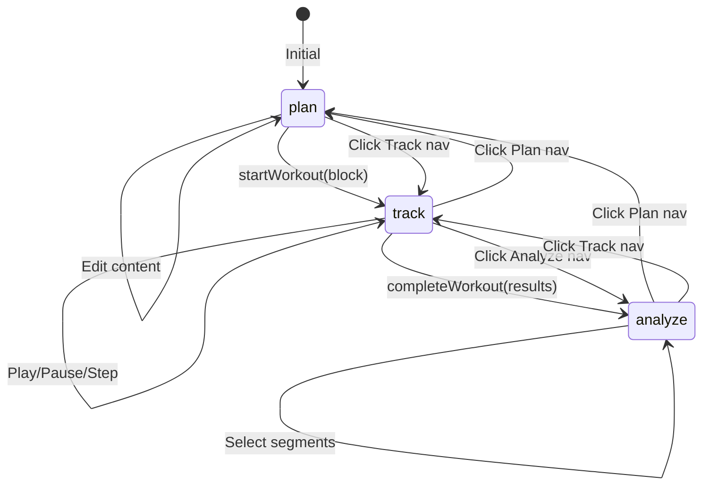

# UnifiedWorkbench Coupling Analysis

The `UnifiedWorkbench` is a complex orchestration component that manages the entire workout planning, tracking, and analysis workflow. This document provides a comprehensive analysis of its coupling, dependency chain, and data flow.

---

## 1. Provider Hierarchy (Context Nesting)

The component wraps its content in a strict hierarchy of providers that establish different domains of concern:



| Provider | Storage | Purpose |
|----------|---------|---------|
| **ThemeProvider** | `localStorage` (`wod-wiki-theme`) | Dark/light theme state |
| **MetricsProvider** | React state | Segment logging during workout |
| **CommandProvider** | React state | Command palette registry |
| **WorkbenchProvider** | React state | Core document/execution state |

---

## 2. WorkbenchContext - Central State Hub

The `WorkbenchProvider` is the main state container. It holds:



### Key Actions from WorkbenchContext

| Action | Trigger | Effect |
|--------|---------|--------|
| `setContent` | Editor content change | Updates markdown content |
| `setBlocks` | `useWodBlocks` hook | Updates parsed WOD blocks |
| `selectBlock` | User clicks block | Sets `selectedBlockId` |
| `startWorkout` | "Start Workout" button | Sets `selectedBlockId`, changes to `track` view |
| `completeWorkout` | Stop button | Saves results, switches to `analyze` view |

---

## 3. Component Dependency Tree



---

## 4. Event Flow: Editor → Runtime → UI



---

## 5. Data Flow: What Gets Saved and Where



### What's Persisted
- **Theme**: `localStorage` key `wod-wiki-theme`

### What's Ephemeral (React State)
- Document content and parsed blocks
- Runtime instance and execution state
- Workout results
- Metrics/segments
- Command registry

---

## 6. Event Types Passed Between Components



---

## 7. View Mode State Machine



---

## 8. Summary: Key Dependencies

| Component | Depends On | Provides To |
|-----------|------------|-------------|
| **UnifiedWorkbench** | All Providers | Entry point |
| **WorkbenchContext** | None | content, blocks, runtime, viewMode |
| **MarkdownEditorBase** | CommandContext | blocks, content changes, onStartWorkout |
| **TimerIndexPanel** | runtime (from context) | Execution history visualization |
| **TimerDisplay** | useRuntimeExecution | Timer UI, control buttons |
| **useRuntimeExecution** | ScriptRuntime | status, elapsedTime, controls |
| **SlidingViewport** | viewMode | Panel layout |
| **ScriptRuntime** | JitCompiler, RuntimeMemory | Event handling, execution state |

---

## 9. Identified Coupling Issues

### Issue 1: WorkbenchContext Knows Too Much
`WorkbenchContext` directly imports and instantiates `ScriptRuntime`, `WodScript`, and references `globalCompiler`. This mixes UI state management with runtime execution concerns.

**Location**: [WorkbenchContext.tsx](../src/components/layout/WorkbenchContext.tsx#L63-L76)

```typescript
// Current problematic code
const script = new WodScript(selectedBlock.content, selectedBlock.statements);
const newRuntime = new ScriptRuntime(script, globalCompiler);
const rootBlock = globalCompiler.compile(selectedBlock.statements as any, newRuntime);
```

### Issue 2: Deep Callback Chain for Start Workout
The `onStartWorkout` callback flows through multiple layers:
1. `MarkdownEditor` receives prop
2. Passes to `RichMarkdownManager` constructor
3. Card action triggers callback
4. Callback finds block in `blocksRef`
5. Finally calls `startWorkout` in context

**Location**: [MarkdownEditor.tsx](../src/markdown-editor/MarkdownEditor.tsx#L84-L110)

### Issue 3: Implicit Runtime Initialization
Runtime creation happens in a `useEffect` that watches `selectedBlockId` and `viewMode`. This implicit behavior makes it hard to understand when/why runtime is created.

**Location**: [WorkbenchContext.tsx](../src/components/layout/WorkbenchContext.tsx#L56-L78)

### Issue 4: Mock Analytics Data Hardcoded
`generateSessionData()` is defined inline in `UnifiedWorkbench.tsx` and generates fake data. This should be injected or fetched from a data source.

**Location**: [UnifiedWorkbench.tsx](../src/components/layout/UnifiedWorkbench.tsx#L47-L100)

### Issue 5: MetricsContext Appears Unused
`MetricsProvider` is included in the provider hierarchy but `useMetrics()` is never called in `UnifiedWorkbenchContent`. The runtime has its own `MetricCollector`.

**Location**: Provider hierarchy in [UnifiedWorkbench.tsx](../src/components/layout/UnifiedWorkbench.tsx#L421-L428)

### Issue 6: Duplicate Theme Synchronization
Theme is managed by `ThemeProvider` but also synchronized from Monaco editor's `propTheme`. There's bidirectional sync logic that can cause confusion.

**Location**: [UnifiedWorkbench.tsx](../src/components/layout/UnifiedWorkbench.tsx#L217-L223)

### Issue 7: TimerDisplay is Inline Component
`TimerDisplay` is defined inside `UnifiedWorkbench.tsx` rather than as a separate component, making it harder to test and reuse.

**Location**: [UnifiedWorkbench.tsx](../src/components/layout/UnifiedWorkbench.tsx#L103-L160)
