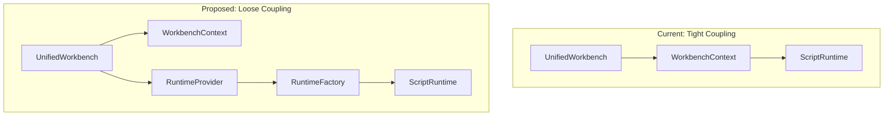
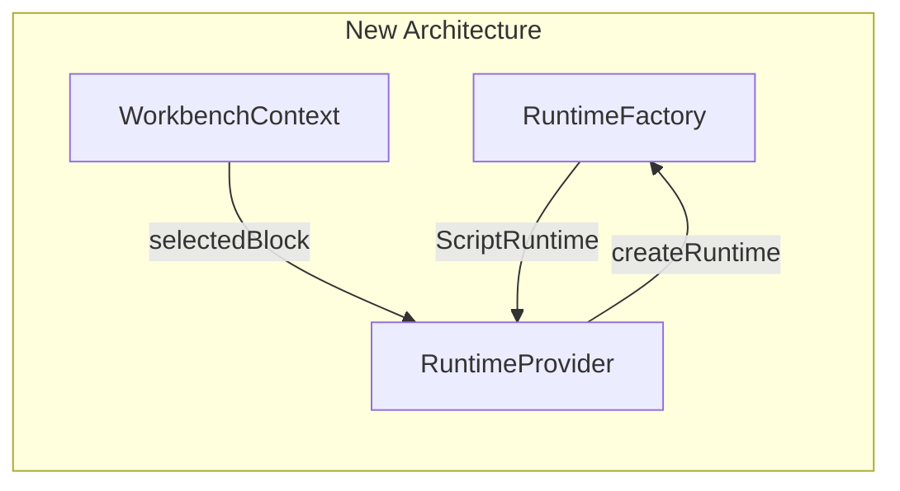
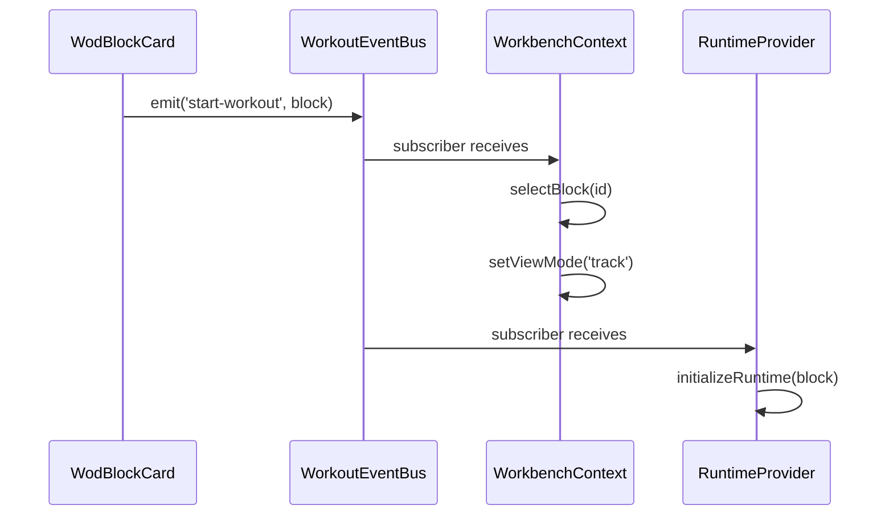
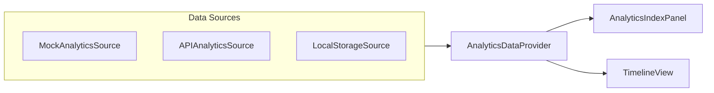
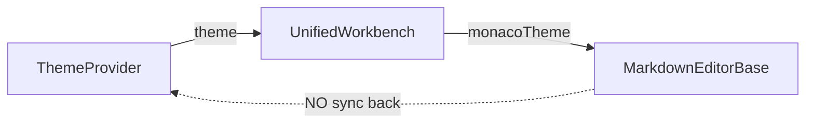
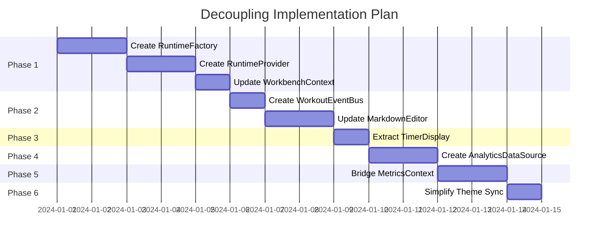

# UnifiedWorkbench Decoupling Plan

This document proposes solutions to address the coupling issues identified in the [UnifiedWorkbench Coupling Analysis](./UnifiedWorkbench_Coupling_Analysis.md).

---

## Overview

The goal is to transform `UnifiedWorkbench` from a monolithic orchestrator into a composition of loosely-coupled, single-responsibility components. This will improve testability, maintainability, and make the codebase easier to understand.



---

## Phase 1: Extract Runtime Creation (Priority: High)

### Problem
`WorkbenchContext` directly imports and instantiates `ScriptRuntime`, `WodScript`, and `globalCompiler`.

### Solution
Create a `RuntimeFactory` service and `RuntimeProvider` context that encapsulate runtime creation.



### Implementation

#### Step 1.1: Create RuntimeFactory

```typescript
// src/runtime/RuntimeFactory.ts
import { ScriptRuntime } from './ScriptRuntime';
import { WodScript } from '../parser/WodScript';
import { JitCompiler } from './JitCompiler';
import { WodBlock } from '../markdown-editor/types';

export interface IRuntimeFactory {
  createRuntime(block: WodBlock): ScriptRuntime | null;
}

export class RuntimeFactory implements IRuntimeFactory {
  constructor(private compiler: JitCompiler) {}

  createRuntime(block: WodBlock): ScriptRuntime | null {
    if (!block.statements) return null;
    
    const script = new WodScript(block.content, block.statements);
    const runtime = new ScriptRuntime(script, this.compiler);
    
    const rootBlock = this.compiler.compile(block.statements as any, runtime);
    if (rootBlock) {
      runtime.stack.push(rootBlock);
      const actions = rootBlock.mount(runtime);
      actions.forEach(action => action.do(runtime));
    }
    
    return runtime;
  }
}
```

#### Step 1.2: Create RuntimeProvider

```typescript
// src/components/layout/RuntimeProvider.tsx
import React, { createContext, useContext, useState, useEffect } from 'react';
import { ScriptRuntime } from '../../runtime/ScriptRuntime';
import { IRuntimeFactory } from '../../runtime/RuntimeFactory';
import { WodBlock } from '../../markdown-editor/types';

interface RuntimeContextState {
  runtime: ScriptRuntime | null;
  initializeRuntime: (block: WodBlock) => void;
  disposeRuntime: () => void;
}

const RuntimeContext = createContext<RuntimeContextState | undefined>(undefined);

export const RuntimeProvider: React.FC<{
  factory: IRuntimeFactory;
  children: React.ReactNode;
}> = ({ factory, children }) => {
  const [runtime, setRuntime] = useState<ScriptRuntime | null>(null);

  const initializeRuntime = (block: WodBlock) => {
    disposeRuntime(); // Clean up existing
    const newRuntime = factory.createRuntime(block);
    setRuntime(newRuntime);
  };

  const disposeRuntime = () => {
    if (runtime) {
      runtime.disposeAllBlocks();
      setRuntime(null);
    }
  };

  return (
    <RuntimeContext.Provider value={{ runtime, initializeRuntime, disposeRuntime }}>
      {children}
    </RuntimeContext.Provider>
  );
};

export const useRuntime = () => {
  const context = useContext(RuntimeContext);
  if (!context) throw new Error('useRuntime must be used within RuntimeProvider');
  return context;
};
```

#### Step 1.3: Update WorkbenchContext

Remove runtime creation logic from `WorkbenchContext`. It should only manage document state and view mode.

```typescript
// Updated WorkbenchContext - runtime removed
interface WorkbenchContextState {
  content: string;
  blocks: WodBlock[];
  activeBlockId: string | null;
  selectedBlockId: string | null;
  viewMode: ViewMode;
  results: WorkoutResults[];
  // runtime: ScriptRuntime | null; // REMOVED
  
  setContent: (content: string) => void;
  setBlocks: (blocks: WodBlock[]) => void;
  setActiveBlockId: (id: string | null) => void;
  selectBlock: (id: string | null) => void;
  setViewMode: (mode: ViewMode) => void;
  completeWorkout: (results: WorkoutResults) => void;
}
```

---

## Phase 2: Simplify Start Workout Flow (Priority: High)

### Problem
The `onStartWorkout` callback passes through 4+ layers before reaching the context.

### Solution
Use a dedicated event bus or React context action pattern.



### Implementation

#### Step 2.1: Create WorkoutEventBus

```typescript
// src/services/WorkoutEventBus.ts
type WorkoutEvent = 
  | { type: 'start-workout'; block: WodBlock }
  | { type: 'stop-workout'; results: WorkoutResults }
  | { type: 'pause-workout' }
  | { type: 'resume-workout' };

type Subscriber = (event: WorkoutEvent) => void;

class WorkoutEventBus {
  private subscribers = new Set<Subscriber>();

  subscribe(fn: Subscriber): () => void {
    this.subscribers.add(fn);
    return () => this.subscribers.delete(fn);
  }

  emit(event: WorkoutEvent): void {
    this.subscribers.forEach(fn => fn(event));
  }
}

export const workoutEventBus = new WorkoutEventBus();
```

#### Step 2.2: Create useWorkoutEvents Hook

```typescript
// src/hooks/useWorkoutEvents.ts
import { useEffect } from 'react';
import { workoutEventBus } from '../services/WorkoutEventBus';

export const useWorkoutEvents = (handler: (event: WorkoutEvent) => void) => {
  useEffect(() => {
    return workoutEventBus.subscribe(handler);
  }, [handler]);
};
```

#### Step 2.3: Update MarkdownEditor Card Action

```typescript
// In RichMarkdownManager or card action handler
import { workoutEventBus } from '../services/WorkoutEventBus';

// Instead of callback chain:
workoutEventBus.emit({ type: 'start-workout', block });
```

---

## Phase 3: Extract TimerDisplay Component (Priority: Medium)

### Problem
`TimerDisplay` is defined inline in `UnifiedWorkbench.tsx`.

### Solution
Extract to a standalone component in `src/components/workout/`.

### Implementation

```typescript
// src/components/workout/TimerDisplay.tsx
import React from 'react';
import { Button } from '@/components/ui/button';
import { Play, Pause, Square, SkipForward } from 'lucide-react';
import { cn } from '@/lib/utils';

export interface TimerDisplayProps {
  elapsedMs: number;
  hasActiveBlock: boolean;
  isRunning: boolean;
  compact?: boolean;
  onStart: () => void;
  onPause: () => void;
  onStop: () => void;
  onNext: () => void;
}

export const TimerDisplay: React.FC<TimerDisplayProps> = ({
  elapsedMs,
  hasActiveBlock,
  isRunning,
  compact = false,
  onStart,
  onPause,
  onStop,
  onNext
}) => {
  // ... existing implementation
};
```

---

## Phase 4: Inject Analytics Data Source (Priority: Medium)

### Problem
`generateSessionData()` is hardcoded in `UnifiedWorkbench.tsx`.

### Solution
Create an `AnalyticsDataProvider` that can be configured with different data sources.



### Implementation

```typescript
// src/services/analytics/AnalyticsDataSource.ts
export interface AnalyticsDataSource {
  getData(): Promise<{ data: DataPoint[]; segments: Segment[] }>;
}

// src/services/analytics/MockAnalyticsSource.ts
export class MockAnalyticsSource implements AnalyticsDataSource {
  async getData() {
    // Move generateSessionData() here
    return generateSessionData();
  }
}

// src/components/layout/AnalyticsDataProvider.tsx
export const AnalyticsDataProvider: React.FC<{
  source: AnalyticsDataSource;
  children: React.ReactNode;
}> = ({ source, children }) => {
  const [data, setData] = useState({ data: [], segments: [] });
  
  useEffect(() => {
    source.getData().then(setData);
  }, [source]);
  
  return (
    <AnalyticsDataContext.Provider value={data}>
      {children}
    </AnalyticsDataContext.Provider>
  );
};
```

---

## Phase 5: Consolidate Metrics Collection (Priority: Low)

### Problem
Both `MetricsContext` and `ScriptRuntime.metrics` (MetricCollector) exist. `MetricsContext` appears unused.

### Solution
Decide on single source of truth:

**Option A**: Remove `MetricsContext`, use runtime's `MetricCollector` exclusively.

**Option B**: Bridge `MetricCollector` to `MetricsContext` for React-friendly subscriptions.

### Recommended: Option B

```typescript
// src/runtime/MetricsContextBridge.ts
export const useRuntimeMetrics = (runtime: ScriptRuntime | null) => {
  const { logMetric, startSegment, endSegment } = useMetrics();
  
  useEffect(() => {
    if (!runtime) return;
    
    // Subscribe to runtime metric emissions
    const unsubscribe = runtime.metrics.subscribe((metric) => {
      logMetric({
        timestamp: Date.now(),
        type: metric.type,
        value: metric.value,
        unit: metric.unit
      });
    });
    
    return unsubscribe;
  }, [runtime, logMetric]);
};
```

---

## Phase 6: Simplify Theme Synchronization (Priority: Low)

### Problem
Theme sync between `ThemeProvider` and Monaco editor has bidirectional logic.

### Solution
Make Monaco theme derived from `ThemeProvider` state (unidirectional flow).



### Implementation

Remove the `propTheme` prop from being a source of truth. Always derive Monaco theme from context:

```typescript
// In UnifiedWorkbench
const { theme } = useTheme();

const monacoTheme = useMemo(() => {
  if (theme === 'system') {
    return window.matchMedia('(prefers-color-scheme: dark)').matches 
      ? 'wod-dark' 
      : 'wod-light';
  }
  return theme === 'dark' ? 'wod-dark' : 'wod-light';
}, [theme]);

// Remove propTheme sync useEffect
```

---

## Implementation Roadmap



---

## Testing Strategy

Each phase should include:

1. **Unit Tests** for new services (RuntimeFactory, WorkoutEventBus)
2. **Integration Tests** for provider interactions
3. **Storybook Stories** for extracted components (TimerDisplay)
4. **Manual Testing** via Runtime Test Bench

### Test Files to Create

| Phase | Test File |
|-------|-----------|
| 1 | `src/runtime/RuntimeFactory.test.ts` |
| 1 | `src/components/layout/RuntimeProvider.test.tsx` |
| 2 | `src/services/WorkoutEventBus.test.ts` |
| 3 | `src/components/workout/TimerDisplay.test.tsx` |
| 4 | `src/services/analytics/MockAnalyticsSource.test.ts` |

---

## Migration Notes

### Breaking Changes
- `WorkbenchContext` will no longer provide `runtime` directly
- Components needing runtime should use `useRuntime()` from `RuntimeProvider`

### Backwards Compatibility
- Keep `UnifiedWorkbench` as the main export with same props
- Internal restructuring should not affect consumers

### Deprecation Path
1. Add `RuntimeProvider` alongside existing implementation
2. Migrate internal components to use new patterns
3. Remove old runtime logic from `WorkbenchContext`
4. Document new patterns in AGENTS.md
