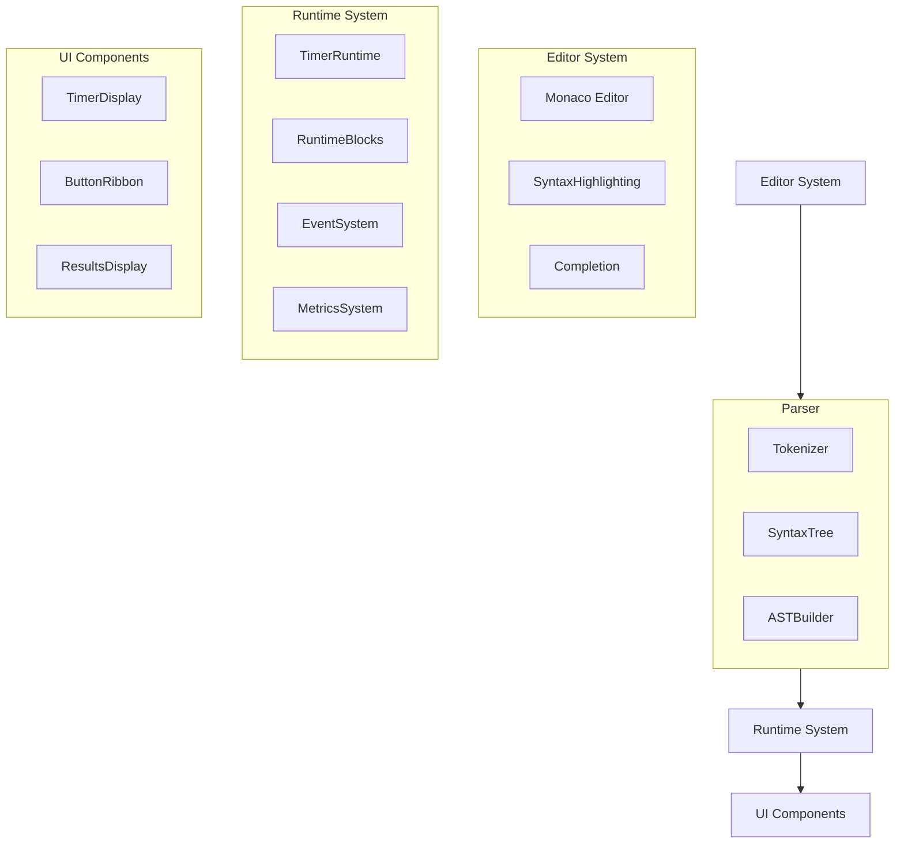

# WOD.Wiki – Developer Documentation

> "Write your workout like code, run it like an app."

WOD.Wiki is a TypeScript/React toolkit for **authoring, executing, and analyzing functional fitness workouts**. It combines a specialized **markdown-like language** with a Monaco-powered editor, a reactive runtime engine, and a rich component library.

## Architecture Overview

The wod.wiki system consists of several key architectural components:



## Core Components

### Editor

The Monaco-based editor provides a rich environment for authoring workout scripts:

- Syntax highlighting for workout elements
- Auto-completion for exercise names and formats
- Real-time validation and error reporting

### Parser/Compiler

The parser transforms text into executable structures:

- Tokenization of workout notation
- Construction of abstract syntax tree
- Statement and fragment identification

### Runtime Engine

The runtime executes workout scripts using a reactive architecture:

- Event-driven execution model
- Block-based component system
- Metrics collection and reporting

### UI Components

The UI components provide visual representation and user interaction:

- Timer display with visual feedback
- Control buttons for workout execution
- Results display for performance metrics

## Key Features

1. **Custom Workout Notation** - A domain-specific language for functional fitness
2. **Just-In-Time Compilation** - Dynamic creation of executable blocks
3. **Reactive Event System** - RxJS-based event handling
4. **Block Strategy Pattern** - Extensible execution strategies
5. **Comprehensive Metrics** - Detailed workout performance tracking
6. **Chromecast Integration** - External display functionality

## Workflow Overview

A typical workflow in wod.wiki follows these steps:

1. User writes workout script in the editor
2. Script is parsed into a syntax tree
3. Runtime compiles the tree into executable blocks
4. User starts the workout via UI controls
5. Runtime executes blocks according to the script
6. Results are collected and displayed

## Documentation Sections

The documentation is organized into the following sections:

- [**Components**](./Components/README.md) - Details of the React components and their relationships
- [**Core**](./Core/README.md) - Runtime engine, workflow, and implementation details
- [**Chromecast**](./Chromecast/README.md) - Chromecast integration functionality
- [**Syntax**](./Syntax.md) - Comprehensive guide to the workout notation language

> Note: This documentation is automatically synchronized to the [project's GitHub Wiki](../../wiki) whenever changes are pushed to the main branch.

## Getting Started as a Developer

### Prerequisites

```bash
node >= 18
npm >= 9
```

### Installation

```bash
# Clone the repository
git clone https://github.com/your-org/wod-wiki.git

# Install dependencies
cd wod-wiki
npm install

# Run Storybook
npm run dev
```

### Key Development Scripts

| Command         | Purpose                               |
| --------------- | ------------------------------------- |
| `npm run dev`   | Run **Storybook** at `localhost:6006` |
| `npm run build` | Build library into `dist/`            |
| `npm run test`  | Execute **Vitest** suite              |
| `npm run lint`  | ESLint + Prettier (if configured)     |

### Project Structure

```text
src/
  components/          ← React UI & hooks
  core/                ← Parser • Runtime • Types
    runtime/           ← Runtime components
    parser/            ← Syntax parsing
  cast/                ← Chromecast functionality
  contexts/            ← React context providers
  stories/             ← Storybook demos
```

## Extension Points

The wod.wiki system is designed for extensibility at several key points:

1. **Block Strategies** - Add new runtime block behaviors
2. **Workout Elements** - Extend the syntax with new fragment types
3. **UI Components** - Create custom visualizations
4. **Metrics Processors** - Add specialized metrics calculations
5. **External Integrations** - Connect with external services

## Contributing

Contributions are welcome! Please follow these guidelines:

1. Fork the repository
2. Create a feature branch
3. Make your changes
4. Add tests for new functionality
5. Ensure all tests pass
6. Submit a pull request

## License

© 2025 WOD.Wiki contributors – MIT licence
