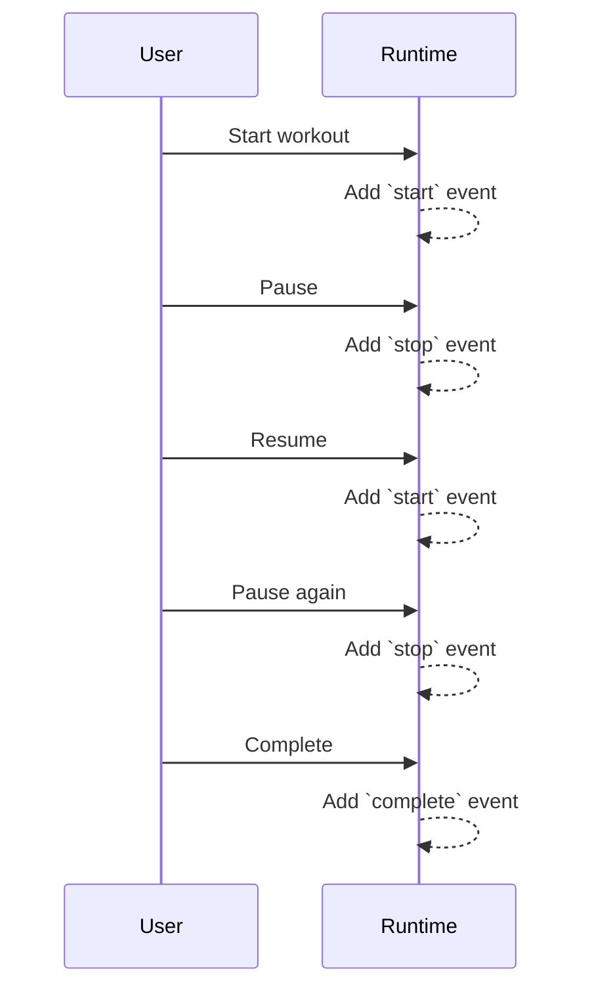

# Pause/Resume Duration Reporting – Design Document

**Date:** 2025-04-14

## Purpose
This document describes the canonical event flow and design for accurate duration reporting in the wod.wiki runtime, especially across multiple pause/resume cycles. It serves as a reference for developers and maintainers.

---

## Canonical Event Flow

### Event Sequence Table

| User Action        | Event(s) Generated         | Notes                                                         |
|--------------------|---------------------------|---------------------------------------------------------------|
| Start workout      | `start`                   | Marks the beginning of a timing span                          |
| Pause (stop)       | `stop`                    | Ends the current timing span; no explicit `pause` event       |
| Resume             | `start`                   | Begins a new timing span                                      |
| Complete round/set | `lap`, `done`, `complete` | Used for workout structure and reporting                      |
| End workout        | `stop`, `complete`        | Finalizes all spans                                           |

- The event list for a workout is an alternating sequence of `start` and `stop` events, possibly interleaved with `lap`, `done`, or `complete`.
- Durations are calculated as the sum of all (`stop` - previous `start`) pairs, plus any active span if running.

---

### Mermaid Sequence Diagram

---

## Implementation Notes

- There is no explicit `pause` event; the `stop` event acts as a pause marker.
- Each resume is a new `start` event.
- The event list must be well-formed (no consecutive `start` or `stop` without a matching pair).
- Filtering out `pause` events is a legacy step and can be ignored if only `start`/`stop` are used.

## EventSpanAggregator Improvements (2025-04-14)

- Enforces canonical event sequence: always alternate `start` and `stop`/terminal event.
- Detects and flags malformed event sequences (e.g., consecutive `start` or `stop`).
- Optionally repairs event sequences for reporting, ignoring duplicates or incomplete pairs.
- Provides robust span aggregation for duration reporting, even with edge cases.
- Exposes utility methods for validation and canonical state extraction.

### Example Edge Cases

| Event Sequence           | Result/Handling                              |
| ------------------------ | -------------------------------------------- |
| start, stop, start, stop | Two valid spans                              |
| start, start, stop       | First span closed by second start, then stop |
| start, stop, stop        | Second stop ignored (or flagged as anomaly)  |
| start, stop, start       | One closed span, one open span               |
| stop, start              | First stop ignored (or flagged as anomaly)   |

### API Additions

- `getAnomalies()`: Returns a list of detected anomalies in the event sequence.
- Aggregation logic now flags and/or repairs malformed sequences for more robust reporting.

---

## DefaultResultLogger Integration (2025-04-14)

- Updated to use EventSpanAggregator for span detection and duration calculation.
- Ensures robust and canonical reporting of all workout durations, including across multiple pauses/resumes.
- Reports anomalies detected in the event sequence (e.g., consecutive starts/stops) for debugging and analytics.

---

## WorkRestLogger Integration (2025-04-14)

- Updated to use EventSpanAggregator for span detection and duration calculation.
- Ensures robust and canonical reporting of all work/rest spans, including across multiple pauses/resumes.
- Reports anomalies detected in the event sequence (e.g., consecutive starts/stops) for debugging and analytics.

---

## Next Steps
- Update EventSpanAggregator and report logic to robustly handle all valid event sequences.
- Write comprehensive tests for edge cases (e.g., consecutive pauses, missing resumes).
- Update documentation and developer guides accordingly.

---

*See Kanban board for current progress and actionable tasks.*
