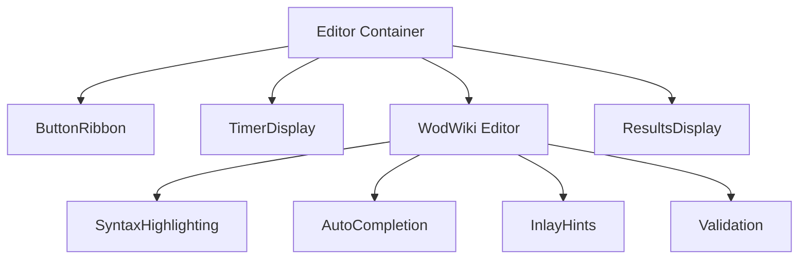
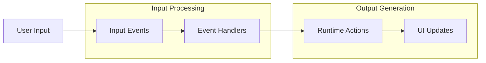

# UI Design Guide Development - 2025-05-01

## Overview

Today's focus is on creating a comprehensive UI design guide that can be provided to designers to build out a structured plan and style guide for the wod.wiki application. This guide will serve as the foundation for the visual design system and interaction patterns.

## Design Document Structure

The main design document has been created at `docs/design.md` with the following sections:

1. Application Overview
2. Core User Experience
3. UI Components Architecture
4. Visual Design Language
5. UI Components Specification
6. Interaction Patterns
7. Responsive Design Considerations
8. Accessibility Considerations
9. Brand Identity Integration
10. Implementation Guidance

## Key UI Components

The application consists of several interdependent UI components that need special design attention:

### Editor Component

### Event-Action Flow for UI Updates

## Design Considerations from Runtime Analysis

Based on the runtime handlers analysis (documented in `docs/Components/RuntimeHandlers.md`), the UI design must account for:

1. Multiple timer displays (primary and total)
2. Clear visual states for running, paused, and completed workouts
3. Round/lap counter visualization
4. Exercise metrics display with support for various units (reps, weights, distances)
5. Audio feedback integration

## Next Steps

1. Create wireframes for key screens based on the design guide
2. Develop component visual specifications
3. Define interaction animations and transitions
4. Create a color palette and typography system aligned with application needs
5. Design icon set for workout elements and controls

## References

- Runtime Handlers Documentation: `docs/Components/RuntimeHandlers.md`
- Editor Components Documentation: `docs/Components/Editor.md`
- Runtime Components Documentation: `docs/Components/Runtime.md`
