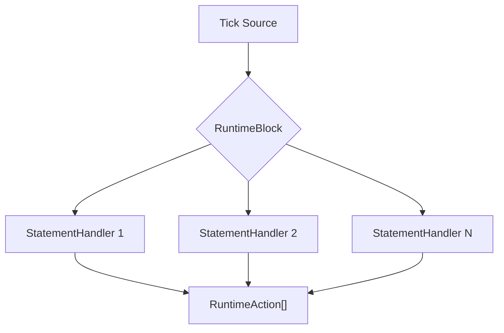

```There has been a bit of a change in the way i want to think about the selection current defined as compiler strategies.  They were originally part of the runtime instead i want to think about them in terms of ways of validating the `StatementNode` and attaching some type of runtime handler.



So these could say we are done and go to next block or generate some type of lap event or other process as part of the RuntimeAction.

The Statement handlers are what we want to compose in the new compile strategy classes.  The `visitor` currently creates a list with the child parent defined as ids.  this allows the active node to be composed of the statment and the parent tree, these `statementHandlers` represnt the handles on nodes going up that chain tree. 

## Some Ideas

### 1. From Monolithic Strategies to Composable Handlers

#### Current Structure:
```typescript
// Current ICompilerStrategy interface
export interface ICompilerStrategy {
  apply(stack: StatementNode[], runtime: CompiledRuntime): IRuntimeAction[];
}

// Current AMRAPStrategy implementation
export class AMRAPStrategy implements ICompilerStrategy {
  apply(stack: StatementNode[], runtime: CompiledRuntime): IRuntimeAction[] {
    // Safety check: Make sure we have a current node
    if (!stack || stack.length === 0) {
      return [];
    }

    const current = stack[0];
    
    // Safety check: Make sure current.fragments exists
    if (!current || !current.fragments) {
      return [];
    }
    
    const amrap = fragmentToPart(current.fragments, "effort");
    if (!amrap || current.children.length === 0) {
      return [];
    }

    // Create a RuntimeBlock instance
    const block = new RuntimeBlock(current, childBlocks);
    
    // Return display update action
    return [new SetDisplayAction(event, display)];
  }
}
```

#### New Structure:
```typescript
// New handler interface
export interface IStatementHandler {
  // Returns true if this handler can process the given node
  canHandle(node: StatementNode): boolean;
  
  // Creates a runtime handler for the node
  createHandler(node: StatementNode): IRuntimeHandler;
}

// New IRuntimeHandler interface (already existing)
export interface IRuntimeHandler {
  type: string;    
  onTimerEvent(timestamp: Date, event: string, blocks?: RuntimeBlock[]): IRuntimeAction[];
}

// AMRAPHandler implementation
export class AMRAPHandler implements IStatementHandler {
  canHandle(node: StatementNode): boolean {
    // Check if the node has an effort fragment that indicates AMRAP
    const effortPart = fragmentToPart(node, "effort");
    return !!effortPart && node.children.length > 0;
  }
  
  createHandler(node: StatementNode): IRuntimeHandler {
    return new AMRAPRuntimeHandler(node);
  }
}

// AMRAPRuntimeHandler implementation
export class AMRAPRuntimeHandler implements IRuntimeHandler {
  type = "amrap";
  
  constructor(private node: StatementNode) {}
  
  onTimerEvent(timestamp: Date, event: string, blocks?: RuntimeBlock[]): IRuntimeAction[] {
    // Different logic depending on timer event
    if (event === "start") {
      // Return actions to set up display for AMRAP
      return [/* setup actions */];
    } else if (event === "tick") {
      // Update timer, etc.
      return [/* update actions */];
    } else if (event === "lap") {
      // Increment round counter, etc.
      return [/* lap actions */];
    }
    
    return [];
  }
}
```

### 2. Compiler Flow Changes

#### Current Flow:
```typescript
// Compilation process in useTimerRuntime
const compile = (blocks: StatementNode[]): CompiledRuntime => {
  const runtime = new CompiledRuntime(blocks);
  // All strategies are instantiated and composed in one place
  runtime.strategy = new CompoundStrategy([
    new AMRAPStrategy(),
    new RepeatingGroupStrategy(),
    // ... other strategies
  ]);
  return runtime;
};
```

#### New Flow:
```typescript
// New compilation process
const compile = (blocks: StatementNode[]): CompiledRuntime => {
  const runtime = new CompiledRuntime(blocks);
  
  // Register statement handlers
  const handlers: IStatementHandler[] = [
    new AMRAPHandler(),
    new RepeatingGroupHandler(),
    // ... other handlers
  ];
  
  // Process each block to assign appropriate handlers
  for (const block of blocks) {
    // Find first handler that can handle this node
    const handler = handlers.find(h => h.canHandle(block));
    if (handler) {
      // Create and attach a runtime handler
      block.runtimeHandler = handler.createHandler(block);
    }
  }
  
  return runtime;
};
```

### 3. Event Processing Changes

#### Current Approach:
```typescript
// In the runtime
class CompiledRuntime {
  // ...
  
  handleEvent(event: RuntimeEvent): IRuntimeAction[] {
    // Use the strategy to process the event
    return this.strategy.apply(this.stack, this);
  }
}
```

#### New Approach:
```typescript
// In the runtime
class CompiledRuntime {
  // ...
  
  handleEvent(event: RuntimeEvent): IRuntimeAction[] {
    // Get current block
    const currentBlock = this.getCurrentBlock();
    if (!currentBlock || !currentBlock.runtimeHandler) {
      return [];
    }
    
    // Delegate to the block's runtime handler
    return currentBlock.runtimeHandler.onTimerEvent(
      event.timestamp,
      event.name,
      this.getChildBlocks(currentBlock)
    );
  }
  
  getChildBlocks(block: StatementNode): RuntimeBlock[] {
    // Get child blocks for the current block
    return block.children.map(id => {
      const node = this.getNodeById(id);
      return node ? new RuntimeBlock(node, []) : null;
    }).filter(Boolean);
  }
}
```

### 4. Benefits of the New Approach

1. **Single Responsibility Principle**: Each handler has a specific responsibility for handling a particular type of statement.

2. **Open/Closed Principle**: Adding new statement types becomes easier - just add a new handler without modifying existing code.

3. **Composition over Inheritance**: Handlers can be composed in various ways to build complex behaviors.

4. **Improved Testability**: Each handler can be tested in isolation.

5. **Better Separation of Concerns**: Statement validation logic is separated from runtime event handling.

6. **More Flexible Runtime Behaviors**: Each node can have its own specialized runtime handler.
