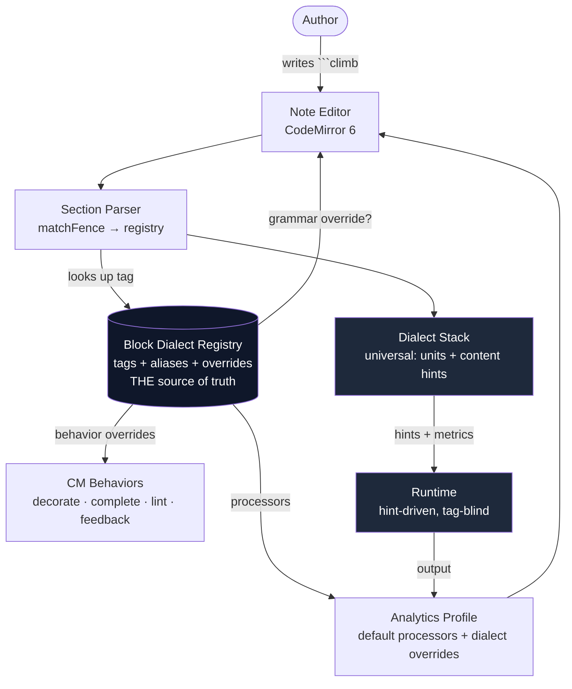

# Dialect as the Block Alignment Axis

The **Block Dialect** — the fence tag (` ```wod `, ` ```climb `) — is the one
property that aligns parser, analytics, and editor for a domain. One registry of
dialect descriptors (tags + aliases + optional overrides) is the single source of
truth. Universal defaults always run; a Block Dialect overrides, it does not
replace. The runtime is deliberately untouched.

This is the companion to [the plan](./dialect-block-alignment-plan.md).

## Context — the vision

` ```wod ` is the wod dialect; ` ```climb ` should be a climbing dialect. A dialect
is the axis that aligns how a block is parsed, analyzed, and edited for its domain
— including, at a high level, the ability to override CodeMirror editor behaviors.

## The problem — "dialect" fragmented across seven places

Today the knowledge of "which dialects exist" is smeared across seven disconnected
places, each with its own hardcoded notion. There is no Dialect module to delete —
an absent seam, not a shallow wrapper.

| Axis | Where | State |
|------|-------|-------|
| Analyzer | `IDialect` + `DialectStack` (`src/dialects/`) | ✓ clean; `ClimbDialect` already runs in the stack |
| Legacy duplicate | `DialectRegistry` (`src/services/`) | test-only; "no production path ever registered a Dialect" |
| Editor gate | `EditorDialect = "wod"\|"log"\|"plan"` + `matchDialectFence` (`section-state.ts`) | **closed enum** — `climb` falls through to generic `code` |
| CM language | `whiteboardScriptLanguage` + a hand-written `codeLanguages` predicate | another hardcoded `wod\|whiteboard\|log\|plan` list |
| CM behaviors | autocomplete, preview-decorations, cursor-focus-panel, line-ids, linter, results-widget | all filter `type === "wod"` |
| Runtime | strategies match Hint markers | tag-blind by design |

Consequence: ` ```climb ` cannot be a block today, even though `ClimbDialect`
exists. Adding a domain means editing ~7 scattered switches.

## Decision

1. **Block Dialect** is a first-class concept — the fence tag that declares a
   block's domain.
2. **One registry** of dialect descriptors is the single source of truth. Each
   descriptor declares its fence tags (canonical + aliases) and *optional*
   overrides. There is no closed enum.
3. **Defaults always present; dialects override, never replace.** The base
   Dialect Stack, the shared grammar, and the default analytics processors run for
   every block. A Block Dialect layers overrides on top; no override → default
   applies.
4. **The runtime is untouched.** It stays hint-driven and never reads the tag —
   there is no tag-keyed strategy seam. Domain reaches the runtime indirectly,
   through the hints the Dialect Stack produces.

## System overview



## How dialect reflects across the system

| Stage | Default (always present) | Dialect override (optional) |
|-------|--------------------------|------------------------------|
| Parsing — grammar | shared `whiteboardScript` grammar | a dialect *may* supply its own Lezer grammar (climb does **not** — spec-confirmed: "uses the shared parser") |
| Parsing — semantics | universal **Dialect Stack** (units fusion + content-pattern hints, incl. `ClimbDialect`) | none — the stack runs for every block; `ClimbDialect` only fires on grade/send lines |
| Runtime | universal, hint-driven strategies/behaviors | **none** — runtime never reads the tag |
| Analytics | default processors (the universal ones) | the dialect *declares* its processors — **inverts** today's per-processor `dialects` allow-list |
| Editor (CM) | the six extensions, generalized from `type === "wod"` to "registered runnable block" | a dialect *may* add editor-behavior overrides |

The single reflection principle: **defaults universal; two override surfaces
(parser-grammar, analytics); runtime deliberately untouched; editor defaults
generalized + optionally overridden.** Every override is opt-in.

## The registry (structure — illustrative)

```ts
// One descriptor per domain. Illustrative shape, not the committed interface.
export interface DialectDescriptor {
  tags: string[];                       // canonical first, then aliases: ['wod','whiteboard']
  name: string;                         // 'Climbing'
  analyzer?: IDialect;                  // the existing analyzer axis
  language?: () => LanguageSupport;     // grammar override; omit → shared grammar
  analytics?: AnalyticsProcessor[];     // dialect-declared processors (replace the allow-list)
  editorExtensions?: () => Extension[]; // CM behavior overrides
  runnable?: boolean;                   // produces a runnable block? (wod yes; plan no)
}
```

The seven axes collapse onto it:

```ts
// section-state — the closed enum dies; matchFence is a lookup
const d = registry.matchFence(trimmed);          // DialectDescriptor | null

// CM language predicate reads the registry
markdown({ codeLanguages: (info) => registry.languageFor(info) ?? null })

// editor defaults key off the registry, not a literal
const isRunnable = (s: EditorSection) => registry.isRegistered(s.dialect)
```

## Considered options

- **Runtime override seam (rejected).** Let a Block Dialect contribute tag-keyed
  runtime strategies/behaviors, symmetric with parser/analytics. Rejected: the
  analyzer → hint → strategy channel already conveys domain to the runtime; a
  second, tag-keyed channel would duplicate "this block behaves like X."
- **Two axes — sport domain × output mode (rejected).** Model ` ```log ` as
  "wod dialect, log mode" and factor execute/log/plan out as a mode axis.
  Rejected: the climb spec calls climb a "climbing log" — domain and mode already
  compose *inside* each dialect, so a separate axis is unused machinery. One flat
  registry instead.
- **Rename the section type `"wod"` → `"script"` and generalize filters
  (rejected).** Rejected in favour of registry-driven: the dialects themselves
  declare what is runnable, so the enum is *deleted* rather than renamed, and no
  filter is edited per new dialect.
- **Tag scopes the Dialect Stack (rejected).** Only the matched dialect analyzes
  its block. Rejected: the stack's sport dialects are content-pattern detectors,
  not mutually-exclusive domains — scoping would *lose* the ability for a block to
  mix patterns. The tag annotates (sets domain context); the stack stays universal.

## Consequences

- `EditorDialect` / `VALID_DIALECTS` / `matchDialectFence`'s closed loop become a
  registry lookup; ` ```climb ` becomes a runnable section by registration.
- The analytics per-processor `dialects` allow-list inverts: dialects declare the
  processors they add; defaults always load.
- The six `type === "wod"` editor filters key off the registry ("is this a
  registered runnable block"); new dialects inherit default
  decorations/feedback/lint/results for free.
- The legacy `DialectRegistry` (`src/services/`, test-only) folds into the
  registry; one remains.
- Adding a domain = register one descriptor. No closed enum, no scattered lists.
  Alias collisions are caught at registration.

## Relationship to other decisions

- Independent of [Versioned Block Identity](./versioned-block-identity.md), which
  governs result identity (`blockId` / `contentId` / `version`). Block Dialect
  governs *what kind of block it is*; versioned identity governs *which run it
  belongs to*.
- CONTEXT.md `Block Dialect` is the canonical term; `Dialect` remains the
  analyzer, `Dialect Stack` the universal composition.
