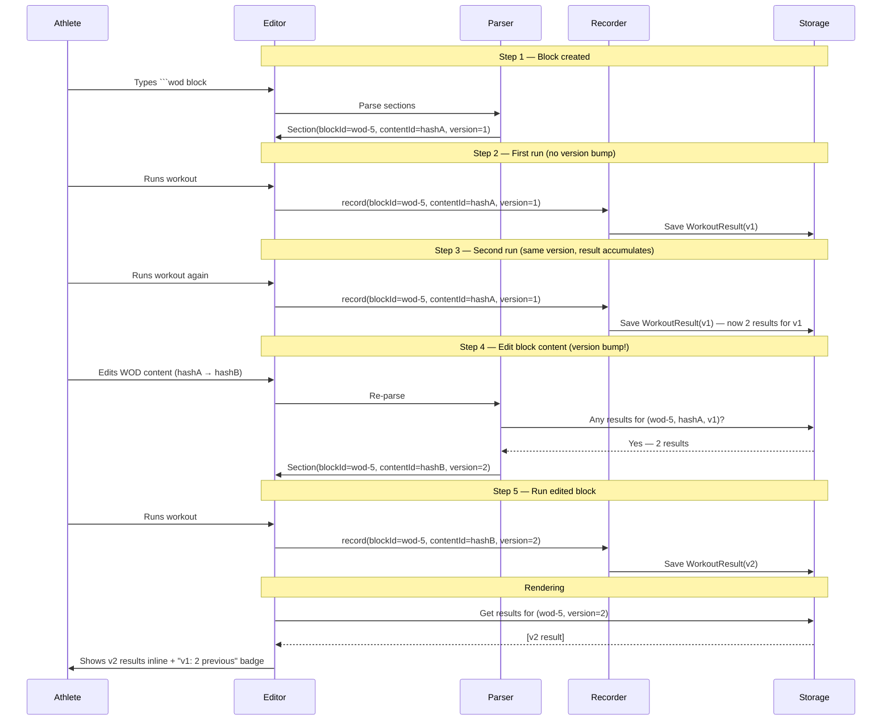
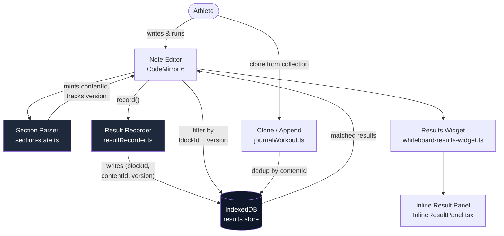
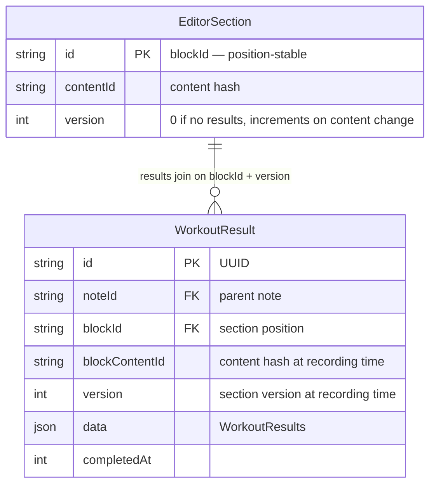

# Versioned Block Identity

A three-part identity model for linking workout results to the blocks they were recorded against, with versioning for content changes.

## The Three Keys

| Key | Scope | Stable across… | Changes when… |
|-----|-------|-----------------|---------------|
| **contentId** | Content | Clone, reorder, edit-above, edit-below | Block content is edited |
| **blockId** | Position | Re-parses at the same position | Block is moved or deleted |
| **version** | Execution | Nothing — increments per content change at a position | Content changes AND a result exists for the current version |

### How they compose

```
Note
 └─ Section (blockId: "wod-5-abc")
     ├─ contentId: "hash-of-fenced-content"
     ├─ version: 2
     └─ Results
         ├─ WorkoutResult(blockId: "wod-5-abc", contentId: "hash-v1", version: 1)
         └─ WorkoutResult(blockId: "wod-5-abc", contentId: "hash-v2", version: 2)
```

- **contentId** answers: *"What workout is this?"*
- **blockId** answers: *"Where in the note is this?"*
- **version** answers: *"Which generation of this block's content?"*

## Version Lifecycle



**The trigger rule**: a new version is created when the block content changes AND at least one result exists for the current version. If no result has been recorded, editing just updates version 1 in place (the content hash changes, but the version number stays).

## System Overview



## Impact Areas

### 1. Section Parser (`section-state.ts`, `sectionParser.ts`)

**Current**: Mints `contentId` from fenced content hash. No version tracking.

**Change**: When a section's `contentId` changes between re-parses, check if results exist for the old `contentId` at this `blockId`. If yes, increment `version`. If no, keep version at 1.

The parser already re-parses on every doc change and carries forward stable identities via `mapIdentities`. The version check is a new step in that mapping pass.

### 2. Result Recorder (`resultRecorder.ts`)

**Current**: Writes `blockContentId: runBlock.contentId`.

**Change**: Also write `blockId` (the section's `id`) and `version` (the section's current version).

```ts
WorkoutResult {
  blockId: string         // section identity (position)
  blockContentId: string  // content hash (what workout)
  version: number         // content generation at this position
}
```

### 3. Result Filtering (`NoteEditor.tsx`, `useScriptBlockResults.ts`, `useNotePageNav.ts`)

**Current**: Filter by `r.blockContentId === section.contentId`.

**Change**: Filter by `r.blockId === section.id && r.version === section.version`. Results from older versions don't match the current section — they're hidden but preserved in storage.

To view previous versions: the inline results panel gets a "Previous versions" toggle that relaxes the version filter to `r.blockId === section.id` (all versions), with each `ResultRow` badged with its version number.

### 4. Clone / Append (`journalWorkout.ts`)

**Current**: Dedup check by exact fenced content match (just added).

**Change**: No change needed. Clone deduplication stays content-based. Cloned blocks with the same content share `contentId` but get their own `blockId` and start at version 1.

### 5. Inline Editing UX

```mermaid
graph LR
    subgraph "Results Bar (current version)"
        RB["```wod block (v2)<br/>━━━━━━━━━━━━━━━<br/>Result: 4:12 — today"]
    end

    subgraph "Version Toggle (expanded)"
        VT["v2 — Fran (95lb)<br/>Result: 4:12 ✓ current"]
        VT2["v1 — Fran (original)<br/>Result: 3:47 — 2 days ago"]
    end

    RB -->|"▾ Previous"| VT
```

- **Version badge** on each results bar: shows current version number. Green dot = results exist for current version. Gray = no results yet.
- **Previous versions toggle**: expands a panel below the results bar showing all versions for this `blockId`, each with its result summary and timestamp.
- **Inline diff**: clicking a previous version shows the old content alongside the current (future enhancement).

## Data Model



## Version Bump Algorithm

```
On section re-parse (content changed):

  oldContentId = previousSection.contentId
  newContentId = hash(newFencedContent)
  blockId = section.id

  if newContentId === oldContentId:
      # Content unchanged — keep version
      section.version = previousSection.version
      return

  # Content changed — check if results exist for the old version
  hasResults = await getResultsForBlock(blockId, oldContentId, previousSection.version)

  if hasResults:
      # Bump version — old results stay linked to old contentId + version
      section.version = previousSection.version + 1
  else:
      # No results yet — update version 1 in place
      section.version = 1

  section.contentId = newContentId
```

## Why Three Keys Instead of One

The current model has one key (`blockContentId`) that conflates three questions:

| Question | Current (one key) | Proposed (three keys) |
|----------|-------------------|----------------------|
| Which workout? | `blockContentId` | `contentId` |
| Where in the note? | *(implicit — all blocks with same contentId share results)* | `blockId` |
| Which generation? | *(lost — editing content silently hides old results)* | `version` |

**Problem with one key**: if two blocks have the same content (same workout cloned into two sections), both render the same results. If a block is edited after recording, old results become invisible (different `contentId`, no match).

**With three keys**: each block position has its own result history. Editing creates a version boundary. Previous results are preserved, not lost.
