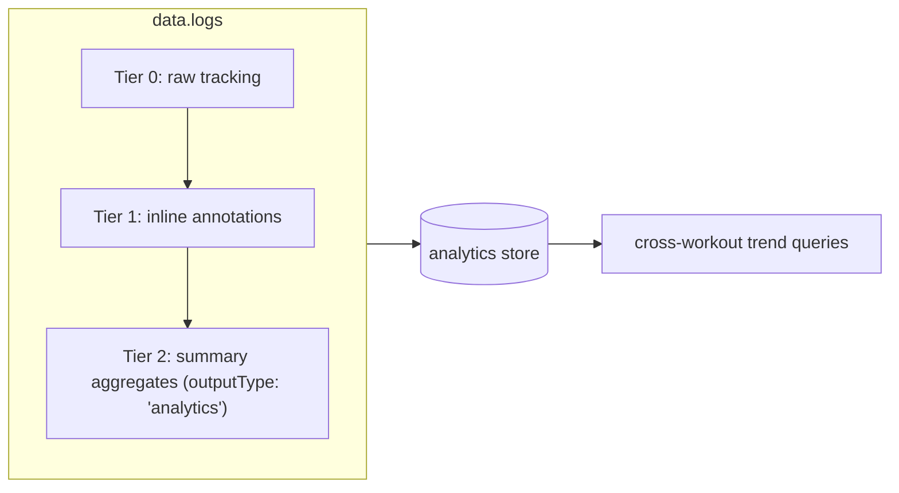
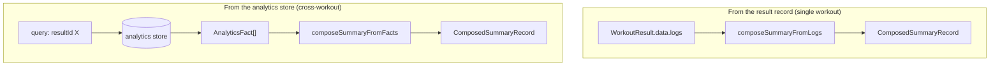

# Analytics Data Shapes & Composition

This document specifies the target data structures for splitting workout data into **inline logs** and **summary analytics**, the shape of the `analytics` store when optimized for cross-workout search, and how a **composed summary record** is assembled from all metric tiers.

Companion to:
- [`indexeddb-analytics-workflows.md`](indexeddb-analytics-workflows.md) — how data flows into the analytics store today
- [`08-analytics.md`](08-analytics.md) — the analytics engine and its processors

- Status: **implemented** (v10 shipped, summary-only reconciliation; v11 schema flattening)
- Source grounding: `src/components/Editor/types/index.ts`, `src/types/storage.ts`, `src/services/AnalyticsTransformer.ts`, `src/services/persistence/IndexedDBNotePersistence.ts`

---

## 1. The three-tier metric model

Workout metrics exist at three levels of derivation. Splitting storage along these tiers is what enables both faithful per-record replay and efficient cross-workout analysis.

| Tier | What it is | Who produces it | Storage target |
|---|---|---|---|
| **Tier 0 — Raw tracking** | Measured values from the runtime (reps, distance, elapsed, resistance) | Runtime output stream | `data.logs` as `segment` outputs |
| **Tier 1 — Inline annotations** | Single-record derived metrics (`origin: 'analyzed'`) — power, pace, resolved effort | `IRealtimeProcessor` | `data.logs` appended onto the same segment output |
| **Tier 2 — Summary aggregates** | Cross-record compound metrics — total volume, total distance, MET-minutes, TIS, session load | `ISummaryProcessor` | `data.logs` with `outputType: 'analytics'` **and** the `analytics` store |



**Today's problem:** `WorkoutResults.logs` holds Tier 0, Tier 1, **and** Tier 2 in one flat `StoredOutputStatement[]`, distinguished only by `outputType`. Mixing summary outputs (`outputType: 'analytics'`) into the same list as segment records makes it impossible to re-run summary processors cleanly, and forces every consumer to filter.

---

---

> **DECISION (2026-07-20):** The `data.logs` / `data.analytics` split is **REJECTED** and **REVERTED**. `CONTEXT.md` glossary is authoritative: a single `logs` stream holds all tiers, and Tier 2 is discriminated by `outputType === 'analytics'`. `WorkoutResults.analytics` was removed; `buildWorkoutResults` no longer partitions; `getAnalyticsFromResults` was deleted; call sites are back on `getAnalyticsFromLogs`. The rest of this document has been updated to reflect the single-stream model.

## 2. The proposed split on `WorkoutResults.data` (REJECTED)

```ts
// REJECTED — kept for design context only. src/components/Editor/types/index.ts

export interface WorkoutResults {
  startTime: number;
  endTime: number;
  duration: number;
>   roundsCompleted?: number;
>   totalRounds?: number;
>   repsCompleted?: number;
>   --- not neede, would be a type of summary aggraeates
  completed: boolean;

  /**
   * Tier 0 + Tier 1 + Tier 2 — single stream.
   * Tier 2 summary outputs are distinguished by `outputType: 'analytics'`.
   * This is the source of truth for both replay and cross-workout facts.
   */
  logs?: StoredOutputStatement[];
}
```

**Key invariant:** `data.logs` is the single source of truth. Tier 2 summary outputs (`outputType: 'analytics'`) live inside the same stream and are extracted when needed. This matches the `CONTEXT.md` glossary and avoids the replay/round-trip problems of a separate `data.analytics` property.

---

## 3. No special form — Tier 2 is filtered by `outputType`

Summary projections are `OutputStatement`s with `outputType: 'analytics'`. Today `AnalyticsEngine._buildProjectionOutputs()` wraps each `ProjectionResult` into an `OutputStatement` with `outputType: 'analytics'` and `sourceBlockKey: 'analytics-summary'`, carrying its metrics in a standard `MetricContainer`.

The single-stream model means Tier 2 lives inside `data.logs` and is filtered by `outputType`. Every consumer (`getAnalyticsFromLogs`, `AnalyticsTransformer`, review grids) already filters `outputType` to read the tiers it needs. There is no separate `data.analytics` property.

What this means concretely:

| Filter | `outputType` | Tier |
|---|---|---|
| Segment records | `'segment'` \| `'milestone'` \| `'completion'` | 0 + 1 |
| Summary aggregates | `'analytics'` | 2 |

---

## 4. The `analytics` IndexedDB store as a cross-workout fact table

The `analytics` store becomes the **fact table** for cross-workout queries. It stores only Tier 2 summary facts extracted from `data.logs` (`outputType: 'analytics'`), so trend queries never need to load full `WorkoutResult.data.logs`. Per-segment data remains in `data.logs` as the source of truth.

### 4.1 Summary-only row shape

```ts
// PROPOSED — supersedes the current AnalyticsDataPoint

export interface AnalyticsFact {
  id: string;

  // ── Grain ───────────────────────────────────────────────
  /** Always 'summary' in the current design. Per-segment facts are NOT stored; they remain in data.logs. */
  grain: 'summary';

  // ── Identity / foreign keys ─────────────────────────────
  noteId: string;
  pageId?: string;          // direct page link (v10)
  resultId: string;
  /** The segment that produced this result; null for the summary row itself. */
  segmentId: string | null;
  segmentVersion?: number;
  /** Content-stable cross-note key. REQUIRED for "find similar workouts" without a resultId join. */
  blockContentId: string;

  // ── The measure ─────────────────────────────────────────
  /** Canonical cross-workout metric key (see §5). */
  metricKey: string;
  value: number;
  unit: string;
  label: string;

  // ── Provenance & origin ─────────────────────────────────
  /** 'journal' | 'playground'; default trend queries exclude playground. */
  origin: 'journal' | 'playground';
  /** Which processor produced this ('volume-projection', 'tis-projection', …). */
  source: string;

  // ── Dimensions for cross-workout matching ───────────────
  /** Effort discipline at the workout level ('strength' | 'rowing' | 'running' | …). */
  discipline?: string;

  // ── Temporal ────────────────────────────────────────────
  /** Effective workout time. */
  timestamp: number;
  /** Row generation time. */
  createdAt: number;
}
```

**Why summary-only?** The `analytics` store is optimized for cross-workout queries. Per-segment data lives in `data.logs` and is the source of truth for replay. The store extracts only `outputType: 'analytics'` summary statements — one row per `result × canonical metric key`. This eliminates the old per-segment pipeline (`normalizeAnalyticsSegments`, `AnalyticsSegmentInput`, `workoutResult.analyticsSegments`, etc.), which has been deleted.

### 4.2 Indexes for cross-workout search

| Index | keyPath | Purpose |
|---|---|---|
| `by-metric` | `metricKey` | "Find all workouts that have a `totalVolume`" |
| `by-result` | `resultId` | "All facts for one workout" |
| `by-page` | `pageId` | "All facts for one journal page" |
| `by-content` | `blockContentId` | **RETAINED** — "All facts for this workout content across notes" (cross-note join) |
| `by-discipline` | `discipline` | "All rowing facts" (workout-level discipline) |
| `by-origin` | `origin` | "Journal vs. playground facts" (**v10 shipped**) |

Removed from the previous proposal: `by-segment`, `by-effort`, `by-grain` — the store is summary-only, so these dimensions do not apply.

These indexes make every common cross-workout query a single `getAllFromIndex` call, no client-side filtering over full result logs.

### 4.3 Example rows for one workout

A workout of `(5) → 8 Back Squat 60kg` with a 60 s segment produces only summary rows in the `analytics` store:

| grain | metricKey | value | unit | discipline | source |
|---|---|---|---|---|---|
| `summary` | `reps` | 40 | `reps` | `strength` | rep-projection |
| `summary` | `totalVolume` | 2400 | `kg` | `strength` | volume-projection |
| `summary` | `sessionLoad` | 300 | `AU` | `strength` | session-load-projection |
| `summary` | `tis` | 12.5 | `pts` | `strength` | tis-projection |

Per-segment facts (`reps`, `resistance`, `power`, `elapsed`) remain in `data.logs` and are not copied to the analytics store.

---

## 5. Canonical metric keys for cross-workout matching

Cross-workout analysis works **only if two workouts use the same `metricKey`** for the same concept. The key is the join dimension across the fact table.

### 5.1 Key allocation

| Category | Pattern | Examples |
|---|---|---|
| Raw tracking | `<family>` | `reps`, `distance`, `resistance`, `elapsed` |
| Inline annotations | `<family>` | `power`, `pace`, `speed` |
| Summary aggregates | `<aggregate>` | `totalVolume`, `totalDistance`, `totalReps`, `energy`, `sessionLoad`, `tis` |
| Per-effort scope | `<effortSlug>.<family>` | `back-squat.reps`, `rowing.distance` (when scoped to one exercise) |
| User-defined (`calculate` block) | `calc.<target>` | `calc.weeklyIntensity` |

### 5.2 A metric catalog (future)

For cross-workout search to be reliable, metric keys should be discoverable. A lightweight **metric catalog** (a small store or derived set) lists every `metricKey` that exists, with its label, unit, and grain. Trend-query UIs read the catalog to offer "compare by …" options; the fact table is queried by the chosen key.

> This is the equivalent of a dimension table in a star schema. It is optional for the initial implementation but recommended before building trend dashboards.

---

## 6. Composing the summary record

A **composed summary record** is the assembled view of one workout that combines all tiers. Consumers (review page, trend dashboards, export) read this instead of raw `data.logs` or raw fact rows.

```ts
// PROPOSED

export interface ComposedSummaryRecord {
  resultId: string;
  noteId: string;
  pageId?: string;
  timestamp: number;

  /** Tier 2 — workout-level aggregates (filter data.logs by outputType 'analytics'). */
  summaries: StoredOutputStatement[];

  /** Tier 1 — per-segment enriched metrics (filter data.logs by outputType 'segment'). */
  segments: SegmentMetricSummary[];

  /** Effort breakdown: metrics grouped by exercise. */
  efforts: EffortSummary[];
}

export interface SegmentMetricSummary {
  segmentId: string;
  name: string;
  effortSlug?: string;
  elapsed: number;
  /** All metrics on this segment (raw + annotated). */
  metrics: { metricKey: string; value: number; unit: string; origin: MetricOrigin }[];
}

export interface EffortSummary {
  effortSlug: string;
  discipline?: string;
  /** Aggregated metrics for this effort within the workout. */
  metrics: { metricKey: string; value: number; unit: string }[];
}
```

### 6.1 Two composition paths



| Path | Input | When to use |
|---|---|---|
| `composeSummaryFromLogs` | `data.logs` (filter `outputType` on demand) | You already have the `WorkoutResult` loaded (review page, editor) |
| `composeSummaryFromFacts` | `analytics` store rows for a `resultId` | Cross-workout context; avoids loading full logs |

Both produce the same `ComposedSummaryRecord` shape, so downstream consumers are source-agnostic. **Deferred:** `ComposedSummaryRecord` itself is not yet built — no consumer.

### 6.2 Cross-workout comparison

With the fact table in place, comparing workouts is a grouped query:

```
"Compare total volume across the last 10 workouts"
  → by-metric('totalVolume'), grain='summary', order by timestamp desc, limit 10
```

Each query returns `AnalyticsFact[]`, which can be charted directly or composed into `ComposedSummaryRecord` views.

---

## 7. Re-derivation when a record is edited

Because Tier 2 lives inside the single `data.logs` stream, re-derivation is simpler. When a segment is edited:


Steps:

1. **Strip** existing `origin: 'analyzed'` metrics from the edited segment (so annotations are not duplicated on re-run). **Preserve** `origin: 'analyzed-estimated'` predictions; they are frozen as recorded.
2. **Re-run** the applicable `IRealtimeProcessor`(s) on that segment.
3. **Re-run** all `ISummaryProcessor`s over the full `data.logs` → new `StoredOutputStatement[]` with `outputType: 'analytics'`.
4. **Replace** the existing Tier-2 outputs inside `data.logs`.
5. **Re-normalize** facts: delete all `AnalyticsFact` rows for this `resultId`, then re-insert from the Tier-2 statements only (`normalizeSummaryFacts`).

Because the summary depends on the full log and the facts depend on both, the cascade is: edit one segment → re-annotate it → re-aggregate the workout → refresh the fact rows for that workout.

---

## 8. Normalization functions (proposed API)

```ts
/**
 * Build summary analytics facts from a workout's logs.
 * Extracts `outputType: 'analytics'` statements and produces one
 * `AnalyticsFact` per `result × canonical metric key`.
 */
export function normalizeSummaryFacts(
  resultId: string,
  noteId: string,
  logs: StoredOutputStatement[],
  identity: { pageId?: string; segmentId?: string; segmentVersion?: number; blockContentId: string; origin: 'journal' | 'playground' },
): AnalyticsFact[];

/**
 * Assemble a composed summary record from the result's own data.
 * (Deferred — no consumer yet.)
 */
export function composeSummaryFromLogs(
  result: WorkoutResult,
): ComposedSummaryRecord;

/**
 * Assemble a composed summary record from fact-table rows.
 * (Deferred — no consumer yet.)
 */
export function composeSummaryFromFacts(
  facts: AnalyticsFact[],
  resultId: string,
): ComposedSummaryRecord;
```

---

## 9. Migration impact

| Area | Change |
|---|---|
| `WorkoutResults` | **No `analytics` property.** Tier 2 stays in `data.logs` with `outputType: 'analytics'`. |
| `AnalyticsEngine.finalize()` | Returns Tier-2 `StoredOutputStatement[]` with `outputType: 'analytics'`; these are appended to `data.logs`. |
| `OutputEmitter` | Summary outputs continue to flow through `add()`; no separate `data.analytics` hand-off. |
| `resultRecorder` | No `analyticsSegments` param; facts are derived from `data.logs` after recording. |
| `normalizeAnalyticsSegments` | **Deleted.** Per-segment pipeline removed. |
| `AnalyticsSegmentInput` | **Deleted.** |
| `NoteMutation.analytics` / `workoutResult.analyticsSegments` | **Deleted.** |
| `normalizeAnalyticsSegments` → `normalizeSummaryFacts` | Extracts `outputType: 'analytics'` from `data.logs` → one summary fact per `result × canonical metric key`. |
| `analytics` store schema | Summary-only facts (`grain: 'summary'`). Retains `blockContentId` + `by-content`; keeps `by-metric`, `by-discipline`, `by-origin`; drops `by-segment`, `by-effort`, `by-grain` from the proposal. |
| `AnalyticsDataPoint` → `AnalyticsFact` | Rename + extend; `metricKey` is canonical camelCase (`resolveCanonicalMetricKey`). |
| `getAnalyticsFromLogs` | Display continues to derive segments from `data.logs`; filters `outputType` for Tier 2. |

This reconciliation was implemented in schema version 10 (2026-07-20).
