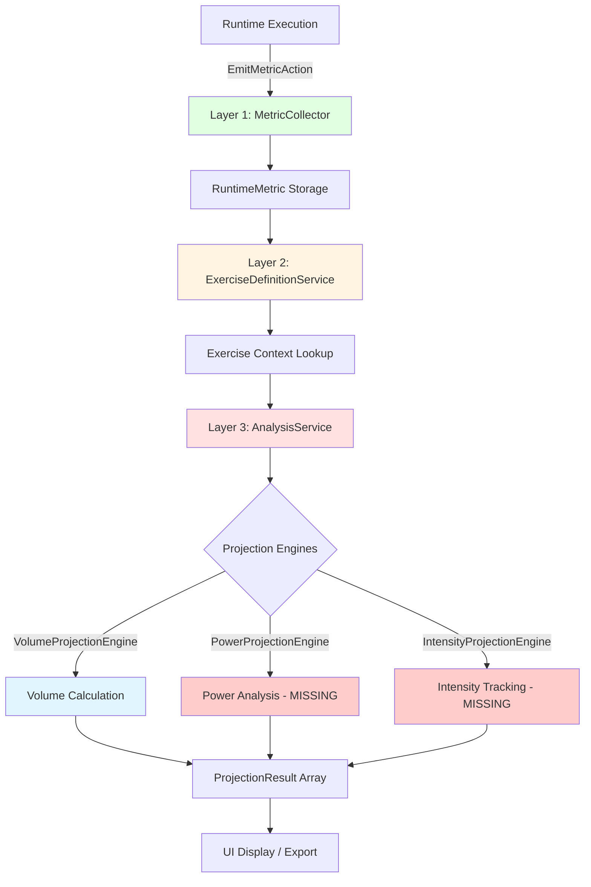
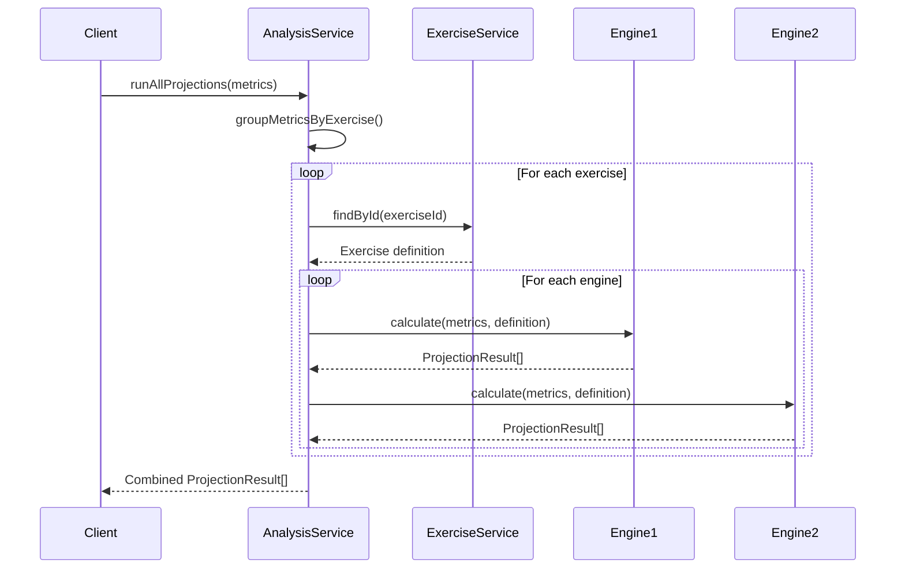

# WOD Wiki Analytics State and Capabilities

## Executive Summary

WOD Wiki implements a three-layer analytics architecture for collecting, contextualizing, and analyzing workout performance metrics. This document details the complete analytics system including data collection via `RuntimeMetric`, contextual framework via `ExerciseDefinitionService`, and analytical projections via pluggable `IProjectionEngine` implementations.

**Target Audience:** Experienced developers implementing analytics features, projection engines, or metric collection patterns.

**Related Documentation:**
- [Architectural Overview](./architectural-overview.md) - Complete system architecture
- [Runtime Execution Overview](./runtime-execution-overview.md) - Runtime block execution
- [Fitness Projection System](./fitness-projection-system.md) - Complete analytics architecture
- [IMPLEMENTATION-SUMMARY](./IMPLEMENTATION-SUMMARY.md) - Analytics implementation status

## Table of Contents

1. [Three-Layer Analytics Architecture](#three-layer-analytics-architecture)
2. [Layer 1: Data Collection (RuntimeMetric)](#layer-1-data-collection-runtimemetric)
3. [Layer 2: Contextual Framework (ExerciseDefinitionService)](#layer-2-contextual-framework-exercisedefinitionservice)
4. [Layer 3: Analytical Projections (AnalysisService)](#layer-3-analytical-projections-analysisservice)
5. [Metric Emission Patterns](#metric-emission-patterns)
6. [Current Implementation Status](#current-implementation-status)
7. [Missing Features and Gaps](#missing-features-and-gaps)
8. [Future Projection Engines](#future-projection-engines)
9. [Integration Patterns](#integration-patterns)

---

## Three-Layer Analytics Architecture

The analytics system implements a clean separation between data collection, context, and analysis:



### Layer Responsibilities

| Layer | Component | Responsibility | Status |
|-------|-----------|---------------|--------|
| Layer 1 | MetricCollector | Collect RuntimeMetrics during execution | ✅ Complete |
| Layer 2 | ExerciseDefinitionService | Provide exercise context (873+ exercises) | ✅ Complete |
| Layer 3 | AnalysisService | Coordinate projection engines | ✅ Complete |
| Projection | VolumeProjectionEngine | Calculate volume (reps × resistance) | ✅ Complete |
| Projection | PowerProjectionEngine | Calculate power metrics | ❌ Missing |
| Projection | IntensityProjectionEngine | Calculate intensity zones | ❌ Missing |

---

## Layer 1: Data Collection (RuntimeMetric)

### RuntimeMetric Structure

**Primary File:** `src/runtime/RuntimeMetric.ts`

```typescript
interface RuntimeMetric {
  exerciseId: string;           // Exercise identifier for traceability
  values: MetricValue[];        // Performance metrics
  timeSpans: TimeSpan[];        // Temporal tracking
}

type MetricValue = {
  type: "repetitions" | "resistance" | "distance" | "timestamp" | 
        "rounds" | "time" | "calories" | "action" | "effort";
  value: number | undefined;
  unit: string;
}

interface TimeSpan {
  start: Date;
  stop: Date;
}
```

### Nine Metric Value Types

| Type | Semantic Meaning | Example | Unit |
|------|------------------|---------|------|
| `repetitions` | Count-based metrics | 21 pushups | `reps` |
| `resistance` | Weight/load | 95lb squat | `lb`, `kg` |
| `distance` | Distance measurements | 5km run | `m`, `km`, `mi` |
| `timestamp` | Time-based events | Completed at 10:30 | `ms` |
| `rounds` | Round completion | Round 3 of 5 | `rounds` |
| `time` | Duration | 45 seconds | `ms` |
| `calories` | Energy expenditure | 250 calories | `cal` |
| `action` | Action completion | Warmup complete | `action` |
| `effort` | Intensity/RPE | RPE 8 | `rpe` |

### MetricCollector Implementation

**Primary File:** `src/runtime/MetricCollector.ts`

```typescript
interface IMetricCollector {
  collect(metric: RuntimeMetric): void;
  getMetrics(): RuntimeMetric[];
  clear(): void;
}

class MetricCollector implements IMetricCollector {
  private metrics: RuntimeMetric[] = [];
  
  collect(metric: RuntimeMetric): void {
    // Defensive copy to prevent external mutations
    this.metrics.push({ ...metric });
  }
  
  getMetrics(): RuntimeMetric[] {
    // Return copy to prevent external mutations
    return [...this.metrics];
  }
  
  clear(): void {
    this.metrics = [];
  }
}
```

**Key Features:**
- ✅ In-memory storage (array-based)
- ✅ O(1) collection time
- ✅ O(n) retrieval time
- ✅ Defensive copying prevents mutations
- ✅ Clear() method for cleanup between workouts
- ✅ Integrated into ScriptRuntime automatically

### EmitMetricAction

**Primary File:** `src/runtime/actions/EmitMetricAction.ts`

Declarative action for emitting metrics from behaviors:

```typescript
class EmitMetricAction implements IRuntimeAction {
  constructor(public readonly metric: RuntimeMetric) {}
}

// Usage in behavior:
onNext(runtime: IScriptRuntime, block: IRuntimeBlock): IRuntimeAction[] {
  const metric: RuntimeMetric = {
    exerciseId: this.context.exerciseId,
    values: [
      { type: 'repetitions', value: 21, unit: 'reps' },
      { type: 'resistance', value: 95, unit: 'lb' }
    ],
    timeSpans: [
      { start: this.startTime, stop: new Date() }
    ]
  };
  
  return [new EmitMetricAction(metric)];
}
```

### Integration with ScriptRuntime

**Primary File:** `src/runtime/ScriptRuntime.ts`

```typescript
class ScriptRuntime implements IScriptRuntime {
  public readonly metrics: IMetricCollector;
  
  constructor(script: WodScript) {
    this.metrics = new MetricCollector();
    // ...
  }
  
  handle(event: IEvent): void {
    // ... handler execution
    
    for (const action of allActions) {
      if (action instanceof EmitMetricAction) {
        this.metrics.collect(action.metric);
      }
      // ... other actions
    }
  }
}
```

---

## Layer 2: Contextual Framework (ExerciseDefinitionService)

### Exercise Definition Structure

**Primary File:** `src/exercise.d.ts`

```typescript
interface Exercise {
  name: string;                    // Exercise name (also used as ID)
  force?: string | null;           // Push, Pull, Static
  level: string;                   // Beginner, Intermediate, Expert
  mechanic?: string | null;        // Compound, Isolation
  equipment?: string | null;       // Barbell, Dumbbell, Bodyweight, etc.
  primaryMuscles: string[];        // Target muscles
  secondaryMuscles: string[];      // Supporting muscles
  instructions: string[];          // Step-by-step instructions
  category: string;                // Strength, Cardio, etc.
  images: string[];                // Image URLs
  id: string;                      // Exercise identifier
}
```

### ExerciseDefinitionService (Singleton)

**Primary File:** `src/services/ExerciseDefinitionService.ts`

```typescript
class ExerciseDefinitionService {
  private static instance: ExerciseDefinitionService;
  private exercises: Map<string, Exercise> = new Map();
  
  private constructor() {
    // Private constructor for singleton
  }
  
  static getInstance(): ExerciseDefinitionService {
    if (!ExerciseDefinitionService.instance) {
      ExerciseDefinitionService.instance = new ExerciseDefinitionService();
    }
    return ExerciseDefinitionService.instance;
  }
  
  // Find exercise by ID (uses name as ID)
  findById(id: string): Exercise | undefined {
    return this.exercises.get(id);
  }
  
  // Add exercise definition
  addExercise(exercise: Exercise): void {
    this.exercises.set(exercise.name, exercise);
  }
  
  // Get all exercises
  getAllExercises(): Exercise[] {
    return Array.from(this.exercises.values());
  }
  
  // Reset for testing
  reset(): void {
    this.exercises.clear();
  }
}
```

**Key Features:**
- ✅ Singleton pattern (global instance)
- ✅ Uses exercise `name` as ID (Exercise interface lacks separate id field)
- ✅ Fast lookup via Map (O(1) access)
- ✅ Support for 873+ exercises
- ✅ Reset method for testing

### Exercise Database Integration

**Primary File:** `public/exercises/` (873+ exercise folders)

```typescript
// Example: Loading exercises
const exercises = await fetch('/exercises/exercise-list.json');
const exerciseData = await exercises.json();

const service = ExerciseDefinitionService.getInstance();
for (const exercise of exerciseData) {
  service.addExercise(exercise);
}
```

---

## Layer 3: Analytical Projections (AnalysisService)

### AnalysisService Architecture

**Primary File:** `src/analytics/AnalysisService.ts`

```typescript
class AnalysisService {
  private engines: IProjectionEngine[] = [];
  private exerciseService?: ExerciseDefinitionService;
  
  // Register projection engine
  registerEngine(engine: IProjectionEngine): void {
    this.engines.push(engine);
  }
  
  // Set exercise service for context
  setExerciseService(service: ExerciseDefinitionService): void {
    this.exerciseService = service;
  }
  
  // Run all registered engines
  runAllProjections(metrics: RuntimeMetric[]): ProjectionResult[] {
    const results: ProjectionResult[] = [];
    
    // 1. Group metrics by exercise ID
    const metricsByExercise = this.groupMetricsByExercise(metrics);
    
    // 2. Run projections for each exercise
    for (const [exerciseId, exerciseMetrics] of metricsByExercise.entries()) {
      const definition = this.exerciseService.findById(exerciseId);
      
      if (!definition) {
        console.warn(`No definition found for: ${exerciseId}`);
        continue;
      }
      
      // 3. Execute all engines
      for (const engine of this.engines) {
        const engineResults = engine.calculate(exerciseMetrics, definition);
        results.push(...engineResults);
      }
    }
    
    return results;
  }
  
  // Group metrics by exercise ID
  private groupMetricsByExercise(metrics: RuntimeMetric[]): Map<string, RuntimeMetric[]> {
    const grouped = new Map<string, RuntimeMetric[]>();
    
    for (const metric of metrics) {
      if (!metric.exerciseId) continue;
      
      const existing = grouped.get(metric.exerciseId) || [];
      existing.push(metric);
      grouped.set(metric.exerciseId, existing);
    }
    
    return grouped;
  }
}
```

**Execution Flow:**



### IProjectionEngine Interface

**Primary File:** `src/analytics/IProjectionEngine.ts`

```typescript
interface IProjectionEngine {
  readonly name: string;
  
  calculate(
    metrics: RuntimeMetric[], 
    definition: Exercise
  ): ProjectionResult[];
}
```

### ProjectionResult Structure

**Primary File:** `src/analytics/ProjectionResult.ts`

```typescript
interface ProjectionResult {
  name: string;                    // "Total Volume", "Average Power"
  value: number;                   // Calculated value
  unit: string;                    // "kg", "watts", "%"
  timeSpan: TimeSpan;              // When metric was recorded
  metadata?: Record<string, any>;  // Additional context
}
```

### VolumeProjectionEngine (Complete ✅)

**Primary File:** `src/analytics/engines/VolumeProjectionEngine.ts`

```typescript
class VolumeProjectionEngine implements IProjectionEngine {
  readonly name = "VolumeProjectionEngine";
  
  calculate(metrics: RuntimeMetric[], definition: Exercise): ProjectionResult[] {
    if (metrics.length === 0) return [];
    
    let totalVolume = 0;
    let hasValidData = false;
    
    // Collect all time spans
    const allSpans = metrics.flatMap(m => m.timeSpans);
    if (allSpans.length === 0) return [];
    
    // Calculate volume: reps × resistance
    for (const metric of metrics) {
      const reps = metric.values.find(v => v.type === 'repetitions')?.value;
      const resistance = metric.values.find(v => v.type === 'resistance')?.value;
      
      if (typeof reps === 'number' && typeof resistance === 'number') {
        totalVolume += reps * resistance;
        hasValidData = true;
      }
    }
    
    if (!hasValidData) return [];
    
    // Determine time span
    const sortedSpans = allSpans.sort((a, b) => a.start.getTime() - b.start.getTime());
    const startTime = sortedSpans[0].start;
    const endTime = sortedSpans[sortedSpans.length - 1].stop;
    
    return [{
      name: "Total Volume",
      value: totalVolume,
      unit: "kg",
      timeSpan: { start: startTime, stop: endTime },
      metadata: {
        exerciseName: definition.name,
        totalSets: metrics.length,
      }
    }];
  }
}
```

**Example:**
```typescript
// Metrics: 3 sets of 10 reps at 100kg
// Input:
[
  { exerciseId: "Squat", values: [{ type: 'repetitions', value: 10 }, { type: 'resistance', value: 100 }] },
  { exerciseId: "Squat", values: [{ type: 'repetitions', value: 10 }, { type: 'resistance', value: 100 }] },
  { exerciseId: "Squat", values: [{ type: 'repetitions', value: 10 }, { type: 'resistance', value: 100 }] },
]

// Output:
{
  name: "Total Volume",
  value: 3000,  // 10 × 100 × 3 sets
  unit: "kg",
  metadata: { exerciseName: "Squat", totalSets: 3 }
}
```

---

## Metric Emission Patterns

### Pattern 1: Emit on Round Completion

```typescript
// In LoopCoordinatorBehavior.onNext()
onNext(runtime: IScriptRuntime, block: IRuntimeBlock): IRuntimeAction[] {
  this.index++;
  const state = this.getState();
  
  // Emit metric when round completes (position wraps to 0)
  if (state.position === 0 && state.rounds > 0) {
    const metric: RuntimeMetric = {
      exerciseId: this.context.exerciseId,
      values: [
        { type: 'rounds', value: state.rounds, unit: 'rounds' }
      ],
      timeSpans: [
        { start: this.roundStartTime, stop: new Date() }
      ]
    };
    
    return [
      new PushBlockAction(/* next child */),
      new EmitMetricAction(metric)
    ];
  }
  
  return [new PushBlockAction(/* next child */)];
}
```

### Pattern 2: Emit on Timer Complete

```typescript
// In TimerBehavior (planned)
onTimerComplete(runtime: IScriptRuntime, block: IRuntimeBlock): IRuntimeAction[] {
  const metric: RuntimeMetric = {
    exerciseId: this.context.exerciseId,
    values: [
      { type: 'time', value: this.getElapsedMs(), unit: 'ms' }
    ],
    timeSpans: [
      { start: this.startTime, stop: new Date() }
    ]
  };
  
  return [new EmitMetricAction(metric)];
}
```

### Pattern 3: Emit on Effort Complete

```typescript
// In EffortBlock.unmount() (planned)
unmount(runtime: IScriptRuntime): IRuntimeAction[] {
  // Extract reps and resistance from context or fragments
  const reps = this.getReps();
  const resistance = this.getResistance();
  
  const metric: RuntimeMetric = {
    exerciseId: this.context.exerciseId,
    values: [
      { type: 'repetitions', value: reps, unit: 'reps' },
      { type: 'resistance', value: resistance, unit: 'lb' }
    ],
    timeSpans: [
      { start: this.mountTime, stop: new Date() }
    ]
  };
  
  return [new EmitMetricAction(metric)];
}
```

---

## Current Implementation Status

### Data Collection Layer ✅

| Component | Status | Notes |
|-----------|--------|-------|
| RuntimeMetric interface | ✅ Complete | Full type definitions |
| MetricValue types | ✅ Complete | 9 metric types supported |
| TimeSpan tracking | ✅ Complete | Start/stop timestamps |
| MetricCollector service | ✅ Complete | In-memory storage |
| EmitMetricAction | ✅ Complete | Declarative emission |
| ScriptRuntime integration | ✅ Complete | Automatic initialization |

### Contextual Framework Layer ✅

| Component | Status | Notes |
|-----------|--------|-------|
| Exercise interface | ✅ Complete | Comprehensive metadata |
| ExerciseDefinitionService | ✅ Complete | Singleton pattern |
| Exercise ID mapping | ✅ Complete | Uses name as ID |
| 873+ exercise database | ✅ Complete | Full database available |

### Analytical Projection Layer ✅

| Component | Status | Notes |
|-----------|--------|-------|
| IProjectionEngine interface | ✅ Complete | Extensible plugin pattern |
| ProjectionResult type | ✅ Complete | Standardized output |
| AnalysisService | ✅ Complete | Engine coordination |
| VolumeProjectionEngine | ✅ Complete | Reps × resistance |

### Testing Coverage ✅

| Test Suite | Status | Tests |
|------------|--------|-------|
| MetricCollector tests | ✅ Complete | 5 tests |
| ExerciseDefinitionService tests | ✅ Complete | 8 tests |
| AnalysisService tests | ✅ Complete | 7 tests |
| VolumeProjectionEngine tests | ✅ Complete | 6 tests |
| **Total** | **✅ 100% Pass** | **26 tests** |

---

## Missing Features and Gaps

### Critical Gaps

#### 1. Metric Emission in Core Behaviors ❌

**Issue:** Behaviors don't emit metrics during execution

```typescript
// Current: LoopCoordinatorBehavior
onNext(runtime, block): IRuntimeAction[] {
  return [new PushBlockAction(childBlock)];
  // ❌ Missing metric emission
}

// Desired:
onNext(runtime, block): IRuntimeAction[] {
  const actions = [new PushBlockAction(childBlock)];
  
  if (roundComplete) {
    actions.push(new EmitMetricAction({
      exerciseId: this.context.exerciseId,
      values: [{ type: 'rounds', value: state.rounds, unit: 'rounds' }],
      timeSpans: [{ start: this.roundStart, stop: new Date() }]
    }));
  }
  
  return actions;
}
```

**Impact:**
- No automatic metric collection during workouts
- Must manually emit metrics from custom blocks
- Missing round completion tracking
- Missing timer duration tracking

**Priority:** HIGH - Core feature gap

---

#### 2. Exercise ID Parsing Not Integrated ❌

**Issue:** Parser doesn't extract exerciseId from statements

```typescript
// Current workaround in strategies:
const exerciseId = (code[0] as any)?.exerciseId ?? '';

// Desired: Parser should populate exerciseId
const exerciseId = code[0].exerciseId;  // From EffortFragment
```

**Impact:**
- Metrics can't automatically link to exercises
- Manual exerciseId assignment required
- No validation against exercise database during parsing

**Priority:** MEDIUM - Affects usability

---

#### 3. TimeSpan Tracking Incomplete ❌

**Issue:** Behaviors don't track start/stop times

```typescript
// Missing in all behaviors:
private mountTime: Date;
private unmountTime?: Date;

mount(runtime): IRuntimeAction[] {
  this.mountTime = new Date();  // ❌ Not implemented
  // ...
}

unmount(runtime): IRuntimeAction[] {
  this.unmountTime = new Date();  // ❌ Not implemented
  // Emit metric with timeSpans
}
```

**Impact:**
- No temporal context for metrics
- Can't calculate workout duration
- Can't calculate time under tension
- Can't correlate metrics with workout phases

**Priority:** MEDIUM - Analytics quality issue

---

### Missing Projection Engines

#### PowerProjectionEngine ❌

**Purpose:** Calculate power metrics (force × velocity)

```typescript
interface PowerProjectionEngine extends IProjectionEngine {
  // Calculates: (resistance × distance) / time
  // Example: Power Clean at 100kg, 1.5m ROM, 0.8s = 187.5 watts
}
```

**Requirements:**
- Distance metric type
- Time metric type
- Resistance metric type
- Exercise ROM (range of motion) from definition

**Priority:** MEDIUM - Advanced analytics

---

#### IntensityProjectionEngine ❌

**Purpose:** Calculate intensity zones (% of 1RM)

```typescript
interface IntensityProjectionEngine extends IProjectionEngine {
  // Calculates: (resistance / user1RM) × 100
  // Example: 95lb squat with 135lb 1RM = 70% intensity
}
```

**Requirements:**
- User profile with 1RM values
- Resistance metric type
- Exercise-specific 1RM lookup

**Priority:** LOW - Requires personalization

---

#### FatigueProjectionEngine ❌

**Purpose:** Calculate cumulative fatigue

```typescript
interface FatigueProjectionEngine extends IProjectionEngine {
  // Calculates cumulative stress based on:
  // - Volume (reps × resistance)
  // - Time under tension
  // - Recovery between sets
}
```

**Requirements:**
- Volume calculation
- Time tracking
- Rest period detection
- Fatigue accumulation model

**Priority:** LOW - Research-based feature

---

### Missing Historical Tracking ❌

**Issue:** Metrics cleared between workouts

```typescript
// Current: In-memory only
class MetricCollector {
  clear(): void {
    this.metrics = [];  // Loses all data
  }
}

// Desired: Persistent storage
class PersistentMetricCollector {
  async save(workout: Workout): Promise<void> {
    await db.workouts.add(workout);
  }
  
  async getHistory(exerciseId: string): Promise<RuntimeMetric[]> {
    return db.metrics.where({ exerciseId }).toArray();
  }
}
```

**Impact:**
- No long-term progress tracking
- No trend analysis
- No personal records (PRs)
- No workout history

**Priority:** HIGH - User value feature

---

### Missing Personalization ❌

**Issue:** No user profile integration

**Missing Components:**
- User 1RM (one-rep max) values
- Max heart rate
- Body weight
- Training age
- Goals and targets

**Impact:**
- Can't calculate % of max
- Can't calculate intensity zones
- Can't provide personalized recommendations
- Can't track relative progress

**Priority:** MEDIUM - User experience

---

## Future Projection Engines

### Velocity-Based Training Engine

```typescript
class VelocityProjectionEngine implements IProjectionEngine {
  calculate(metrics: RuntimeMetric[], definition: Exercise): ProjectionResult[] {
    // Calculate bar velocity from:
    // - Distance (ROM)
    // - Time (duration)
    // Result: m/s velocity for each rep
  }
}
```

**Use Cases:**
- Auto-regulation (adjust weight by velocity)
- Fatigue detection (velocity drop-off)
- Explosive power tracking

---

### Endurance Scoring Engine

```typescript
class EnduranceProjectionEngine implements IProjectionEngine {
  calculate(metrics: RuntimeMetric[], definition: Exercise): ProjectionResult[] {
    // Calculate endurance score based on:
    // - Total time under tension
    // - Volume degradation over sets
    // - Rest periods
  }
}
```

**Use Cases:**
- Conditioning assessment
- Work capacity tracking
- Pacing analysis

---

### Technical Proficiency Engine

```typescript
class TechnicalProjectionEngine implements IProjectionEngine {
  calculate(metrics: RuntimeMetric[], definition: Exercise): ProjectionResult[] {
    // Calculate technique score based on:
    // - Rep consistency (velocity variance)
    // - ROM consistency
    // - Fatigue-induced form breakdown
  }
}
```

**Use Cases:**
- Skill development tracking
- Form quality assessment
- Coaching feedback

---

## Integration Patterns

### Pattern 1: React Component Integration

```typescript
import { AnalysisService } from '@/analytics/AnalysisService';
import { VolumeProjectionEngine } from '@/analytics/engines/VolumeProjectionEngine';
import { ExerciseDefinitionService } from '@/services/ExerciseDefinitionService';

function WorkoutResults({ runtime }: { runtime: IScriptRuntime }) {
  const [results, setResults] = useState<ProjectionResult[]>([]);
  
  useEffect(() => {
    // Setup analysis service
    const analysisService = new AnalysisService();
    analysisService.registerEngine(new VolumeProjectionEngine());
    analysisService.setExerciseService(ExerciseDefinitionService.getInstance());
    
    // Run projections
    const metrics = runtime.metrics.getMetrics();
    const projections = analysisService.runAllProjections(metrics);
    
    setResults(projections);
  }, [runtime]);
  
  return (
    <div>
      {results.map(result => (
        <div key={result.name}>
          <h3>{result.name}</h3>
          <p>{result.value} {result.unit}</p>
        </div>
      ))}
    </div>
  );
}
```

### Pattern 2: Custom Projection Engine

```typescript
class MyCustomEngine implements IProjectionEngine {
  readonly name = "MyCustomEngine";
  
  calculate(metrics: RuntimeMetric[], definition: Exercise): ProjectionResult[] {
    // 1. Extract relevant metric values
    const reps = metrics.flatMap(m => 
      m.values.filter(v => v.type === 'repetitions').map(v => v.value)
    );
    
    // 2. Perform calculation
    const avgReps = reps.reduce((sum, val) => sum + (val ?? 0), 0) / reps.length;
    
    // 3. Determine time span
    const allSpans = metrics.flatMap(m => m.timeSpans);
    const startTime = Math.min(...allSpans.map(s => s.start.getTime()));
    const endTime = Math.max(...allSpans.map(s => s.stop.getTime()));
    
    // 4. Return result
    return [{
      name: "Average Reps",
      value: avgReps,
      unit: "reps",
      timeSpan: { 
        start: new Date(startTime), 
        stop: new Date(endTime) 
      },
      metadata: { exerciseName: definition.name }
    }];
  }
}

// Register engine
const service = new AnalysisService();
service.registerEngine(new MyCustomEngine());
```

### Pattern 3: Metric Export

```typescript
function exportMetrics(runtime: IScriptRuntime): string {
  const metrics = runtime.metrics.getMetrics();
  
  // Convert to CSV
  const csv = [
    'Exercise,Reps,Resistance,Unit,Start,Stop',
    ...metrics.map(m => {
      const reps = m.values.find(v => v.type === 'repetitions')?.value ?? '';
      const resistance = m.values.find(v => v.type === 'resistance')?.value ?? '';
      const unit = m.values.find(v => v.type === 'resistance')?.unit ?? '';
      const start = m.timeSpans[0]?.start.toISOString() ?? '';
      const stop = m.timeSpans[0]?.stop.toISOString() ?? '';
      
      return `${m.exerciseId},${reps},${resistance},${unit},${start},${stop}`;
    })
  ].join('\n');
  
  return csv;
}
```

---

## Related Documentation

- **[Architectural Overview](./architectural-overview.md)** - Complete system architecture
- **[Runtime Execution Overview](./runtime-execution-overview.md)** - Metric emission from behaviors
- **[Fitness Projection System](./fitness-projection-system.md)** - Complete analytics guide
- **[Vision and Missing Elements](./vision-and-missing-elements.md)** - Future analytics roadmap
- **[IMPLEMENTATION-SUMMARY](./IMPLEMENTATION-SUMMARY.md)** - Implementation status

---

**Document Status:** Complete  
**Last Updated:** November 3, 2025  
**Maintainer:** WOD Wiki Core Team
