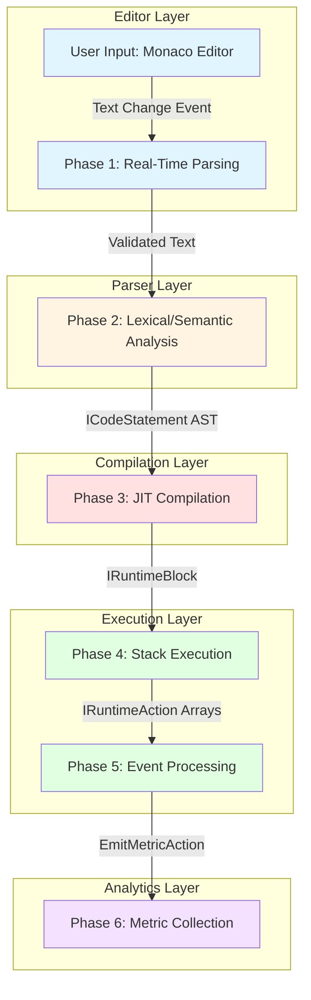
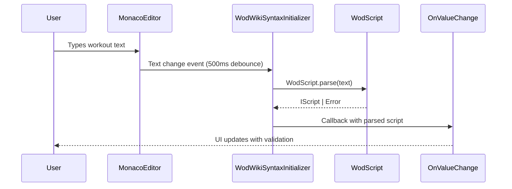
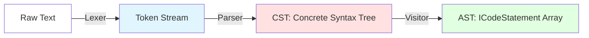
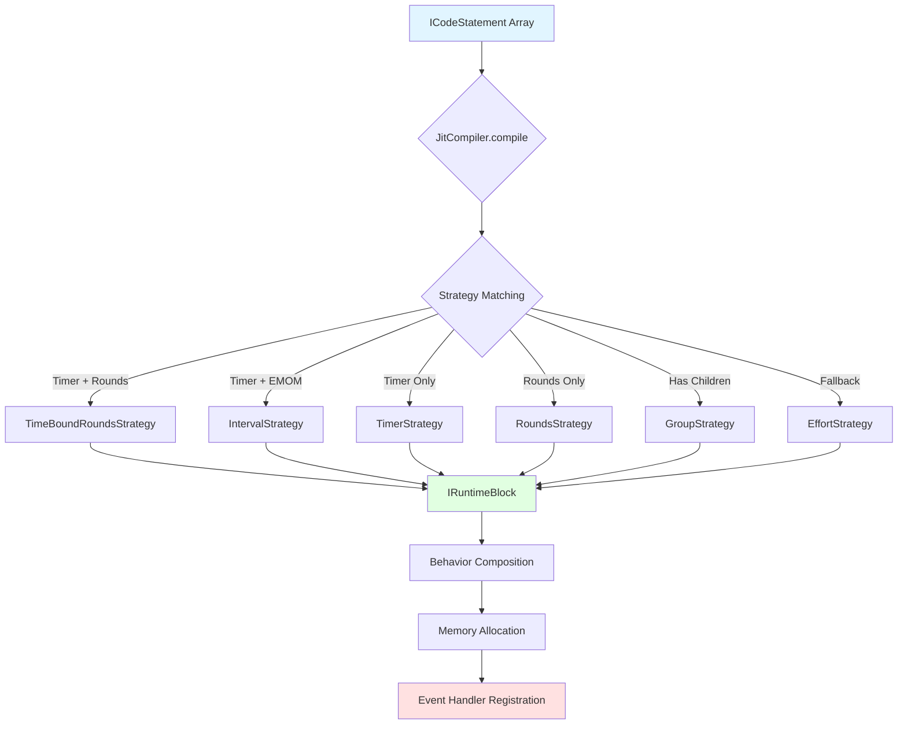
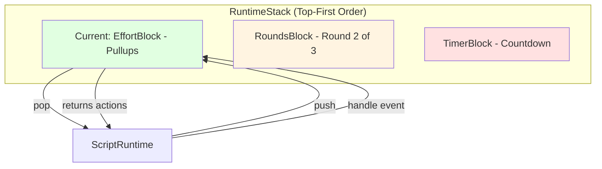
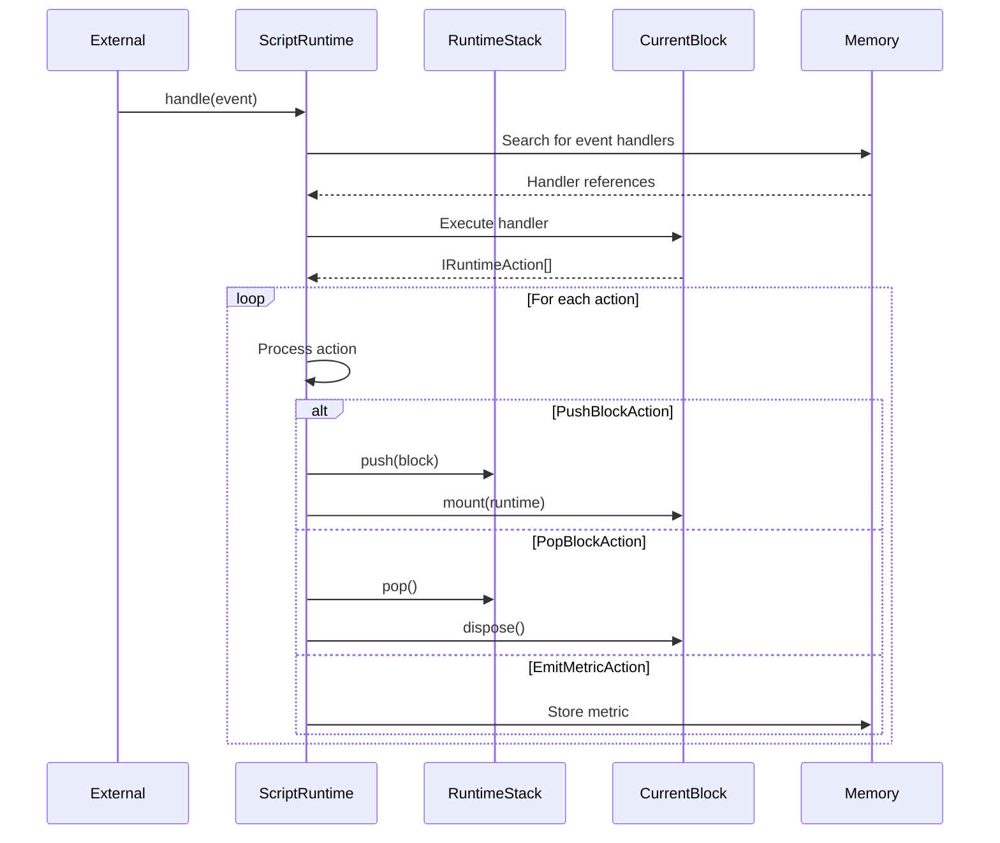
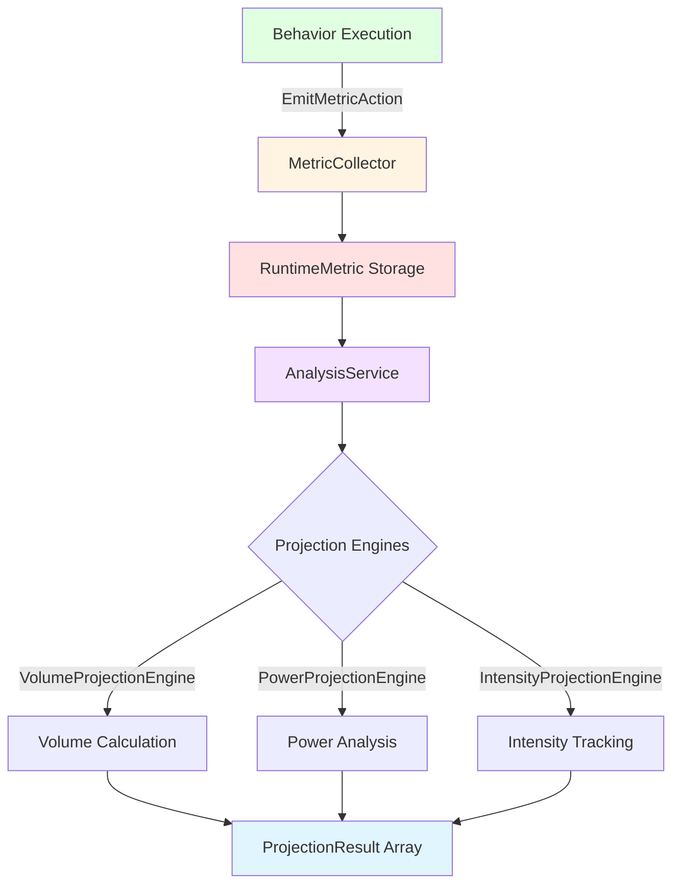
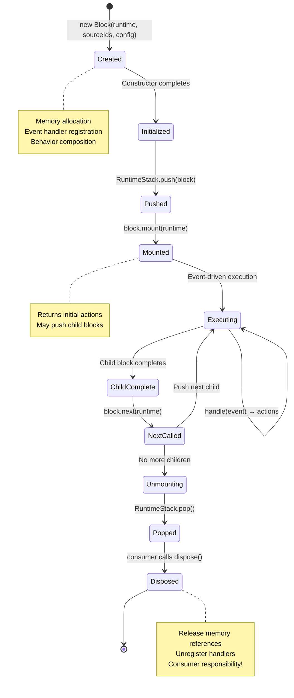
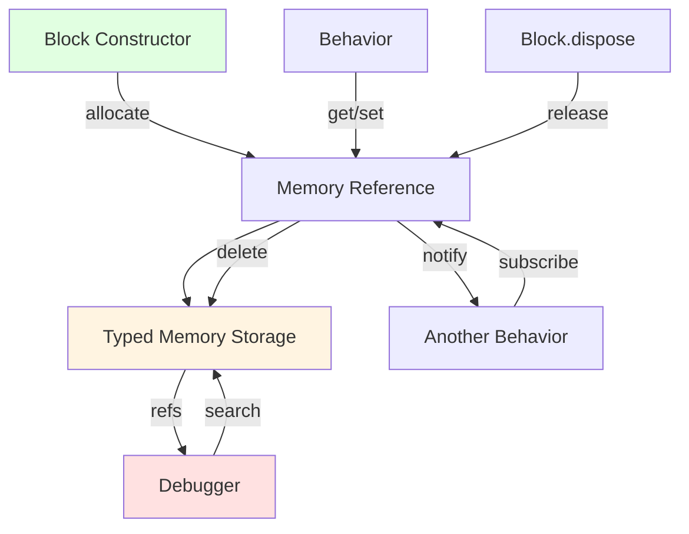

# WOD Wiki Architectural Overview

## Executive Summary

WOD Wiki implements a sophisticated six-phase transformation pipeline that converts human-readable workout markdown into executable runtime blocks with comprehensive performance analytics. This document maps the complete data flow from user input through to metric storage, detailing every interface boundary, lifecycle pattern, and architectural decision.

**Target Audience:** Experienced developers implementing features, debugging execution issues, or extending the compilation/runtime system.

**Related Documentation:**
- [Runtime Interfaces Deep Dive](./runtime-interfaces-deep-dive.md) - Detailed interface specifications
- [Runtime Strategies Implementation](./runtime-strategies-implementation.md) - Strategy pattern details
- [Runtime Execution Overview](./runtime-execution-overview.md) - Stack-based execution model
- [Syntax and Parser Overview](./syntax-and-parser-overview.md) - Parser architecture details

## Table of Contents

1. [Complete Data Flow Pipeline](#complete-data-flow-pipeline)
2. [Phase 1: Editor Input & Real-Time Parsing](#phase-1-editor-input--real-time-parsing)
3. [Phase 2: Lexical & Semantic Analysis](#phase-2-lexical--semantic-analysis)
4. [Phase 3: JIT Compilation & Strategy Selection](#phase-3-jit-compilation--strategy-selection)
5. [Phase 4: Stack-Based Execution](#phase-4-stack-based-execution)
6. [Phase 5: Event-Driven State Management](#phase-5-event-driven-state-management)
7. [Phase 6: Metric Collection & Analytics](#phase-6-metric-collection--analytics)
8. [Block Lifecycle Management](#block-lifecycle-management)
9. [Memory Management Architecture](#memory-management-architecture)
10. [Performance Characteristics](#performance-characteristics)
11. [Critical Implementation Patterns](#critical-implementation-patterns)

---

## Complete Data Flow Pipeline

The transformation from markdown to metrics occurs through six distinct phases with clear interface boundaries:



### Interface Boundaries

| Phase Transition | Input Interface | Output Interface | Key Files |
|-----------------|-----------------|------------------|-----------|
| Editor → Parser | `string` (markdown text) | `WodScript` | `src/editor/WodWiki.tsx`, `src/WodScript.ts` |
| Parser → AST | `Token[]` (Chevrotain) | `ICodeStatement[]` | `src/parser/timer.parser.ts`, `src/CodeStatement.ts` |
| AST → Compiler | `ICodeStatement[]` | `IRuntimeBlock \| undefined` | `src/runtime/JitCompiler.ts` |
| Compiler → Stack | `IRuntimeBlock` | `void` (pushed to stack) | `src/runtime/RuntimeStack.ts` |
| Stack → Execution | Stack state | `IRuntimeAction[]` | `src/runtime/ScriptRuntime.ts` |
| Execution → Metrics | `EmitMetricAction` | `RuntimeMetric[]` | `src/runtime/MetricCollector.ts` |

---

## Phase 1: Editor Input & Real-Time Parsing

### Component: WodWiki Editor

**Primary File:** `src/editor/WodWiki.tsx`

The WodWiki component wraps Monaco Editor with custom language registration, syntax highlighting, and real-time validation.



### Key Features

1. **Real-Time Parsing:** 500ms debounce prevents excessive parsing on rapid typing
2. **Syntax Highlighting:** Custom token types (duration, rep, resistance, distance, effort, rounds)
3. **Exercise Typeahead:** 873+ exercises with LRU cache (100 entries), 150ms debounce
4. **Error Positioning:** Inline error markers with line/column precision
5. **Hover Documentation:** Rich exercise metadata on hover

### Integration Points

```typescript
// src/editor/WodWiki.tsx
const initializer = new WodWikiSyntaxInitializer(
  new SemantcTokenEngine(tokens),      // Syntax highlighting
  new SuggestionEngine(service),        // Exercise typeahead
  onValueChange,                        // Parse result callback
  id,
  readonly
);

function handleMount(editor: editor.IStandaloneCodeEditor, monaco: Monaco) {
  editorRef.current = editor;
  monacoRef.current = monaco;
  initializer.handleMount(editor, monaco);
  
  // Auto-parse on content changes
  editor.onDidContentSizeChange(() => {
    handleContentSizeChange();
  });
}
```

### Performance Targets

- **Initial Load:** < 100ms for Monaco initialization
- **Parse Debounce:** 500ms after last keystroke
- **Typeahead Response:** < 10ms for cached results, < 50ms for searches
- **Syntax Highlighting:** Real-time (< 16ms per frame)

**Related:** [Exercise Typeahead Implementation Guide](./exercise-typeahead-implementation-guide.md)

---

## Phase 2: Lexical & Semantic Analysis

### Three-Phase Parsing System

The parser implements a comprehensive Chevrotain-based parsing pipeline:



### Phase 2A: Lexical Analysis

**Primary File:** `src/parser/timer.tokens.ts`

**20+ Token Types:**
- **Timer:** `:\d+` or `(\d+:){1,3}\d+` (supports days:hours:mins:secs)
- **Weight:** `\d+\s*(lb|kg|#)`
- **Distance:** `\d+\s*(m|km|mi|ft|yd)`
- **Number:** Integer values for reps
- **Identifier:** Exercise names and labels
- **GroupOpen/Close:** `(` and `)` for rounds
- **ActionOpen/Close:** `[:` and `]` for special actions
- **LapOperators:** `-` (round), `+` (compose), no prefix (repeat)

```typescript
// Token precedence example (more specific first)
export const Timer = createToken({
  name: "Timer",
  pattern: /:\d+|(?:\d+:){1,3}\d+/,
  longer_alt: Number  // Timer takes precedence over Number
});
```

### Phase 2B: Syntax Analysis

**Primary File:** `src/parser/timer.parser.ts`

**Grammar Rules (Chevrotain CST Parser):**

```typescript
// Top-level rule
wodMarkdown → (wodBlock Return)+

// Block structure
wodBlock → lap? (timer | rounds | effort | resistance | distance | reps | action)+

// Rounds syntax
rounds → GroupOpen (Identifier | sequence)+ GroupClose
sequence → (Number Minus)+  // e.g., 21-15-9

// Action syntax
action → ActionOpen Collon (Identifier | AllowedSymbol | Minus)+ ActionClose
```

**Example Parse:**
```
Input:  "20:00 AMRAP\n(21-15-9) Thrusters 95lb\nPullups"
Output: CST with timer, action, rounds, effort, resistance fragments
```

### Phase 2C: Semantic Transformation

**Primary File:** `src/parser/timer.visitor.ts`

The visitor transforms CST into semantic AST with hierarchical relationships:

```typescript
export class MdTimerInterpreter extends BaseCstVisitor {
  visit(cst: CstNode): ICodeStatement[] {
    // Transform CST → AST with:
    // - Fragment type identification
    // - Parent-child relationship linking
    // - Source metadata preservation (line, column, offset)
    // - Child grouping by lap operators
  }
}
```

**Child Grouping Algorithm:**

Consecutive `+` (compose) operators group children, others stay individual:

```
Input:  [-, +, +, repeat, +, -]
Output: [[1], [2,3], [4], [5], [6]]
```

This enables complex workout structures like:
```
- Round 1: Exercise A
+ Superset: Exercise B + Exercise C  (grouped)
- Round 2: Exercise D
```

### CodeStatement Structure

**Primary File:** `src/CodeStatement.ts`

```typescript
interface ICodeStatement {
  id: number;                      // Line number (1-indexed)
  parent?: number;                 // Parent statement ID
  children: number[][];            // Multi-dimensional child grouping
  fragments: ICodeFragment[];      // Timer, Rounds, Effort, etc.
  isLeaf?: boolean;                // Optimization flag
  meta: CodeMetadata;              // Source position tracking
}
```

**Fragment Types** (`src/fragments/`):
- `TimerFragment` - Duration parsing (days:hours:mins:secs → ms)
- `RoundsFragment` - Round grouping and sequencing
- `RepFragment` - Repetition counting
- `EffortFragment` - Exercise identification
- `ResistanceFragment` - Weight/load values
- `DistanceFragment` - Distance measurements
- `ActionFragment` - Special workout types (EMOM, AMRAP)
- `LapFragment` - Grouping operations (compose+, round-, repeat)

**Related:** [Syntax and Parser Overview](./syntax-and-parser-overview.md)

---

## Phase 3: JIT Compilation & Strategy Selection

### JitCompiler: Central Compilation Engine

**Primary File:** `src/runtime/JitCompiler.ts`

The compiler uses the Strategy Pattern to select appropriate runtime blocks based on statement characteristics.



### Strategy Precedence (CRITICAL)

Strategies are matched in **strict order** - first match wins:

```typescript
// src/runtime/JitCompiler.ts (registration order)
compiler.registerStrategy(new TimeBoundRoundsStrategy()); // 1. Most specific
compiler.registerStrategy(new IntervalStrategy());        // 2. EMOM workouts
compiler.registerStrategy(new TimerStrategy());           // 3. Time-bound
compiler.registerStrategy(new RoundsStrategy());          // 4. Multi-round
compiler.registerStrategy(new GroupStrategy());           // 5. Nested structure
compiler.registerStrategy(new EffortStrategy());          // 6. Fallback
```

### Strategy Interface

**Primary File:** `src/runtime/IRuntimeBlockStrategy.ts`

```typescript
interface IRuntimeBlockStrategy {
  match(statements: ICodeStatement[], runtime: IScriptRuntime): boolean;
  compile(statements: ICodeStatement[], runtime: IScriptRuntime, context?: CompilationContext): IRuntimeBlock;
}
```

### Example Strategy: TimerStrategy

**Primary File:** `src/runtime/strategies.ts`

```typescript
export class TimerStrategy implements IRuntimeBlockStrategy {
  match(code: ICodeStatement[], _runtime: IScriptRuntime): boolean {
    // Match if ANY statement has Timer fragment
    return code.some(stmt => 
      stmt.fragments.some(frag => frag.type === FragmentType.Timer)
    );
  }

  compile(code: ICodeStatement[], runtime: IScriptRuntime, context?: CompilationContext): IRuntimeBlock {
    // Extract timer duration from fragment
    const timerFragment = code[0].fragments.find(
      f => f.type === FragmentType.Timer
    ) as TimerFragment;
    
    const durationMs = timerFragment.milliseconds;
    const direction = context?.timerDirection ?? 'up';
    
    // Create TimerBlock with TimerBehavior + CompletionBehavior
    return new TimerBlock(runtime, code.map(c => c.id), {
      direction,
      durationMs,
      children: undefined  // TODO: Add child support
    });
  }
}
```

### Compilation Context

**Primary File:** `src/runtime/CompilationContext.ts`

Context flows from parent blocks to children during compilation:

```typescript
interface CompilationContext {
  exerciseId?: string;           // Exercise identifier for metrics
  reps?: number;                 // Inherited rep count
  round?: number;                // Current round number (0-indexed)
  totalRounds?: number;          // Total rounds in workout
  intervalDurationMs?: number;   // Interval duration for EMOM
  timerDirection?: 'up' | 'down';
}
```

**Related:** [Runtime Strategies Implementation](./runtime-strategies-implementation.md)

---

## Phase 4: Stack-Based Execution

### RuntimeStack: High-Performance Execution Environment

**Primary File:** `src/runtime/RuntimeStack.ts`



### Stack Operations

```typescript
class RuntimeStack {
  readonly blocks: readonly IRuntimeBlock[];  // Top-first (index 0 = current)
  readonly current: IRuntimeBlock | undefined;
  
  push(block: IRuntimeBlock): void;    // Simple push, no lifecycle calls
  pop(): IRuntimeBlock | undefined;    // Simple pop, returns block
  graph(): IRuntimeBlock[];            // Visualization (bottom-first)
}
```

**Design Philosophy:**
- **Simple Operations:** Stack only manages order, no lifecycle management
- **Consumer Responsibility:** Caller must invoke `mount()`, `unmount()`, `dispose()`
- **Immutable Access:** `blocks` is readonly to prevent corruption

### Performance Targets

- **push/pop:** < 1ms (instant transitions)
- **current() access:** < 0.1ms (frequent queries)
- **graph() generation:** < 5ms (debugging only)

---

## Phase 5: Event-Driven State Management

### ScriptRuntime: Central Orchestrator

**Primary File:** `src/runtime/ScriptRuntime.ts`



### Event Handler Registry

All event handlers are stored in memory as references:

```typescript
// Register handler in block constructor
this.context.registerHandler('timer:tick', (event) => {
  // Handle tick event
  const elapsed = this.timerBehavior.getElapsedMs();
  return [new EmitMetricAction(...)];
});

// Runtime searches for handlers by event type
const handlers = runtime.memory.search({
  type: 'handler',
  // Additional criteria
});
```

### Action Types

**Primary Files:** `src/runtime/actions/`

1. **PushBlockAction:** Push new block to stack
2. **PopBlockAction:** Remove current block from stack
3. **EmitMetricAction:** Emit performance metric
4. **ErrorAction:** Record runtime error
5. **UpdateMemoryAction:** Modify memory value

---

## Phase 6: Metric Collection & Analytics

### MetricCollector: Analytics Subsystem

**Primary File:** `src/runtime/MetricCollector.ts`



### RuntimeMetric Structure

**Primary File:** `src/runtime/RuntimeMetric.ts`

```typescript
interface RuntimeMetric {
  exerciseId: string;           // Exercise identifier from statement
  values: MetricValue[];        // Performance metrics
  timeSpans: TimeSpan[];        // Temporal tracking
}

type MetricValue = {
  type: "repetitions" | "resistance" | "distance" | "timestamp" | 
        "rounds" | "time" | "calories" | "action" | "effort";
  value: number | undefined;
  unit: string;
}

interface TimeSpan {
  start: Date;
  stop: Date;
}
```

### Metric Emission Pattern

```typescript
// In behavior (e.g., RoundsBehavior)
onNext(runtime: IScriptRuntime, block: IRuntimeBlock): IRuntimeAction[] {
  const metric: RuntimeMetric = {
    exerciseId: this.context.exerciseId,
    values: [
      { type: 'repetitions', value: 21, unit: 'reps' },
      { type: 'resistance', value: 95, unit: 'lb' }
    ],
    timeSpans: [
      { start: this.startTime, stop: new Date() }
    ]
  };
  
  return [new EmitMetricAction(metric)];
}
```

**Related:** [Analytics State and Capabilities](./analytics-state-and-capabilities.md)

---

## Block Lifecycle Management

### Complete Lifecycle Pattern



### Critical Pattern: Constructor-Based Initialization

**CORRECT Implementation:**

```typescript
class MyBlock implements IRuntimeBlock {
  private timerRef: TypedMemoryReference<number>;
  
  constructor(runtime: IScriptRuntime, sourceIds: number[], config: Config) {
    this.context = new BlockContext(runtime, this.key.toString());
    
    // ✅ Allocate memory in constructor
    this.timerRef = this.context.memory.allocate<number>(
      'timer', 
      this.key.toString(), 
      0
    );
    
    // ✅ Register event handlers in constructor
    this.context.registerHandler('tick', (event) => {
      return [/* actions */];
    });
  }
  
  mount(runtime: IScriptRuntime): IRuntimeAction[] {
    // ✅ Return initial actions only
    return [new PushAction(childBlock)];
  }
  
  dispose(): void {
    // ✅ Release all memory
    this.context.memory.release(this.timerRef);
  }
}
```

**INCORRECT Implementation:**

```typescript
// ❌ WRONG: Initializing during mount
mount(runtime: IScriptRuntime): IRuntimeAction[] {
  this.timerRef = runtime.memory.allocate(...); // TOO LATE!
  return [];
}

// ❌ WRONG: Not disposing memory
const block = stack.pop();
// Memory leak - never called dispose()!
```

### Consumer Disposal Pattern

**CORRECT:**

```typescript
// Consumer (e.g., ScriptRuntime) is responsible for disposal
const block = stack.pop();
if (block) {
  block.dispose();  // ✅ Consumer calls dispose
}
```

---

## Memory Management Architecture

### IRuntimeMemory: Independent State System

**Primary File:** `src/runtime/RuntimeMemory.ts`

Memory is **separate from execution flow** to enable debugging without affecting runtime.



### Memory Operations

```typescript
interface IRuntimeMemory {
  // Type-safe allocation
  allocate<T>(
    type: string, 
    ownerId: string, 
    initialValue?: T, 
    visibility?: 'public' | 'private'
  ): TypedMemoryReference<T>;
  
  // Reference-based access
  get<T>(reference: TypedMemoryReference<T>): T | undefined;
  set<T>(reference: TypedMemoryReference<T>, value: T): void;
  
  // Subscription pattern
  subscribe<T>(reference: TypedMemoryReference<T>, callback: (value: T) => void): void;
  
  // Search by criteria
  search(criteria: MemorySearchCriteria): IMemoryReference[];
  
  // Manual cleanup
  release(reference: IMemoryReference): void;
}
```

### Memory Types

**Primary File:** `src/runtime/MemoryTypeEnum.ts`

Predefined memory types for common runtime needs:

```typescript
export const MemoryTypeEnum = {
  TIMER_TIME_SPANS: 'timer:timeSpans',        // TimeSpan[] for timer tracking
  TIMER_IS_RUNNING: 'timer:isRunning',        // boolean for timer state
  ROUNDS_STATE: 'rounds:state',                // RoundsState for loop tracking
  METRIC_REPS: 'metric:reps',                  // number for rep inheritance (public)
  HANDLER: 'handler',                           // Event handler references
} as const;
```

### Visibility Controls

- **public:** Accessible to all blocks (e.g., inherited reps)
- **private:** Accessible only to owner (default)

---

## Performance Characteristics

### Critical Path Performance Targets

| Operation | Target | Current | File |
|-----------|--------|---------|------|
| Stack push/pop | < 1ms | ~0.5ms | `RuntimeStack.ts` |
| current() access | < 0.1ms | ~0.05ms | `RuntimeStack.ts` |
| Memory allocate | < 0.5ms | ~0.3ms | `RuntimeMemory.ts` |
| Memory get/set | < 0.1ms | ~0.05ms | `RuntimeMemory.ts` |
| dispose() | < 50ms | ~10ms | `IRuntimeBlock.ts` |
| Parse time | < 100ms | ~30ms | `WodScript.ts` |
| Compile time | < 100ms | ~20ms | `JitCompiler.ts` |

### Memory Usage

- **Average workout:** ~500KB (parsed + runtime state)
- **Large workout (1000+ statements):** ~5MB
- **Memory leak risk:** Medium (manual disposal required)

### Optimization Strategies

1. **Constructor-based init:** Minimizes runtime allocation overhead
2. **Reference-based memory:** Prevents unnecessary copying
3. **Readonly stack access:** Prevents accidental mutations
4. **Event handler registry:** Unified lookup instead of per-block handlers

---

## Critical Implementation Patterns

### Pattern 1: Strategy Matching Precedence

Always register strategies from most specific to least specific:

```typescript
// ✅ CORRECT: Specific strategies first
compiler.registerStrategy(new TimeBoundRoundsStrategy()); // Timer + Rounds
compiler.registerStrategy(new TimerStrategy());           // Timer only

// ❌ WRONG: General strategies first will match everything
compiler.registerStrategy(new TimerStrategy());           // Catches all timers!
compiler.registerStrategy(new TimeBoundRoundsStrategy()); // Never matched
```

### Pattern 2: Memory Allocation in Constructors

```typescript
// ✅ CORRECT: Allocate in constructor
constructor(runtime, sourceIds, config) {
  this.ref = runtime.memory.allocate('type', ownerId, value);
}

// ❌ WRONG: Allocate in mount
mount(runtime) {
  this.ref = runtime.memory.allocate(...); // Too late!
}
```

### Pattern 3: Consumer-Managed Disposal

```typescript
// ✅ CORRECT: Consumer calls dispose
const block = stack.pop();
if (block) {
  block.dispose();
}

// ❌ WRONG: Assuming automatic cleanup
stack.pop(); // Memory leak!
```

### Pattern 4: Action-Based State Changes

```typescript
// ✅ CORRECT: Return actions
onNext(runtime, block): IRuntimeAction[] {
  return [
    new PushBlockAction(childBlock),
    new EmitMetricAction(metric)
  ];
}

// ❌ WRONG: Direct state modification
onNext(runtime, block) {
  runtime.stack.push(childBlock); // Violates immutability!
}
```

---

## Related Documentation

- **[Syntax and Parser Overview](./syntax-and-parser-overview.md)** - Deep dive into parsing system
- **[Runtime Execution Overview](./runtime-execution-overview.md)** - Stack-based execution details
- **[Analytics State and Capabilities](./analytics-state-and-capabilities.md)** - Metric collection system
- **[Vision and Missing Elements](./vision-and-missing-elements.md)** - Implementation gaps and roadmap
- **[Runtime Interfaces Deep Dive](./runtime-interfaces-deep-dive.md)** - Comprehensive interface specifications

---

**Document Status:** Complete  
**Last Updated:** November 3, 2025  
**Maintainer:** WOD Wiki Core Team
