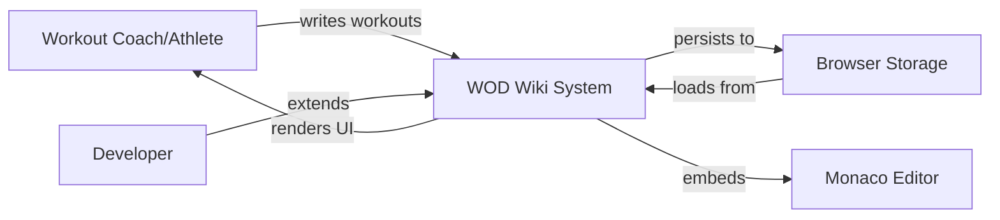

# Context and Scope

> **Status**: Draft
> **Last Updated**: 2026-02-14
> **Category**: Architecture Documentation
> **arc42 Section**: 1

## Business Context

### Purpose

WOD Wiki enables users to:

1. **Write** workout definitions using a specialized syntax
2. **Parse** workout scripts into structured data
3. **Execute** workouts with a stack-based runtime
4. **Track** metrics and performance data
5. **Visualize** workout structure and progress

### Problem Statement

Traditional workout tracking systems suffer from:

- **Rigid Structure**: Pre-defined workout templates only
- **Limited Expressiveness**: Cannot describe complex workout patterns
- **Poor Developer Experience**: No tooling or IDE support
- **Manual Tracking**: Users must log metrics manually

### Solution

WOD Wiki provides:

- **Flexible Syntax**: Describe any workout pattern
- **Smart Editor**: Monaco integration with autocomplete and syntax highlighting
- **Automated Execution**: Runtime engine handles workout flow
- **Metric Collection**: Automatic tracking of time, reps, and load
- **Component Library**: Reusable React components for workout UI

## System Context

### C4 Level 1: System Context Diagram

```
                    ┌─────────────────┐
                    │  Workout Coach  │
                    │    (Person)     │
                    └────────┬────────┘
                             │
                             │ writes/edits
                             │ workouts
                             ▼
       ┌──────────────────────────────────────┐
       │         WOD Wiki System              │
       │                                      │
       │  • Workout Script Editor             │
       │  • Parser & Compiler                 │
       │  • Runtime Engine                    │
       │  • Metrics Collection                │
       └──────────┬───────────────────────────┘
                  │
                  │ stores metrics
                  ▼
       ┌──────────────────────┐
       │   Browser Storage    │
       │   (LocalStorage)     │
       └──────────────────────┘
```

### External Entities

#### Users

**Workout Coaches & Athletes**
- **Uses**: Create and execute workout definitions
- **Inputs**: Workout scripts in WOD syntax
- **Outputs**: Executed workouts with metrics
- **Interface**: React UI with Monaco Editor

**Developers & Contributors**
- **Uses**: Extend system with new features
- **Inputs**: TypeScript code, tests, documentation
- **Outputs**: New behaviors, strategies, fragments
- **Interface**: Source code, Storybook, test harness

#### External Systems

**Browser Storage (LocalStorage)**
- **Purpose**: Persist workout history and user preferences
- **Interface**: Web Storage API
- **Data**: JSON-serialized workout results and settings

**Monaco Editor (Library)**
- **Purpose**: Code editing experience
- **Interface**: React component wrapper
- **Data**: Workout scripts as text

**Chevrotain (Library)**
- **Purpose**: Parser generation
- **Interface**: Lexer and Parser classes
- **Data**: Token stream and CST

## Business Context Diagram



## Technical Context

### Technology Stack

| Component | Technology | Version | Purpose |
|-----------|-----------|---------|---------|
| Language | TypeScript | 5.x | Type-safe development |
| UI Framework | React | 18.x | Component rendering |
| Parser | Chevrotain | 11.x | Syntax analysis |
| Editor | Monaco Editor | Latest | Code editing |
| Styling | Tailwind CSS | 3.x | Utility-first CSS |
| Testing | Bun Test | Latest | Test execution |
| Build | Bun | Latest | Package management |

### Communication Channels

#### Internal Communication

**Parser → Compiler**
- **Format**: `ICodeStatement[]` (TypeScript interfaces)
- **Protocol**: Direct function calls
- **Data**: AST nodes with workout structure

**Compiler → Runtime**
- **Format**: `IRuntimeBlock` instances
- **Protocol**: Stack operations (`push`/`pop`)
- **Data**: Executable blocks with behaviors

**Runtime → UI**
- **Format**: `ICodeFragment[]` (memory locations)
- **Protocol**: React state and subscriptions
- **Data**: Display fragments and metrics

#### External Communication

**UI ↔ LocalStorage**
- **Format**: JSON
- **Protocol**: Web Storage API
- **Data**: Workout history, user preferences

**Editor ↔ Monaco**
- **Format**: Plain text
- **Protocol**: Component props and events
- **Data**: Workout script content

## Interfaces

### Public API

WOD Wiki exposes the following public interfaces:

#### React Components

```typescript
// Main editor component
<WodWiki
  initialContent={string}
  onChange={(content: string) => void}
  onParse={(statements: ICodeStatement[]) => void}
/>

// Runtime visualization
<RuntimeTestBench
  script={string}
  onComplete={(results: WorkoutResults) => void}
/>
```

#### Parser API

```typescript
import { parseWorkoutScript } from 'wod-wiki/parser';

const statements: ICodeStatement[] = parseWorkoutScript(script);
```

#### Runtime API

```typescript
import { RuntimeStack, JitCompiler } from 'wod-wiki/runtime';

const compiler = new JitCompiler();
const runtime = new RuntimeStack();

compiler.compile(statements, runtime);
runtime.current().mount();
```

### Internal Interfaces

Key internal contracts:

- **`IRuntimeBlock`**: Block lifecycle and state management
- **`IRuntimeBehavior`**: Composable behavior units
- **`IBehaviorContext`**: Runtime environment access
- **`ICodeFragment`**: Typed data structures
- **`IRuntimeBlockStrategy`**: Compiler strategies

See [API Reference](../api/) for detailed documentation.

## Scope

### In Scope

**Core Features**
- ✅ Workout script parsing
- ✅ JIT compilation
- ✅ Stack-based runtime execution
- ✅ Metric collection (time, reps, load)
- ✅ Monaco Editor integration
- ✅ Syntax highlighting and autocomplete
- ✅ Fragment visualization
- ✅ Test harness for behaviors

**Workout Types**
- ✅ For Time
- ✅ AMRAP (As Many Rounds As Possible)
- ✅ EMOM (Every Minute On the Minute)
- ✅ Tabata intervals
- ✅ Custom timers and rep schemes

### Out of Scope

**Not Implemented**
- ❌ Backend API for workout storage
- ❌ User authentication and accounts
- ❌ Social features (sharing, leaderboards)
- ❌ Mobile native applications
- ❌ Offline-first PWA capabilities
- ❌ Video/audio recording
- ❌ AI-powered workout generation
- ❌ Wearable device integration

### Future Considerations

**Potential Extensions**
- 📋 Cloud storage for workout library
- 📋 Collaborative editing features
- 📋 Advanced analytics and reports
- 📋 Integration with fitness platforms
- 📋 Template marketplace

## Dependencies

### Runtime Dependencies

```json
{
  "react": "^18.0.0",
  "react-dom": "^18.0.0",
  "@monaco-editor/react": "^4.6.0",
  "chevrotain": "^11.0.3",
  "tailwindcss": "^3.4.0"
}
```

### Development Dependencies

```json
{
  "typescript": "^5.3.0",
  "bun-types": "latest",
  "@types/react": "^18.0.0",
  "storybook": "^8.0.0"
}
```

### System Requirements

**Browser Support**
- Chrome/Edge 90+
- Firefox 88+
- Safari 15+
- No IE11 support

**JavaScript Features Required**
- ES2020+ (Promise.allSettled, optional chaining, nullish coalescing)
- ES Modules
- Local Storage API

## Assumptions

1. **Browser Environment**: System runs exclusively in modern web browsers
2. **Client-Side Only**: No server-side rendering or execution
3. **LocalStorage Available**: Browser storage is accessible and sufficient
4. **Modern JavaScript**: No transpilation for legacy browsers
5. **React Ecosystem**: Users are familiar with React patterns

## Constraints

### Technical Constraints

| Constraint | Description | Impact |
|------------|-------------|--------|
| Browser-Only | No Node.js runtime support | Cannot run workouts server-side |
| No Build Output | Library mode not configured | Cannot be imported as npm package |
| Tailwind Only | No custom CSS allowed | Limited styling flexibility |
| TypeScript Strict | Strict type checking enabled | Higher development overhead |

### Organizational Constraints

| Constraint | Description | Impact |
|------------|-------------|--------|
| Open Source | MIT License | Public visibility of all code |
| GitHub-Hosted | Repository on GitHub | Limited to GitHub features |
| Self-Maintained | No dedicated team | Slower feature development |

### Conventions

- **Code Style**: TypeScript strict mode, no ESLint
- **Testing**: Bun Test with co-located test files
- **Documentation**: Markdown in `/docs` directory
- **Versioning**: Semantic versioning (semver)
- **Branch Strategy**: Feature branches with PR reviews

## Quality Goals

| Quality Attribute | Importance | Description |
|------------------|------------|-------------|
| **Performance** | High | Stack operations < 1ms, compilation < 100ms |
| **Type Safety** | High | Full TypeScript coverage, strict mode |
| **Testability** | High | Isolated behaviors, test harness support |
| **Extensibility** | High | Plugin-based strategies, composable behaviors |
| **Maintainability** | Medium | Clear patterns, documented architecture |
| **Usability** | Medium | Good developer experience, clear APIs |

## Risks and Technical Debt

### Current Risks

1. **No Package Build**: Library cannot be consumed as npm package
2. **TypeScript Errors**: 369 existing type errors in codebase
3. **Memory Leaks**: Improper disposal can cause memory leaks
4. **Performance**: Large workouts may cause UI lag

### Technical Debt

- Dual-write migration (Map-based → list-based memory) incomplete
- Some behaviors not yet migrated to new memory API
- Legacy patterns still exist in older code
- Test coverage gaps in certain areas

## Related Documentation

- [Solution Strategy](./02-solution-strategy.md) - Design decisions
- [Building Blocks](./03-building-blocks.md) - System components
- [Deployment View](./05-deployment-view.md) - Infrastructure
- [ADRs](../adr/) - Architecture decisions

---

**Previous**: [← Introduction](./00-introduction.md) | **Next**: [Solution Strategy →](./02-solution-strategy.md)
