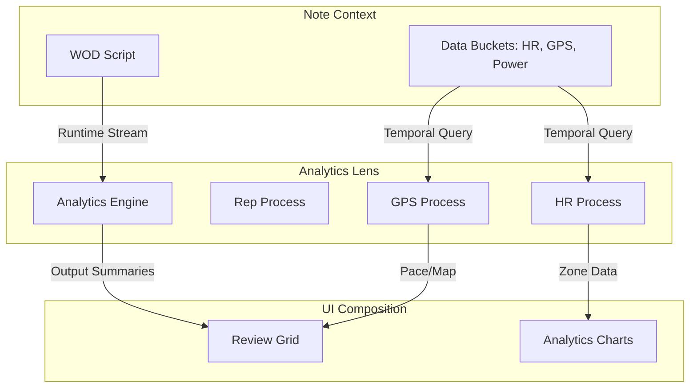

# Workout Analytics System Review

This document describes how the WOD Wiki analytics system operates, how data flows from the parser to the final review, and how we manage the separation between raw execution data and derived metrics.

## 1. System Architecture

The analytics system follows an **Interceptor and Observer pattern**. It sits on top of the `ScriptRuntime` and listens to the stream of `OutputStatement`s generated during a workout.

### Core Components

| Component | Responsibility |
| :--- | :--- |
| **`ScriptRuntime`** | The execution engine. It emits "Raw" `OutputStatement`s (Segments, Events, System) as blocks unmount. |
| **`AnalyticsEngine`** | Orchestrates multiple `IAnalyticsProcess` instances. It passes every emitted statement through these processes. |
| **`IAnalyticsProcess`** | Granular logic units (e.g., `RepAnalyticsProcess`) that track specific metrics. |
| **`OutputStatement`** | The universal data carrier. It contains `Fragments` (Reps, Distance, Time, Effort) which the analytics engine inspects. |

---

## 2. Data Workflow

### A. Generation (Real-Time)
1. **Parser/Compiler**: Fragments are defined in the script (e.g., `10 Reps`, `Hard Effort`).
2. **Runtime Execution**: When a block (like an exercise) finishes, the `ScriptRuntime` creates an `OutputStatement` of type `segment`.
3. **Interception**: `Runtime.addOutput(output)` is called. Before any listeners are notified, the statement is passed to `AnalyticsEngine.run(output)`.
4. **Accumulation**: Each process (Rep, Weight, etc.) looks for relevant fragments in the statement. If it find a match, it updates its internal counters (e.g., `totalReps += segmentReps`).

### B. Finalization (End of Workout)
1. **Dispose**: When the workout ends (or `Runtime.dispose()` is called), the `AnalyticsEngine.finalize()` method is triggered.
2. **Summary Generation**: Each process generates new `OutputStatement`s of type `analytics`. These contain the calculated totals and averages (e.g., "Total Weight: 5000kg", "Reps per Second: 0.5").
3. **Injection**: These summary statements are injected back into the runtime's output stream, appearing at the very end of the log.

---

## 3. Data Accessibility

| Phase | Access Point | Data Available |
| :--- | :--- | :--- |
| **In-Flight** | `Runtime.subscribeToOutput()` | Real-time stream of segments as they complete. Analytics processes have updated their internal state but haven't emitted summaries yet. |
| **Post-Workout** | `Runtime.getOutputStatements()` | The full flat list containing both **Raw Segments** and **Final Analytics Summaries**. |
| **UI Rendering** | `AnalyticsTransformer` | Converts the flat list of statements into `Segments` and `DataPoints` for charts and grids. |

---

## 4. Multi-Source Data Lens Architecture

The analytics system is evolving from a simple runtime observer into a **Multi-Source Data Lens**. This lens acts as a processing layer that correlates the workout "Ground Truth" (segments, reps, weight) with **External Data Buckets** stored alongside the workout note.

### A. External Data Buckets (Blobs)

Workouts often include high-frequency time-series data that shouldn't be stored in the main script text. These are handled as **Note Attachments**:

| Data Type | Source | Storage Format | Purpose |
| :--- | :--- | :--- | :--- |
| **Biometric** | Heart Rate Monitor | Time-indexed JSON/CSV Blob | HR Average, Recovery Rate, Zone Analysis |
| **Geospatial** | GPS (Phone/Watch) | GPX / Time-indexed JSON Blob | Actual Distance, Pace, Elevation Gain |
| **Environmental** | Weather/Sensor | Metadata Blob | Correlation with performance |

### B. Temporal Alignment (The Query Logic)

The "Lens" uses **Effective Date-Time** as the join key. When an analytics process (e.g., `HREfficiencyProcess`) runs, it performs a temporal lookup:

1. **Segment Identification**: The process receives an `OutputStatement` (e.g., "Run 400m") with a `TimeSpan` (Start: 10:00:05, End: 10:02:15).
2. **External Query**: The process queries the relevant Data Bucket for all samples where `timestamp` is between `10:00:05` and `10:02:15`.
3. **Derived Metric**: 
   - It calculates the **Average HR** for that specific segment.
   - It compares **GPS Distance** vs. **Script Distance**.
4. **Injection**: The process adds a `MetricFragment` to the `AnalyticsOverlay` for that segment (e.g., `type: 'avg_hr', value: 165`).

---

## 5. Implementation: The "Lens" Workflow

The UI remains clean because it overlays these independent streams:

### Key Advantages

1. **Reprocessable**: You can upload HR data *after* the workout is finished, and the analytics will automatically update the "Lens" view.
2. **Immutable Ground Truth**: The original script and execution logs are never modified by the external data analysis.
3. **Pluggable**: New data sources (e.g., Power Meters, Blood Oxygen) can be added by implementing a new `IAnalyticsProcess` that knows how to query that specific blob type.

## 6. Current Implementation: Granular Metrics

The system currently employs granular processes to ensure logic isolation for internal runtime data:

- **`RepAnalyticsProcess`**:
  - Values: `total_reps`, `effort_reps`, `reps_per_second`.
- **`DistanceAnalyticsProcess`**:
  - Values: `total_distance`, `effort_distance`, `distance_per_second`.
- **`WeightAnalyticsProcess`**:
  - Values: `total_weight` (Volume: Reps * Resistance), `effort_weight`, `weight_per_second`.

Each value is accessible via `FragmentType.Metric` on statements where `outputType === 'analytics'`.
