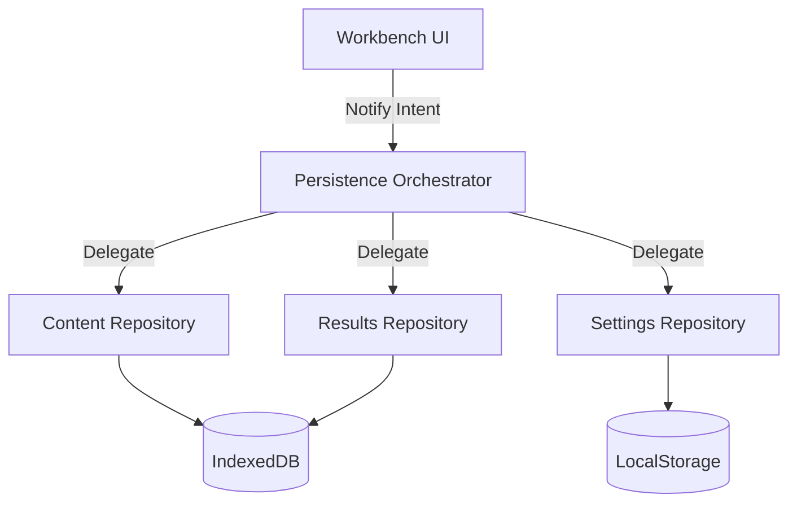

# Unified Persistence Strategy

This document outlines the architectural strategy for handling data persistence across the WOD Wiki system. It uses the C4 Model approach to describe the structural decoupling between UI notification and storage implementation.

## 1. Context: The Persistence Problem

Currently, persistence is fragmented across:
*   **WorkbenchContext**: Manages auto-save loops for Markdown and patches WorkoutResults.
*   **IContentProvider**: An abstraction for History entries (LocalStorage, Static, or IndexedDB).
*   **IndexedDBService**: Direct low-level access for results and section history.

**Goal:** The Workbench should not care *how* data is saved. It should only emit intent ("Content Changed", "Workout Completed") and let a dedicated persistence layer handle the complexity of storage, syncing, and conflict resolution.

---

## 2. Container: The Persistence Orchestrator

### The "Notify-Only" Contract
The Workbench interacts with persistence via a high-level Orchestrator using an **Event-Driven Intent** pattern:

| Action | Payload | Orchestrator Responsibility |
| :--- | :--- | :--- |
| `onContentChange` | `entryId, rawContent` | Debounce, validate, and update the Content Repository. |
| `onWorkoutComplete` | `entryId, sectionId, results` | Wrap results in a `WorkoutResult` entity and commit to Results Repository. |
| `onUserOverride` | `blockKey, fragmentType, value` | Update the Section History / User Input Repository. |

---

## 3. Component: Repository Layer

Each type of content is managed by a specific Repository that implements a standard interface.

### A. Content Repository (Markdown Source)
*   **Entity:** `Note` / `Script`
*   **Backends:** IndexedDB (Production), Static Files (Storybook), GitHub Gist (Future).
*   **Behavior:** Handles versioning of the raw source text.

### B. Results Repository (Execution History)
*   **Entity:** `WorkoutResult`
*   **Backends:** IndexedDB.
*   **Behavior:** Stores immutable records of completed workouts mapped to specific sections.

### C. User-Override Repository (Analytics Corrections)
*   **Entity:** `SectionHistory`
*   **Backends:** IndexedDB.
*   **Behavior:** Stores "Ground Truth" values provided by the user that override runtime-recorded data.

---

## 4. Implementation Plan (Code-Level)

### Step 1: Define `IPersistenceOrchestrator`
Create a central hook or service that the `WorkbenchContext` consumes. This removes `IndexedDBService` and `IContentProvider` calls from the UI components.

### Step 2: Extract Repositories
Move the logic from `WorkbenchContext` (like `completeWorkout` auto-save) into standalone Repository classes.

### Step 3: Standardize the ID Strategy
Ensure that `noteId` and `sectionId` are consistent across all repositories to allow for effortless joining of data (e.g., matching a `WorkoutResult` to a specific version of a `Note`).

---

## 5. Benefits

1.  **UI Portability:** The Workbench can run in a "No-DB" mode (Storybook) by simply swapping the Orchestrator's repositories for mock versions.
2.  **Robustness:** Auto-save logic, retry logic, and offline syncing live in one place, not scattered across React effects.
3.  **Auditability:** Every persistence action is a clear "Intent" that can be logged or intercepted for debugging.
