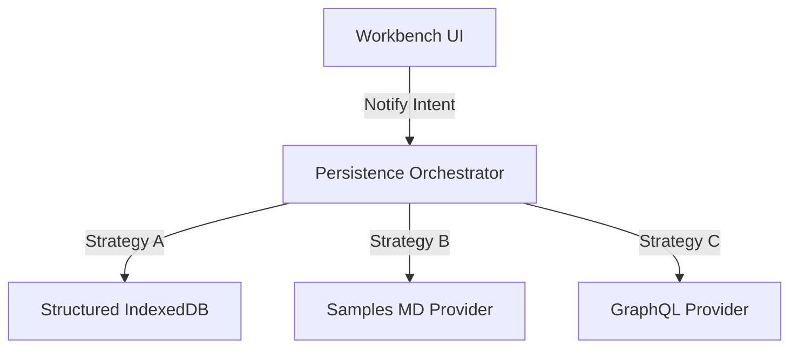

# Unified Persistence Strategy

This document outlines the architectural strategy for handling data persistence across the WOD Wiki system. It uses the C4 Model approach to describe the structural decoupling between UI notification and storage implementation.

## 1. Context: The Persistence Problem

Currently, persistence is fragmented across:
*   **WorkbenchContext**: Manages auto-save loops for Markdown and patches WorkoutResults.
*   **IContentProvider**: An abstraction for History entries (LocalStorage, Static, or IndexedDB).
*   **IndexedDBService**: Direct low-level access for results and section history.

**Goal:** The Workbench should not care *how* data is saved. It should only emit intent ("Content Changed", "Workout Completed") and let a dedicated persistence layer handle the complexity of storage, syncing, and conflict resolution.

---

## 2. Container: The Persistence Orchestrator



### The "Notify-Only" Contract
The Workbench interacts with persistence via a high-level Orchestrator using an **Event-Driven Intent** pattern:

| Action | Payload | Orchestrator Responsibility |
| :--- | :--- | :--- |
| `onContentChange` | `entryId, rawContent` | Debounce, validate, and update the Note source. |
| `onWorkoutComplete` | `entryId, segmentId, results` | Record a **Segment** (type: Run) and its **Results**. |
| `onUserOverride` | `resultId, value` | Record a user-correction for a specific Result fragment. |

---

## 3. Data Providers (The "How")

### 3-Layer Hierarchy
All providers follow a simplified 3-layer model where a **Run** is treated as a specialized **Segment**:

1.  **Notes**: The Markdown documents (the containers).
2.  **Segments**: 
    *   *Definitions*: Parsed workout blocks identified within a Note (e.g. "Murph").
    *   *Runs*: Specific execution instances of a definition (e.g. "Murph on Monday").
3.  **Results**: The granular fragments/logs produced during a Run (Timestamps, Reps, splits).

### A. Default IndexedDB (Structured)
The primary local-first storage mode. 
*   **Notes Table**: Stores the raw Markdown and metadata.
*   **Segments Table**: Stores both block definitions (versioned) and run metadata.
*   **Results Table**: Stores the immutable fragment logs linked to a "Run" segment.

### B. Samples MD Source (Volatile)
Used for Storybook and demos. 
*   **Source**: Loads from static `.md` files.
*   **Persistence**: **In-Memory Only**.
*   **Behavior**: Workouts can be executed, and segments/results are generated in page memory. Refreshing wipes the history, keeping the sample source pristine.

### C. GraphQL Provider (Synchronized)
A remote-first provider that persists to a backend service.

#### **GraphQL Schema Design**

```graphql
type Note {
  id: ID!
  title: String!
  rawContent: String!
  segments: [Segment!]!
  updatedAt: DateTime!
}

enum SegmentType {
  DEFINITION
  RUN
}

type Segment {
  id: ID!
  note: Note!
  type: SegmentType!
  blockKey: String # e.g. "wod-1"
  startTime: DateTime # Only for RUN
  endTime: DateTime   # Only for RUN
  results: [Result!]!
}

type Result {
  id: ID!
  segment: Segment! # The RUN segment it belongs to
  type: String!     # segment, milestone, system
  data: JSON!       # The serialized fragments (Duration, Spans, etc)
  timestamp: DateTime!
}

type Mutation {
  saveNote(id: ID, content: String!): Note!
  createRun(definitionSegmentId: ID!): Segment!
  addResult(runSegmentId: ID!, data: JSON!): Result!
  completeRun(runSegmentId: ID!): Segment!
}
```

---

## 4. Implementation Plan (Code-Level)

### Step 1: Unify "Segment" and "Run"
Align the storage types so that a `WorkoutResult` (from `storage.ts`) is conceptually a `Segment` of type `RUN`.

### Step 2: Extract Repositories
Move the logic from `WorkbenchContext` (like `completeWorkout` auto-save) into standalone Repository classes.

### Step 3: Clean up WorkbenchContext
Remove direct `IndexedDBService` calls and replace them with the `IPersistenceOrchestrator` notification methods.

---

## 5. Benefits

1.  **Consistency**: Treating a Run as a type of Segment aligns with the internal Runtime logic where "Segments" are the units of execution.
2.  **UI Portability**: The Workbench remains storage-agnostic.
3.  **Auditability**: Every persistence action is a clear "Intent".
