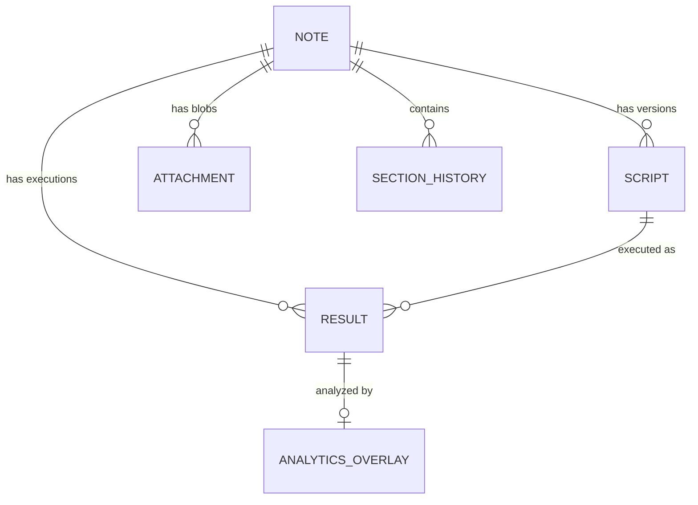

# Storage Schema (IndexedDB)

This document defines the data structures and relationships stored in IndexedDB (`wodwiki-db`). The schema follows a hierarchical model where a **Note** acts as the root container for scripts, results, and external data attachments.

## 1. Core Stores

### `notes`
The root entity representing a workout file or template.
- **Key**: `id` (UUID)
- **Indexes**: `by-updated` (timestamp), `by-target-date` (timestamp)
- **Structure**:
```typescript
interface Note {
    id: string;           // UUID
    title: string;        // Display name
    rawContent: string;   // Current/Draft content
    tags: string[];
    createdAt: number;
    updatedAt: number;    // Last edit time
    targetDate: number;   // Primary date for sorting
    segmentIds: string[]; // Ordered list of segment (section) UUIDs
    type?: 'note' | 'template';
}
```

### `scripts`
Immutable versions of the markdown content for a note.
- **Key**: `id` (UUID)
- **Indexes**: `by-note` (noteId), `by-created` (timestamp)
- **Structure**:
```typescript
interface Script {
    id: string;           // UUID
    noteId: string;       // Parent Note UUID
    content: string;      // Full markdown
    versionHash: string;  // Detect changes
    createdAt: number;
}
```

### `results`
Raw execution data (segments, timestamps, logs) generated by the `ScriptRuntime`.
- **Key**: `id` (UUID)
- **Indexes**: `by-script` (scriptId), `by-note` (noteId), `by-completed` (timestamp)
- **Structure**:
```typescript
interface WorkoutResult {
    id: string;           // UUID
    scriptId: string;     // Version link
    noteId: string;       // Note link
    sectionId?: string;   // Specific WOD segment link
    data: WorkoutResults; // Raw execution stream (IOutputStatement[])
    completedAt: number;
}
```

### `section_history`
Snapshots of specific structural components (WOD blocks) within a note.
- **Key**: `[sectionId, version]` (Compound)
- **Indexes**: `by-section` (sectionId), `by-note` (noteId)
- **Structure**:
```typescript
interface SectionHistory {
    sectionId: string;    // UUID
    version: number;      // Sequence number
    noteId: string;       // Parent Note UUID
    content: string;      // Markdown snippet
    type: SectionType;    // 'wod' | 'markdown' | 'heading'
    wodBlock?: WodBlock;  // Compiled block for WODs
    timestamp: number;
}
```

---

## 2. Analytics & External Data (The Lens Overlay)

To support the **Multi-Source Data Lens**, the following stores are proposed to decouple raw data from derived analysis and external biometrics.

### `attachments` (Proposed)
High-frequency time-series data or large media files attached to a note.
- **Key**: `id` (UUID)
- **Indexes**: `by-note` (noteId), `by-type` (string), `by-time` (startTime)
- **Structure**:
```typescript
interface Attachment {
    id: string;
    noteId: string;
    type: 'hr' | 'gps' | 'power' | 'video';
    mimeType: string;
    
    // Temporal Alignment
    startTime: number;    // Unix timestamp of first sample
    endTime: number;      // Unix timestamp of last sample
    
    // Data Storage
    blob: Blob | ArrayBuffer; 
    metadata: Record<string, any>; // e.g., sample rate, device name
    
    createdAt: number;
}
```

### `analytics_overlays` (Proposed)
Derived metrics generated by the `AnalyticsEngine`. This store allows re-calculating analytics without modifying the original `WorkoutResult`.
- **Key**: `id` (UUID)
- **Indexes**: `by-result` (resultId), `by-note` (noteId)
- **Structure**:
```typescript
interface AnalyticsOverlay {
    id: string;
    resultId: string;     // Link to the specific raw execution
    noteId: string;
    
    engineVersion: string; // To track if re-processing is needed
    
    // Derived Data
    summaries: IOutputStatement[]; // Finalized totals
    segmentMetrics: Map<number, ICodeFragment[]>; // Map of statementId -> new metric fragments
    
    createdAt: number;
}
```

---

## 3. Relationships



## 4. Query Patterns

1. **Load Workout for Review**: 
   - Get `WorkoutResult` by ID.
   - Get `AnalyticsOverlay` by `resultId`.
   - Query `attachments` for all types where `startTime` and `endTime` overlap with the workout duration.
2. **Reprocess Analytics**:
   - Load `WorkoutResult.data`.
   - Load `attachments` for the same time window.
   - Run `AnalyticsEngine`.
   - Update/Overwrite `AnalyticsOverlay`.
