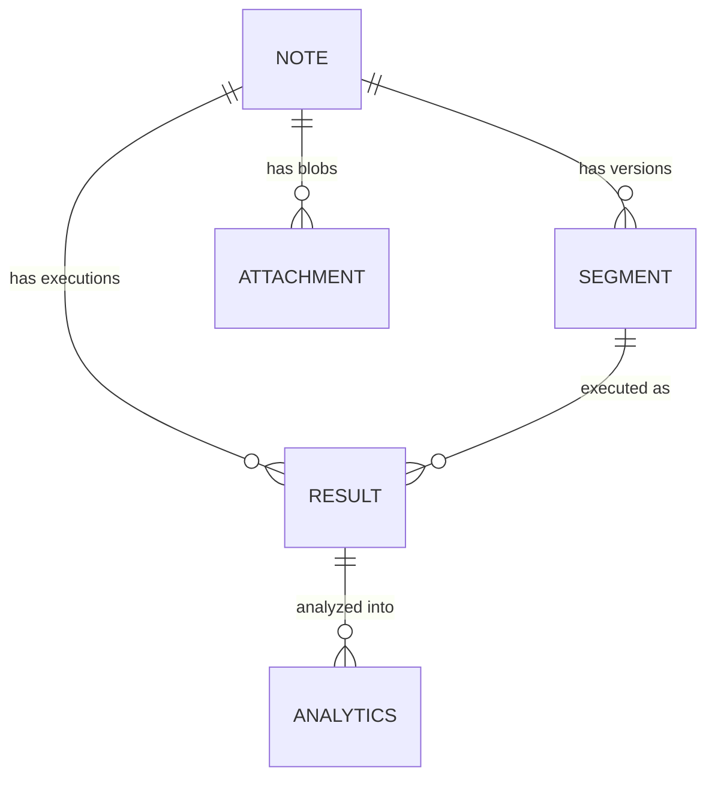

# Storage Schema V4 (IndexedDB)

This document defines the data structures and relationships stored in IndexedDB (`wodwiki-db`).  
**V4** follows a **Multi-Source Data Lens** architecture with 5 stores: `notes`, `segments`, `results`, `attachments`, and `analytics`.

> **Upgrade strategy**: a destructive upgrade — if the existing DB version is < 4, all legacy stores (`scripts`, `section_history`) are deleted and recreated.

## 1. Core Stores

### `notes`
The root entity representing a workout file or template.
- **Key**: `id` (UUID)
- **Indexes**: `by-updated` (timestamp), `by-target-date` (timestamp)
- **Structure**:
```typescript
interface Note {
    id: string;           // UUID
    title: string;        // Display name
    rawContent: string;   // Current/Draft content (for search/preview)
    tags: string[];
    createdAt: number;
    updatedAt: number;    // Last edit time
    targetDate: number;   // Primary date for sorting
    segmentIds: string[]; // Ordered list of segment UUIDs
    type?: 'note' | 'template';
    templateId?: string;
    clonedIds?: string[];
}
```

### `segments` (replaces `scripts` + `section_history`)
Versioned content chunks. Each edit creates a new row; the compound key is `[id, version]`.
- **Key**: `[id, version]` (Compound)
- **Indexes**: `by-note` (noteId), `by-type` (dataType)
- **Structure**:
```typescript
type SegmentDataType = 'script' | 'youtube' | 'markdown' | 'header' | 'frontmatter' | 'wod' | 'title';

interface NoteSegment {
    id: string;           // Stable UUID across versions
    version: number;      // 1, 2, 3…
    noteId: string;       // Parent Note UUID
    dataType: SegmentDataType;
    data: any;            // Structured JSON payload (e.g. WodBlock)
    rawContent: string;   // Original markdown / source text
    level?: number;       // For headings
    wodBlock?: WodBlock;  // For WOD sections
    createdAt: number;    // When this version was saved
}
```

### `results`
Raw execution data (segments, timestamps, logs) generated by the `ScriptRuntime`.
- **Key**: `id` (UUID)
- **Indexes**: `by-segment` (segmentId), `by-note` (noteId), `by-completed` (timestamp)
- **Structure**:
```typescript
interface WorkoutResult {
    id: string;           // UUID
    segmentId?: string;   // Link to NoteSegment
    segmentVersion?: number;
    noteId: string;       // Note link
    sectionId?: string;   // Legacy link
    data: WorkoutResults; // Raw execution stream (IOutputStatement[])
    completedAt: number;
}
```

### `attachments`
Temporal blob data attached to a workout (HR, GPS, etc.).
- **Key**: `id` (UUID)
- **Indexes**: `by-note` (noteId), `by-time` (createdAt)
- **Structure**:
```typescript
interface Attachment {
    id: string;
    noteId: string;
    mimeType: string;
    label: string;
    data: ArrayBuffer | string;
    timeSpan: { start: number; end: number };
    createdAt: number;
}
```

### `analytics`
De-normalized metric data points for cross-workout trend analysis.
- **Key**: `id` (UUID)
- **Indexes**: `by-type` (metricType), `by-segment` (segmentId), `by-result` (resultId)
- **Structure**:
```typescript
interface AnalyticsDataPoint {
    id: string;
    noteId: string;
    segmentId: string;
    segmentVersion: number;
    resultId: string;
    metricType: string;   // 'total_reps', 'avg_hr', 'pace', etc.
    value: number | any;
    unit?: string;
    label: string;
    timestamp: number;    // Effective workout date
    createdAt: number;    // Generation date
}
```

---

## 2. Relationships



## 3. Query Patterns

1. **Load Workout for Review**: 
   - Get `WorkoutResult` by ID.
   - Get `AnalyticsDataPoint[]` by `resultId`.
   - Query `attachments` for the same note where `timeSpan` overlaps.
2. **Cross-Workout Trends**:
   - Query `analytics` by `metricType` to get all data points for a metric (e.g. "total_reps") across workouts.
3. **Reprocess Analytics**:
   - Load `WorkoutResult.data`.
   - Load `attachments` for the same time window.
   - Run analytics processes → produce `AnalyticsDataPoint[]`.
   - Upsert into `analytics` store.
