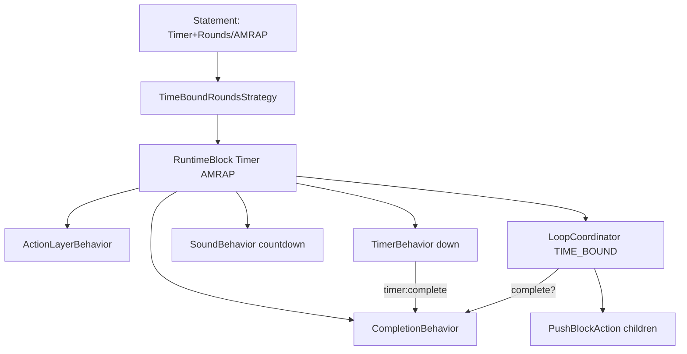
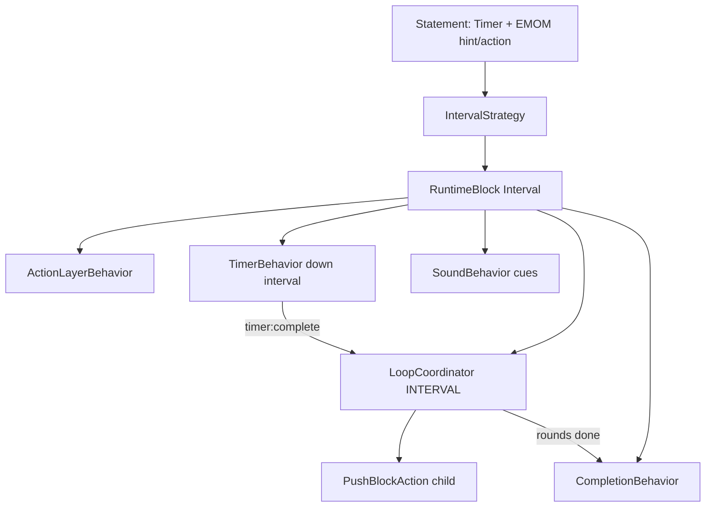
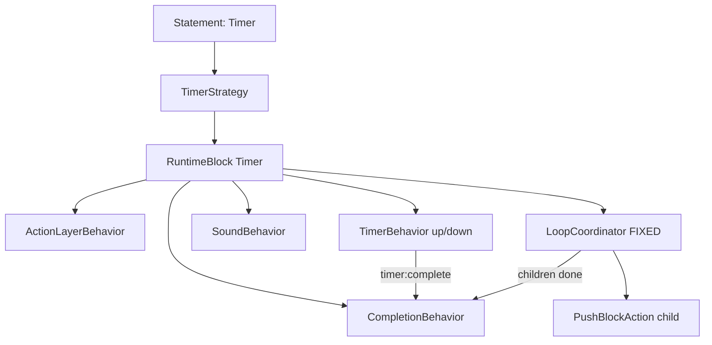
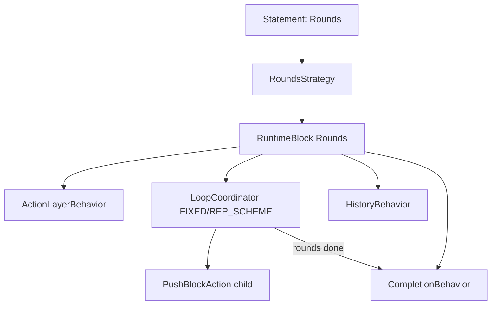
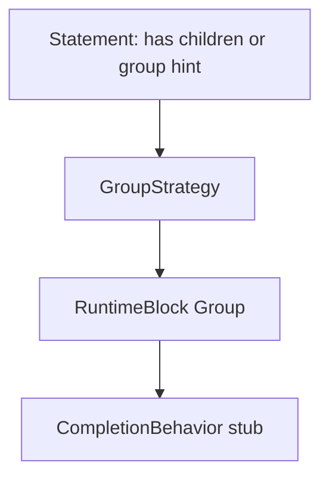
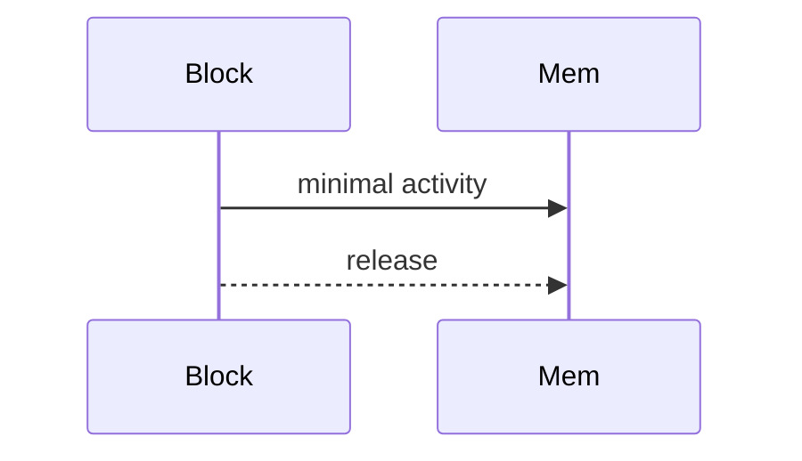
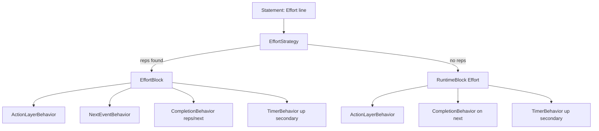
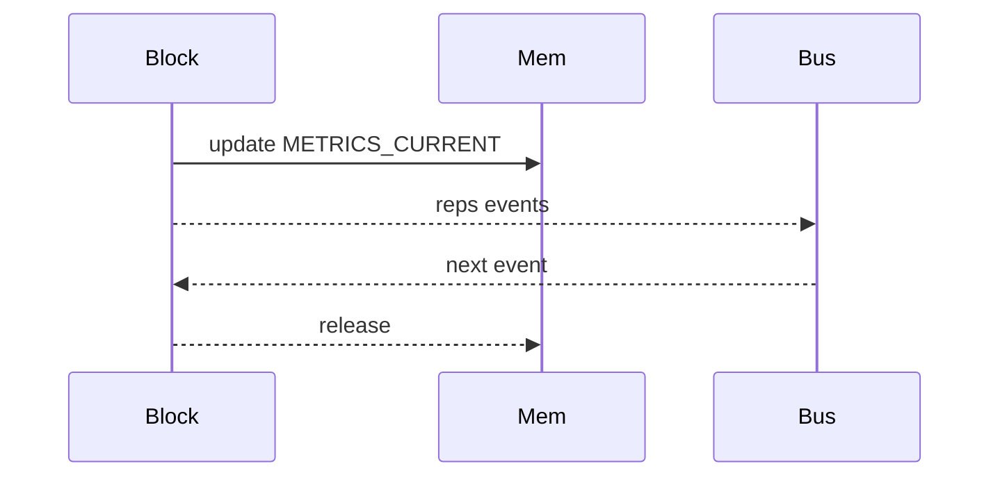

## Purpose
Map how parsed code statements become runtime blocks, which behaviors they carry, and which actions those behaviors emit. This follows the strategy precedence and the block lifecycle used by the JIT compiler.

## Strategy Precedence → Block Creation
The JIT tries strategies in order (highest specificity first): `TimeBoundRoundsStrategy`, `IntervalStrategy`, `TimerStrategy`, `RoundsStrategy`, `GroupStrategy`, `EffortStrategy` (`src/runtime/strategies/index.ts`). The first match wins and builds a block with behaviors.

### TimeBoundRounds (AMRAP)
- **Match**: Timer fragment plus (Rounds fragment OR `behavior.time_bound` hint OR `Action=AMRAP`).
- **Block**: `RuntimeBlock` labeled like `20:00 AMRAP` (blockType "Timer").
- **Behaviors** (compile order):
  - `ActionLayerBehavior` → pushes UI actions from Action fragments, defaults `next`.
  - `TimerBehavior('down', durationMs, 'AMRAP', 'secondary')` → emits `timer:started`, `timer:tick`, `timer:complete`.
  - `HistoryBehavior("AMRAP", debugMetadata...)` → writes execution span.
  - `SoundBehavior` with countdown cues → `PlaySoundAction` when thresholds hit.
  - `LoopCoordinatorBehavior` `loopType=TIME_BOUND`, `totalRounds=Infinity` → compiles children per round, emits `PushBlockAction`, `SetRoundsDisplayAction`.
  - `CompletionBehavior` conditioned on loop completion or timer completion → `PopBlockAction`.

Flowchart:


Memory/event workflow:
```mermaid
sequenceDiagram
  participant Block
  participant Timer
  participant Loop
  participant Mem
  participant Bus
  Block->>Timer: onPush register
  Block->>Loop: onPush advance
  Loop-->>Block: PushBlockAction
  Timer-->>Bus: timer events
  Bus-->>Loop: timer:complete
  Loop-->>Mem: allocate spans
  Loop-->>Block: completion check
  Block-->>Mem: release on pop
```

Key excerpt (`src/runtime/strategies/TimeBoundRoundsStrategy.ts`):
```typescript
const timerBehavior = new TimerBehavior('down', durationMs, 'AMRAP', 'secondary');
behaviors.push(timerBehavior);

const loopCoordinator = new LoopCoordinatorBehavior({
  childGroups: children,
  loopType: LoopType.TIME_BOUND,
  totalRounds: Infinity
});
behaviors.push(loopCoordinator);

behaviors.push(new CompletionBehavior(
  (_rt, block) => loopCoordinator.isComplete(_rt, block),
  ['timer:complete', 'children:complete']
));
```

### Interval (EMOM)
- **Match**: Timer + `behavior.repeating_interval` hint OR `Action=EMOM`.
- **Block**: `RuntimeBlock` blockType "Interval", label "EMOM".
- **Behaviors**: `ActionLayerBehavior`; `TimerBehavior('down', intervalMs, 'Interval', 'secondary')`; `SoundBehavior`; `LoopCoordinatorBehavior` `loopType=INTERVAL` (waits for `timer:complete` when work finishes early); `HistoryBehavior` (EMOM metadata); `CompletionBehavior` on `['interval:complete']`.

Flowchart:


Memory/event workflow:
```mermaid
sequenceDiagram
  participant Block
  participant Timer
  participant Loop
  participant Mem
  participant Bus
  Block->>Timer: onPush interval
  Block->>Loop: onPush child
  Loop-->>Mem: allocate spans
  Timer-->>Bus: timer:tick
  Timer-->>Bus: timer:complete
  Bus-->>Loop: timer:complete
  Loop-->>Block: rounds done
  Block-->>Mem: cleanup
```

Excerpt (`IntervalStrategy.compile`):
```typescript
const timerBehavior = new TimerBehavior('down', intervalDurationMs, 'Interval', 'secondary');
behaviors.push(timerBehavior);

const loopCoordinator = new LoopCoordinatorBehavior({
  childGroups: children,
  loopType: LoopType.INTERVAL,
  totalRounds,
  intervalDurationMs
});
behaviors.push(loopCoordinator);

behaviors.push(new CompletionBehavior(
  (_rt, block) => loopCoordinator.isComplete(_rt, block),
  ['interval:complete']
));
```

### Timer (Count-up / Countdown)
- **Match**: Timer fragment or `behavior.timer` hint (only after AMRAP/EMOM fail).
- **Block**: `RuntimeBlock` blockType "Timer"; label `Countdown` when direction down else `For Time`.
- **Behaviors**: `ActionLayerBehavior`; `TimerBehavior(direction, duration?)`; `HistoryBehavior`; `SoundBehavior` (countdown or start beep); optional `LoopCoordinatorBehavior` `loopType=FIXED` if children exist; `CompletionBehavior` (children complete; countdown also on timer complete).

Flowchart:


Memory/event workflow:
```mermaid
sequenceDiagram
  participant Block
  participant Timer
  participant Loop
  participant Mem
  participant Bus
  Block->>Timer: onPush
  Block->>Loop: onPush if children
  Timer-->>Bus: timer events
  Bus-->>Loop: optional
  Loop-->>Mem: allocate spans
  Loop-->>Block: children done
  Block-->>Mem: cleanup
```

Excerpt (`TimerStrategy.compile`):
```typescript
const timerBehavior = new TimerBehavior(direction, durationMs, label);
behaviors.push(timerBehavior);

if (children.length > 0) {
  loopCoordinator = new LoopCoordinatorBehavior({
    childGroups: children,
    loopType: LoopType.FIXED,
    totalRounds: 1
  });
  behaviors.push(loopCoordinator);
}

behaviors.push(new CompletionBehavior(
  (_rt, block) => loopCoordinator ? loopCoordinator.isComplete(_rt, block) : false,
  ['timer:complete', 'children:complete']
));
```

### Rounds (Fixed / Rep Scheme)
- **Match**: Rounds fragment or `behavior.fixed_rounds` hint, and no Timer present.
- **Block**: `RuntimeBlock` blockType "Rounds"; label `repScheme.join('-')` or `"N Rounds"`.
- **Behaviors**: `ActionLayerBehavior`; `LoopCoordinatorBehavior` (`loopType=REP_SCHEME` when rep fragments, else `FIXED`) with `onRoundStart` updating inherited `METRIC_REPS`; `HistoryBehavior`; `CompletionBehavior` on `['rounds:complete']`.

Flowchart:


Memory/event workflow:
```mermaid
sequenceDiagram
  participant Block
  participant Loop
  participant Mem
  participant Bus
  Block->>Loop: onPush
  Loop-->>Mem: allocate spans
  Loop-->>Mem: set METRIC_REPS
  Loop-->>Block: advance
  Bus-->>Loop: rounds:complete
  Block-->>Mem: release
```

Excerpt (`RoundsStrategy.compile`):
```typescript
const loopCoordinator = new LoopCoordinatorBehavior({
  childGroups: children,
  loopType,
  totalRounds,
  repScheme,
  onRoundStart: (rt, roundIndex) => {
    if (repScheme && repScheme.length > 0) {
      const schemeIndex = roundIndex % repScheme.length;
      const currentReps = repScheme[schemeIndex];
      const refs = rt.memory.search({ type: MemoryTypeEnum.METRIC_REPS, ownerId: blockId, id: null, visibility: 'inherited' });
      if (refs.length > 0) rt.memory.set(refs[0] as any, currentReps);
    }
  }
});
```

### Group (Structural)
- **Match**: `behavior.group` hint or presence of children.
- **Block**: `RuntimeBlock` blockType "Group" with stub label `Total Time`.
- **Behaviors**: Currently only `CompletionBehavior(() => true)`; TODO: add proper child coordination.

Flowchart:


Memory/event workflow (current):


### Effort (Fallback)
- **Match**: No Timer and no Rounds, unless `behavior.effort` forces it.
- **Block choices**: If reps resolved → `EffortBlock`; otherwise generic `RuntimeBlock` with behaviors.
- **Rep resolution**: prefer `Rep` fragment; else inherit public `METRIC_REPS` (from parent rounds).
- **Behaviors (EffortBlock path)**:
  - `ActionLayerBehavior` (added after base ctor) → `PushActionsAction`/`PopActionsAction`.
  - `NextEventBehavior` (internal) sets `_forceComplete` on `next`.
  - `CompletionBehavior` (triggers on `['reps:updated','next']`, no push/tick checks) → `PopBlockAction` when reps done or forced.
  - `TimerBehavior('up', undefined, 'Segment Timer', 'secondary')` for per-effort timing.
- **Behaviors (generic effort)**: `ActionLayerBehavior`; `CompletionBehavior(() => true, ['next'], checkOnPush=false, checkOnNext=false)`; `TimerBehavior('up', ... , 'secondary')`; `HistoryBehavior`.

Flowchart:


Memory/event workflow:


Excerpt (`EffortStrategy.compile`):
```typescript
const repsFragment = fragments.find(f => f.fragmentType === FragmentType.Rep);
// ... inherit reps if missing

if (reps !== undefined) {
  return new EffortBlock(runtime, code[0]?.id ? [code[0].id] : [], {
    exerciseName,
    targetReps: reps
  }, fragmentGroups);
}

behaviors.push(new CompletionBehavior(
  () => true,
  ['next'],
  false,
  false
));
behaviors.push(new TimerBehavior('up', undefined, 'Segment Timer', 'secondary'));
```

## Behavior Catalog and Their Actions

### ActionLayerBehavior (`src/runtime/behaviors/ActionLayerBehavior.ts`)
- **Push**: `PushActionsAction` with descriptors built from `Action` fragments (deduped by eventName). Adds default `next` if none.
- **Pop**: `PopActionsAction` removes actions for the block.
- **Event**: If custom action event matches descriptor and block is current → returns `block.next()` actions. Skips `next` to avoid double-handling.

### CompletionBehavior (`src/runtime/behaviors/CompletionBehavior.ts`)
- Checks a condition on push (optional), next (default), and/or specific events. When true: emits `block:complete` event then returns `PopBlockAction`.
- Parameters: condition `(runtime, block) => boolean`, `triggerEvents?: string[]`, `checkOnPush=false`, `checkOnNext=true`.

### LoopCoordinatorBehavior (`src/runtime/behaviors/LoopCoordinatorBehavior.ts`)
- Manages child compilation/looping across `FIXED`, `REP_SCHEME`, `TIME_BOUND`, `INTERVAL`.
- **Push/Next**: compiles current child group → `PushBlockAction`; updates rounds display; opens round/interval span; creates lap timer ref; restarts timer for intervals.
- **Event**: on `timer:complete` (INTERVAL) when waiting → advance.
- **Completion**: depends on loopType (rounds reached, timer expired, or intervals done).

### TimerBehavior (`src/runtime/behaviors/TimerBehavior.ts`)
- Starts/stops timer, registers with unified clock.
- Emits `timer:started`, periodic `timer:tick` (~100ms) with `elapsedMs` (+ `remainingMs` for countdown), and `timer:complete` for countdowns.
- Supports `pause`, `resume`, `reset`, `restart` (used by EMOM intervals), and detects `isRunning/isPaused/isComplete`.

### SoundBehavior (`src/runtime/behaviors/SoundBehavior.ts`)
- Subscribes to `timer:tick`; when thresholds met, emits `PlaySoundAction` (uses `SoundCue` list). Dedupes triggers per cue.

### HistoryBehavior (`src/runtime/behaviors/HistoryBehavior.ts`)
- On push: allocates `EXECUTION_SPAN_TYPE` with label, fragments, debug metadata, metrics; tracks parent span from stack.
- On pop: marks span completed with endTime.

### RuntimeControlsBehavior (`src/runtime/behaviors/RuntimeControlsBehavior.ts`)
- (Not wired by strategies above) Allocates public `runtime-controls` state; helper methods to register buttons/set display mode.

## Concrete Blocks and Embedded Behaviors

### EffortBlock (`src/runtime/blocks/EffortBlock.ts`)
- Behaviors order: `ActionLayerBehavior` (prepended), `NextEventBehavior`, `CompletionBehavior` (reps/next), `TimerBehavior` (secondary segment).
- Metrics: writes `METRICS_CURRENT.reps`; emits `reps:updated`, `reps:complete`.
- Display: `PushStackItemAction` on mount, `PopStackItemAction` on unmount.

### RoundsBlock (`src/runtime/blocks/RoundsBlock.ts`)
- Behaviors: `ActionLayerBehavior`; `LoopCoordinatorBehavior` (rep scheme or fixed); `CompletionBehavior` (rounds complete); `HistoryBehavior`.
- Metrics: on each `next`, updates `METRICS_CURRENT.reps` with current round’s reps when rep scheme exists.
- Display: push/pop stack actions on mount/unmount.

### TimerBlock (`src/runtime/blocks/TimerBlock.ts`)
- Behaviors: `TimerBehavior` (primary); optional `LoopCoordinatorBehavior` (children, fixed 1 round); `HistoryBehavior`; `CompletionBehavior` (countdown end OR children complete).
- Display: push/pop stack actions.

## Fragment → Behavior Wiring
- `Timer` fragment: direction/duration → `TimerBehavior`; in IntervalStrategy also drives interval length; in AMRAP default 20:00 if missing.
- `Rounds` fragment: total rounds or rep scheme array → `LoopCoordinatorBehavior` setup; rep scheme also seeds inherited `METRIC_REPS`.
- `Rep` fragments: build rep scheme (modern parser) and set effort target reps.
- `Effort` fragment: exercise name for EffortBlock label (if reps present); otherwise label defaults to `Exercise`.
- `Action` fragments: user actions → `ActionLayerBehavior` descriptors (eventName from `name/value`, label from `raw`). Default `next` added if absent.
- `children` groups: drive `childGroups` for `LoopCoordinatorBehavior` (round/interval iteration).

## Lifecycle Flow (happy path)
1. **Compile**: First matching strategy builds block with behaviors + context + fragments.
2. **Push**: `PushBlockAction` → stack.push → `block.mount` → each behavior `onPush` emits actions (e.g., timers register, actions registered).
3. **Run**: Events (`timer:tick`, `next`, custom action names) dispatched to behaviors via `RuntimeBlock` event dispatcher.
4. **Advance**: `block.next()` (from `next` event or parent) calls behaviors `onNext`; `LoopCoordinatorBehavior` may push children; `CompletionBehavior` may pop.
5. **Complete**: `CompletionBehavior` condition true → `PopBlockAction`; stack.pop orchestrates unmount → dispose → parent.next.
6. **Dispose**: Behaviors `onDispose` (timers stop, sound unsubscribed), memory released by consumer via `context.release()` after `dispose`.

## Representative Event→Action Examples

### Countdown Tick Triggering Sound and Interval Advance
```mermaid
sequenceDiagram
  participant Timer
  participant Sound
  participant Loop
  participant Runtime
  Timer->>Runtime: timer:tick
  Runtime->>Sound: dispatch timer:tick
  Sound-->>Runtime: PlaySoundAction
  Timer->>Runtime: timer:complete
  Runtime->>Loop: dispatch timer:complete
  Loop-->>Runtime: PushBlockAction
```

### Effort Completion via Next
```typescript
// EffortBlock behaviors: NextEventBehavior sets _forceComplete on 'next'
// CompletionBehavior listens to ['reps:updated','next']
runtime.handle({ name: 'next', timestamp: new Date(), data: {} });
// CompletionBehavior condition true -> returns PopBlockAction -> stack.pop()
```

### Rounds Rep Scheme Cycling
```typescript
// From LoopCoordinatorBehavior onRoundStart in rep scheme mode
const schemeIndex = roundIndex % repScheme.length;
const currentReps = repScheme[schemeIndex];
const refs = rt.memory.search({ type: MemoryTypeEnum.METRIC_REPS, ownerId: blockId, id: null, visibility: 'inherited' });
if (refs.length > 0) rt.memory.set(refs[0] as any, currentReps);
```

## Quick How-Tos
- **Add a new strategy**: implement `IRuntimeBlockStrategy` (`match`, `compile`), register in `strategies/index.ts` in correct precedence, add behaviors, and set labels/fragments.
- **Expose custom actions**: add `Action` fragments (`@action Name` or dialect equivalent); `ActionLayerBehavior` will surface them and include default `next` if missing.
- **Use inherited reps**: ensure parent Rounds allocates public `METRIC_REPS`; Effort blocks without explicit reps will adopt the latest inherited value.
- **Interval wait**: In EMOM, if work finishes before the minute, `LoopCoordinatorBehavior` sets `isWaitingForInterval` and only advances when its own `timer:complete` fires.
