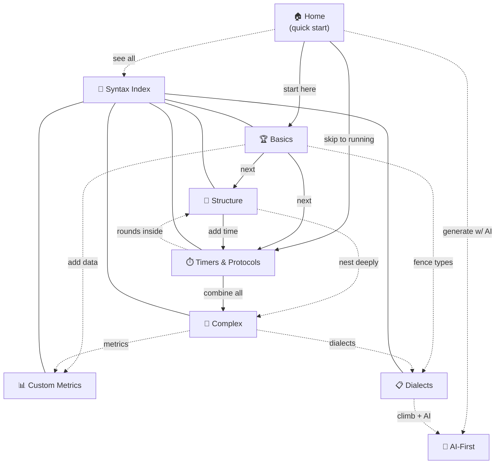

# Collapsed Canvas Page Outline

> **Purpose.** A redesign of the playground's learning surface. Today the same
> fundamentals are explained in **four** overlapping places. This document
> proposes collapsing them into a two-tier structure — a lean **quick-start
> home** plus **detailed tutorial pages** — where every page carries its own
> gamified challenges, the whole language is covered with **zero duplication**,
> and a crosslink mesh lets learners jump around freely.
>
> This is a planning artifact. It supersedes the current-state docs
> (`home.md`, `chapters.md`, `syntax.md`, `challenge-lifecycle.md`) which
> describe the code *as it is today*.

---

## 1. The problem: four layers saying the same thing

The fundamentals (movement · rep · timer · rounds · AMRAP) currently appear in
up to **five** separate pages each:

| Fundamental            |   Home `/`    | Getting-Started |         Chapters          |  Syntax ref   |   ×   |
| ---------------------- | :-----------: | :-------------: | :-----------------------: | :-----------: | :---: |
| Movement line          | ✓ (statement) |   ✓ (step 1)    |        ✓ (basics)         |  ✓ (basics)   | **4** |
| Reps / load / distance |  ✓ (metrics)  |   ✓ (step 2)    |        ✓ (basics)         |  ✓ (basics)   | **4** |
| Timer / rest           |   ✓ (timer)   |   ✓ (step 3)    |       ✓ (sequences)       | ✓ (protocols) | **4** |
| Rounds `(N)`           |  ✓ (groups)   |   ✓ (step 4)    | ✓ (sequences + protocols) | ✓ (structure) | **5** |
| AMRAP                  | ✓ (protocols) |   ✓ (step 5)    |       ✓ (protocols)       | ✓ (protocols) | **4** |

The four layers differ only in *depth + gamification*, not in *what* they cover:

| Layer                | Route(s)                                 | Depth                              | Gamified?                        |
| -------------------- | ---------------------------------------- | ---------------------------------- | -------------------------------- |
| **Home**             | `/`                                      | condensed walkthrough (8 sections) | ❌ no quests                      |
| **Getting-Started**  | `/guide/getting-started`                 | 6-step "Zero to Hero"              | ❌ "Your Turn" prompts, no quests |
| **Chapters**         | `/chapters/{basics,sequences,protocols}` | none — blank scratchpad only       | ✅ quests (but no teaching)       |
| **Syntax reference** | `/guide/syntax/*`                        | full depth                         | ❌ no quests                      |

So a learner who wants *both* an explanation *and* a challenge must visit two
pages that repeat each other. And neither home nor the reference pages reward
completion. **(Plus a standalone `/challenge` gauntlet that re-covers the same
fundamentals a fifth time.)**

### Route bugs found during analysis

| Bug              | Detail                                                                                                                                                                     |
| ---------------- | -------------------------------------------------------------------------------------------------------------------------------------------------------------------------- |
| **Dead link**    | Syntax index links to `/guide/syntax/custom-and-calculated-metrics` — no such route exists. The page is at `/syntax/custom-metrics` (wrong prefix **and** different slug). |
| **Wrong prefix** | `custom-metrics.md` "What's Next" links to `/syntax/basics` and `/syntax/structure` — should be `/guide/syntax/...`.                                                       |

---

## 2. Design principles

1. **Two tiers, not four.** Home = quick start (60 seconds to first run).
   Tutorial pages = full depth. Nothing in between.
2. **Every page is gamified.** Each page carries `quest` blocks verified by a
   `ChallengeBanner`. Completing all quests on a page unlocks its **badge**.
3. **One concept, one home.** Every grammar element lives on exactly one page.
   The coverage map in §5 is the contract — no element appears twice.
4. **Crosslinks, not funnels.** Pages link ↑prereqs, →next, ↔see-also so a
   learner can enter anywhere and orient. No single forced linear path.
5. **One route scheme.** All tutorials live under `/guide/syntax/<slug>`.
   The `/chapters/*` and `/syntax/*` (bare) prefixes are retired.

---

## 3. Proposed page tree

```
Tier 0 — Quick start
  /                                  Home (lean pitch + 1 live demo + quick quests)

Tier 1 — Core tutorials              prereq: none (beyond home)
  /guide/syntax/basics               Basics         🏆
  /guide/syntax/structure            Structure      🧱

Tier 2 — Time & protocols            prereq: basics
  /guide/syntax/protocols            Timers & Protocols  ⏱️

Tier 3 — Synthesis & advanced        prereq: basics + relevant tier-1/2
  /guide/syntax/complex              Complex Workouts    🧩
  /guide/syntax/custom-metrics       Custom Metrics      📊
  /guide/syntax/dialects             Dialects            📋

Tier ∞ — Index & orthogonal
  /guide/syntax                      Syntax index (map + links, no quests)
  /ai-first                          AI integration (unchanged, not a tutorial)
```

**Retired / folded:**

| Current route            | Disposition                                                                                                                                                                                                 |
| ------------------------ | ----------------------------------------------------------------------------------------------------------------------------------------------------------------------------------------------------------- |
| `/guide/getting-started` | **Retire.** Its 6 steps distribute: steps 1–2 → Home quick-start + Basics; 3 → Protocols; 4 → Structure; 5 → Protocols; 6 → Home/journal. Its "Your Turn" prompts become the tutorial quests.               |
| `/chapters/basics`       | **Retire → redirect `/guide/syntax/basics`.** Quests move there.                                                                                                                                            |
| `/chapters/sequences`    | **Retire.** `has-timer` → Protocols; `min-rounds` → Structure. The "sequences" mashup never existed as one topic.                                                                                           |
| `/chapters/protocols`    | **Retire → redirect `/guide/syntax/protocols`.** Quests move there.                                                                                                                                         |
| `/challenge`             | **Retire.** `has-movement`/`has-timer`/`min-rounds` duplicate tutorials; the unique `workout-complete` concept moves to Home's quick-start. *(Optional: keep as a "capstone" run-to-finish page — see §7.)* |
| `/syntax/custom-metrics` | **Move** to `/guide/syntax/custom-metrics` (fix prefix + dead link).                                                                                                                                        |

---

## 4. Per-page outline

Each page below specifies: **content** · **challenges** (quests + validation) ·
**badge** · **measurement** · **crosslinks**. All quests use only the existing
validator types (`has-movement`, `has-reps`, `has-timer`, `min-rounds`,
`contains-token`, `exactly-movements`) plus the runtime `workout-complete` — no
new validators are required.

---

### Home — `/` · Quick Start

**Content (lean — ~4 screens, down from 8):**
1. **Hero / pitch + Quick-Start meter** — markdown → live timer → journal, in one
   paragraph. **Gamification starts on this screen:** the Quick-Start challenge
   chain is visible in the hero with *endowed progress* — a first-time visitor
   lands at 1/3 done, never at zero (see Challenges below).
2. **Jump-In hub** *(see below)* — the "use it now or learn first" fork.
3. **Live demo** — the canonical example in the `home-demo` panel (the existing
   3-round KB circuit). The deep-dive sections move out to the tutorials.
4. **What's next hub** — links into the tutorial path.

#### Home · Jump-In hub (the decision fork)

Placed **immediately after the pitch, before any challenge**, this section
offers two clear paths — *start using the app right now* or *keep scrolling to
learn the syntax.* It respects that many users arrive already knowing what they
want (browse workouts, open their journal, or just start typing) and shouldn't
be forced through a tutorial first.

**Path A — "Jump right in"** *(primary buttons, leave the page)*

| Button | Pipeline / route | What it does |
|---|---|---|
| 📓 Open Journal | `navigate: /journal` | Land on the training journal — history of completed sessions. |
| 🗂️ Browse Collections | `navigate: /collections` | Browse benchmark workout libraries (Dan John, ZombieFit, …). |
| ✍️ New Workout Note | `set-source: query:new` · `set-state: note` · `launch: dialog` | Open a blank playground note — start typing immediately. |

**Path B — "Learn the syntax first"** *(secondary, stays on page)*

| Button | Pipeline | What it does |
|---|---|---|
| ▾ Keep scrolling | `scroll-to: home-demo` *(visual cue)* | Drops to the live demo + quick-start challenges below. |
| 🎓 Zero to Hero | `navigate: /guide/syntax/basics` | Jumps straight to the first tutorial (the collapsed replacement for the retired `/guide/getting-started`). |

**Design note:** Path A buttons are full-app navigations (`/journal`,
`/collections`, new-note dialog) using the same `button` + `pipeline` mechanism
the current home already uses for "Open a New Note." Path B is the soft on-ramp:
the scroll cue keeps the user on the page where the demo and challenges live,
while the Zero-to-Hero button is the explicit escape hatch to the structured
tutorial. The hub is **non-gated** — no quest blocks here, just navigation.
The gamification lives in the Quick-Start meter on the hero above (endowed
1/3 on arrival); this hub sits beside it as the "jump in now" alternative.

**Challenges (the Quick Start chain — endowed progress):**

The chain starts **pre-credited**. `qs-arrive` auto-completes the instant the
page mounts, so a first-time visitor lands at **1 of 3 done (33%)** — never at
zero. This is the endowed-progress / goal-gradient effect: a visible head start
measurably increases the chance the user finishes the chain. `qs-arrive`
subsumes the existing `visitedLanding` onboarding step (same mount event —
don't double-track).

| Quest id | Label | Validation | Fires when |
|---|---|---|---|
| `qs-arrive` | Welcome to WOD Wiki | *(mount-event)* | Auto-marks on page mount via `usePageQuests.markComplete` — same pattern as the existing `visitedLanding` effect in `OnboardingBanner`. Endows 1/3. |
| `qs-edit` | Change the workout | *(edit-event)* | `block.content` diverges from the demo's initial source — reuses the existing `editedNote` onboarding action-site. |
| `qs-run` | Run it to the finish | `workout-complete` | Fullscreen review reaches `completed === true`. |

**Badge:** none of its own — Home is the **dashboard**. It shows every tutorial
badge aggregating (the existing `useChapterProgress` cross-route read). All
badges lit = "Syntax complete" state.

**Measurement:** `qs-arrive` via a mount effect (`markComplete` on first
render); `qs-edit` via the onboarding action-site write; `qs-run` via
`useCompletionChallenge` (already implemented). All three persist to
`wodwiki.quests.v1` under route `/`.

**Crosslinks:** → Basics (start here) · → Protocols (skip to running) · ↔ AI-First · ↔ Syntax index

---

### Basics — `/guide/syntax/basics` · 🏆

**Content (merges current `chapters/basics` + `syntax/basics`):**
The `wod` fence · one-statement-per-line · indent-to-nest · single movement ·
measurements (reps · load · distance) · unknown load `?lb` · supplemental effort
text · setup actions `[...]` · comments `//`.

*Timer modifiers (`^` `*` `:?`) move to Protocols — they are meaningless without
a timer and currently appear in both pages.*

**Challenges:**

| Quest id | Label | Validation |
|---|---|---|
| `basics-movement` | Add a movement | `has-movement` |
| `basics-reps` | Add a rep count | `has-reps` |
| `basics-load` | Add a load or distance | `contains-token` · `value: lb` *(or `kg`, `m`)* |

**Badge:** 🏆 Basics

**Measurement:** `has-movement` (Effort metric present), `has-reps` (Rep metric),
`contains-token` (raw-text substring). All live per-keystroke via
`useSyntaxChallenge`.

**Crosslinks:** ↑ Home · → Structure · → Protocols · ↔ Custom Metrics · ↔ Dialects

---

### Structure — `/guide/syntax/structure` · 🧱

**Content (absorbs the rounds half of `chapters/sequences`):**
Simple rounds `(N Rounds)` · named groups `(Warmup)` · nested groups · mixed
sections · rep schemes `(21-15-9)` · descending reps · multiple sets `(5 Sets)`.

**Challenges:**

| Quest id | Label | Validation |
|---|---|---|
| `structure-rounds` | Wrap movements in 2+ rounds | `min-rounds` · `count: 2` |
| `structure-repscheme` | Write a rep scheme | `contains-token` · `value: 21-15-9` |

**Badge:** 🧱 Structure

**Measurement:** `min-rounds` (summed Rounds metrics ≥ 2), `contains-token`
(raw text includes the rep-scheme literal). *Note: verifying true nesting
(indent level > 1) needs a new `has-nested-group` validator — flagged as a
minor optional extension; the two quests above use only existing types.*

**Crosslinks:** ↑ Basics · → Protocols · ↔ Complex

---

### Timers & Protocols — `/guide/syntax/protocols` · ⏱️

**Content (absorbs timer half of `chapters/sequences` + all of `chapters/protocols`):**
Countdown timers & rest (`*:30 Rest`) · **timer modifiers** `^`/`*`/`:?` *(moved
from Basics)* · longer durations `H:MM:SS` · mixed timers · AMRAP (classic · time
cap · multiple windows) · EMOM (basic · longer · alternating) · Tabata & custom
intervals · distance intervals.

**Challenges:**

| Quest id | Label | Validation |
|---|---|---|
| `protocols-timer` | Add a rest or time cap | `has-timer` |
| `protocols-rounds` | Add a 3-round cap | `min-rounds` · `count: 3` |
| `protocols-tag` | Tag it AMRAP / EMOM / TABATA | `contains-token` · `value: AMRAP` |

**Badge:** ⏱️ Timers & Protocols

**Measurement:** `has-timer` (Duration/Time metric), `min-rounds` (≥ 3),
`contains-token` (raw text includes `AMRAP`).

**Crosslinks:** ↑ Basics · → Complex · ↔ Structure (rounds inside protocols)

---

### Complex Workouts — `/guide/syntax/complex` · 🧩

**Content (unchanged depth, now gamified):**
Nested protocols · full training session (warmup→strength→conditioning→cooldown)
· barbell cycling · partner workouts. The synthesis page — combines groups +
timers + protocols.

**Challenges:**

| Quest id | Label | Validation |
|---|---|---|
| `complex-time` | Add a timed block to the session | `has-timer` |
| `complex-rounds` | Use 2+ rounds across sections | `min-rounds` · `count: 2` |

**Badge:** 🧩 Complex

**Measurement:** compound — both validators must pass (the page validates one
block against multiple quests; all must pass).

**Crosslinks:** ↑ Basics + Structure + Protocols · ↔ Custom Metrics · ↔ Dialects

---

### Custom Metrics — `/guide/syntax/custom-metrics` · 📊 *(route fixed)*

**Content (unchanged, route corrected):**
Inline JSON metrics (`intensity`, `rpe`, `rir`, `hrZone`, arbitrary keys) ·
document-level `calculate` blocks (`sum`, `mean`, `max`, `min`, `count`).

**Challenges:**

| Quest id | Label | Validation |
|---|---|---|
| `metrics-custom` | Add a custom metric | `contains-token` · `value: "rpe"` *(or any JSON key)* |
| `metrics-calc` | Add a calculate block | `contains-token` · `value: calculate` |

**Badge:** 📊 Custom Metrics

**Measurement:** `contains-token` raw-text match (JSON keys and `calculate` are
text-level constructs the validator can see without a new metric type).

**Crosslinks:** ↑ Basics · ↔ Complex · ↔ Dialects

---

### Dialects — `/guide/syntax/dialects` · 📋

**Content (unchanged, now gamified):**
`wod` (definition) · `log` (completed session) · `plan` (template) · `climb`
(bouldering · sport · hangboard).

**Challenges:**

| Quest id | Label | Validation |
|---|---|---|
| `dialects-log` | Write a `log` block | `contains-token` · `value: \`\`\`log` |
| `dialects-climb` | Write a `climb` block | `contains-token` · `value: \`\`\`climb` |

**Badge:** 📋 Dialects

**Measurement:** `contains-token` raw-text match on the fence keyword.

**Crosslinks:** ↑ Basics · ↔ Custom Metrics · ↔ AI-First

---

### Syntax index — `/guide/syntax` *(no quests)*

Stays as the **map**: one card per tutorial with a "X/Y complete" hint pulled
from the ledger, plus links in and out. No quests of its own (it's a directory).
Fixes the dead link to custom-metrics.

### AI-First — `/ai-first` *(unchanged)*

Orthogonal integration page (parse skill, shared Gems/GPTs). Not a syntax
tutorial; no quests. Linked from Home and Dialects.

---

## 5. Complete language coverage map (no gaps, no overlap)

Every grammar element assigned to **exactly one** owning page:

| Grammar element | Owner page | Currently also appears in (removed) |
|---|---|---|
| `wod` fence, one-per-line, indent-to-nest | Basics | home, getting-started |
| Single movement (bare) | Basics | home, getting-started, chapters/basics |
| Reps · load · distance | Basics | home, getting-started, chapters/basics |
| Unknown load `?lb` | Basics | — |
| Supplemental effort text | Basics | — |
| Setup actions `[...]` | Basics | — |
| Comments `//` | Basics | — |
| Rounds `(N Rounds)` | Structure | home, getting-started, chapters/sequences+protocols |
| Named / nested groups · sections | Structure | — |
| Rep schemes `(21-15-9)` · sets | Structure | — |
| Countdown timers · rest | Protocols | home, getting-started, chapters/sequences |
| Timer modifiers `^` `*` `:?` | Protocols | *(was also in basics)* |
| Longer durations `H:MM:SS` | Protocols | — |
| Mixed timers | Protocols | — |
| AMRAP (all forms) | Protocols | home, getting-started, chapters/protocols |
| EMOM (all forms) | Protocols | — |
| Tabata · custom · distance intervals | Protocols | — |
| Nested protocols · full session | Complex | — |
| Barbell cycling · partner workouts | Complex | — |
| Inline JSON custom metrics | Custom Metrics | — |
| `calculate` block | Custom Metrics | — |
| `wod` / `log` / `plan` / `climb` dialects | Dialects | home |

**Result:** 23 grammar elements → 7 owning pages, each appearing exactly once.

---

## 6. Crosslink mesh



**Legend:** solid `→` = primary next-step; dotted `⇢` = see-also sideways jump.
Every page reachable from Home in ≤ 2 hops; every page links back to its prereqs.

**Crosslink convention** (every tutorial page carries these three button groups):
- **↑ Prerequisite** — the page(s) whose concepts this one builds on.
- **→ Continue** — the natural next tutorial.
- **↔ See also** — sideways concepts (2–3 max) for non-linear learners.

---

## 7. Migration checklist

**Routes & redirects**
- [ ] Move `syntax/custom-metrics.md` route → `/guide/syntax/custom-metrics`; fix the index dead link and the page's own `/syntax/basics` → `/guide/syntax/basics` links.
- [ ] Add redirects: `/chapters/basics` → `/guide/syntax/basics`, `/chapters/protocols` → `/guide/syntax/protocols`, `/guide/getting-started` → `/`.
- [ ] Retire `/chapters/sequences` (no single destination — link to Structure or Protocols depending on referrer).
- [ ] Decide `/challenge`: retire (default) or keep as optional capstone.

**Quest migration** (each quest keeps its id; the owning route changes)
- [ ] `basics-movement`, `basics-reps` → move to `/guide/syntax/basics` (from `/chapters/basics`).
- [ ] `sequences-timer` → rename `protocols-timer`, move to `/guide/syntax/protocols`.
- [ ] `sequences-rounds` → rename `structure-rounds`, move to `/guide/syntax/structure`.
- [ ] `protocols-rounds`, `protocols-tag` → move to `/guide/syntax/protocols`.
- [ ] `first-complete` (`workout-complete`) → rename `qs-run`, move to `/`.
- [ ] Add new quests: `basics-load`, `structure-repscheme`, `protocols-timer`, `complex-time`, `complex-rounds`, `metrics-custom`, `metrics-calc`, `dialects-log`, `dialects-climb`.

**Badges & banner**
- [ ] Replace 3 chapter badges (trophy/dumbbell/timer) with 6 page badges. Extend `chapterIcon` in `OnboardingBanner` for 🧱 🧩 📊 📋.
- [ ] `useChapterProgress` already ORs across routes — no logic change, just feed it the new chapter declarations from Home's frontmatter.

**Home slim-down**
- [ ] Remove the Metrics / Timers / Groups / Protocols / Custom-Dialects walkthrough sections from Home; keep pitch + one demo + quick-start quests + hub links.
- [ ] Wire `qs-arrive` to a mount effect (same as `visitedLanding` — subsume it, don't double-track); `qs-edit` to the existing `editedNote` action-site; `qs-run` to `useCompletionChallenge`.

**Coverage guarantee**
- [ ] After migration, run the §5 coverage map as a checklist: each of the 23 grammar elements verified present on exactly one page.
