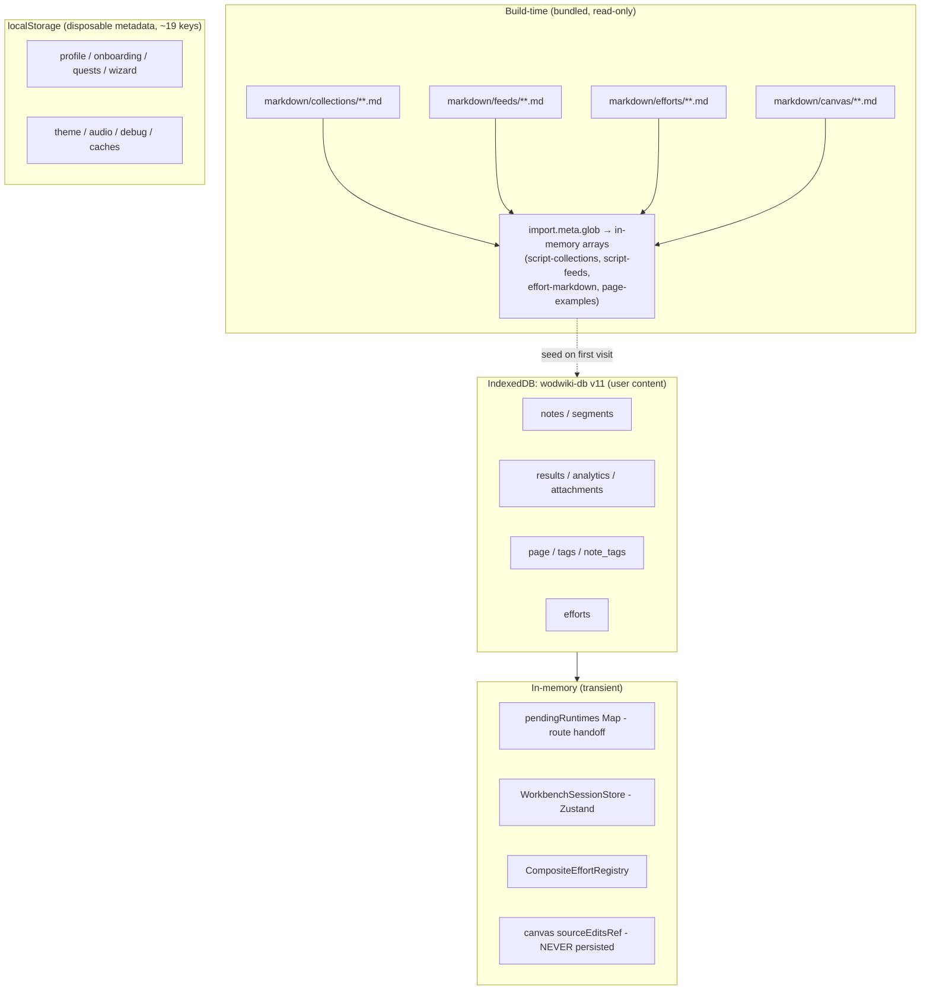

# 01 — Storage Tiers

Data in wod-wiki lives in four tiers. Only one of them is authoritative for
user content.

## Tier summary

| Tier | Technology | Role | Survives reload? | Source of truth? |
|---|---|---|---|---|
| Build-time markdown | `import.meta.glob` of `markdown/**` | Seed & fallback content | n/a (compiled in) | No — only until first IDB write |
| IndexedDB | `wodwiki-db` v11, 9 stores | All user content | Yes | **Yes** |
| localStorage | ~19 keys | Flags, profile, caches, legacy migration source | Yes | No — disposable |
| In-memory | Maps / Zustand / refs | Route handoff, session state, canvas edits | No | No |

## Notes per tier

**Build-time markdown** (`src/repositories/*.ts`) — `script-collections`,
`script-feeds`, `effort-markdown`, `script-loader`, `page-examples` are all
compile-time globs into in-memory arrays. No runtime file I/O, no writes.
Pages use them only when IDB has no row yet (seed) or as read-only listings.

**IndexedDB** (`src/services/db/IndexedDBService.ts`) — the only live
database. The legacy `wodwiki-playground` DB is referenced solely by
`resetUserData` for best-effort deletion; nothing opens it anymore.

**localStorage** — holds no user content. Wiping it loses no workouts, only
onboarding/profile/theme state. Full key inventory in
[05 — Crosswalks](05-crosswalks.md). Legacy `wodwiki:history:{id}` keys are
consumed once by `MigrationService` into IDB (gate key
`wodwiki:migrated-to-idb-v4`).

**In-memory** — `pendingRuntimes` (`playground/src/runtimeStore.ts`) bridges
route navigation to `/run/:runtimeId`; `WorkbenchSessionStore` (Zustand)
holds editor state with a 5s autosave; `CompositeEffortRegistry` hydrates
once at boot from bundled + IDB efforts; canvas page edits live in
`useCanvasEditorSource.sourceEditsRef` and are **lost on navigation** —
only results from canvas runs persist.
