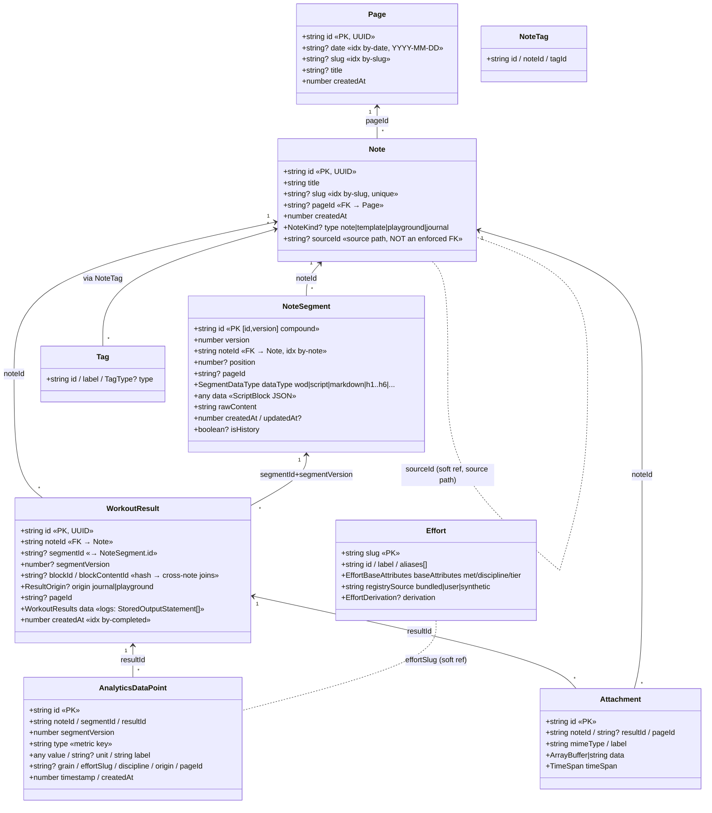

# 02 — Database Schema (UML)

`wodwiki-db`, version 11, nine object stores. Canonical types:
`src/types/storage.ts`. Store/index declarations:
`src/services/db/IndexedDBService.ts` (`WodWikiDB`).



## Store index reference

| Store | Key | Indexes |
|---|---|---|
| `notes` | `id` | `by-slug` (unique), `by-page` |
| `page` | `id` | `by-date` (unique), `by-slug` (unique) |
| `tags` | `id` | `by-label` (unique), `by-type` |
| `note_tags` | `id` | `by-note`, `by-tag` |
| `segments` | `[id, version]` | `by-note`, `by-type`, `by-page`, `by-history` |
| `results` | `id` | `by-segment`, `by-note`, `by-completed`, `by-content`, `by-block`, `by-page`, `by-origin` |
| `attachments` | `id` | `by-note`, `by-time`, `by-page`, `by-result` |
| `analytics` | `id` | `by-type`, `by-segment`, `by-result`, `by-content`, `by-page`, `by-origin`, `by-metric`, `by-effort`, `by-grain`, `by-discipline` |
| `efforts` | `slug` | `by-discipline`, `by-source` |

## Embedded shapes (never their own store rows)

| Shape | Lives inside | Purpose |
|---|---|---|
| `ScriptBlock` | `NoteSegment.data` | parsed ```` ```wod ```` block |
| `WorkoutResults {startTime,endTime,duration,completed,logs[]}` | `WorkoutResult.data` | full execution replay |
| `StoredOutputStatement` | `WorkoutResults.logs[]` | flattened runtime output (metrics as plain arrays) |
| `IMetric` / `MetricContainer` | runtime `OutputStatement` (in-memory only) | metric values; container flattens on save |
| `TimeSpan {started, ended?}` | statements, attachments | interval math |

## Design notes that matter

- `segments` key is compound `[id, version]` — **every edit appends a new
  version row**; `isHistory` marks superseded ones.
- `blockContentId` (content hash) is the cross-note join: the same workout
  text run in different notes aggregates via `results.by-content` /
  `analytics.by-content`.
- `origin='playground'` rows are recorded but excluded from default
  journal/progress queries.
- `sourceId` on a journal Note is a source path
  (`/collections/...`, `/effort/...`), **not** a DB-enforced foreign key.
- Known quirk: analytics index `by-type` was created on field `metricType`
  during upgrade, but new rows write `type` — the `by-metric` index (on
  `metricKey`) is the working join.
- Upgrade path: V4 fresh start → V6 content/block indexes → V8 slug +
  lazy UUID migration → V10 page/tags/note_tags + pageId/origin (analytics
  purged) → V11 destructive field migrations (`completedAt`→`createdAt`,
  Note slim-down, heading segments).
