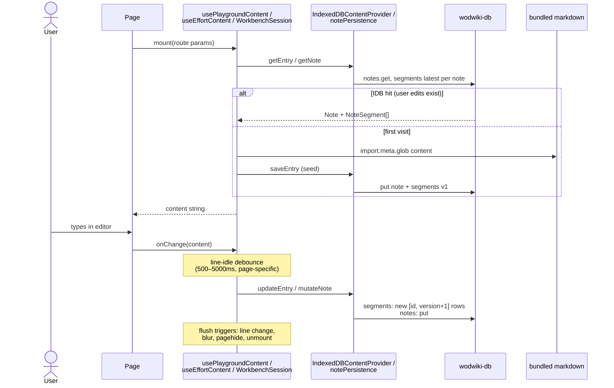
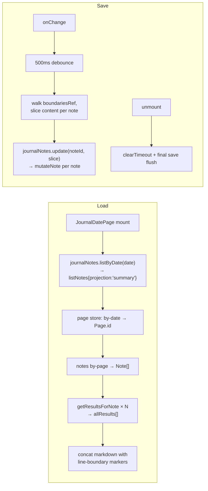
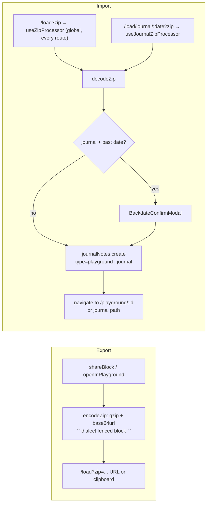

# 03 — Page Lifecycles

How each playground page loads and saves data. Shared stack under every
page:

```
Page → hook (usePlaygroundContent / useEffortContent / WorkbenchSession)
     → playgroundContent | journalNotes | playgroundRecorder
     → IndexedDBContentProvider | IndexedDBNotePersistence
     → indexedDBService (singleton) → wodwiki-db
```

## 3a. Edit-persist pages (the common pattern)

Applies to: JournalPage, JournalDatePage, PlaygroundNotePage,
WorkoutEditorPage, FeedItemPage, EffortDetailPage. They differ only in load
source and debounce timing.



## 3b. Journal date aggregation (multi-note day view)



## 3c. Zip import/export (content transport)



## 3d. Per-page behavior table

| Page (route) | Loads from | Saves to | Mode / debounce |
|---|---|---|---|
| PlaygroundLandingPage `/` | none (UI only) | `journalNotes.create` via Run-example | import-fork |
| PlaygroundNotePage `/playground/:id` | IDB note `playground/:id`, else seed from `new-playground.md` | notes+segments via playgroundContent | 500ms line-idle + blur/pagehide/unmount flush |
| WorkoutEditorPage `/collections/:cat/:name` | IDB, else bundled collection markdown (seed) | same | 500ms |
| FeedItemPage `/feeds/:f/:d/:i` | IDB `feed/...`, else bundled feed markdown (seed) | same | 500ms |
| JournalPage `/journal/:identity` | notePersistence.getNote (workbench projection) | provider.updateEntry | Zustand autosave 5000ms + flushSave on unmount |
| JournalDatePage `/journal/:date` | page→notes→results per date | per-note slices via mutateNote | 500ms + unmount flush |
| EffortDetailPage `/effort/:slug` | IDB efforts → registry → bundled markdown (3-tier fallback) | efforts store; **bundled edit auto-clones to `-custom` user copy** | 1200ms |
| EffortsCatalogPage `/efforts` | in-memory CompositeEffortRegistry | none | read-only |
| FeedDetailPage `/feeds/:slug` | bundled feed + IDB journal lookups | journal fork only | read-only listing |
| MarkdownCanvasPage `/guide/*` etc. | build-time markdown only | **edits NOT persisted**; results → recorder (origin=playground) | ephemeral edits |
| WallClockPage `/run/:id` | pendingRuntimes Map (in-memory) | results+analytics via mutateNote | write-on-complete |
| ReviewPage `/review/:id` | results store by id | none | read-only replay |
| LoadZipPage / JournalZipLoadPage | `?zip=` param | journalNotes.create (atomic) | import |

## Classification

- **Read-only** — EffortsCatalogPage, FeedDetailPage, ReviewPage
- **Edit-persist** — JournalPage, JournalDatePage, PlaygroundNotePage,
  WorkoutEditorPage, FeedItemPage, EffortDetailPage
- **Import/export** — LoadZipPage (display only; global `useZipProcessor`
  creates), JournalZipLoadPage, PlaygroundLandingPage forks

Result recording from any page is covered in
[04 — Workout Result Lifecycle](04-workout-result-lifecycle.md).
