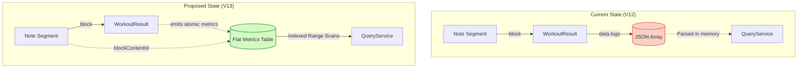
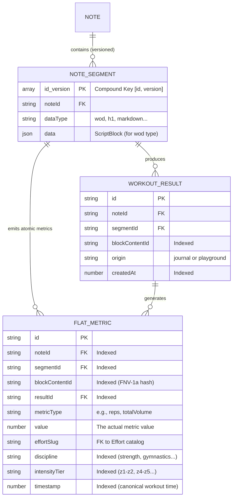

# Proposed Database Schema: Indexed Metrics Refactor (V13)

This document outlines the proposed refactor to move workout results from an opaque JSON array (`WorkoutResult.data.logs`) into a flat, fully-indexed metrics table. This enables the `QueryService` to execute fast, native range scans for cross-store WQL queries (e.g., `find:note where sum:totalVolume{} > 5000`).

## Current vs. Proposed Data Flow

## Proposed Schema (ERD)

The `AnalyticsDataPoint` table is expanded (or replaced by a unified `ResultMetric` table) to become the canonical store for **all** atomic metrics, not just derived summaries.

## New Indexes Added

To support `QueryService` executing fast `IDBKeyRange` scans without loading data into memory, we add the following indexes to the metrics table:

1. **`by-value` (Compound):** `[metricType, value]`
   - *Purpose:* Allows the database to natively find all `totalVolume` metrics `> 5000` instantly.
2. **`by-content` (Standard):** `blockContentId`
   - *Purpose:* The join key used for bi-directional cross-store queries (`find:block where ...`).

## Migration Path (V13)

1. **Backfill:** On database upgrade, iterate through all existing `WorkoutResult` records.
2. **Parse & Flatten:** Read the opaque `data.logs` JSON array. For every atomic metric found (reps, weight, time, calories), emit a new `FlatMetric` row.
3. **Index:** Apply the new `by-value` and `by-content` indexes.
4. **Cleanup (Optional):** The raw `data.logs` array can be stripped from the `WorkoutResult` record, as the UI and query engine now rely strictly on the flat metrics table for rendering and analytics.
