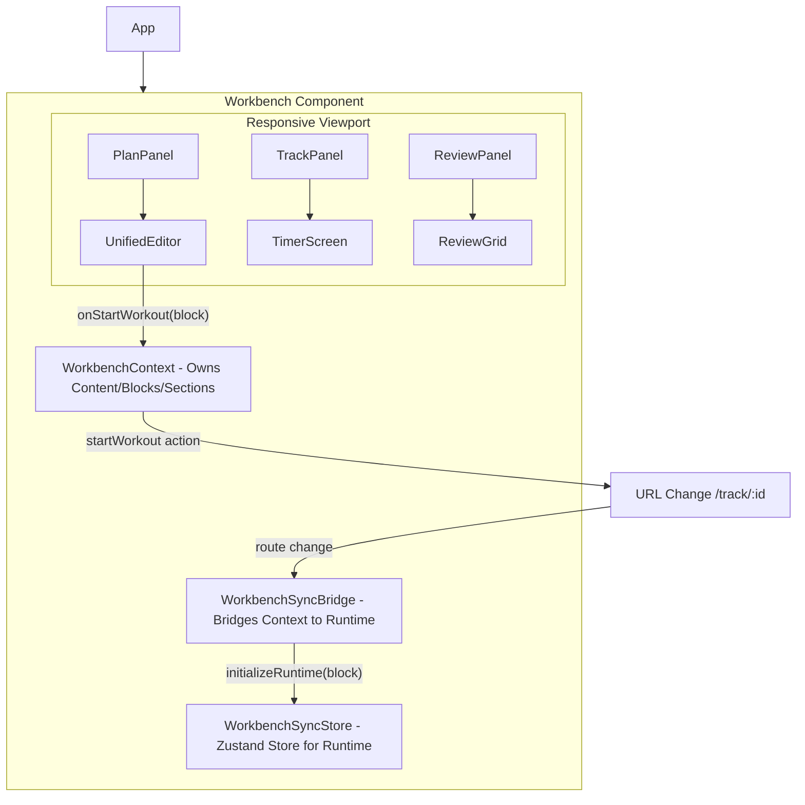
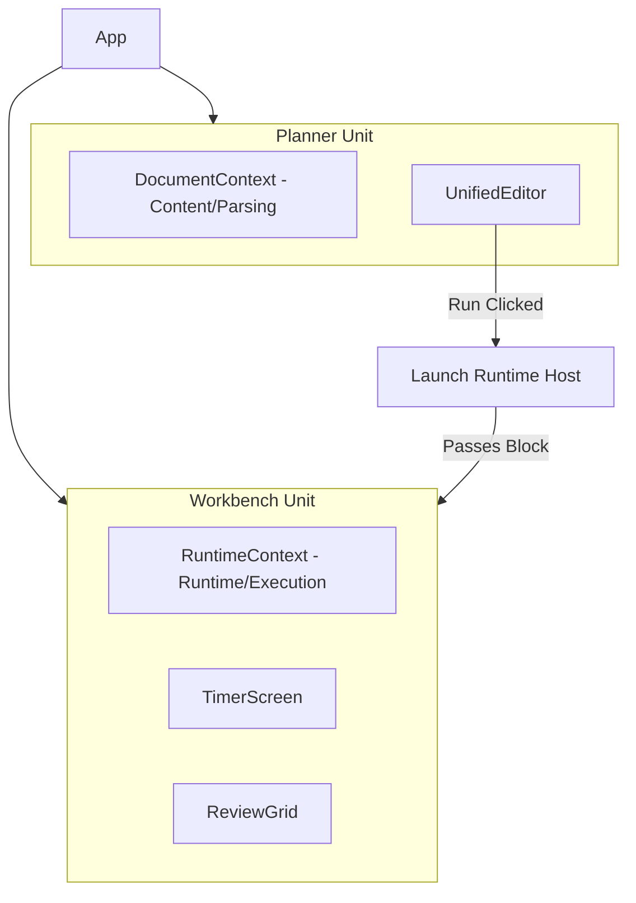

# Architectural Decoupling: Planner vs. Workbench

## 1. Overview
This document outlines the strategy for decoupling the **Planner** (editing/authoring) from the **Workbench** (runtime execution/tracking). The goal is to move towards a **Unified Editor** architecture where the Workbench acts as a standalone unit that hosts a runtime, capable of being initialized from any `WodBlock`.

## 2. Current Architecture (Monolithic Workbench)

Currently, the `Workbench` component acts as a monolithic container that owns both the document state and the execution state.

### 2.1. Component Hierarchy (C4 Level 3)


### 2.2. Current State Ownership
| State Category | Current Owner | Dependency |
|---|-|---|
| **Document Content** | `WorkbenchContext` | Shared across all views |
| **Parsed Blocks/Sections** | `WorkbenchContext` | Shared across all views |
| **Active Block (Cursor)** | `WorkbenchContext` | Syncs with Editor |
| **Selected Block (Run Target)** | `WorkbenchContext` | Driven by URL `:sectionId` |
| **Runtime Instance** | `WorkbenchSyncStore` | Initialized by `WorkbenchSyncBridge` |
| **Execution Progress** | `WorkbenchSyncStore` | Updated by Runtime |

### 2.3. The "Run" Action Flow
1. User clicks **"Run"** in the `UnifiedEditor` (overlay or menu).
2. `UnifiedEditor` calls `onStartWorkout(block)`.
3. `Workbench` receives this through `WorkbenchContext.startWorkout`.
4. `WorkbenchContext` calls `navigation.goToTrack(noteId, block.id)`.
5. The URL changes to `/note/:noteId/track/:sectionId`.
6. `WorkbenchSyncBridge` detects the `viewMode === 'track'` and `selectedBlockId` change.
7. `WorkbenchSyncBridge` calls `initializeRuntime(block)`.

---

## 3. Target Architecture (Decoupled Units)

In the new architecture, the **Planner** and **Workbench** are decoupled. The `Workbench` becomes a "Runtime Host" that can be instantiated with just a `WodBlock`.

### 3.1. Component Hierarchy (Decoupled)


### 3.2. Decoupled State Ownership
| State Category | New Owner | Purpose |
|---|-|---|
| **Document State** | `DocumentContext` | Editing, Parsing, Persistence |
| **Execution State** | `WorkbenchHost` | Runtime, Timer, Analytics |
| **Navigation State** | `App Router` | Orchestrates which unit is visible |

---

## 4. Decoupling Steps

### 4.1. Refactor `WorkbenchContext` into `DocumentContext`
The `WorkbenchContext` should be renamed or split to focus purely on the document.
- **Move**: `content`, `sections`, `blocks`, `saveState` to `DocumentContext`.
- **Remove**: Runtime-specific triggers like `startWorkout` from the document logic.

### 4.2. Standardize `Workbench` as a Runtime Host
The `Workbench` (or a new `RuntimeHost` component) should accept:
- `initialBlock?: WodBlock`: To start execution immediately.
- `onComplete?: (results) => void`: Callback when the workout finishes.
- `onExit?: () => void`: Callback when the user leaves the runtime.

### 4.3. Unified Editor "Run" Integration
The `UnifiedEditor` is the entry point for the "Run" action.
- It already has an `onStartWorkout` prop.
- In the decoupled model, the parent of `UnifiedEditor` (the `Planner`) will handle this by:
    1. Persisting the current document state (if needed).
    2. Navigating to the `WorkbenchHost` route or switching the active view.

### 4.4. Wiring the Transition
Instead of the `Workbench` internally switching its `viewMode`, the transition becomes a top-level concern:

**Option A: Route-Based (Preferred)**
```typescript
// In Planner
const handleStartWorkout = (block: WodBlock) => {
  // Navigation triggers the mount of the WorkbenchHost
  navigate(`/run/${block.id}`, { state: { block } });
};
```

**Option B: Component-Based**
```typescript
const App = () => {
  const [activeBlock, setActiveBlock] = useState<WodBlock | null>(null);
  
  if (activeBlock) {
    return <WorkbenchHost block={activeBlock} onExit={() => setActiveBlock(null)} />;
  }
  
  return <Planner onRun={setActiveBlock} />;
};
```

---

## 5. Benefits of Decoupling
1. **Testing**: The `WorkbenchHost` can be tested in isolation with mock blocks without needing a full `DocumentProvider`.
2. **Reusability**: The `WorkbenchHost` can be used in other parts of the app (e.g., "Daily WOD" widget) without the Editor.
3. **Simplicity**: `UnifiedEditor` doesn't need to know about the complex sliding viewport of the `Workbench`. It just emits an event.
4. **Performance**: Smaller context providers mean fewer re-renders across the entire application.
