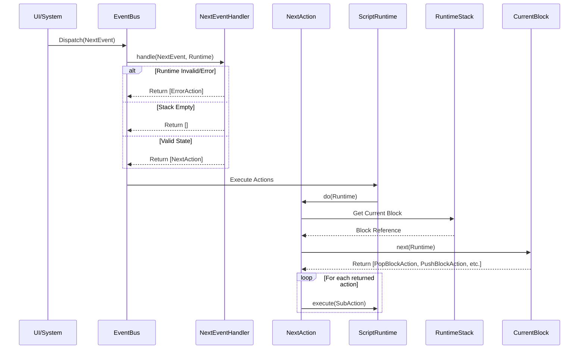

# Deep Dive: Next Action Test Suite Analysis

This document provides a detailed breakdown of the test suite for the "Next" logic in the Wod-Wiki runtime. It focuses on three core files that validate the event-driven transition mechanism.

## Overview of the "Next" Mechanism

The "Next" mechanism is the primary way the runtime moves from one state (block) to another. It follows an Event -> Handler -> Action pattern:

1.  **NextEvent**: A signal that a "next" transition is requested.
2.  **NextEventHandler**: A logic component that listens for the event and decides what to do based on the current runtime state.
3.  **NextAction**: An executable command that triggers the transition logic on the current block.

---

## 1. NextEvent.test.ts
**Purpose:** Validates the data structure representing the "next" signal.

### Structure of the Tests
- **Setup:** A simple `beforeEach` that instantiates a new `NextEvent`.
- **Validation Points:**
    - **Interface Compliance:** Ensures it implements `IEvent` with `name` and `timestamp`.
    - **Identity:** Verifies the event name is strictly `'next'`.
    - **Payload Flexibility:** Validates that `data` can be `undefined`, `null`, simple objects, or complex nested metadata.
    - **Immutability/Integrity:** Checks that the timestamp is generated correctly and that the object is JSON-serializable.

### Key Assertions
- `expect(event.name).toBe('next')`
- `expect(event.timestamp).toBeInstanceOf(Date)`
- `expect(jsonEvent).toEqual(parsed)` (Serialization check)

---

## 2. NextEventHandler.test.ts
**Purpose:** Validates the orchestration logic that converts signals into executable actions.

### Structure of the Tests
- **Setup:** 
    - Creates a `NextEventHandler` with a unique ID.
    - Mocks `IScriptRuntime` including `stack`, `eventBus`, `memory`, and `errors`.
- **Validation Points:**
    - **Filtering:** Ensures it only responds to `'next'` events and ignores others (returns `[]`).
    - **State Sensitivity:** 
        - Returns `ErrorAction` if the runtime has existing errors or an invalid stack.
        - Returns `[]` (unhandled) if there is no current block to transition from.
    - **Action Production:** Verifies that a successful handle results in a `NextAction`.
    - **Performance:** Benchmarks the handler to ensure it processes events in under 10ms.

### Runtime Pathway Support
This test identifies that the runtime relies on the handler to be the "gatekeeper." The runtime doesn't just execute "next"; it asks the handler to evaluate if a "next" transition is valid given the current stack state.

---

## 3. NextAction.test.ts
**Purpose:** Validates the execution phase where the "next" transition actually occurs.

### Structure of the Tests
- **Setup:**
    - Mocks the `IScriptRuntime` and a `mockCurrentBlock`.
    - The `mockCurrentBlock` has a `next()` method mocked to return an array of actions.
- **Validation Points:**
    - **Delegation:** Confirms that `action.do(runtime)` calls `currentBlock.next(runtime)`.
    - **Recursive Execution:** Validates that if `block.next()` returns further actions, the `NextAction` executes them.
    - **Safety:** 
        - Prevents execution if the runtime is in an error state.
        - Handles exceptions thrown by the block's `next()` method by logging them to `runtime.errors`.
        - Handles corrupted memory states gracefully.
    - **Performance:** Benchmarks execution time to ensure it stays under 50ms (target).

### Key Assertions
- `expect(mockCurrentBlock.next).toHaveBeenCalled()`
- `expect(mockAction1.do).toHaveBeenCalledWith(mockRuntime)` (Chain execution check)

---

## Runtime Processing Pathways

Based on these tests, the following execution pathway is supported by the runtime:

### Critical Success Factors identified in tests:
1.  **Error Propagation:** Errors in any part of the "next" chain are captured and prevent further state transitions.
2.  **Stateless Actions:** `NextAction` itself doesn't hold state; it delegates the decision of "what is next" to the block currently on the stack.
3.  **Performance Budgets:** The system is designed for high-frequency interaction, with handler overhead <10ms and execution overhead <50ms.
