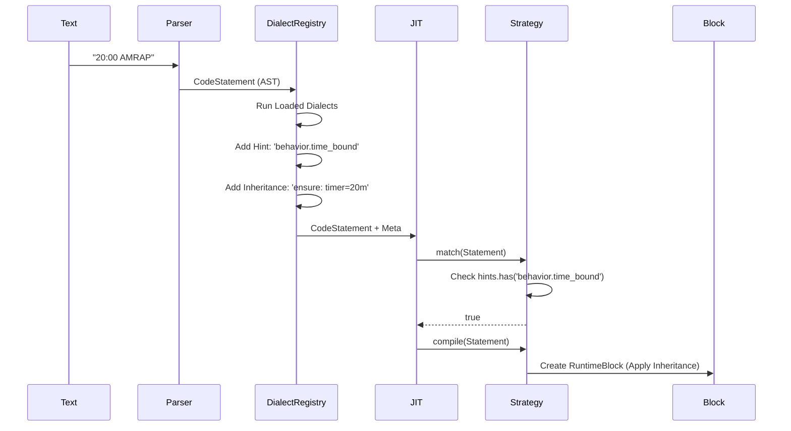

# Deep Dive: JIT Compiler, Parser, and Metrics Architecture

## 1. Architecture Overview: From Text to Execution

The WOD Wiki engine follows a multi-stage pipeline to transform workout text into executable runtime blocks.

**The Pipeline:**
1.  **Lexing & Parsing (Chevrotain):** Raw text is tokenized and parsed into a Concrete Syntax Tree (CST).
2.  **AST Generation (Visitor):** The CST is visited to produce an Abstract Syntax Tree (AST) of `ICodeStatement` objects, wrapped in a `WodScript`.
3.  **JIT Compilation (Strategies):** The `ScriptRuntime` uses a `JitCompiler` to iterate through a prioritized list of strategies. Each strategy inspects the AST (CodeStatement) and decides if it can handle it.
4.  **Runtime Block Creation:** The matching strategy creates a `RuntimeBlock` populated with specific `Behaviors` (e.g., `TimerBehavior`, `LoopCoordinatorBehavior`) and `Metrics`.
5.  **Execution & Tracking:** The block runs, updating `RuntimeMemory` and generating `ExecutionSpans` (history).
6.  **Analytics & Output:** `ExecutionSpans` are transformed into `Segments` and `AnalyticsGroups` for the UI.

## 2. JIT Strategies & Keyword Handling

The core logic for interpreting workout semantics lies in the JIT Strategies. These are **not** part of the parser grammar but are heuristic checks applied at runtime compilation.

### Strategy Precedence
The `JitCompiler` attempts to match a `CodeStatement` against strategies in this strict order:

1.  **`TimeBoundRoundsStrategy` (AMRAP)**
2.  **`IntervalStrategy` (EMOM)**
3.  **`TimerStrategy`**
4.  **`RoundsStrategy`**
5.  **`GroupStrategy`**
6.  **`EffortStrategy`** (Fallback)

### Deep Dive: Keyword Matching (The "Coded Up" Logic)

The user correctly identified that concepts like AMRAP are "coded up" into the system. This logic resides in the `match()` method of specific strategies.

#### AMRAP (TimeBoundRoundsStrategy)
*   **Trigger:** A statement containing a `Timer` fragment AND (`Rounds` fragment OR an `Action`/`Effort` text containing "AMRAP").
*   **Logic:**
    *   `fragments.some(f => f.value.includes('AMRAP'))`
*   **Generated Block:**
    *   A `RuntimeBlock` with `TimerBehavior` (countdown) and `LoopCoordinatorBehavior` (infinite loop).
    *   Tracks "Rounds" metrics.

#### EMOM (IntervalStrategy)
*   **Trigger:** A statement containing a `Timer` fragment AND an `Action`/`Effort` text containing "EMOM".
*   **Logic:**
    *   `fragments.some(f => f.value.includes('EMOM'))`
*   **Generated Block:**
    *   A `RuntimeBlock` with `TimerBehavior` (interval timer) and `LoopCoordinatorBehavior` (restarts timer `n` times).

### The Gap: Syntax vs. Semantics
Currently, the **syntax** (Parser) treats "AMRAP" just as a generic "Action" or "Effort" text. The **semantics** (JIT) re-reads that text to infer behavior. This coupling makes it hard to add new workout types without modifying the core strategies.

## 3. Deep Dive: Fragments to Metrics Transformation

The system uses a flexible pipeline to convert parsed `CodeFragments` (source) into `RuntimeMetrics` (runtime). This pipeline allows for dynamic metric swapping and subset reporting.

### The Fragment Compiler
The `FragmentCompilationManager` iterates over every fragment in a statement and delegates to specific compilers.

```typescript
// Conceptual Flow
function compileStatementFragments(stmt: CodeStatement) {
  const metricValues: MetricValue[] = [];

  for (const fragment of stmt.fragments) {
    // 1. Select Compiler based on fragment type
    const compiler = this.compilers.get(fragment.type);

    // 2. Compiler extracts data
    // e.g. WeightFragmentCompiler: { value: 135 } -> { type: 'resistance', value: 135, unit: 'lbs' }
    if (compiler) {
      metricValues.push(...compiler.compile(fragment));
    }
  }

  // 3. Aggregate into RuntimeMetric
  return new RuntimeMetric(metricValues);
}
```

### Swapping Metrics and Subset Reporting
A key requirement is the ability for a block to "swap" metrics or report on a subset of execution records. This is achieved through **Child Blocks** and **Behaviors**.

1.  **Metric Swapping:**
    *   A `RuntimeBlock` holds the *initial* compiled metrics.
    *   However, behaviors like `ResistanceBehavior` can *dynamically update* the active execution span.
    *   *Example:* A drop-set block starts with 135lbs. When the user clicks "Next", the behavior updates the `ExecutionTracker` to record 115lbs for the next span, effectively swapping the metric for the same block instance.

2.  **Subset Reporting (The "Interval" Pattern):**
    *   An "EMOM" block is a container. It has metrics like "10 minutes".
    *   It spawns **Child Blocks** for the exercises (e.g., "5 Pullups").
    *   The `ExecutionTracker` records separate spans for the Parent (Interval) and the Children (Pullups).
    *   **Result:** Analytics can filter (subset) the records. You can view the "Interval Pacing" (Parent spans) OR the "Pullup Volume" (Child spans). The hierarchy is preserved in the `parentSpanId` field.

## 4. Deep Dive: Output & Execution Records (Gap Analysis)

The `ExecutionLog` (an array of `ExecutionSpan` objects) is designed to be the single source of truth. However, currently, there are side channels that need to be consolidated.

### The Goal: Single Source of Truth
All visualization, analytics, and storage should derive purely from the `ExecutionLog`.

### Current State vs. Gap
1.  **ExecutionLog (Primary):** Tracks start/end times and metrics.
    *   *Status:* **Canonical.** Used for analytics graphs.
2.  **Real-time Events (Side Channel):** The UI currently listens to `timer:tick` events directly for countdowns.
    *   *Gap:* This is acceptable for *display* (latency), but not for *record keeping*.
3.  **Console Logs (Side Channel):** Debug information is logged to console.
    *   *Action:* Redirect all debug logs to a `DebugMetadata` field within `ExecutionSpan`.
4.  **Local Storage (Persistence):** Currently saves `WodResult`.
    *   *Action:* Ensure `WodResult` is strictly a serialization of `ExecutionLog`.

### Consolidation Plan
To ensure the `ExecutionRecord` is the *only* pathway:
1.  **Unified Transformation:** The `AnalyticsTransformer` must be the *only* component reading raw logs. The UI should consume `Segments` produced by the transformer, never raw spans.
2.  **Rich Metadata:** All "context" (e.g., "This was an AMRAP round") must be stamped onto the `ExecutionSpan` via `tags` or `metadata` at the moment of creation, not inferred later.

## 5. Proposal: Dialect-Based Post-Parser (JIT Hints)

To address the "hardcoded" nature of AMRAP/EMOM logic, we propose a **Post-Parser Hinting System**. This system decouples string parsing from execution strategy and introduces a sophisticated inheritance model.

### Concept: Generic Behavioral Hints
Instead of hints mapping 1:1 to strategies (e.g., `strategy.amrap`), hints should describe **Generic Behaviors**. This allows multiple different source dialects to map to the same underlying runtime mechanics.

*   `behavior.time_bound` (AMRAP, For Time)
*   `behavior.repeating_interval` (EMOM, E2MOM)
*   `behavior.auto_complete_children`

### Concept: Dialect Registry
The system will feature a **Dialect Registry** that allows different parsing rules (Dialects) to be loaded dynamically. A "CrossFit" dialect might parse "AMRAP", while a "Running" dialect parses "Fartlek", but both emit `behavior.time_bound`.

### Concept: Advanced Inheritance Protocol
Parent blocks often need to enforce or modify the context for their children. The proposal introduces explicit inheritance modes:

1.  **Clear:** The child starts fresh, ignoring any value from the parent.
2.  **Modify:** The child inherits the parent's value but can modify it (e.g., add to a cumulative total).
3.  **Ensure:** The parent enforces a value on the child (e.g., an EMOM parent ensuring all children have a 1-minute timer).

## 6. Detailed Strategy Refactoring (Before vs After)

This section provides a detailed breakdown of how *each* of the six JIT strategies will be refactored. The "Before" code reflects the current implementation (identifying hardcoded regexes or structural checks), while the "After" code demonstrates the new Dialect-driven approach.

### 1. TimeBoundRoundsStrategy (AMRAP)
Handles "As Many Rounds As Possible" within a fixed time.

**Before:** Relies on finding a `Timer` fragment AND either a `Rounds` fragment OR explicit "AMRAP" text.
```typescript
// Current Implementation
match(statements: ICodeStatement[]): boolean {
    const fragments = statements[0].fragments;
    const hasTimer = fragments.some(f => f.fragmentType === FragmentType.Timer);
    const hasRounds = fragments.some(f => f.fragmentType === FragmentType.Rounds);

    // MIXED CONCERN: Regex parsing inside strategy
    const hasAmrapAction = fragments.some(f =>
        (f.fragmentType === FragmentType.Action || f.fragmentType === FragmentType.Effort) &&
        (f.value as string)?.toUpperCase().includes('AMRAP')
    );
    return hasTimer && (hasRounds || hasAmrapAction);
}
```

**After:** Checks for the `behavior.time_bound` hint emitted by a Dialect.
```typescript
// Proposed Implementation
match(statements: ICodeStatement[]): boolean {
    const meta = statements[0].meta;

    // Generic check: Does the dialect say this is time-bound?
    // This supports "AMRAP", "For Time", "Max Effort", etc.
    const isTimeBound = meta.hints?.has('behavior.time_bound');

    // Still checks structural requirement (Must have a timer)
    const hasTimer = statements[0].fragments.some(f => f.fragmentType === FragmentType.Timer);

    return hasTimer && isTimeBound;
}
```

### 2. IntervalStrategy (EMOM)
Handles "Every Minute on the Minute" style intervals.

**Before:** Explicitly scans for "EMOM" text.
```typescript
// Current Implementation
match(statements: ICodeStatement[]): boolean {
    const fragments = statements[0].fragments;
    const hasTimer = fragments.some(f => f.fragmentType === FragmentType.Timer);

    // MIXED CONCERN: Regex parsing inside strategy
    const hasEmomAction = fragments.some(f =>
        (f.fragmentType === FragmentType.Action || f.fragmentType === FragmentType.Effort) &&
        (f.value as string)?.toUpperCase().includes('EMOM')
    );
    return hasTimer && hasEmomAction;
}
```

**After:** Checks for `behavior.repeating_interval`.
```typescript
// Proposed Implementation
match(statements: ICodeStatement[]): boolean {
    const meta = statements[0].meta;
    const hasTimer = statements[0].fragments.some(f => f.fragmentType === FragmentType.Timer);

    // Supports "EMOM", "E2MOM", "Every 3:00", etc.
    const isInterval = meta.hints?.has('behavior.repeating_interval');

    return hasTimer && isInterval;
}
```

### 3. TimerStrategy
Handles simple countdowns or timers (e.g., "Rest 2:00").

**Before:** Checks for any `Timer` fragment.
```typescript
// Current Implementation
match(statements: ICodeStatement[]): boolean {
    const fragments = statements[0].fragments;
    return fragments.some(f => f.fragmentType === FragmentType.Timer);
}
```

**After:** Checks for `behavior.timer` hint OR structural fallback.
```typescript
// Proposed Implementation
match(statements: ICodeStatement[]): boolean {
    const meta = statements[0].meta;
    const hasTimer = statements[0].fragments.some(f => f.fragmentType === FragmentType.Timer);

    // Dialect can explicitly flag "Rest" or "Work" timers
    const isExplicitTimer = meta.hints?.has('behavior.timer');

    // Fallback: If it has a timer and no other conflicting hints (like time_bound)
    return hasTimer || isExplicitTimer;
}
```

### 4. RoundsStrategy
Handles fixed round counts (e.g., "3 Rounds").

**Before:** Checks for `Rounds` fragment but *excludes* `Timer` fragment (priority).
```typescript
// Current Implementation
match(statements: ICodeStatement[]): boolean {
    const fragments = statements[0].fragments;
    const hasRounds = fragments.some(f => f.fragmentType === FragmentType.Rounds);
    const hasTimer = fragments.some(f => f.fragmentType === FragmentType.Timer);
    return hasRounds && !hasTimer;
}
```

**After:** Checks for `behavior.fixed_rounds`.
```typescript
// Proposed Implementation
match(statements: ICodeStatement[]): boolean {
    const meta = statements[0].meta;

    // Checks hint
    const isFixedRounds = meta.hints?.has('behavior.fixed_rounds');

    // Still respects structural priority (TimerStrategy handles timers)
    const hasTimer = statements[0].fragments.some(f => f.fragmentType === FragmentType.Timer);

    return isFixedRounds && !hasTimer;
}
```

### 5. GroupStrategy
Handles nested indentation groups without explicit metrics.

**Before:** Checks strictly for children.
```typescript
// Current Implementation
match(statements: ICodeStatement[]): boolean {
    return statements[0].children && statements[0].children.length > 0;
}
```

**After:** Checks for `behavior.group` hint. The standard parser will likely emit this for any indented block.
```typescript
// Proposed Implementation
match(statements: ICodeStatement[]): boolean {
    const meta = statements[0].meta;
    const isGroup = meta.hints?.has('behavior.group');
    const hasChildren = statements[0].children && statements[0].children.length > 0;

    return isGroup || hasChildren;
}
```

### 6. EffortStrategy (Fallback)
Handles everything else (e.g., "5 Pullups").

**Before:** Matches if NO timer and NO rounds.
```typescript
// Current Implementation
match(statements: ICodeStatement[]): boolean {
    const fragments = statements[0].fragments;
    const hasTimer = fragments.some(f => f.fragmentType === FragmentType.Timer);
    const hasRounds = fragments.some(f => f.fragmentType === FragmentType.Rounds);
    return !hasTimer && !hasRounds;
}
```

**After:** Checks for `behavior.effort` or acts as catch-all.
```typescript
// Proposed Implementation
match(statements: ICodeStatement[]): boolean {
    const meta = statements[0].meta;

    // Explicit hint allows forcing "Effort" behavior even on complex lines
    if (meta.hints?.has('behavior.effort')) return true;

    // Structural fallback remains for backward compatibility
    const hasTimer = statements[0].fragments.some(f => f.fragmentType === FragmentType.Timer);
    const hasRounds = statements[0].fragments.some(f => f.fragmentType === FragmentType.Rounds);
    return !hasTimer && !hasRounds;
}
```

## 7. Implementation: Dialect Registry & Visualizations

### Workflow with Dialect Registry
A `DialectRegistry` runs loaded dialects. Strategies check for *behavioral hints* and apply *inheritance rules*.



### New Models

We introduce `IDialect`, `InheritanceRule`, and update `CodeMetadata`.

```typescript
// src/core/models/Dialect.ts

export type InheritanceMode = 'clear' | 'modify' | 'ensure';

export interface InheritanceRule {
    property: string;      // e.g., 'timer', 'weight'
    mode: InheritanceMode;
    value?: any;
}

export interface IDialect {
    id: string;
    /** Analyze statement and return hints/inheritance */
    analyze(statement: ICodeStatement): {
        hints: string[];
        inheritance?: InheritanceRule[];
    };
}

// src/services/DialectRegistry.ts
export class DialectRegistry {
    private dialects: IDialect[] = [];

    register(dialect: IDialect) { this.dialects.push(dialect); }

    process(statement: ICodeStatement): void {
        for (const dialect of this.dialects) {
            const result = dialect.analyze(statement);
            result.hints.forEach(h => statement.meta.hints.add(h));
            // Merge inheritance rules...
        }
    }
}
```
